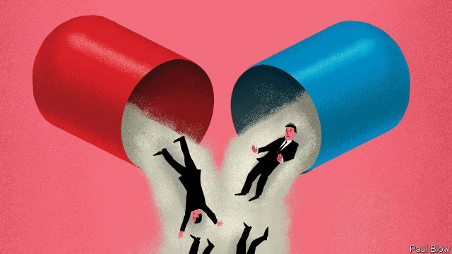

###### A tough sell

# Antibiotics biotech firms are struggling 

##### The slim rewards for new antibiotics make them a risky business 

 

> May 2nd 2019 

GETTING HOLD of penicillin in 1943 was a lottery in America. The “miracle drug” had been discovered 15 years earlier but production capacity was limited, and most went to the war effort. What remained was rationed, and a single injection cost at least $40 (about $600 in today’s prices). By 1949 better manufacturing methods allowed the price to fall to 20 cents. The use of penicillin exploded. 

Antibiotics subsequently became a staple of modern medicine. Massive volumes offset low margins. No longer. Finding new molecules is getting harder, which means higher development costs. At the same time, growing awareness that overuse accelerates development of bacterial resistance to the drugs has led to “antibiotics stewardship”, the practice of using the newest antibiotics only for infections untreatable with older ones. Volumes, in other words, are often disappointing. With returns from antibiotics down, big pharmaceutical companies have abandoned them for more lucrative drugs. GlaxoSmithKline, Pfizer and Merck are the only three doing clinical research in the field. 

Small biotechnology firms tried to pick up the slack. In the past ten years, as the world began to panic about the rise of resistant superbugs, governments and charities provided early-stage financing. Like big pharma, though, the biotech startups have struggled to make money from antibiotics. An American one, Achaogen, filed for bankruptcy on April 15th; plazomicin, a novel antibiotic it began selling in 2018, sold barely any doses in the first eight months. Melinta, another antibiotics startup, is restructuring. Share prices of similar firms have plunged, in some cases below their liquidation value. 

The demise of Achaogen has been blamed on the peculiar features of the antibiotics market, rather than the poor business decisions of its managers. The low number of cases that are suitable for potential treatment with novel antibiotics makes it hard to recruit enough patients for clinical trials. Take carbapenem-resistant Enterobacteriaceae (or CRE for short), which Achaogen went after. These bacteria kill half of those whose bloodstream they infect. But CREs cause only a tiny fraction of bacterial infections in American hospitals. 

Firms get around this by having their new antibiotics approved for more common ailments treatable with existing drugs, such as urinary-tract infections. At the same time, they publish results from small observational trials of the new drugs showing good recovery rates for hospital patients with CRE infections—counting on doctors to prescribe the medicines off-label for CRE. In the case of Achaogen, a small study showed that plazomicin was indeed safer and more effective for CRE than colistin, a highly toxic antibiotic of last resort from the 1950s. Yet plazomicin did not make a dent in colistin use. A CRE antibiotic by Melinta that has been on the market for over a year is not selling well, either. 

That could be because few doctors know about the new treatments. The firms which sell them lack the marketing dollars that big pharma firms shower on new drugs, says Alan Carr, an analyst at Needham, an asset manager in New York. It takes time for new antibiotics to make it into clinical guidelines, such as those of the Infectious Diseases Society of America, which are updated infrequently. 

American hospitals, meanwhile, avoid new antibiotics because they end up footing the bill, which can run to several thousand dollars per patient. Federal programmes like Medicare, which provides health care for the elderly, often pay hospitals for antibiotics as part of bundled payments for hospitalisation, not as reimbursement for a particular treatment, as in the case of cancer. Aleks Engel of Novo Holdings, another asset manager, cites this model as a perennial gripe among fellow investors in antibiotics. 

Antibiotics which fall flat in the first few years can eventually become profitable, notes Bibhash Mukhopadhyay of New Enterprise Associates, an American venture-capital firm. Until tests pinpoint the specific bug causing an infection (which may take days), doctors try several common antibiotics that usually work for the microbial culprit they suspect. For example, when a first-line antibiotic stops working for most cases of pneumonia caused by bacteria that grow in hospital patients’ breathing tubes, the third-line antibiotic starts selling briskly.  

Many investors are too impatient to wait that long. Lacking other products on the market to turn a profit, firms like Achaogen struggle to raise capital to cover their costs. Higher prices might help, but the debate in America is about how to lower the cost of drugs, not raise it. Even if new antibiotics were paid for separately, many investors think that patients for drugs like plazomicin are too few to make these drugs commercially viable in the near term. 

Making them profitable for firms will take ingenuity. This week a UN commission mused about granting large cash prizes for companies that create such drugs, or paying them a subscription that guarantees fixed revenues regardless of use. Given the X Prize and Netflix, these are at least familiar to venture capitalists. 

-- 

 单词注释:

1.antibiotic[.æntibai'ɒtik]:n. 抗生素 a. 抗生的 

2.biotech['baɪəʊtek]:n. 生物技术 

3.risky['riski]:a. 危险的 

4.penicillin[.peni'silin]:n. 盘尼西林, 青霉素 [化] 青霉素 

5.lottery['lɒtәri]:n. 奖券, 彩票, 运气 [经] 抽彩给奖法 

6.ration['ræʃәn]:n. 定额, 定量, 配给 vt. 配给, 定量供应 

7.manufacturing[.mænju'fæktʃәriŋ]:n. 制造业 a. 制造业的 

8.subsequently['sʌbsikwәntli]:adv. 后来, 随后 

9.staple['steipl]:n. 主要产物, 常用品, 主要要素, 原料, 订书钉, 钩环 a. 主要的, 重要的 vt. 分级, 钉住 

10.offset['ɒ:fset]:n. 抵消, 把...并列, 旁系, 支管, 用胶印法印 vt. 弥补, 抵消, 胶印 vi. 装支管 n. 偏移量 [计] 偏移量 

11.awareness[ә'weәnis]:n. 意识, 认识 [计] 识别, 议定, 明白 

12.overuse[.әuvәr'ju:z]:vt. 使用过度 n. 过度使用, 任意驱使 

13.bacterial[bæk'tiәriәl]:a. 细菌的 [医] 细菌的, [无芽胞]杆菌的 

14.stewardship['stju:wәdʃip]:n. steward的职务, 管理工作 

15.infection[in'fekʃәn]:n. 传染, 影响, 传染病 [医] 传染, 感染 

16.untreatable[ʌnt'ri:teɪbl]: 无法医治的 

17.pharmaceutical[,fɑ:mә'sju:tikәl]:a. 药学的, 制药的, 药用的, 药物的, 药剂师的, 药师的 n. 药品, 成药, 药剂 

18.lucrative['lu:krәtiv]:a. 有利益的, 获利的, 合算的 

19.GlaxoSmithKline[]:n. 葛兰素史克（英国制药公司） 

20.pfizer[]:n. 辉瑞（美国制药公司） 

21.merck[]:n. 默克公司（财富500强公司之一, 部所在地美国, 主要经营制药） 

22.clinical['klinikәl]:a. 临床的, 门诊部的 [医] 临床的, 临证的 

23.biotechnology[.baiәutek'nɔlәdʒi]:n. 生物工艺学；生物技术 

24.slack[slæk]:n. 松弛, 松懈, 淡季, 闲散, 家常裤 a. 松弛的, 不流畅的, 疏忽的, 无力的, 呆滞的, 软弱的, 漏水的 adv. 马虎地, 缓慢地 vt. 放松, 使缓慢 vi. 松懈, 减弱, 松弛 

25.superbug[ˈsu:pəbʌg]: 超级细菌 

26.pharma[]:n. 制药公司 

27.startup[]:[计] 启动 

28.bankruptcy['bæŋkrәptsi]:n. 破产者 [经] 破产, 倒闭 

29.restructuring[]:[计] 重构的 

30.liquidation[.likwi'deiʃәn]:n. 偿还, 偿付, 清算 [化] 液化; 溶离法; 溶化分离法 

31.demise[di'maiz]:n. 崩, 薨, 死亡 vt. 让渡, 遗赠, 转让 

32.Enterobacteriaceae[]:[医] 肠杆菌科 

33.cre[]:abbr. 中铁快运（China Railway Express） 

34.bloodstream[]:n. 血流 

35.cres[]:abbr. 耐蚀钢（Corrosion Resistant Steel）；工程科学研究中心（Kansas大学）（Center for Research in Engineering Science） 

36.ailment['eilmәnt]:n. 病痛, 疾病 [医] 疾病 

37.treatable[]:a. 好对付的, 能处理的, 能治疗的 

38.observational[,ɔbzә'veiʃәnәl]:a. 观察的, 观测的 [计] 观察的 

39.colistin[kә'listin]:n. [微]黏菌素 

40.toxic['tɒksik]:a. 有毒的, 中毒的 [医] 中毒的, 毒物的 

41.dent[dent]:n. 凹痕 vt. 使凹下, 削弱 vi. 塌陷 

42.marketing['mɑ:kitiŋ]:n. 行销, 买卖 [经] 推销, 在市场买卖, 销售 

43.alan['ælәn]:n. 艾伦（男子名） 

44.Carr[]:n. 凯尔（挪威, 住在沼泽的人） 

45.analyst['ænәlist]:n. 分析者, 精神分析学家 [化] 分析员; 化验员 

46.Needham['ni:dәm]:尼达姆(姓氏) 

47.asset['æset]:n. 资产, 有益的东西 

48.york[jɔ:k]:n. 约克郡；约克王朝 

49.guideline['gaidlain]:n. 指导路线, 方针, 指标 [经] 指导路线, 方针, 准则 

50.infectious[in'fekʃәs]:a. 有传染性的, 易传染的 [医] 传染性的 

51.update[ʌp'deit]:vt. 更新, 使现代化 n. 更新 [计] 更新 

52.infrequently[]:adv. 很少发生, 不常发生, 罕见, 稀罕, 偶有, 不寻常 

53.medicare['medi,keә]:n. 医疗照顾方案, 医疗照顾项目 [法] 公办的医疗保险制 

54.hospitalisation[,hɔspitәlai'zeiʃәn;-li'z-]:n. <主英>=hospitalization 

55.reimbursement[.ri:im'bә:smәnt]:n. 付还, 退还 [经] 偿付, 赔还 

56.alek[]:n. (Alek)人名；(俄)阿列克 

57.engel[]:n. 恩格尔（恩格尔   	德国的统计学家）；英杰尔（日本品牌） 

58.novo[]:abbr. 芬兰诺瓦公司 

59.holding['hәuldiŋ]:n. 把持, 支持, 保持 [法] 租借地, 占有物, 拥有的财产 

60.cite[sait]:vt. 引用, 引证, 表彰 [建] 引证, 指引 

61.perennial[pә'reniәl]:a. 常年的, 长期的, 反复的 [医] 多年生的 

62.gripe[graip]:n. 紧握, 柄, 把手, 控制 vt. 抓紧, 抱住, 使肠痛, 激怒 vi. 肠绞痛, 抱怨 

63.investor[in'vestә]:n. 投资者 [经] 投资者 

64.pinpoint['pinpɒint]:n. 极小之物, 针尖, 立锥之地, 精确位置 vt. 精确地找到, 准确地轰炸, 刺穿, 准确描述, 使突出, 强调 a. 针尖的, 极微的, 精确的, 详尽的, 精确定位的 

65.bug[bʌg]:n. 错误, 虫, 病菌, 缺陷, 窃听器, 癖好, 防盗报警器, 双座小汽车, 要人 vt. 装防盗报警器, 装窃听器, 激怒 vi. 捉虫, 暴突 [计] 缺点, 错误 

66.microbial[mai'krәubiәl]:a. 微生物的, 由细菌引起的 [医] 微生物的 

67.culprit['kʌlprit]:n. 犯人, 罪犯, 刑事被告 [法] 犯罪者, 犯人, 罪犯 

68.pneumonia[nju:'mәunjә]:n. 肺炎 [医] 肺炎 

69.commercially[]:adv. 商业上；通商上 

70.viable['vaiәbl]:a. 能养活的, 能生长发育的 [医] 有活力的, 有生机的 

71.ingenuity[.indʒi'nju:iti]:n. 心灵手巧, 精巧, 精巧设计 

72.UN[ʌn]:pron. 家伙, 东西 [经] 联合国 

73.muse[mju:z]:n. 沉思, 冥想 v. 沉思, 冥想, 若有所思地凝望或说 

74.subscription[sәb'skripʃәn]:n. 捐献, 订金, 订阅, 签署, 同意 [化] 订购 

75.x[eks]:n. 未知数 [计] 交换, 变址, 索引, 传输 

76.netflix[]:n. 全球十大视频网站中唯一收费站点 

77.capitalist['kæpitәlist]:n. 资本家, 资本主义者 a. 资本主义的 

