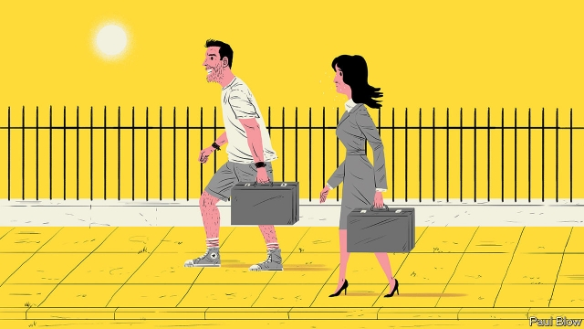

###### Bartleby

# Struggling with style 

##### Modern dress codes are easier for men than for women 

 

> May 2nd 2019 

SUMMER’S ARRIVAL in the northern hemisphere brings with it a dilemma that plagues every office worker. What does a casual dress code mean in practice? The happy medium between looking like Kim Kardashian or Hagrid the giant is hard to pin down. 

Goldman Sachs has just implemented a “flexible dress code” although the executive memo noted gnomically that “casual dress is not appropriate every day”. Besuited corporate clients might not take kindly to investment-banking advice offered by someone wearing a tank top and ripped jeans. 

It makes sense that banking would be one of the last bastions to fall to the advance of casual workwear. You want the people who look after your money to appear sober and respectable. For similar reasons, bank headquarters have deliberately been built in a grandiose style to emphasise the institution’s financial solidity and historical roots. Depositors might hesitate about handing over their savings to people working under a railway arch. 

For men, the move to casual dress seems entirely positive. Few people will mourn the demise of the tie, a functionally useless garment that constricted male necks for a century. The tie’s origins date back to the 17th century, when mercenaries hired by Louis XIII of France wore a form of cravat. The modern version of the tie emerged in the 1920s and was popularised by Britain’s Edward VIII who, when not flirting with the Nazis, developed the Windsor knot. It became standard office wear for the next six decades. In the 1990s ties started to go out of fashion because technology titans and hedge-fund managers refused to wear them—and were rich enough to ignore social convention. Once, when Mark Zuckerberg, the founder of Facebook, was to meet a venture capitalist, he turned up wearing his pyjamas. 

The jacket, by contrast, is a much more useful garment, replete with pockets to house wallets, spectacle cases and travel passes (or, these days, mobile phones). So the default work garb for men, when meeting clients, is jacket, open-necked shirt and dark trousers (denim excluded). 

On days without meetings, men can slob out in T-shirts (though not too garish) and jeans, and no one will think the worse of them. Arriving in shorts or without socks is another matter entirely. But dressing in the morning is quick and easy. Steve Jobs was famous for wearing the same outfit—black polo neck, jeans and trainers—every day. 

But what works well for men does not translate as easily to women. Karl Stefanovic, an Australian television presenter, wore the same blue suit every day for a year and no one noticed. By contrast, his female co-presenters received constant remarks on their appearance. Even the Duchess of Cambridge, Kate Middleton, gets snarky comments when she wears the same clothes twice. 

Women’s workwear seems to have become less formal over time. A survey by Euromonitor found that sales of women’s suits fell by 77% in America between 2007 and 2016. But many women worry that they will be judged as unprofessional (unlike their male colleagues) if their clothes are deemed to be too scruffy, or too revealing. It can also be hard choosing clothes that are suitable for both indoors and out. Air-conditioning systems in offices are often designed to suit the male metabolic rate, which can cope with colder temperatures than the female body. The result may be that women have to bring an extra layer to wear in the building. 

As for formal meetings, while men have abandoned the tie, many women feel obliged to wear high heels. These give some women a sense of empowerment and femininity (not to mention extra height). But in health terms, heels can seem like the Western equivalent of the ancient Chinese practice of foot-binding: bad for women’s feet, ankles and backs and designed to limit their mobility. Britain’s Parliament held a debate after a woman was sent home from her job as a receptionist for refusing to wear high heels (it was inconclusive). 

Companies understandably want workers who deal with the public to look respectable. Workers shouldn’t wear clothes that wouldn’t be appropriate if visiting a prudish grandmother or a child’s teacher. And yet no one should be expected to turn up at the office as if dressed for a wedding. The most important item to bring to work is a dose of sartorial common sense. 

-- 

 单词注释:

1.bartleby[]:[网络] 巴特比；巴特白；老板是空气 

2.hemisphere['hemisfiә]:n. 半球, 地球的半面, 大脑半球 [医] 半球 

3.plague[pleig]:n. 瘟疫, 天罚, 麻烦, 灾祸 vt. 折磨, 使苦恼, 使得灾祸 

4.kim[]:n. 金姆（人名） 

5.kardashian[]:n. 卡戴珊（人名） 

6.hagrid[]:[网络] 海格；罗彼·考特拉尼；海洛 

7.goldman[]:n. 高曼（姓氏） 

8.Sachs[zaks]:n. 萨克斯（汽车零配件生产厂商） 

9.memo['memәu]:n. 备忘录 [经] 备忘录 

10.gnomically[]:adv. gnomical的变形 

11.besuited[]: 身着套装的 

12.corporate['kɒ:pәrit]:a. 社团的, 合伙的, 公司的 [经] 团体的, 法人的, 社团的 

13.client['klaiәnt]:n. 客户, 顾客, 委托人 [计] 客户, 客户机, 客户机程序 

14.kindly['kaindli]:a. 和蔼的, 温和的, 爽快的 adv. 温和地, 亲切地 

15.rip[rip]:n. 裂痕, 破绽, 拉裂, 浪子, 巨浪 vi. 被拉开, 裂开, 猛冲 vt. 撕, 扯, 劈 

16.jean[dʒi:n]:n. 牛仔裤, 牛仔布, 斜纹棉布 

17.bastion['bæstʃәn]:n. 棱堡, 阵地工事 

18.workwear[wɜ:k'weər]:n. 工作服 

19.respectable[ri'spektәbl]:a. 值得尊重的, 人格高尚的, 相当数量的 n. 品格高尚的人 

20.headquarter[,hed'kwɔ:tә]:vt. 将...的总部设在 

21.grandiose['grændiәus]:a. 宏伟的, 壮丽的, 夸张的 [医] 夸大的 

22.emphasise[]:vt. 强调, 重读, 加强...的语气, 着重 

23.solidity[sә'liditi]:n. 固体性, 坚硬, 坚固, 稳健, 体积 

24.depositor[di'pɒzitә]:n. 存放者, 存款人 [经] 存款人, 储户, 委托人 

25.entirely[in'taiәli]:adv. 完全, 全然, 一概 

26.demise[di'maiz]:n. 崩, 薨, 死亡 vt. 让渡, 遗赠, 转让 

27.functionally[]:adv. 官能, 有功能, 职务, 机能, 在起作用, 从使用/实用的观点设计, 函数 [计] 功能地 

28.constrict[kәn'strikt]:vt. 压缩, 束紧, 使收缩 vi. 收缩 

29.mercenary['mә:sinәri]:n. 唯利是图者, 雇佣兵 a. 为钱而工作的, 被雇的, 图利的 

30.louis['lu(:)i, 'lu(:)is]:n. 路易斯（男子名） 

31.xiii[]:num. 罗马数字 13 

32.cravat[krә'væt]:n. 领带, 围巾, 三角绷带 [医] 三角布绷带 

33.popularise['pɔpjjlәraiz]:vt.vi. 使通俗化, 使受欢迎, 使大众化, 使普及, 宣传, 推广 

34.edward['edwәd]:n. 爱德华（男子名） 

35.viii[]:num. 罗马数字8 

36.flirt[flә:t]:n. 卖弄风骚的人, 急动, 急扔 vt. 忽然弹出, 轻快摆动, 挥动 vi. 调情, 玩弄, 摆动, 轻率地对待 

37.Nazi['nɑ:tsi]:n. 纳粹党人 a. 纳粹党的 

38.windsor['winzә]:n. 温莎（地名, 伦敦西方的城市） 

39.Titan['taitn]:n. 提坦, 太阳神, 巨人 

40.zuckerberg[]:扎克伯格 

41.founder['faundә]:n. 创立者, 建立者 vt. 使沉没, 使摔倒, 弄跛, 浸水, 破坏 vi. 沉没, 摔到, 变跛, 倒塌, 失败 

42.facebook[]:n. 脸谱网 

43.capitalist['kæpitәlist]:n. 资本家, 资本主义者 a. 资本主义的 

44.pyjama[pә'dʒɑ:mә, pi-]:n. 睡衣裤, 宽松裤 

45.replete[ri'pli:t]:a. 装满的, 充满的, 充实的, 吃饱的 

46.default[di'fɒ:lt]:n. 违约, 不履行责任, 缺席, 默认值 v. 疏怠职责, 缺席, 拖欠, 默认 [计] 默认; 默认值; 缺省值 

47.garb[gɑ:b]:n. 打扮, 装束 vt. 打扮, 穿衣 

48.trouser['trauzә]:a. 裤子的 

49.denim['denim]:n. 斜纹粗棉布, 牛仔布, 劳动布, (非正式)工作服, 工装裤 

50.slob[slɒb]:n. 泥, 软泥, 粗俗平庸的人 

51.garish['gєәriʃ]:a. 穿着花哨的, 炫耀的, 过分装饰的 

52.steve[]:n. 史蒂夫（男子名） 

53.polo['pәulәu]:n. 马球, 水球 

54.karl[kɑ:l]:n. 卡尔（男子名, 等于Charles） 

55.stefanovic[]:[网络] 斯蒂法诺维奇 

56.presenter[pri'zentә]:n. 节目主持人, 奉献者, 提出者 [法] 告发者, 提出者, 推荐者 

57.duchess['dʌtʃis]:n. 公爵夫人 

58.Cambridge['keimbridʒ]:n. 剑桥 

59.kate[keit]:n. 凯特（女子名, 等于Catherine） 

60.middleton['midltәn]:n. 米德尔顿（姓氏） 

61.snarky[ˈsnɑ:ki]:a. 恶声恶气的, （突然）咬人的 

62.les[lei]:abbr. 发射脱离系统（Launch Escape System） 

63.Euromonitor['juərəu'mɔnitə]:n. (英国)欧洲商情市场调研公司 

64.unprofessional['ʌnprә'feʃәnl]:a. 违反行业习惯的, 违反行业道德的, 不合行规的, 非职业性的, 外行的 

65.deem[di:m]:v. 认为, 相信 

66.scruffy['skrʌfi]:a. 不整齐的, 肮脏的, 破旧的, 褴褛的 

67.metabolic[.metә'bɒlik]:a. 变化的, 变形的, 新陈代谢的 [医] [新陈]代谢的 

68.empowerment[ɪm'paʊəmənt]:n. 授权; 许可 

69.femininity[.femi'niniti]:n. 妇女特质, 温柔, 柔弱性 [医] 女子本性, 女性, 女子气 

70.mobility[mәu'biliti]:n. 可动性, 流动性, 机动性 [化] 迁移率 

71.inconclusive[.inkәn'klu:siv]:a. 非决定性的, 无效果的, 不得要领的 [法] 非决定性的, 不确定的, 无结果的 

72.understandably[]:adv. 可懂, 可了解, 可理解 

73.prudish['pru:diʃ]:a. 拘守礼仪的, 过分规矩的, 表面正经的 

74.sartorial[sɑ:'tɒ:riәl]:a. 裁缝匠的, 缝工的, 裁缝的 

