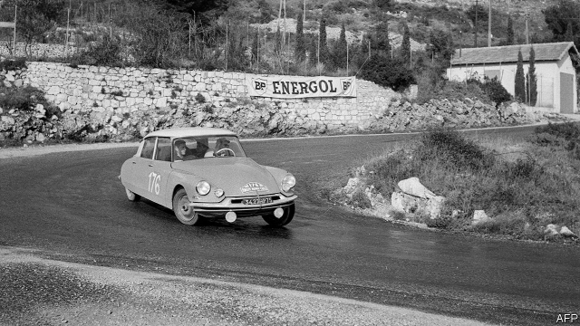

###### Track mentality

# The boss of PSA Group, a French carmaker, has revived its fortunes 

##### He isn’t done 

 

> May 2nd 2019 

CARLOS TAVARES likes to move quickly. The boss of PSA, maker of Peugeots and Citroëns, has a passion for motor racing and speed pervades his day-to-day activities, too. The intense Portuguese arrives abruptly for meetings and departs so swiftly that it takes a few seconds to realise that he has gone. His reputation as the most talented boss now running a car company is also built on speed—his rapid and remarkable turnaround of two struggling firms, first PSA itself and then Opel, acquired from General Motors (GM) in 2017. Steering his mass-market firm towards the future of carmaking will not be easy. 

The permanent frown clouding Mr Tavares’s brow is a testament to the tough jobs he has pulled off. First, after taking the wheel of PSA in 2014 after years of heavy losses, he rescued it from bankruptcy. To near-universal surprise, he restored the firm to the black in a year. Revenues and profits have since grown handsomely; profit margins now rival those of German premium carmakers. 

As Maxime Picat, PSA’s director of operation in Europe, drily observes, seeking profits first and volumes afterwards has “not always been the case” in an industry that has prioritised sales and market share. PSA sought to sell fewer cars at a bigger mark-up. It axed niche models that made little money and slashed costs by limiting the bewildering array of combinations of engines, body styles and the like. 

When PSA was criticised for lacking the heft to make big investments in electric vehicles and self-driving cars, Mr Tavares paid GM €1.3bn ($1.4bn) for its struggling European arm. This added around 1m vehicles a year to the 2.8m the rest of the group built in 2018, making it Europe’s second-biggest carmaker behind Volkswagen. He applied his tactics again, this time to a company which had suffered two decades of losses totalling around $20bn under American ownership. In 2018 Opel reported an operating profit of over €860m. 

The resurrection of two struggling car giants has propelled PSA’s share price by 14% over the past year. Steering the combined firm through the next series of bends will take a different set of skills, however. Car sales in Europe, where PSA generates 80% of revenues, are less brisk than in the past. Markets such as India and Russia, which Mr Tavares is eyeing, are trickier to negotiate. PSA has struggled in China, where carmakers have done well in recent years. Making humdrum Opels (sold as Vauxhalls in Britain) desirable will require heavy spending. Placid unions, which recognised PSA’s difficulties, may become less so as its health improves. 

A plan to return to America has also met with scepticism. PSA’s brands are largely forgotten there—the last one, Peugeot, departed 28 years ago. Rather than spending heavily on marketing, building a factory and losing money “like hell”, Mr Picat says, PSA will start with car-sharing services to reintroduce the marques gradually as part of a ten-year project that will “make money at every step”. This seems to be one place where Mr Tavares is content to go slowly. 

Further down the road, he worries about the added costs of electrification to meet EU emissions targets. The American car-sharing venture will offer some experience in mobility services, but PSA lags behind many rivals in autonomous vehicles. All this will require heavy spending. 

Greater scale would help. Mr Tavares is on the lookout for deals. A tie-up with GM or Fiat Chrysler Automobiles (whose chairman, John Elkann, sits on the board of The Economist’s parent company) has been rumoured. So has a takeover of struggling Jaguar Land Rover from its Indian owners. Some industry-watchers think consolidation is imminent—and virtually all believe it is necessary to share the costs of developing electric vehicles, self-driving cars and mobility services. Since the death last year of Sergio Marchionne, Fiat Chrysler’s legendary boss, and the legal travails in Japan of Carlos Ghosn, ejected from his leadership roles in the Renault-Nissan-Mitsubishi alliance, many observers see Mr Tavares as the only car boss with the skill to cut big and difficult deals. 

-- 

 单词注释:

1.mentality[men'tæliti]:n. 精神力, 智力, 头脑作用, 心态 [医] 智力 

2.PSA[]:[化] 酞磺醋胺; 酞磺胺醋酰 [医] 酞酰磺乙酰胺, 酞[酰]磺醋胺, 羟苯甲酰磺乙酰胺 

3.carmaker['kɑ:,meikә(r)]:n. 汽车制造商 

4.revive[ri'vaiv]:vt. 使苏醒, 使复兴, 使振奋, 回想起, 重播 vi. 苏醒, 复活, 复兴, 恢复精神 

5.carlo[]:n. 卡洛（男子名） 

6.quickly['kwikli]:adv. 很快地 

7.maker['meikә]:n. 制造者, 上帝 [经] 制造者, 出票人 

8.peugeot[]:n. 法国标致（法国汽车公司） 

9.pervade[pә'veid]:vt. 弥漫于, 遍及于, 流行于, 蔓延, 渗透于, 充满 

10.abruptly[ә'brʌptli]:adv. 突然地, 唐突地 

11.swiftly['swiftli]:adv. 很快地, 即刻 

12.talented['tælәntid]:a. 天资高的, 有才能的 

13.turnaround['tә:nә.raund]:n. 转向, 回车道, 转变 [化] 小修; 预防(性)修理 

14.opel[]:n. 德国欧宝汽车 

15.GM[]:通用汽车公司, 总经理, 导弹 [经] 通用汽车公司 

16.carmaking[]:[网络] 汽车制造 

17.testament['testәmәnt]:n. 遗嘱, <<圣约书>> [法] 遗言, 遗嘱, 确实的证明 

18.bankruptcy['bæŋkrәptsi]:n. 破产者 [经] 破产, 倒闭 

19.handsomely['hænsәmli]:adv. 漂亮地, 整齐地, 当心地, 慢慢地, 优厚地, 慷慨地, 美观地 

20.premium['pri:miәm]:n. 额外补贴, 奖金, 奖赏, 保险费 [医] 保险费 

21.maxime[]:n. (Maxime)人名；(法)马克西姆 

22.drily['draili]:adv. 干燥地, 不加渲染地, 冷冰冰地, 枯燥地 

23.afterwards['ɑ:ftәwәdz]:adv. 然后, 后来 

24.alway['ɔ:lwei]:adv. 永远；总是（等于always） 

25.prioritise[praɪ'ɒrəˌtaɪz]:vt. 给予…优先权; 按优先顺序处理; 出轻重缓急 vi. 把事情按优先顺序排好（等于prioritize） 

26.axe[]:n. 斧, 斧头 vt. 削减(人员、经费、计划、机构等) 

27.niche[nitʃ]:n. 壁龛 vt. 放入壁龛, 安顿 

28.slash[slæʃ]:v. 猛砍, 乱砍 n. 猛砍, 乱砍, 删减 [计] 斜线 

29.bewilder[bi'wildә]:vt. 使迷惑, 使不知所措 

30.array[ә'rei]:n. 排列, 衣服, 大批, 军队 vt. 布署, 打扮, 排列 [计] 数组; 阵列 

31.criticise['kritisaiz]:v. 批评, 吹毛求疵, 非难 

32.heft[heft]:n. 重量, 影响, 重要性 vt. 举起试重量, 举起 vi. 称重量 

33.volkswagen['fɔ:lks,vɑ:^әn]:n. 大众汽车（财富500强公司之一） 

34.tactic['tæktik]:n. 一项战术, 一条策略 a. 战术的, 顺序的, 排列的 

35.resurrection[.rezә'rekʃәn]:n. 复活, 复兴, 恢复, 掘墓盗尸 [法] 复活, 恢复, 修复 

36.propel[prәu'pel]:vt. 推进, 驱使 [机] 推进 

37.sery[]:n. (Sery)人名；(俄)谢雷；(科特)塞里 

38.les[lei]:abbr. 发射脱离系统（Launch Escape System） 

39.tricky['triki]:a. 狡猾的, 机敏的 

40.humdrum['hʌmdrʌm]:a. 平凡的, 单调的, 令人厌烦的 n. 平凡, 单调, 无聊 vi. 单调令味地进行 

41.opel[]:n. 德国欧宝汽车 

42.placid['plæsid]:a. 平静的, 温和的, 沉着的, 平稳的 

43.scepticism['skeptisizm]:n. 怀疑论, 怀疑主义 [医] 多疑癖 

44.peugeot[]:n. 法国标致（法国汽车公司） 

45.marketing['mɑ:kitiŋ]:n. 行销, 买卖 [经] 推销, 在市场买卖, 销售 

46.reintroduce[ri:intrә'dju:s]:vt. 再引进, 再介绍 

47.marque[mɑ:k]:n. 商品型号 [法] 商品的型号或样式, 报复性的捕夺 

48.electrification[i.lektrifi'keiʃәn]:n. 起电, 带电, 电气化 [化] 起电 

49.EU[]:[化] 富集铀; 浓缩铀 [医] 铕(63号元素) 

50.emission[i'miʃәn]:n. 发射, 射出, 发行 [医] 发射, 遗精 

51.mobility[mәu'biliti]:n. 可动性, 流动性, 机动性 [化] 迁移率 

52.lookout['lukaut]:n. 注意, 前途, 了望台, 景色 [法] 看守, 守望 

53.fiat['faiæt]:n. 命令, 严命, 许可 [医] 制成, 作成 

54.Chrysler[]:[经] 克莱斯勒 

55.john[dʒɔn]:n. 盥洗室, 厕所, 嫖客 

56.elkann[]:[网络] 埃尔坎 

57.takeover[]:n. 接管, 接收 [经] 接收 

58.jaguar['dʒægjuә]:n. 美洲虎 

59.rover['rәuvә]:n. 漂泊者, 流浪者, 海盗 [法] 流浪者, 海盗, 海盗船 

60.consolidation[kәn.sɒli'deiʃәn]:n. 巩固, 团结, 合并, 加强 [医] 实变 

61.Sergio[]:n. 塞尔吉奥（NBA球员） 

62.marchionne[]:[网络] 马尔基翁内；首席执行长马基奥尼；马奇恩尼先生 

63.legendary['ledʒәndәri]:a. 传说的, 传奇中说的, 传奇般的, 传说中的, 著名的 

64.travail['træveil]:n. 分娩的痛苦, 阵痛, 辛劳 vi. 发生阵痛, 辛劳 

65.ghosn[]:[网络] 戈森 

66.eject[i'dʒekt]:vt. 逐放, 放逐, 喷射 [化] 排出 

67.alliance[ә'laiәns]:n. 联盟, 联合 [法] 同盟, 联盟, 联姻 

