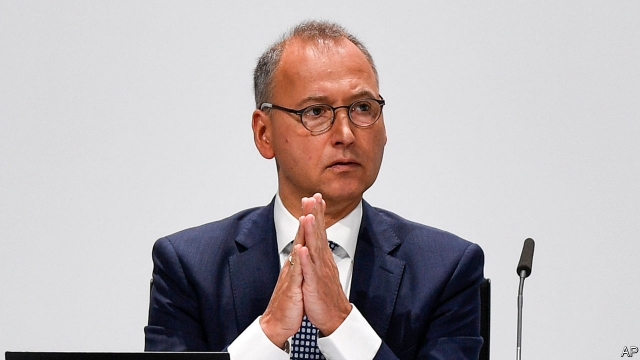

###### German business

# Why so many big German companies are in trouble 

##### Bayer is the latest DAX firm burnt by a takeover of an American firm 

 

> May 4th 2019 

IT HAS NEVER happened to a chief executive of a company in the DAX index of Germany’s 30 largest listed firms. On April 26th 56% of shareholders in Bayer, a chemicals conglomerate, censured Werner Baumann and his management team. Most German bosses can count on nine in ten shareholders to back them in non-binding confidence votes. In 2015 a rebellion by a minority, of 39%, of Deutsche Bank’s owners, who censured Anshu Jain and Jürgen Fitschen, led both co-chief executives to announce their resignation. 

Bayer shareholders have reason to be mutinous. Its share price has plunged by 40% since its takeover last June of Monsanto. It is now worth less than the $63bn it paid for the American seed-and-chemicals giant. Critics accuse Mr Baumann of infecting a healthy firm with underestimated legal risks related to Roundup, Monsanto’s blockbuster weedkiller. 

In August an American court awarded $289m to Dewayne Johnson, a terminally ill cancer patient who had been exposed to Roundup over many years. In March it lost a similar case when a court in California awarded $81m to a cancer victim. It is fending off more than 13,000 lawsuits alleging (despite earlier scientific evidence to the contrary) that Roundup causes tumours. The next verdict is expected later this month. There are murmurs that activist investors, including Elliott, an American hedge fund which owns a stake in the company, want to amputate Bayer’s agriculture business from its healthier drugs one. 

Bayer is not the only German blue-chip company that has stumbled after an American misadventure. Volkswagen, Europe’s biggest carmaker, has so far paid $30bn in fines and compensation in America after it was caught fitting “defeat devices” in up to 11m cars worldwide to fool emissions tests. It is now trying to reinvent itself as Europe’s leading maker of electric vehicles. Deutsche Bank’s existential troubles date back to its acquisition in 1999 of Bankers Trust, an American investment bank, which served as the launching pad for its ill-fated foray into international investment banking. Daimler, which makes Mercedes cars, has yet to recover after losing €40bn ($45bn) in its short-lived takeover in 1998 of Chrysler. ThyssenKrupp, a steelmaker, burned through €8bn with two factories in North and South America and is now splitting its historic steelmaking unit, to be merged with the European steelmaking business of Tata, an Indian conglomerate, from its lucrative lifts business. 

Optimists point to the rude health of DAX stalwarts like SAP (software), Allianz (insurance), Munich Re (reinsurance), Siemens (engineering) or BASF (chemicals)—solid companies with sound balance-sheets busily preparing for the digital age. Even Volkswagen appears largely to have put “Dieselgate” behind it. Cornelius Baur, the German boss of McKinsey, a consultancy, puts some of German firms’ mishaps to chief executives’ poor communication strategy. Americans talk up sexy topics such as technology when they pitch their company’s achievements. By contrast, Mr Baur observes, Germans tend to pontificate about regulation and taxes. 

Perhaps. But even DAX companies that have avoided self-inflicted wounds from unfamiliar American-style corporate aggression face challenges. Most depend on exports. They are affected by the slowdown of the Chinese economy, tariff wars and the uncertainty over Brexit. Last year the operating income of DAX firms fell by 6.5%. Although the index is up since January, in line with other stockmarkets, this year may be no less tough for some of them. Carmakers and energy firms plan to send many workers into early retirement. 

Whether Bayer’s boss joins them will depend on how company’s legal troubles in America unfold. The sum awarded to Mr Johnson was subsequently reduced; Bayer is appealing. On April 30th credit-raters at Moody’s said that Bayer could absorb litigation costs of up to €5bn. But they warned that payouts of €20bn or more could push the company’s rating uncomfortably close to junk. 

-- 

 单词注释:

1.baye[]: [地名] [毛里塔尼亚] 巴伊 

2.dax[]:n. 达克斯（法国西南部一座城市） 

3.takeover[]:n. 接管, 接收 [经] 接收 

4.shareholder['ʃєә.hәuldә]:n. 股东 [法] 股东, 股票持有人 

5.conglomerate[kәn'glɒmәrit]:a. 聚成球形的, 砾岩性的 n. 集成物, 混合体, 砾岩 v. (使)凝聚成团 

6.censure['senʃә]:n. 责难 vt. 非难, 指责 

7.werner['wә:nә]:n. 维尔纳（男子名） 

8.baumann[]:n. 鲍曼（姓氏） 

9.deutsche[]:n. 德意志联邦共和国马克 

10.anshu[]:[网络] 尔熟；尔尔 

11.Jain[dʒain]:n. 耆那教徒 a. 耆那教的, 耆那教徒的 

12.Fitschen[]:[网络] 菲辰 

13.mutinous['mju:tinәs]:a. 暴动的, 反抗的 

14.monsanto[]:n. 孟山都公司（美国著名农业生化公司） 

15.les[lei]:abbr. 发射脱离系统（Launch Escape System） 

16.underestimate[.ʌndәr'estimeit]:n. 低估 vt. 低估, 看轻 

17.roundup['raundʌp]:n. 驱集, 集拢, 综述 

18.blockbuster['blɒkbʌstә]:n. 巨型炸弹 

19.weedkiller[ˈwi:dkɪlə(r)]:n. 除莠剂; 除草剂 

20.dewayne[]: [人名] 德韦恩 

21.johnson['dʒɔnsn]:n. 约翰逊（姓氏） 

22.terminally['tә:minәli]:adv. 在末端, 末尾, 每期 

23.California[.kæli'fɒ:njә]:n. 加利福尼亚 

24.fend[fend]:vt. 击退, 保护, 供养 

25.lawsuit['lɒ:sju:t]:n. 诉讼 [法] 诉讼, 诉讼案件 

26.allege[ә'ledʒ]:vt. 宣称, 主张, 提出, 断言 [法] 断言, 指称, 指证 

27.tumour['tju:mә]:n. 瘤, 肿块 

28.verdict['vә:dikt]:n. 裁决, 判决, 判断性意见, 定论, 结论 [法] 定论, 判断, 意见 

29.murmur['mә:mә]:n. 低语, 低声的怨言 vi. 低语, 低声而言 vt. 低声说 

30.activist['æktivist]:n. 激进主义分子 

31.investor[in'vestә]:n. 投资者 [经] 投资者 

32.Elliott[]:n. 艾略特（姓氏） 

33.amputate['æmpjuteit]:vt. 切断, 删除 

34.misadventure[.misәd'ventʃә]:n. 运气不佳的遭遇 [法] 意外事故, 不辛遭遇, 灾难 

35.volkswagen['fɔ:lks,vɑ:^әn]:n. 大众汽车（财富500强公司之一） 

36.carmaker['kɑ:,meikә(r)]:n. 汽车制造商 

37.compensation[.kɒmpen'seiʃәn]:n. 补偿, 赔偿金, 工资 [医] 代偿(机能), 补偿 

38.emission[i'miʃәn]:n. 发射, 射出, 发行 [医] 发射, 遗精 

39.reinvent[.ri:in'vent]:vt. 重新使用；彻底改造；重复发明（在不知他人已发明的情况下） 

40.maker['meikә]:n. 制造者, 上帝 [经] 制造者, 出票人 

41.existential[.egzis'tenʃәl]:a. 有关存在的 

42.banker['bæŋkә]:n. 银行家, 庄家 [经] 银行业者, 银行家 

43.foray['fɒrei]:vi. 侵略, 劫掠, 袭击 n. 侵掠, 侵略, 攻击 

44.daimler[]:n. 戴姆勒（英国的高级汽车名） 

45.mercedes['mә:sidi:z]:n. 梅塞德斯（人名）；梅赛德斯（公司名） 

46.Chrysler[]:[经] 克莱斯勒 

47.ThyssenKrupp[]:[网络] 蒂森克虏伯；蒂森克虏伯集团；德国蒂森克虏伯 

48.steelmaker['sti:lˌmeɪkə]:n. 炼钢工; 钢铁制造商 

49.historic[hi'stɒrik]:a. 历史上著名的, 有历史性的 

50.merge[mә:dʒ]:vt. 使合并, 使消失, 吞没 vi. 合并, 渐渐消失 [计] 合并 

51.tata[.tæ'tɑ:. .tɑ:-]:int. [英国口语]再见 

52.lucrative['lu:krәtiv]:a. 有利益的, 获利的, 合算的 

53.optimist['ɔptimist]:n. 乐观者, 乐观主义者 

54.stalwart['stɒ:lwәt]:n. 健壮的人 a. 高大结实的, 坚定的 

55.sap[sæp]:n. 树液, 体液, 活力, 坑道, 消弱, 警棍 vt. 使排出体液, 使伤元气, 使衰竭, 挖坑道逼近, 逐渐侵蚀 vi. 挖坑道, 消弱 [计] 共享汇编程序, 结构分析程序, 符号汇编程序, 服务器广告协议 

56.allianz[]:n. 安联（财富500强公司之一，总部在德国，主要经营保险） 

57.Munich['mju:nik]:n. 慕尼黑 

58.re[ri:]:prep. 关于 n. 不动产, 房地产 [计] 赖斯编码 

59.reinsurance[.ri:in'ʃurәns]:n. 再保险, 再保险金额 [医] 再保险 

60.siemen[]:[网络] 西门子贝得 

61.BASF[]:n. 巴斯夫（德国化学公司名） 

62.busily['bizili]:adv. 忙碌地 

63.Cornelius[kɔ:'ni:ljәs]:n. 科尼利厄斯(m.) 

64.baur[]:n. biologically active ultraviolet radiation 具有生物活性的紫外辐射 

65.McKinsey[]:n. 麦肯锡（公司） 

66.consultancy[]:n. 商量, 协商, 磋商, 会诊, 与...商量, 咨询, 请教, 找(医生)看病, 查阅, 考虑 [经] 咨询业务, 咨询服务 

67.mishap['mishæp]:n. 不幸之事, 灾祸, 恶运 

68.sexy['seksi]:a. 有性感的, 色情的 

69.pontificate[pɒn'tifikit]:vi. 自负地谈论, 执行教皇职务 

70.unfamiliar[.ʌnfә'miljә]:a. 不熟悉的 

71.corporate['kɒ:pәrit]:a. 社团的, 合伙的, 公司的 [经] 团体的, 法人的, 社团的 

72.slowdown['slәudaun]:n. 降低速度, 减速 

73.tariff['tærif]:n. 关税, 关税表, 价格表, 收费表 vt. 课以关税 [计] 价目表 

74.uncertainty[.ʌn'sә:tnti]:n. 不确定, 不可靠, 不确定的事物 [化] 不确定度 

75.Brexit[]:[网络] 英国退出欧盟 

76.stockmarket[s'tɒkmɑ:kɪt]: 证券市场; 证券交易所; 证券行情 

77.retirement[ri'taiәmәnt]:n. 退休, 隐居, 撤退 [经] 退休, 退股, (固定资产)报废 

78.subsequently['sʌbsikwәntli]:adv. 后来, 随后 

79.litigation[.liti'geiʃәn]:n. 诉讼, 起诉 [经] 诉讼, 纠葛 

80.payout['pei'aut]:n. 支出, 付出款项 [经] 付出款项, 花费, 支出 

81.uncomfortably[ʌnˈkʌmftəbli]:adv. 不舒适地, 不自在地, 令人不快地 

