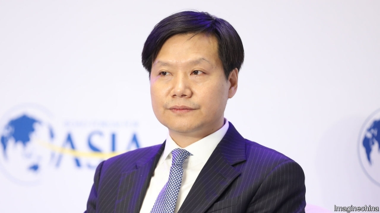
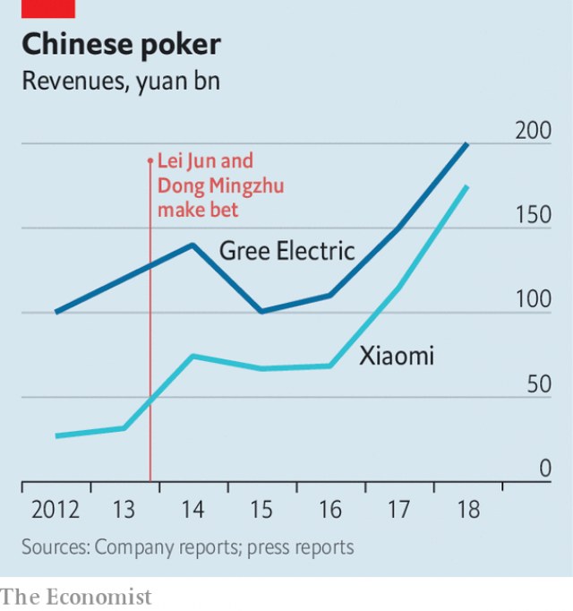

###### Chinese business

# Xiaomi’s founder loses a billion-yuan bet 

##### The wager offers a vignette of corporate China 

 

> May 2nd 2019 

IN 2013 BUSINESS folk gathered in Beijing to honour Chinese “Economic Figures of the Year” were treated to an unexpected twist. One of the winners, Lei Jun, ventured that in five years the sales of Xiaomi, the smartphone-maker he founded in 2010, would surpass those of Gree, a manufacturer of air-conditioners with government roots. To make things interesting Dong Mingzhu, an entrepreneur and Gree’s chairwoman with whom Mr Lei had shared an award, bet him 1bn yuan ($148m today) that her company’s turnover would stay ahead. Mr Lei accepted. Since March 19th, when Xiaomi posted revenues of 175bn yuan in 2018, corporate China has awaited the figure from Gree. On April 28th the verdict was in: it made 200bn yuan. Mr Lei was out of the money. 

The bet looked bold for Mr Lei in 2013. Xiaomi was then making a quarter of Gree’s 120bn yuan in annual sales. The “Apple of the East”, as it was dubbed, represented a new sort of Chinese company: market-driven and spunky, not state-led and stodgy; online instead of bricks and mortar; relying on digital technology rather than mechanical engineering. By mid-2018 Xiaomi’s revenue neared 90% of Gree’s (see chart). When the firm floated on the Hong Kong stock exchange last July it was valued at $54bn. It has become the fourth-most-valuable Chinese brand, according to BrandZ, a consultancy; Gree is 29th. Ms Dong herself suggested that the wager was meaningless given how different Gree and Xiaomi were. 

 

In reality, the companies are not that dissimilar—and growing less so as China’s economy modernises. Both have boomed thanks to swelling Chinese disposable incomes. The fiercely independent Ms Dong has repeated publicly that her firm must fight for customers just as private ones like Xiaomi do. In April Gree’s largest shareholder, a regulator overseeing state-owned enterprises, said it would sell most of its 18% stake. To build an ecosystem of devices controlled by his mobile phones, Mr Lei relies on closeness to China’s manufacturing heartland, Gree’s home. 

They face similar challenges, too. The competition in their core markets is stiff. Xiaomi’s margins from low-cost phones are wafer-thin. Gree has lost share of Chinese air-con sales to rivals such as Haier and Midea, which are introducing more high-tech models. Xiaomi and Gree have both taken a punt on changing their original business models. Gree is selling more online. Xiaomi is opening more physical stores. To keep up with rapidly changing consumer tastes, Gree has moved into smart home appliances, as well as low-emission vehicles and chip design—areas in which Xiaomi now does business, too. Ms Dong now makes smartphones, and Mr Lei has a line of air-conditioners. Whether or not he makes good on it—gambling is outlawed on the mainland—the bet highlights the changing face of China Inc. 

-- 

 单词注释:

1.founder['faundә]:n. 创立者, 建立者 vt. 使沉没, 使摔倒, 弄跛, 浸水, 破坏 vi. 沉没, 摔到, 变跛, 倒塌, 失败 

2.wager['weidʒә]:n. 赌注, 赌博, 赌物 vt. 下赌注, 向...保证 vi. 打赌 

3.vignette[vi'njet]:n. 装饰图案；小插图 

4.corporate['kɒ:pәrit]:a. 社团的, 合伙的, 公司的 [经] 团体的, 法人的, 社团的 

5.unexpect[]:[网络] 意想不到；使意外 

6.lei['leii:]:n. 花环 

7.Jun[dʒʌn]:六月 

8.Xiaomi[]:[网络] 小米手机；路嘉怡；品牌 

9.surpass[sә'pɑ:s]:vt. 超越, 凌驾, 胜过 

10.gree[^ri:]:n. 格力（品牌名） 

11.dong[dɔŋ]:n. 盾（越南货币单位） 

12.entrepreneur[.ɒntrәprә'nә:]:n. 企业家, 主办人 [经] 承包商, 企业家 

13.turnover['tә:n.әuvә]:n. 翻倒, 翻转, 半圆酥饼, 营业额, 流通, 周转 a. 可翻转的 

14.verdict['vә:dikt]:n. 裁决, 判决, 判断性意见, 定论, 结论 [法] 定论, 判断, 意见 

15.dub[dʌb]:vt. 配音, 轻点, 授予称号, 击 n. 一下击鼓声, 笨蛋 

16.spunky['spʌŋki]:a. 有精神的, 生气蓬勃的, 容易发怒的 

17.stodgy['stɒdʒi]:a. 易吃饱的, 塞满的, 平凡的, 庸俗的, 步履艰难的 

18.online[]:[计] 联机 

19.mortar['mɒ:tә]:n. 臼, 研钵, 灰泥 vt. 用灰泥涂抹, 用灰泥结合 

20.hong[hɔŋ]:n. （中国、日本的）行, 商行 

21.kong[kɔŋ]:n. 含锡砾石下的无矿基岩；钢 

22.consultancy[]:n. 商量, 协商, 磋商, 会诊, 与...商量, 咨询, 请教, 找(医生)看病, 查阅, 考虑 [经] 咨询业务, 咨询服务 

23.meaningless['mi:niŋlis]:a. 无意义的 

24.les[lei]:abbr. 发射脱离系统（Launch Escape System） 

25.modernise['mɔdәnaiz]:vt.vi. (使)现代化, (使)适应现代需要 vi. 用现代方法 

26.disposable[dis'pәuzәbl]:a. 可任意处理的 [法] 可任意处理或处置的, 可自由使用的 

27.fiercely['fiәsli]:adv. 猛烈地, 厉害地 

28.shareholder['ʃєә.hәuldә]:n. 股东 [法] 股东, 股票持有人 

29.regulator['regjuleitә]:n. 调整者, 校准者, 校准器, 调整器, 标准钟 [化] 调节剂; 调节器 

30.oversee[.әuvә'si:]:vt. 向下看, 了望, 监督, 偷看到 [法] 监察, 监督, 俯瞰 

31.ecosystem['i:kәu.sistәm]:n. 生态系统 [医] 生态系 

32.closeness['klәusnis]:[建] 密闭, 紧密 

33.manufacturing[.mænju'fæktʃәriŋ]:n. 制造业 a. 制造业的 

34.heartland['hɑ:tlænd]:n. 心脏地区, 中心地带 

35.haier[]:n. 海尔（中国家电品牌） 

36.midea[]:n. 美的（品牌名） 

37.punt[pʌnt]:n. 方头平底船, 踢悬空球, 赌博者 v. 踢悬空球, 用篙撑船, 赌博 

38.chip[tʃip]:n. 屑片, 薄片, 碎片 vt. 削, 切, 削成碎片, 使摔倒, 凿 vi. 削下屑片 [计] 孔屑; 组件; 晶片; 芯片 

39.smartphones[]: 智能手机（smartphone的复数） 

40.outlaw['autlɒ:]:n. 被剥夺法律保护的人, 罪犯 vt. 使...失去法律保护, 将...逐出社会, 宣告非法, 取缔 

41.Inc[]:a. 根据法律组成的公司, 公司 

