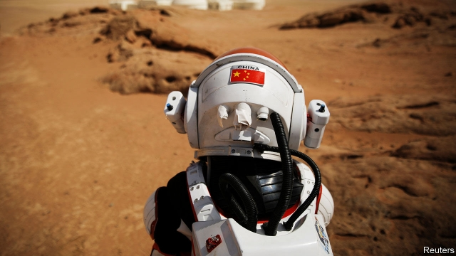

###### Life on Mars

# Space-themed tourism is taking off in China 

##### The red planet is far away, but the Gobi desert isn’t 

 

> May 2nd 2019 

MEALWORMS WRIGGLE on a shelf in the botanical module of Mars Base 1, a simulated Martian habitat on the edge of the Gobi desert in western China. Guo Jiayu, a guide, tells a group of wide-eyed schoolchildren that, mashed up, such larvae could be part of the diet of astronauts should they reach the red planet. Elsewhere in the complex (pictured), neon-lit corridors lead to sleeping compartments and a control centre. Through an airlock lined with spacesuits awaits a rover, ready for exploring the rocky expanse outside. 

The small installation is near Jinchang, a nickel-mining city in the western province of Gansu. It was built last year at a cost of around 50m yuan ($7.5m) by Bai Fan, a garrulous British-educated entrepreneur with the backing of private investors. For now Mr Bai is mainly using the base to teach students about travel to Mars. Eventually he hopes the facility will become the centrepiece of a resort. His company has secured the right to develop 67 square kilometres of the surrounding desert—an area bigger than Manhattan. The base has already hosted a reality television show, in which six celebrities pretended to be astronauts facing life-threatening challenges. 

Businesspeople across China see money-making possibilities in the country’s quest for space-faring achievement. In January China became the first country to land a spacecraft on the far side of the moon. It aims to send another one to the lunar surface this year to collect samples and bring them back to Earth (the last country to do this was the Soviet Union in 1976). Next year China wants to launch the main section of a new Earth-orbiting space station and send a rover to Mars. 

There is clearly much public excitement. The number of people searching online for space-related museums, attractions and tours increased by 60% in 2018, reckons Ctrip, a Chinese travel agent. In March another Mars-themed attraction—a tourist camp accommodating up to 160 people—opened on the Tibetan plateau. Publishers are producing five times as many science-fiction titles as they were in 2011, says Sixth Tone, a Chinese news site. 

In the southernmost province of Hainan, officials are hoping to cash in on a space-launch site that became operational there in 2016. Previously, such facilities were built in remote areas deep inland. The new facility is much more accessible to tourists. Its launches can be watched from a nearby sandy beach. For now, however, a more popular attraction is the world’s largest radio telescope, FAST, in a remote basin of another southern province, Guizhou. The instrument, which has a diameter of 500 metres, also opened in 2016. In the first half of last year alone, more than 5m visitors travelled to see it. Few of them got inside the facility itself: only 2,000 people are admitted daily. But nearby towns are littered with chintzy attractions. 

Officials in Guizhou worry that the tourism boom might interfere with the telescope’s function. They are scaling back development plans in the area. But the Communist Party sees benefits in all this attention to space. It is generating patriotic fervour as well as enthusiasm for space science. An excited 13-year-old touring Mars Base 1 says she hopes to visit the planet itself one day. Americans were the first people to set foot on the moon, she says. Why shouldn’t the first on Mars be Chinese? 

-- 

 单词注释:

1.mar[mɑ:]:vt. 损毁, 损伤, 糟蹋 n. 三月 

2.Gobi['^әjbi]:n. 戈壁沙漠, 戈壁滩 

3.mealworm['mi:lwә:m]:n. 大黄粉虫幼体 

4.wriggle['rigl]:n. 蠕动, 蜿蜒 vi. 蠕动, 蜿蜒前进, 摆脱 vt. 使扭动, 扭动着爬 

5.module['mɒdju:l]:n. 组件, 模数 [计] 模块 

6.simulate['simjuleit]:vt. 模拟, 假装, 模仿 [法] 伪装的, 模拟的; 假装的, 伪装的, 冒充 

7.Martian['mɑ:ʃiәn]:n. 火星人 a. 火星的 

8.habitat['hæbitæt]:n. 栖息地, 居留地, 自生地, 聚集处 [医] 习生地, 产地, 生境, 栖所 

9.guo[]:abbr. 仅供政府使用（Government Use Only） 

10.schoolchild['sku:ltʃaild]:n. 学童 

11.mash[mæʃ]:n. 碎麦芽, 饲料, 糊状物 vt. 调情, 捣碎 

12.larva['lɑ:vә]:n. 幼虫 [医] 幼虫(昆虫), 蚴(蠕虫) 

13.compartment[kәm'pɑ:tmәnt]:n. 分隔间, 卧车包房, 防水舱隔 [医] 隔室, 隔间 

14.airlock[]:n. 气塞, 气闸, 气密舱 [化] 风闸; 气封; 气窝(塑料表面的) 

15.spacesuit[]:n. 太空衣 

16.rover['rәuvә]:n. 漂泊者, 流浪者, 海盗 [法] 流浪者, 海盗, 海盗船 

17.rocky['rɒki]:a. 岩石的, 多石的, 像岩石的, 无情的, 摇动的, 摇晃的 

18.expanse[ik'spæns]:n. 宽阔区域, 宽阔, 天空 

19.Gansu['^ɑ:n'su:]:甘肃(位于中国西北部) 

20.bai[bai]:n. 黄雾 

21.garrulous['gærulәs]:a. 饶舌的, 多嘴的, 喋喋不休的 

22.entrepreneur[.ɒntrәprә'nә:]:n. 企业家, 主办人 [经] 承包商, 企业家 

23.investor[in'vestә]:n. 投资者 [经] 投资者 

24.centrepiece['sentәpi:s]:n. 中心装饰品 

25.Manhattan[mæn'hætәn]:n. 曼哈顿 

26.celebrity[si'lebrti]:n. 名声, 名人 

27.businessperson['bɪznəspɜ:sn]:n. 商人 

28.quest[kwest]:n. 探索, 寻求, 调查 v. 寻找, 找, 追寻猎物 

29.online[]:[计] 联机 

30.reckon['rekәn]:vt. 计算, 总计, 估计, 认为, 猜想 vi. 数, 计算, 估计, 依赖, 料想 

31.Ctrip[]:[网络] 携程；携程网；携程旅行网 

32.Tibetan[ti'betn]:a. 西藏的 n. 藏语, 西藏人 

33.plateau[plæ'tәu]:n. 高地, 高原, (上升后的)稳定水平 [医] 高原, 平顶, 坪 

34.publisher['pʌbliʃә]:n. 出版者, 发行人 [法] 发行人, 出版者, 报刊发行者 

35.southernmost['sʌð(ә)nmәjst]:a. 最南的 

36.Hainan['hai'nɑ:n]:海南(位于中国南端) n. 海南(中国海南省) 

37.Guizhou['^wei'dʒu:]:贵州(位于中国西南部) 

38.chintzy['tʃintsi]:a. 以印花棉布做成的, 低廉的 

39.patriotic[.peitri'ɒtik]:a. 爱国的, 有爱国心的 [法] 爱国的, 有爱国心的 

40.fervour['fә:vә]:n. 炽热, 热诚, 热情, 热烈 

