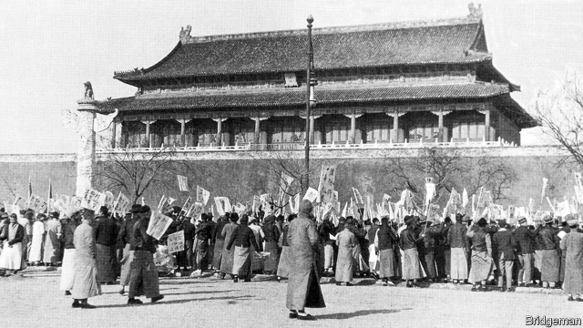

###### Tiananmen 1919

# The Communist Party grapples with a momentous anniversary 

##### Student protests a century ago led to the party’s birth. They also inspired subsequent generations of dissidents 

 

> May 2nd 2019 

A SHORT WALK from Tiananmen Square, young carworkers wearing company tracksuits stand with their fists in the air. They are renewing their vows to the Communist Youth League by chanting promises to “resolutely support” the Communist Party and “strictly follow” the league’s regulations. When they step aside for a group photo, 40 students from a technical college take their place to make their own pledges of loyalty. A growing queue of youngsters waits nearby to do the same. 

The oath-swearing spot is in the courtyard of an imposing edifice of russet brick, known as the Red Building. A century ago it belonged to Peking University, one of China’s most prestigious seats of learning (now in a north-western suburb). There is a striking contrast between these professions of faith in a dictatorial party and an exhibition the same young people are taken to see inside the building. It is about the students who, 100 years ago on May 4th, set off from the Red Building and other sites around the city to join a protest at Tiananmen provoked by the shabby treatment of China by its allies after the first world war. The Treaty of Versailles had awarded a former German colony in China to Japan. 

Today May 4th is officially celebrated as Youth Day. Its significance is strongly contested. The party recalls the May 4th Movement, which refers to the protest in Tiananmen as well as similar ones elsewhere in China and intellectual soul-searching around that time, as the backdrop to the party’s birth two years later. Liberals remember the movement as a cry for democracy by patriots who believed that China had no hope of standing tall without adopting Western learning, including in politics. In a year packed with sensitive anniversaries—including the 30th on June 4th of the army’s crushing of student protests in the same square in 1989 (an event barely known to many young people in China, owing to the assiduous efforts of censors)—the party is bent on ensuring that its version of history is the only one heard. 

Both the party and dissidents agree that in 1919 the country was at its nadir. The last imperial dynasty, the Qing, weakened by decades of internal strife and foreign encroachment on Chinese territory, had collapsed in 1911. A military strongman, Yuan Shikai, had tried to reinstate the monarchy with himself as the new emperor. His death in 1916 had unleashed struggles between rival warlords. The young protesters had hoped that China’s support for the allies against Germany—it had sent about 140,000 men to work as labourers on the front in Europe—would result in the return to China of colonised territory. Not only had their hopes been dashed, but, as they saw it, China’s own government had been complicit in the betrayal. 

But the party prefers not to delve deeply into the political aspirations of the May 4th Movement, including the view of many participants that China’s weakness was in part the result of flaws in its traditional culture. China’s current leader, Xi Jinping, is trying to recast the party as a champion of ancient Chinese values. The reformers of 1919 would be horrified. 

There is only one aspect of the movement that officials want to dwell on, namely its links with the party’s founding, says Rana Mitter of Oxford University. But public discussion even of the party’s early ideals is curtailed. The party does not want to be reminded that its supporters were once attracted by its promise of liberation from autocracy, not by the dictatorship it came to represent. In recent decades the party has downplayed the iconoclasm of the May 4th Movement, preferring to portray it as something far blander. A student leader tells one of the groups outside the Red Building that “the spirit of May 4th” is today found in young doctors who battle epidemics and young soldiers who rescue citizens from natural disasters. 

If there is something galling about a government that brooks no dissent making heroes of long-dead protesters, no one at the Red Building is willing to admit it. China today is far more tightly controlled than it was during the early months of 1989 when the party was almost brought down by students who claimed that they, not China’s geriatric leaders, were the true heirs of 1919. Those protests were fanned by excitement about the 70th anniversary of the May 4th Movement (hundreds of thousands took to the streets on that day 30 years ago—a high point of the unrest). The party frets that the proximity this year of two big anniversaries—of the demonstrations in 1919 as well as in 1989—will encourage dissidents to air their grievances. 

Given the intensity of security in the capital, this is highly unlikely to happen on the streets. But the party’s anxiety has some basis. Campus activism has been bubbling up in the form of #MeToo campaigning against sexual harassment and an attempt by self-described Marxists to help factory workers in southern China establish a free trade union. Police have arrested dozens of these labour activists. (Six students connected with the cause are reported to have been taken into custody on April 28th, presumably for fear that they might speak out during the centenary.) Academics are cowed, but not crushed. Lately the bravest have been speaking up for Xu Zhangrun, an academic in Beijing who was suspended earlier this year for attacking Mr Xi’s authoritarianism. 

The party can at least claim to have fulfilled one dream of the protesters of 1919: China is now a global power (Mr Xi will be careful to ensure that his trade agreement with America’s president, Donald Trump, expected soon, does not look like surrender). But on April 30th, at a commemoration of the centenary in the Great Hall of the People next to Tiananmen, Mr Xi gave a veiled warning to dissidents. He described being unpatriotic as “disgraceful” and said that loving the country was closely entwined with loving the party and socialism. The traditional May Day public holiday was recently extended from three days to four. The party may hope to nudge Beijingers to enjoy a break outside the city and leave its history behind. The “spirit” of the centenary looks a lot like mistrust and fear. 

-- 

 单词注释:

1.grapple[græpl]:v. 抓住, 掌握 n. 抓住, 系紧, 掌握, 与...扭打 

2.momentous[mәu'mentәs]:a. 重大的, 重要的 

3.dissident['disidәnt]:a. 意见不同的, 持不同政见的 n. 意见不同的人, 持不同政见者 

4.tracksuit[]:n. 运动服 

5.vow[vau]:n. 誓约, 誓言, 许愿 vi. 起誓, 发誓, 郑重宣言 vt. 立誓, 起誓要, 郑重地宣布 

6.resolutely[]:adv. 坚决地；毅然地 

7.pledge[pledʒ]:n. 诺言, 保证, 誓言, 抵押, 信物, 保人, 祝愿 vt. 许诺, 保证, 使发誓, 抵押, 典当, 举杯祝...健康 

8.edifice['edifis]:n. 大厦, 大建筑物 

9.russet['rʌsit]:a. 枯叶色的, 红褐色的, 简朴的 n. 红褐色, 冬季粗皮苹果 

10.Peke[pi:k]:n. <口>狮子狗,哈巴狗(原产于中国的一种玩赏狗) 

11.prestigious[pre'stidʒiәs]:a. 享有声望的 

12.dictatorial[diktә'tɒ:riәl]:a. 独裁者的, 独裁的, 独断的 

13.provoke[prә'vәuk]:vt. 激怒, 惹起, 诱导 [法] 刺激, 煽动, 激怒 

14.ally['ælai. ә'lai]:n. 同盟者, 同盟国, 助手 vt. 使联盟, 使联合, 使有关系 vi. 结盟 

15.Versailles[veә'sai, vә:'seilz]:凡尔赛[法国北部城市] 

16.officially[ә'fiʃәli]:adv. 作为公务员, 职务上, 官方地 

17.backdrop['bækdrɒp]:n. 背景幕, 背景 

18.patriot['peitriәt]:n. 爱国者, 爱国主义者 

19.politic['pɒlitik]:a. 精明的, 明智的, 策略的 

20.assiduous[ә'sidjuәs]:a. 勤勉的, 刻苦的 

21.nadir['nei.diә]:n. 天底, 最低点 

22.imperial[im'piәriәl]:a. 帝王的, 宗主国的, 至尊的, 壮丽的 n. 特等品 

23.Q[kju:]:[计] 质量, 询问, 队列, 排队, 商 

24.strife[straif]:n. 争吵, 竞争, 冲突 

25.encroachment[in'krәutʃmәnt]:n. 侵蚀, 侵犯 [法] 侵犯, 侵占, 侵入 

26.strongman[ˈstrɒŋmæn]:n. 大力士 

27.shikai[]:[网络] 琉璃苣；琉璃苣干燥肌肤护理；歯科医 

28.reinstate[.ri:in'steit]:vt. 使复原, 使恢复, 使复立 

29.monarchy['mɒnәki]:n. 君主政体, 君主国, 君主政治 [法] 君主政体, 君主制度, 君主国 

30.unleash[.ʌn'li:ʃ]:vt. 解开...的皮带, 发出, 发动 

31.warlord['wɒ:lɒ:d]:n. 军阀, 军阀式领袖 

32.protester[]:n. 抗议者, 持异议者, 拒付者 [经] 反对者 

33.colonise['kɔlәnaiz]:vi. 开拓殖民地；移民于殖民地 

34.complicit[kәm'plisit]:a. 有同谋关系的,串通一气的[由 complicity 逆构] 

35.betrayal[bi'treiәl]:n. 背叛, 辜负 [法] 背叛, 通敌, 背信 

36.delve[delv]:v. 探究, 查考 n. 坑, 穴 

37.aspiration[.æspә'reiʃәn]:n. 热望, 志向, 渴望 [医] 吸入; 吸[引], 吸引术 

38.participant[pɑ:'tisipәnt]:n. 参加者, 参与者 a. 有份的, 参加的, 参与的 

39.flaw[flɒ:]:n. 缺点, 裂纹, 瑕疵, 一阵狂风 [化] 划痕; 裂缝; 裂纹 

40.recast[.ri:'kɑ:st]:vt. 重铸, 重作, 改造 n. 重铸, 改换角色 

41.reformer[ri'fɒ:mә]:n. 改革家, 改革运动者 [化] 转化炉; 转化器; 重整器; 重整炉 

42.horrify['hɒrifai]:vt. 使恐惧, 使震惊 

43.dwell[dwel]:vi. 居住, 居住(于), 存在(于) 

44.Rana[]:[医] 蛙属 

45.mitter[]: [人名] 米特 

46.Oxford['ɒksfәd]:n. 牛津, 牛津大学 

47.curtail[kә:'teil]:vt. 缩减, 剥夺, 简略 [法] 剥夺特权 

48.supporter[sә'pɒ:tә]:n. 支持者, 后盾, 迫随者, 护身织物 [法] 支持者, 赡养者, 抚养者 

49.autocracy[ɒ:'tɒkrәsi]:n. 独裁统治, 独裁统治的国家 [法] 独裁政治, 专制政治, 独裁政府 

50.dictatorship[dik'teitәʃip]:n. 独裁者之职位, 独裁, 独裁政权 [法] 专攻, 独裁权 

51.downplay['daunplei]:vt. 不予重视 

52.iconoclasm[ai'kɒnәklæzm]:n. 破坏偶像, 破坏偶像主义, 打破旧习 

53.portray[pɒ:'trei]:vt. 描绘, 描写, 描绘...的肖像 

54.bland[blænd]:a. 温和的, 乏味的, 冷漠的 [医] 温和的, 淡的 

55.epidemic[.epi'demik]:n. 传染病, 流行病 a. 流行的, 传染性的 

56.gall[gɒ:l]:n. 胆汁, 五倍子, 苦味, 肿痛, 恼怒, 磨损处 vt. 烦恼, 屈辱, 磨伤 vi. 被磨伤 

57.dissent[di'sent]:n. 异议 vi. 持异议, 不同意 

58.tightly['taitli]:adv. 紧紧地, 坚固地 

59.geriatric[,dʒeri'ætrik]:a. 老年病学的, 衰老的, 老年的 [医] 老年医学的, 老年病学的, 老人学的 

60.fret[fret]:n. 烦躁, 磨损, 焦急, 网状饰物 vi. 烦恼, 不满, 磨损 vt. 使烦恼, 腐蚀, 使磨损, 使起波纹 

61.proximity[prɒk'simiti]:n. 接近, 亲近 

62.demonstration[.demәn'streiʃәn]:n. 示范, 实证 [医] 示教, 实物教授 

63.grievance['gri:vәns]:n. 委屈, 冤情, 苦况 [经] 不满(对雇用条件的) 

64.activism['æktivizm]:n. 激进主义, 行动主义, 能动论 [法] 激进主义, 行动主义 

65.metoo['metkəʊ]:adj. 〈美口〉行仿效计策的 v. 同意(对方的政见等) [网络] 咪兔；我也是；蜜桃 

66.harassment['hærәsmәnt]:n. 困扰, 烦扰, 烦恼 [法] 折磨, 骚扰, 侵扰 

67.activist['æktivist]:n. 激进主义分子 

68.custody['kʌstәdi]:n. 监护, 拘留, 监禁 [经] 保管, 照顾, 保护 

69.centenary[sen'ti:nәri]:n. 一百年 a. 一百年的 

70.xu[su:]:n. 北越货币单位；许（姓氏） 

71.authoritarianism[ə,θɔrə'tɛrɪənɪzəm]:n. 独裁主义；权力主义 

72.commemoration[kә.memә'reiʃәn]:n. 纪念, 纪念物, 庆典 

73.unpatriotic['ʌn.peitri'ɒtik]:a. 不爱国的, 无爱国心的 

74.disgraceful[dis'greisful]:a. 可耻的, 不名誉的 

75.entwine[in'twain]:v. (使)缠住, (使)盘绕, (使)纠缠 

76.nudge[nʌdʒ]:n. 用肘轻推, 推动, 讨厌家伙 

77.beijingers[]:[网络] 北京人 

78.mistrust[.mis'trʌst]:n. 不信任, 疑惑 v. 不信任, 疑惑 

