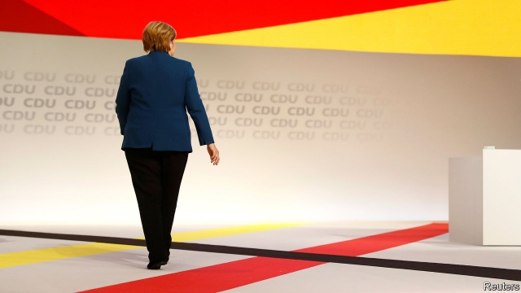

###### The long goodbye

# Germany’s chancellor, Angela Merkel, is taking her time to retire 

##### She still calls the shots on foreign policy 

 

> May 2nd 2019 

“WE ARE FAMILY!” blared the loudspeakers, as the grandees of Germany’s Christian Democratic Union (CDU), and its Bavarian sister party, the Christian Social Union (CSU), merrily marched on stage in Münster on April 27th. For once, the musical choice seemed apt. Last year a sororal row over immigration between the two conservative parties nearly tore Germany’s government apart. But all was forgotten as they launched their joint campaign for the European election on May 26th. Annegret Kramp-Karrenbauer and Markus Söder, new leaders of the CDU and CSU respectively, beamed as they swapped platitudes on stage and gave their blessing to Manfred Weber, a CSU man running for the European Commission presidency. Only one family member was missing. 

Angela Merkel’s absence in Münster was no less strange for being long-trailed. It was as if the Avengers held a reunion and Captain America had a diary conflict. During the previous European election campaign, in 2014, the chancellor’s face was plastered all over the CDU’s posters. This time she will make just two appearances, one of them abroad. She will also skip three state elections in east Germany this autumn, to the relief of some local party barons. “The chancellor is already in early retirement,” said Christian Lindner, leader of the opposition Free Democrats, this week. 

Not quite. Having handed over the CDU leadership to Ms Kramp-Karrenbauer in December, Mrs Merkel evidently wants to give her protégée space to introduce herself to voters. But while her party colleagues focus on winning elections and managing the coalition with the restive Social Democrats (SPD), the chancellor has shifted her attention outward. 

These days her engagements are typically devoted to shoring up multilateralism or celebrating Germany’s constitution, the sorts of themes one might expect from a ceremonial president. But on foreign policy, Mrs Merkel remains vigorously hands-on. This week, along with Emmanuel Macron, she corralled eight Balkan leaders for a meeting in Berlin before jetting off on a three-day tour of the Sahel. Immediately after the European elections she will deliver the commencement speech at Harvard University. Rumours persist that she may offer to send herself to Brussels for a senior European Union post this year. 

Mrs Merkel insists that she has no plans to quit the chancellery before her term expires in 2021. But Ms Kramp-Karrenbauer is being groomed for the top job, and the innovation of splitting the two posts guarantees endless speculation about the timing and manner of a handover that would probably shatter the coalition and trigger an election. This week Mrs Merkel had to deny rumours that a CDU “retreat” in early June, hastily announced by Ms Kramp-Karrenbauer, was designed to occasion a transfer of power. So far Mrs Merkel has stage-managed her exit to perfection. But there is a feeling that control is slipping away. 

Despite the jitters, the smart money still says that Mrs Merkel will serve out her term. The chancellor who, as a child, once hesitated on a diving board for an hour before finally jumping, will not be rushed from office, and there is no public clamour for her to do so. As for Ms Kramp-Karrenbauer, the more German voters see of her earthy conservatism the less they seem to like it, and the CDU’s poll numbers are also sagging. These are not propitious circumstances for an early handover. 

Yet the current strategy carries risks, too. Mrs Merkel remains popular in Germany but her authority is waning. Ms Kramp-Karrenbauer’s forays into European politics have confused partners like France. More immediately, as chancellor it will fall to Mrs Merkel to make the case for Mr Weber as commission president, as part of the horse-trading among European leaders over top EU jobs that begins after the election. But her government is rumoured to want to push for a German president of the European Central Bank instead. Should Mrs Merkel throw Mr Weber under the bus, it will be left to Ms Kramp-Karrenbauer to quell the furies in the CDU/CSU ranks. 

In some respects Mrs Merkel’s transformation into an apolitical chancellor simply caps a process that has defined her long career. The chancellor has always had an arm’s-length relationship with the party she led for 18 years, and some in the CDU’s conservative heartlands never quite took to their leader, an Ossi (easterner) with an unusual biography and relentlessly centrist instincts. It was Mrs Merkel’s pleasant habit of repeatedly winning elections that helped the sceptics overcome their doubts. It now falls to Ms Kramp-Karrenbauer to prove she has the same talent. 

-- 

 单词注释:

1.chancellor['tʃɑ:nsәlә]:n. 大臣, 总理, 首相, 大使馆/领事馆的一等秘书, 司法官, 大学校长 

2.angela['ændʒilә]:n. 安吉拉（女子名） 

3.merkel[]: [人名] 默克尔; [地名] [美国] 默克尔 

4.blare[blєә]:n. 巨响, 吼叫声, 光泽 vi. 高声鸣叫, 大叫 vt. 大声喊出 

5.grandee[græn'di:]:n. 大公, 显贵之人 

6.CDU[]:abbr. 中央显示器（Central Display Unit）；海防搜索潜艇雷达（Coast Defense radar for detecting U-boats） 

7.Bavarian[bә'vєәriәn]:a. 巴伐利亚的, 巴伐利亚人的 n. 巴伐利亚人, 巴伐利亚方言 

8.CSU[]:[计] 信道服务设备 

9.merrily['merili]:adv. 愉快地, 高兴地 

10.Münster[]:[地名] 明斯特 ( 奥、德、瑞士 ) 

11.apt[æpt]:a. 有...倾向的, 易于的, 恰当的, 聪明的 [计] 自动数控语言, 自动图象传输, 自动程序控制, 自动程序设计工具 

12.sororal[sә'rɒ:rәl]:a. 姐妹的 [法] 姐妹的, 姊妹关系的 

13.MARKUS[]:n. 马库斯（姓氏） 

14.platitude['plætitju:d]:n. 单调, 平凡, 陈腐, 陈词滥调 

15.Manfred['mænfred]:曼弗雷德(男子名) 

16.Weber['wi:bә]:[计] 韦伯 [医] 韦伯, 库仑 

17.presidency['prezidәnsi]:n. 总统职权, 总裁职位 

18.les[lei]:abbr. 发射脱离系统（Launch Escape System） 

19.avenger[ә'vendʒә]:n. 复仇者 

20.reunion[ri:'ju:njәn]:n. 团圆, 重聚 [医] 再连合, 复连[合] 

21.baron['bærәn]:n. 男爵 [法] 男爵, 贵族, 大王 

22.retirement[ri'taiәmәnt]:n. 退休, 隐居, 撤退 [经] 退休, 退股, (固定资产)报废 

23.lindner[]: [人名] 林德纳 

24.opposition[.ɒpә'ziʃәn]:n. 反对, 敌对, 相反, 在野党 [医] 对生, 对向, 反抗, 反对症 

25.democrat['demәkræt]:n. 民主人士, 民主主义者, 民主党党员 [经] 民主党 

26.Mr['mistә(r)]:先生 [计] 存储器回收程序, 多重请求 

27.evidently['evidәntli]:adv. 明显地, 根据现有证据来看 

28.voter['vәutә]:n. 选民, 投票人 [法] 选民, 选举人, 投票人 

29.coalition[.kәuә'liʃәn]:n. 结合体, 结合, 联合 [经] 联合, 联盟 

30.restive['restiv]:a. 不愿向前走的, 倔强的, 难驾御的 

31.spd[]:abbr. 电涌保护器；补充石油税；统计过程诊断（Statistical Process Diagnosis） 

32.engagement[in'geidʒdmәnt]:n. 诺言, 约会, 婚约, 交战 [医] 衔接 

33.typically['tipikәli]:adv. 代表性地；作为特色地 

34.multilateralism[]:n. 多边贸易 

35.ceremonial[.seri'mәunjәl]:n. 仪式 a. 正式的 

36.vigorously[]:adv. 朝气蓬勃, 精力充沛, 壮健, 茁壮, 健壮, 强有力 

37.emmanuel[i'mænjuәl]:n. 以马内利（耶稣基督的别称）；伊曼纽尔（男子名, 等于Immanuel） 

38.macron['mækrәn]:n. 长音符号 

39.corral[kɒ:'rɑ:l]:n. 畜栏 vt. 把...关进畜栏 

40.Balkan['bɒ:lkәn]:a. 巴尔干的 

41.Berlin[bә:'lin]:n. 柏林, (软质)柏林毛线 

42.Sahel['sɑ:hel]:荒漠草原(西非) 

43.commencement[kә'mensmәnt]:n. 开始, 毕业典礼 [法] 开始, 毕业典礼 

44.Harvard['hɑ:vәd]:n. 哈佛大学 

45.Brussel[]:n. 布鲁塞尔（比利时首都） 

46.chancellery['tʃɑ:nsәlәri]:n. 大臣 

47.expire[ik'spaiә]:vi. 期满, 呼气, 断气 vt. 呼出 

48.groom[gru:m]:n. 马夫, 新郎, 男仆 vt. 喂马, 使...整洁, 推荐 vi. 打扮, 穿戴 

49.innovation[.inәu'veiʃәn]:n. 改革, 创新 [法] 创新, 改革, 刷新 

50.speculation[.spekju'leiʃәn]:n. 沉思, 推测, 投机 [经] 投机交易, 买空卖空 

51.timing['taimiŋ]:n. 时间选择, 时间测定, 定时, 调速 [计] 定时器时钟 

52.handover['hændәuvә]:[计] 转移, 转换 

53.shatter['ʃætә]:n. 碎片, 粉碎, 落叶, 喷洒 vt. 打碎, 使散开, 粉碎, 破坏 vi. 粉碎, 损坏, 脱落 

54.trigger['trigә]:n. 触发器, 扳机 vt. 触发, 发射, 引起 vi. 松开扳柄 [计] 切换开关 

55.hastily['heistili]:adv. 匆忙地, 急速地, 急躁地 

56.perfection[pә'fekʃәn]:n. 完美, 完成, 极端 [经] 完整性 

57.jitter['dʒitә]:vi. 神经过敏, 战战兢兢 [计] 跳动; 抖动 

58.clamour['klæmә]:n. 喧闹 v. 大声地要求 

59.earthy['ә:θi]:a. 土的, 土质的, 土味的 

60.conservatism[kәn'sә:vәtizәm]:n. 保守, 守旧性, 保守主义, [the]保守党的主张和政策, 保守党 [医] 保守性 

61.sag[sæg]:vi. 下垂, 倾斜, 萎靡, 萧条, 变得乏味 vt. 使下垂 n. 下垂, 倾斜, 萧条 [计] 系统分析组, 语法分析生成程序, 电压下降 

62.propitious[prә'piʃәs]:a. 顺利的, 适合的, 吉祥的, 慈悲的 

63.wane[wein]:n. 减少, 衰微, 败落, 亏缺, 月亏 vi. 变小, 亏缺, 衰落, 消逝, 退潮 

64.foray['fɒrei]:vi. 侵略, 劫掠, 袭击 n. 侵掠, 侵略, 攻击 

65.politic['pɒlitik]:a. 精明的, 明智的, 策略的 

66.EU[]:[化] 富集铀; 浓缩铀 [医] 铕(63号元素) 

67.quell[kwel]:vt. 压制, 平息, 减轻 

68.fury['fjuri]:n. 愤怒, 狂暴, 狂怒的人 [医] 狂乱, 狂暴, 狂怒 

69.apolitical[.eipә'litikl]:a. 不关心政治的 

70.alway['ɔ:lwei]:adv. 永远；总是（等于always） 

71.heartland['hɑ:tlænd]:n. 心脏地区, 中心地带 

72.Ossi[]:[地名] 奥西 ( 意 ) 

73.easterner['i:stәnә(r)]:n. 东方人 

74.relentlessly[]:adv. 不仁慈, 严酷, 无情, 坚韧, 不懈, 不屈不挠 

75.centrist['sentrist]:n. 中间党派的成员, 温和主义者 [法] 中间派议员, 中立派议员 

76.sceptic['skeptik]:n. 怀疑论者 

