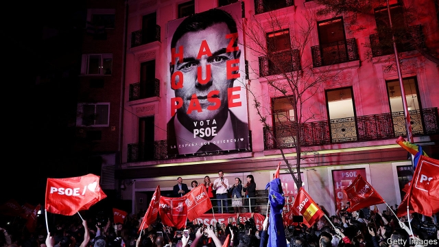
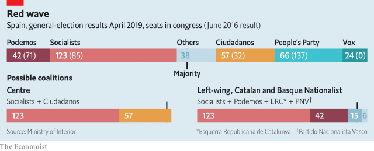

###### Sánchez’s new day

# In Spain’s election, the Socialists win the most seats 

##### But forming a viable government will take time and allies 

 

> May 2nd 2019 

CLOSE TO MIDNIGHT on April 28th, with the vote-count in the general election all but over, the scenes outside the headquarters of Spain’s two main political parties said it all. “We’ve sent a message to Europe and the world…that you can defeat reaction [and] authoritarianism,” Pedro Sánchez told a cheering crowd of several hundred activists from his Socialist party. A couple of kilometres away, barely a dozen people stood outside the offices of the conservative People’s Party (PP) until workers dismantled, unused, an elaborate stage. Speaking inside to journalists, a dejected Pablo Casado, the PP’s leader, admitted: “It’s been a very bad result.” Mr Sánchez led the Socialists to their first win (in the sense of taking the most seats, though still well short of a majority) since 2008, while the PP’s very future, and certainly that of its leader, looks uncertain. 

Back last May when he filed a censure motion that brought him to office and ended more than six years of PP rule under Mariano Rajoy, Mr Sánchez brushed off demands for an immediate election. With less than a quarter of the Congress, he governed for ten months through gestures—a big rise in the minimum wage, which employers say discourages job creation—and symbolic acts, such as a yet-to-be-fulfilled commitment to move the remains of General Franco, Spain’s former dictator, from his grandiose memorial. But although he opted to call fresh elections after failing to pass a budget, the Socialists gained 2m more votes and 38 more seats compared with the previous ballot in 2016. 

The election increased the fragmentation of what was once a two-party system. The right splintered into three, and paid a price for that in lost seats. The PP lost more than half its seats and 3.5m votes, its worst result since its foundation in 1989. Ciudadanos, a formerly liberal party that has moved to the right, came within 220,000 votes of it. The hard right, in the shape of Vox, a newish nationalist party, will be represented in Congress for the first time since 1982. But with only 24 seats and 10.3% of the vote, it fell short of forecasts. 

What Mr Sánchez mocked as “the primary of the right” stamped an ill-tempered character on the campaign. Mr Casado, Ciudadanos and Vox all tried to make the election about national unity. That was threatened in 2017 when the separatist administration in Catalonia staged an unconstitutional referendum and a unilateral declaration of independence. The right castigated Mr Sánchez for having held inconclusive talks with Catalan officials. Mr Casado called him a “felon”, and Albert Rivera, the leader of Ciudadanos, declared that he was “not a constitutionalist” and that Spain faced a “national emergency”. Both wanted to impose direct rule in Catalonia; Vox wants to abolish Spain’s regional governments altogether. 

 

Mr Sánchez insisted he had done no deals with the separatists—their failure to support his budget triggered the election—and will never agree to an independence referendum. He said the issues were “concord” and social justice after the spending cuts following the economic slump of 2009-13. In the event, the spectre of Vox helped Mr Sánchez mobilise his voters. A high turnout of 76% on a spring day also helped the Catalan separatists, who won 22 seats, up from 17, though the big winner among them was Esquerra, the most pragmatic of the pro-independence parties. 

If he wants to be able to tackle deep-seated problems, such as high youth unemployment and unsustainable pensions, Mr Sánchez will need allies to govern in the 350-seat Congress. Securing them will be complicated. “From our position on the left, we will extend our hand to all political forces [who operate] within the constitution,” he said on election night. One option is to join forces with Podemos, a much-further-left outfit with 42 seats (down from 71), and make up the numbers with the moderate Basque nationalists and assorted regional parties. Pablo Iglesias, Podemos’s leader, has been pressing for a formal coalition, which would be a first in Spain’s current democratic period. But this would still be short of a majority. And many Socialist voters recoil at Podemos’s commitment to an independence referendum in Catalonia. Businesses, too, are scared of Podemos entering government, even though Mr Iglesias has moderated his stance and is not quite the firebrand of the left he once was. 

A stronger, but politically harder, option would be a coalition with Ciudadanos. This week Mr Rivera again ruled that out. Socialist activists listening to Mr Sánchez outside party headquarters chanted “Not with Rivera”. But the main business organisations have urged both men to reconsider, or at least that Ciudadanos (and the PP) abstain to allow Mr Sánchez to be invested as prime minister. 

For the moment, Socialist leaders say they will govern alone, seeking support as needed, where they can. Whether that remains the position will become clear only after the new Congress convenes on May 21st and after yet another election, this one on May 26th for mayors, 12 regional governments and the European Parliament. 

The Spanish right faces a hard task of rebuilding. Unless the PP does much better on May 26th, Mr Casado may be forced out. He chose to turn the PP’s broad church into an ideological sect, purging moderates and bringing in an inexperienced team. His attempt to echo rather than challenge Vox, whose origins lie in a breakaway from the PP, failed. The PP lost 1.6m of its voters to Vox, as well as 1.4m to Ciudadanos, according to an analysis for El Mundo, a newspaper. One of them was Alfonso Pérez, a bank worker. “The union of Spain is fundamental,” he said as he listened to Vox’s final campaign rally in Madrid. 

For Mr Sánchez, who was briefly ejected as party leader in 2016-17 and was widely written off by Socialist grandees, the election was a personal triumph. The days of absolute majorities in Spain are over for the time being. But the country’s prime minister has delivered rare good news for social democracy ahead of the election for the European Parliament. 

-- 

 单词注释:

1.viable['vaiәbl]:a. 能养活的, 能生长发育的 [医] 有活力的, 有生机的 

2.ally['ælai. ә'lai]:n. 同盟者, 同盟国, 助手 vt. 使联盟, 使联合, 使有关系 vi. 结盟 

3.headquarter[,hed'kwɔ:tә]:vt. 将...的总部设在 

4.authoritarianism[ə,θɔrə'tɛrɪənɪzəm]:n. 独裁主义；权力主义 

5.pedro['pi:drәu]:n. 彼得牌戏（一种纸牌戏） 

6.activist['æktivist]:n. 激进主义分子 

7.p[pi:]:便士 [计] 页, 对, 并行, 奇偶性, 指示器, 多项式, 程序, 方法, 皮 

8.dismantle[dis'mæntl]:vt. 拆除...的设备, 分解, 去除覆盖物 

9.unused[.ʌn'ju:zd]:a. 不用的, 不在使用的, 从未用过的 

10.deject[di'dʒekt]:vt. 使沮丧, 使灰心 

11.Pablo['pæblәu]:n. 巴勃罗（西班牙籍体育明星）；帕布洛（英国水槽产品品牌）；帕布鲁（西班牙著名画家毕加索的姓） 

12.casado[]:[网络] 卡萨德奥；卡沙度；已婚者 

13.censure['senʃә]:n. 责难 vt. 非难, 指责 

14.Mariano[]:马里亚诺 

15.Rajoy[]:[网络] 拉霍伊；西班牙总理拉荷伊；总理拉霍伊 

16.les[lei]:abbr. 发射脱离系统（Launch Escape System） 

17.symbolic[sim'bɒlik]:a. 象征的, 符号的 [电] 符号化 

18.franco['fræŋkәu]:a. 免费的 [经] 全部费用在内价, 运费准免的 

19.dictator['dikteitә]:n. 命令者, 独裁者 

20.grandiose['grændiәus]:a. 宏伟的, 壮丽的, 夸张的 [医] 夸大的 

21.opt[ɒpt]:vi. 选择 

22.ballot['bælәt]:n. 投票, 投票用纸, 抽签 vi. 投票, 抽签 vt. 投票选出, 拉选票 

23.fragmentation[.frægmәn'teiʃәn]:n. 分裂, 破碎 [计] 在IP层将打包文件切成适当大小的程序 

24.splinter['splintә]:n. 碎片, 尖片, 分裂出来的小派别, 微小的东西 v. 使分裂, (使)破裂 

25.formerly['fɒ:mәli]:adv. 从前, 以前 

26.vox[vɔks]:[医] 语音, 语声 

27.newish['nju:iʃ]:a. 尚新的 

28.nationalist['næʃәnәlist]:n. 国家主义者, 民族主义者 

29.mock[mɒk]:n. 嘲笑, 戏弄, 模仿 a. 假的, 伪造的, 模拟的 adv. 虚伪地 vt. 嘲弄, 模仿, 使失望, 欺骗, 挫败 vi. 嘲弄 

30.separatist['sepәreitist]:n. 分离主义者, 独立派 

31.catalonia[,kætә'lәjniә]:n. 加泰罗尼亚（西班牙东北地方） 

32.unconstitutional['ʌnkɔnsti'tju:ʃәnәl]:a. 违反宪法的, 不符合宪法的 [法] 违反宪法的, 违宪的, 不合宪法规定的 

33.referendum[.refә'rendәm]:n. （就重大政治或社会问题进行的）全民公决，全民投票 

34.unilateral[.ju:ni'lætәrәl]:a. 单方面的, 单边的, 片面的 [医] 单侧的, 一侧的 

35.declaration[.deklә'reiʃәn]:n. 宣告, 说明, 宣布 [计] 说明 

36.castigate['kæstigeit]:vt. 惩罚, 苛评, 修订 

37.inconclusive[.inkәn'klu:siv]:a. 非决定性的, 无效果的, 不得要领的 [法] 非决定性的, 不确定的, 无结果的 

38.Catalan['kætәlәn]:n. 加泰隆人, 加泰隆语 

39.felon['felәn]:n. 重罪犯, 恶棍, 瘭疽 [医] 瘭疽, 指头脓炎 

40.albert['ælbәt]:n. 艾伯特（男子名） 

41.Rivera[]:n. 里韦拉（乌拉圭北部最重要的边境城市, 里韦拉省首府） 

42.constitutionalist[-ist]:n. 立宪主义者, 拥护宪政者 

43.Spain[spein]:n. 西班牙 

44.regional['ri:dʒәnәl]:a. 地方的, 地域性的 [医] 区的, 部位的 

45.trigger['trigә]:n. 触发器, 扳机 vt. 触发, 发射, 引起 vi. 松开扳柄 [计] 切换开关 

46.concord['kɒŋkɒ:d]:n. 一致, 和睦, 协定 

47.slump[slʌmp]:n. 暴跌, 垂头弯腰的姿态 vi. 猛然掉落, 陷入, 衰落(经济等) 

48.spectre['spektә]:n. 幽灵, 妖怪, 凶兆 

49.mobilise['mәjbilɑiz]:vi.vt. 动员, 松动, 使活动, 调动, 发动 

50.voter['vәutә]:n. 选民, 投票人 [法] 选民, 选举人, 投票人 

51.turnout['tә:naut]:n. 聚集的人群, 出席者, 产量 [化] 输出; 产额 

52.esquerra[]:n. (Esquerra)人名；(西)埃斯克拉 

53.pragmatic[præ^'mætik]:a. 忙碌的, 爱管闲事的, 自负的, 固执己见的, 实际的, 务实的, 国事的, 国务的 [法] 闲断的, 固执己见的, 实用主义的 

54.tackle['tækl]:n. 工具, 复滑车, 滑车, 装备, 扭倒 vt. 固定, 处理, 抓住 vi. 扭倒 

55.unsustainable[,ʌnsәs'teinәbl]:a. 无法支撑的, 不能忍受的, 不可证实的 [法] 未能证实的, 不能成立的 

56.podemos[]:[网络] 社会民主力量党；社会民主党；社会暨民主力量党 

57.outfit['autfit]:n. 用具, 配备, 机构 vt. 配备, 供应 vi. 得到装备 

58.Basque[bæsk]:n. 巴斯克衫(女子紧身上衣), 巴斯克人, 巴斯克语 a. 巴斯克人的 

59.assort[ә'sɒ:t]:vt. 把...分类, 把...归为一类 vi. 协调, 交往 

60.Iglesia[]:n. (Iglesia)人名；(西)伊格莱西亚 

61.coalition[.kәuә'liʃәn]:n. 结合体, 结合, 联合 [经] 联合, 联盟 

62.recoil[ri'kɒil]:n. 畏缩, 后退, 弹回, 反作用, 后坐力 vi. 退却, 畏缩, 弹回, 撤退, 反冲, 报应 

63.stance[stæns]:n. 准备击球姿势, 站立的姿势, 位置, 姿态 [经] 地位, 形势 

64.firebrand['faiәbrænd]:n. 火把, 在燃烧的木柴, 煽动叛乱者 

65.politically[]:adv. 政治上 

66.organisation[,ɔ: ^әnaizeiʃən; - ni'z-]:n. 组织, 团体, 体制, 编制 

67.reconsider[.ri:kәn'sidә]:v. 再考虑, 重新考虑 

68.abstain[әb'stein]:vi. 自制, 戒绝, 弃权, 回避 

69.convene[kәn'vi:n]:vt. 集合, 召集, 召唤 vi. 聚集, 集合 

70.ideological[.aidiә'lɒdʒikәl]:a. 意识形态的, 空想的 [法] 思想的, 思想上的, 意识形态的 

71.sect[sekt]:n. 宗派, 教派 

72.purge[pә:dʒ]:n. 净化, 清除, 泻药 v. (使)净化, 清除, (使)通便 [计] 服务器文件删除实用程序 

73.inexperience[.inik'spiәriәns]:n. 无经验, 不熟练 

74.breakaway[]:n. 脱离, (美)(非正式)一碰就散开/脱落的, 分裂 

75.el[el]:abbr. 预期损失（Expected Loss） 

76.mundo[]:[网络] 蒙多；蒙多医生；飞刀男 

77.alfonso[æl'fɔnsәu]:n. 阿方索（男子名） 

78.Pérez[]:[地名] 佩雷斯 ( 阿根、巴拉、智 ) 

79.rally['ræli]:n. 重振旗鼓, 集合, 群众集会, 跌停回升 v. 重整旗鼓, 集合, 恢复精神, 团结, 挖苦, 嘲笑 

80.Madrid[mә'drid]:n. 马德里 

81.briefly['brifli]:adv. 简短地, 扼要地, 简明地, 简单地 

82.eject[i'dʒekt]:vt. 逐放, 放逐, 喷射 [化] 排出 

83.grandee[græn'di:]:n. 大公, 显贵之人 

