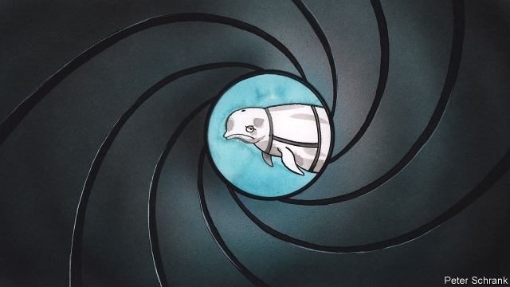

###### Licence to krill

# Norwegians suspect an inquisitive whale is working for the Kremlin 

##### It wouldn’t be the first time 

 

> May 2nd 2019 

HANNIBAL USED war elephants. China’s Song dynasty tried incendiary monkeys. The CIA even experimented with surgically-bugged cats. Russia, it seems, is now employing spy whales. In late April, according to NRK, Norway’s national broadcaster, Norwegian fishermen in the country’s far north Finnmark region began noticing a friendly beluga whale frolicking among their boats, attempting to pull straps from the hull. It wore a harness, complete with camera mounts, inscribed with the words: “Equipment of St Petersburg”. 

Russian researchers disclaimed all knowledge, and suggested it was the work of the Russian navy—whose Northern Fleet is headquartered at nearby Severomorsk. The militarisation of marine mammals would not be unusual. 

The American navy’s own programme, which began in 1960, experimented with sharks, sea turtles and birds before settling on California sea lions and bottlenose dolphins. The latters’ sonar was ideally suited to hunting out buried mines or enemy divers (the navy insists the animals were never trained to kill). Dolphins served with distinction as sentries and minesweepers during the Vietnam war, in Bahrain during American skirmishing with Iran in the 1980s and in Iraq from 2003. 

A CIA report from 1976 warned that the Soviet Union, spurred on by American work in the area, had built several facilities to train bottlenose dolphins. Within two years, noted the CIA, Soviet dolphins could be capable of placing “packages”—whether trackers or explosives—on ships in the open ocean. 

The Crimea-based mammals were inherited by Ukraine after the collapse of the Soviet Union, though at least some were sold to Iran in 2000. Ukraine restarted the programme in 2012—only to have Russia snatch it back when it seized Crimea two years later. In 2016 the Russian defence ministry published a tender for five new dolphins. Russian media reports the following year suggested that the Murmansk Sea Biology Research Institute had looked into using beluga whales for duties in the Arctic, but found them unsuited to the icy temperatures. 

Meanwhile, Russia and Norway are dealing with a more conventional spy scandal. On April 16th Russia jailed a Norwegian man, who had acted as a courier for Norwegian intelligence, for 14 years on charges of espionage against Russian submarines. 

-- 

 单词注释:

1.krill[kril]:n. [动]磷虾 

2.Norwegian[nɒ:'wi:dʒәn]:n. 挪威人, 挪威语 a. 挪威的, 挪威人的, 挪威语的 

3.inquisitive[in'kwizәtiv]:a. 好问的, 想知道的, 好追根究底的 

4.Kremlin['kremlin]:n. 克里姆林宫 [经] 克里姆林宫 

5.hannibal['hænibәl]:n. 汉尼巴尔（男子名）；汉尼拔（公元前247～前183, 迦太基名将、统帅） 

6.incendiary[in'sendjәri]:a. 放火的, 煽动的, 燃烧的 n. 纵火犯人, 煽动者, 燃烧弹 

7.CIA[]:中央情报局 [计] 中国互联网络协会 

8.NRK[]:[网络] 挪威广播公司；挪威国家广播公司；normal rat kidney 

9.broadcaster['brɒ:dkæstә]:n. 播送者, 广播装置, 播种机 

10.Norwegian[nɒ:'wi:dʒәn]:n. 挪威人, 挪威语 a. 挪威的, 挪威人的, 挪威语的 

11.finnmark['finmɑ:k]:n. 芬兰马克（芬兰的货币单位） 

12.beluga[bә'lu:gә]:n. 大白鳇, 白鲸 

13.frolick[]:vi. 嬉戏, 玩耍 

14.hull[hʌl]:n. 壳, 皮, 船体 vt. 去壳 

15.inscribe[in'skraib]:vt. 登记, 铭记于, 题写, 雕刻 [电] 书写 

16.ST[]:[计] 段表, 状态, 系统测试, 直端连接器 [化] 磺胺噻唑 

17.petersburg['pi:tәzbә:^]:n. 彼得斯堡（美国城市）；彼得堡（苏联城市列宁格勒旧称） 

18.disclaim[dis'kleim]:v. 放弃, 弃权, 拒绝承认 

19.headquarter[,hed'kwɔ:tә]:vt. 将...的总部设在 

20.Severomorsk[]:[地名] 北莫尔斯克 ( 俄 ) 

21.militarisation[]:n. 军事化 

22.mammal[mæmәl]:n. 哺乳动物 [化] 哺乳动物 

23.turtle['tә:tl]:n. 海龟 

24.California[.kæli'fɒ:njә]:n. 加利福尼亚 

25.bottlenose['bɔtlnәjz]:n. [动]宽吻海豚 

26.dolphin['dɒlfin]:n. 海豚 

27.sonar['sәunɑ:]:n. 声纳 [计] 声纳 

28.ideally[ai'diәli]:adv. 完美地, 理想地 

29.diver['daivә]:n. 潜水者 

30.sentry['sentri]:n. 哨兵, 看守 vt. 设岗哨 vi. 站岗, 放哨 

31.minesweeper['main,swi:pә]:n. 扫雷舰 [计] 扫雷 

32.Vietnam[.vjet'næm]:n. 越南 

33.Bahrain[]:n. 巴林岛 

34.skirmish['skә:miʃ]:n. 前哨战, 小争论, 小冲突 vi. 发生小争论, 侦察 

35.Iran[i'rɑ:n]:n. 伊朗 

36.Iraq[i'rɑ:k]:n. 伊拉克 

37.tracker['trækә]:n. 追踪者, 跟踪雷达, 拉纤者 [法] 追踪人, 探索者, 追踪空中移动物体的仪器 

38.ukraine[ju(:)'krein]:n. 乌克兰（原苏联一加盟共和国, 现已独立） 

39.restart[.ri:'stɑ:t]:v. 重新开始, 重新启动 [计] 重新启动 

40.Crimea[krai'miә]:n. 克里米亚, 克里米亚半岛 

41.Murmansk[muә'mɑ:nsk]:摩尔曼斯克[苏联西北部港市](临科拉湾) 

42.unsuited[.ʌn'sju:tid]:a. 不适宜的, 不适合的, 不适当的 

43.icy['aisi]:a. 冰的, 冰冷的, 冷淡的, 滑溜的 

44.Norway['nɒ:wei]:n. 挪威 

45.courier['kuriә]:n. 送快信的人, 伴游服务员 [法] 信使, 送急件者 

46.espionage[.espiә'nɑ:ʒ]:n. 间谍活动 [法] 间谍活动, 刺探, 间谍 

