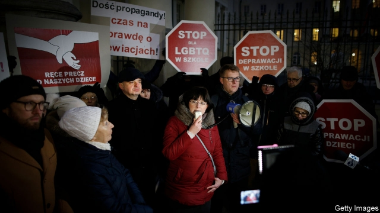

###### Family first

# Poland’s ruling party confronts the “LGBT dictatorship” 

##### It hopes to gin up its base by dividing society 

 

> May 2nd 2019 

POLAND FACES an “attack on the family”, says Jaroslaw Kaczynski, chairman of the ruling Law and Justice (PiS) party. In 2015 the party swept back to power by claiming it would protect the country against refugees from the Middle East. Now Mr Kaczynski has identified a new threat: gay people. The Polish religious right has long waged war on “gender ideology”, a catch-all term for feminism, gay rights and anything else that involves sex and shocks grandpa. As Poles prepare to elect their representatives to the European Parliament on May 26th, in what parties see as a rehearsal for a national parliamentary election in the autumn, PiS has reviled queerness, backed by the Catholic church. 

The row began with a declaration in favour of lesbian, gay, bisexual and transgender (LGBT) rights signed by Rafal Trzaskowski, Warsaw’s newly elected liberal mayor, in February. Its proposals include a shelter in Warsaw, anti-discrimination measures and more sex education in schools. 

For PiS, this is an affront to children. Since coming to power in 2015, the party has championed traditional families. To encourage women to have more babies, it introduced a hefty monthly handout of 500 zloty ($130) per child. Under pressure from the church, it has considered tightening restrictions on abortion. Funding for IVF treatment has been scrapped. 

The row has split Poland. The Polish Bishops’ Conference calls non-heterosexual arrangements “completely alien to European civilisation”. During Easter mass, the Metropolitan Archbishop of Gdansk condemned the “idol of tolerance”. An “LGBT dictatorship” is approaching, warned a recent cover of Do Rzeczy, a right-wing weekly. Meanwhile, Poland’s ombudsman has urged other cities to adopt declarations like Warsaw’s. 

More than half of Poles support civil partnerships. For same-sex marriage, however, the opponents still outnumber proponents, as they do for adoption by gay couples. “Hands off our children!” growled Mr Kaczynski at a PiS conference in March. With the European elections just weeks away, PiS has held on to its lead. A poll this week gives the party almost 39%, ahead of the broad opposition coalition led by the centrist Civic Platform, Mr Trzaskowski’s party, which has 33%. Third, with 8%, is Wiosna (Spring), a new left-wing party that wants to legalise gay marriage. 

-- 

 单词注释:

1.confront[kәn'frʌnt]:vt. 使面对, 对抗, 遭遇, 使对质, 比较 [法] 对证, 使对质, 比较 

2.lgbt[.el dʒiː biː 'tiː]:[网络] 同志；跨性别者；双性恋和跨性别 

3.dictatorship[dik'teitәʃip]:n. 独裁者之职位, 独裁, 独裁政权 [法] 专攻, 独裁权 

4.gin[dʒin]:n. 杜松子酒, 轧棉机, 陷阱 vt. 轧棉, 用陷阱捕 

5.Poland['pәulәnd]:n. 波兰 

6.jaroslaw[]:[网络] 雅罗斯瓦夫；加洛斯罗；雅洛斯瓦夫 

7.kaczynski[]:[网络] 卡钦斯基；卡钦斯基兄弟；炸弹客卡辛斯基 

8.pi[pai]:n. 圆周率 [计] 处理器接口, 程序中断 

9.refugee[.refju'dʒi:]:n. 难民, 流亡者 [法] 避难者, 流亡者, 难民 

10.gender['dʒendә]:n. 性 vt. 产生 

11.ideology[.aidi'ɒlәdʒi]:n. 思想体系, 意识形态, 观念学, 空论 [医] 观念学, 观念形态 

12.feminism['feminizm]:n. 女权主义, 男女平等主义 [医] 男子女性 

13.parliamentary[.pɑ:lә'mentәri]:a. 国会的, 议会的, 议会制度的 

14.revile[ri'vail]:v. 辱骂, 斥责 

15.queerness['kwiәnis]:n. 奇妙, 不舒服 

16.declaration[.deklә'reiʃәn]:n. 宣告, 说明, 宣布 [计] 说明 

17.lesbian['lezbiәn]:a. 女同性恋的 n. 女同性恋者 

18.bisexual[.bai'seksjuәl]:a. 两性的, 雌雄同体的 [医] 两性的 

19.transgender[trænzˈdʒendə(r)]:n. 变性人 

20.rafal[]:[网络] 哈瓦那大剧院边的拉法街 

21.warsaw['wɔ:sɔ:]:n. 华沙（波兰首都） 

22.affront[ә'frʌnt]:n. 公开侮辱, 轻蔑 vt. 公开侮辱, 冒犯, 面对 

23.hefty['hefti]:a. 重的, 肌肉发达的 

24.handout['hændaut]:n. 施舍物, 救济品, 分发的印刷品资料, 广告物品 

25.zloty['zlɒti]:n. 兹罗提(波兰货币单位) 

26.tighten['taitn]:vt. 勒紧, 使变紧 vi. 变紧, 绷紧 

27.ivf[]:abbr. 试管受精（in-vitro fertilization） 

28.scrap[skræp]:n. 碎片, 残余物, 些微, 片断, 铁屑, 吵架 vt. 扔弃, 敲碎, 拆毁 vi. 互相殴打 a. 零碎拼凑成的, 废弃的 

29.Poland['pәulәnd]:n. 波兰 

30.alien['eiljәn]:n. 外国人, 外侨 a. 外国的, 相异的 

31.civilisation[,sivilai'zeiʃən;-li'z-]:n. 文明, 文明世界, 文化, 开化, 教化 

32.metropolitan[.metrә'pɒlitn]:n. 大都市居民, 都主教, 宗主国的公民 a. 大都市的, 都主教区的, 宗主国的 

33.archbishop['ɑ:tʃ'biʃәp]:n. 大主教 

34.Gdansk[^ә'dɑ:nsk]:格但斯克(旧称Danzig但泽, 波兰港市) 

35.idol['aidәl]:n. 偶像, 崇拜物, 宠儿, 幻象, 谬论 

36.ombudsman['ɒmbudzmæn]:n. (专查官员舞弊的)调查官 [法] 调查专员, 监察专员, 司法专员 

37.partnership['pɑ:tnәʃip]:n. 合伙, 合股, 合作关系 [经] 合伙(合作)关系, 全体合伙人 

38.outnumber[.aut'nʌmbә]:vt. 数目超过, 比...多 

39.proponent[prә'pәunәnt]:n. 建议者, 支持者 [法] 提议者, 辩护者, 支持者 

40.adoption[ә'dɒpʃәn]:n. 采用, 采纳, 收养 [法] 收养, 采纳, 采用 

41.growl[graul]:n. 吠声, 咆哮声 v. 怒吠, 咆哮, 吼 

42.opposition[.ɒpә'ziʃәn]:n. 反对, 敌对, 相反, 在野党 [医] 对生, 对向, 反抗, 反对症 

43.coalition[.kәuә'liʃәn]:n. 结合体, 结合, 联合 [经] 联合, 联盟 

44.centrist['sentrist]:n. 中间党派的成员, 温和主义者 [法] 中间派议员, 中立派议员 

45.civic['sivik]:a. 市的, 市民的, 公民的 [法] 公民的, 市民的, 公民资格的 

46.legalise['li:^әlaiz]:vt. 使合法化, 使成为法定, 法律上认可 

