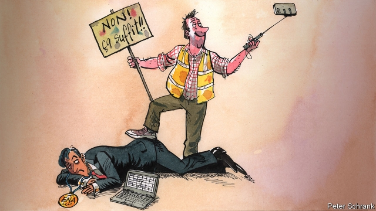

###### Charlemagne

# Why Emmanuel Macron wants to abolish ENA, France’s most elite college 

##### France’s elite is tiny and incestuous 

 

> May 2nd 2019 

FIFTEEN YEARS ago this spring, students at France’s elite postgraduate civil-service college were preparing to celebrate their graduation. Behind them lay the Alsatian city of Strasbourg, its beer halls, and two years of intense study at the Ecole Nationale d’Administration (ENA). Ahead stood fast-track jobs in the parquet-floored corridors of power in Paris, and the guarantee of brilliant careers. As the top-ranked graduating student stepped towards the front of the amphitheatre, however, she handed the astonished director a 20-page report, written by pupils and entitled “ENA: the urgency of reform”. Among its signatories was a fellow graduating student with a shock of unkempt hair, Emmanuel Macron. 

The student rebel, it seems, has turned into the presidential revolutionary. On April 25th, in response to the gilets jaunes (yellow jackets) protesters and their rage against the out-of-touch elite, Mr Macron announced the abolition of ENA. “Makeshift repairs”, the president declared, would not do: “If you keep the same structures, habits are just too strong.” It was the most controversial and spectacular of all the announcements made to mark the end of his months-long “great national debate”. At a stroke, Mr Macron gave in to a populist demand, and sent both his own alma mater and a symbol of modern France to the guillotine. 

All countries select a governing elite. Six of the 13 post-war American presidents attended either Harvard or Yale. Ten of the 14 post-war British prime ministers graduated from Oxford. But France takes the principle to extremes. Though its annual intake is a minute 80 postgraduate students (compared with around 2,000 undergraduates for Harvard and around 3,000 for Oxford), ENA has supplied the country with four of its eight Fifth-Republic presidents, including Mr Macron, and eight of its 22 prime ministers, including the current one, Edouard Philippe. Today énarques, as its graduates are known, run the French central bank, the finance ministry, the presidential office, the Republican party, the external intelligence service, the constitutional council, the state railways and a raft of top French private-sector companies. 

When Charles de Gaulle founded ENA in 1945, from the ashes of Nazi occupation and the second world war, the Resistance leader explicitly sought a meritocratic antidote to the chronic cronyism of the pre-war era. In his memoirs, le général wrote that his ambition then was “to make rational and homogeneous the recruitment and training of the main servants of the state”. ENA was to turn out an impartial, unified army of administrators, motivated by the “noble” calling of public service, in order to rebuild a powerful, stable France. It supplied the overseers of the trente glorieuses, or 30 post-war years of prosperity and planned industrial growth. Those who were to serve the country, said De Gaulle unapologetically, had to form “an elite in all respects”. 

Amid today’s angry, ruthless populism, however, the very concept of an elite is denounced on the streets and roundabouts of France. Far from admired as a dedicated public servant, the énarque has come to embody the perceived arrogance and disconnection of the governing class, skilled at devising technocratic policies and blind to their effect on ordinary people. It was in car-dependent France profonde, after all, far from the bike-sharing quarters of Paris, that the government’s planned raising of the carbon tax first provoked the gilets jaunes. The solution, one of them said, was to “get rid of the énarques” and put some “real people” in government instead. With their calculators and spreadsheets, graduates of ENA have replaced the silk-stockinged nobility of pre-revolutionary France as the public enemy of choice. 

The reality of course is more complex, and more nuanced, than Mr Macron is letting on. The president knows full well that France will still want a top administration college, even if he closes the one with the now-damaged acronym. He also knows that the problem is not the concept of a high-flying school itself, but recruitment to and from it. Over the years, partly because applicants from bookish families better survive the marathon years of preparation required to get in, ENA has admitted fewer, not more, pupils from poorer backgrounds. In the quarter-century after 1985, the share of pupils at the school whose fathers were blue-collar workers fell from 10% to 6%. Broadening access cannot be ENA’s problem alone. It also means ensuring that more school pupils from modest backgrounds apply to classes préparatoires, which train applicants to France’s grandes écoles. This is the baffling parallel world of elite higher education that leads (among other things) to ENA, confuses the uninitiated, and crowns the university system. 

This privileged perch also gives ENA a monopoly on jobs in France’s elite “grand corps”, a sort of top civil-service officer class, the most prestigious of which is the inspection des finances (which Mr Macron joined). Graduating pupils are guaranteed a spot in one or other, according to their exit ranking, rather as in Imperial China. Indeed, this turns time spent there into a race for position rather than a chance for reflection or creativity. And the school’s tiny intake forges an exceptionally tight network of alumni, which fuels suspicions of caste-like behaviour by its members. Enarques trust, recruit and even marry each other. 

With his own satchel of diplomas, Mr Macron knows all these arguments by heart. But he is treading a perilous path. That ENA has flaws, few contest—not least its tiny size. Yet it has done its bit to help create in France a deep culture of public service. And the country itself, with its much less entrenched private-school system, is in many ways better placed than Britain or America to achieve merit-based education. Mr Macron’s real challenge is to give a meaningful nod to the ambient distrust of elite institutions, while making sure that any reincarnation preserves what ENA gets right, and fixes what it gets wrong. Otherwise, its abolition will be a self-defeating populist gesture. 

-- 

 单词注释:

1.Charlemagne['ʃɑ:lә'mein]:查理曼大帝(742-814, 世称 Charles the Great或Charles I, 768-814为法兰克王, 800-814为西罗马帝国皇帝) 

2.emmanuel[i'mænjuәl]:n. 以马内利（耶稣基督的别称）；伊曼纽尔（男子名, 等于Immanuel） 

3.macron['mækrәn]:n. 长音符号 

4.Ena['enə]:n. (Ena)人名；(英、西、意)埃娜(女名), 埃纳 abbr. 可提取性核抗原（Extractable Nuclear Antigen） 

5.elite[ei'li:t]:n. 精华, 精锐, 中坚分子 

6.incestuous[in'sestjuәs]:a. 近亲相奸的, 乱伦的 [法] 乱伦的, 犯乱伦罪的 

7.postgraduate['pәust'^rædjuit, 'pәust'^rædʒuit]:a. 大学毕业后的, 大学研究院的 n. 研究生 

8.Alsatian[æl'seiʃ(ә)n]:a. (法国)阿尔萨斯(Alsace) 的, 阿尔萨斯人的 n. 阿尔萨斯人 

9.strasbourg['stræsb\\:^, strɑ:z'bu:r]:n. 斯特拉斯堡（法国东北部城市） 

10.Ecole[]:n. (Ecole)人名；(法)埃科勒 abbr. 初期教会的在线百科全书（Early Church On-line Encyclopedia） 

11.nationale[]:[网络] 号公路；国家号；国营公司 

12.amphitheatre[]:圆形剧场, 大会堂, 比赛场, 露天竞技场 [医] 手术示教室, 看台式教室 

13.urgency['ә:dʒәnsi]:n. 紧急, 催促 [法] 紧急, 迫切, 紧急之事 

14.signatory['si^nәtәri]:n. 协议的签署者, 签约国 a. 签署的, 签约的 

15.unkempt['ʌnkempt]:a. 蓬乱的, 未被照管好的 

16.presidential[.prezi'denʃәl]:a. 总统制的, 总统的, 首长的, 统辖的 [法] 总统的, 议长的, 总经理的 

17.gilet[dʒi'lei]:n. 背心, 马甲 

18.jaune[]:[网络] 汝拉 

19.protester[]:n. 抗议者, 持异议者, 拒付者 [经] 反对者 

20.abolition[.æbәu'liʃәn]:n. 废除, 废奴运动 [医] 禁止, 消失 

21.makeshift['meikʃift]:n. 权宜之计, 临时代用品 a. 权宜的, 临时代用的 

22.spectacular[spek'tækjulә]:a. 公开展示的, 惊人的, 壮观的 n. 奇观, 惊人之举, 展览物 

23.Populist['pɔpjulist]:n. 民粹派的成员 

24.alma['ælmә]:n. 阿尔玛（女子名）；舞女；歌女 

25.mater['meitә]:n. 母亲 [医] 脑[脊]膜 

26.guillotine['gilәti:n]:n. 断头台, 截断机, 切除器 vt. 用断头台斩首, 用截断机切 

27.Harvard['hɑ:vәd]:n. 哈佛大学 

28.Yale[jeil]:n. 耶鲁 

29.Oxford['ɒksfәd]:n. 牛津, 牛津大学 

30.intake['inteik]:n. 入口, 吸入, 吸入量 [医] 摄取量 

31.Edouard[]:n. (Edouard)人名；(俄)爱德华 

32.Philippe[]:菲力浦（人名）；百达翡丽手表 

33.constitutional[.kɒnsti'tju:ʃәnl]:a. 宪法的, 立宪的, 体质的 [医] 全身的; 体质的 

34.raft[ræft]:n. 筏, 救生筏, 大量 vi. 乘筏 vt. 筏运, 制成筏 

35.charle[]:n. 查理（男子名）；查理（姓氏） 

36.de[di:]:[化] 非对映体过量 [医] 铥(69号元素铥的别名,1916年Eder离得的假想元素) 

37.Gaulle[]:高尔（人名） 

38.Nazi['nɑ:tsi]:n. 纳粹党人 a. 纳粹党的 

39.explicitly[]:adv. 明确地；明白地 

40.meritocratic[ˌmerɪtə'krætɪk]:a. 精英管理的；贤能统治的 

41.antidote['æntidәut]:n. 解毒剂, 解毒药 [化] 解毒药 

42.chronic['krɒnik]:a. 慢性的, 习惯性的 n. 慢性病患者 

43.cronyism['krәjniizəm]:n. 任人唯亲 

44.memoir['memwɑ:]:n. 传记, 实录, 追思录, 回忆录, 自传 [化] 研究报告 

45.LE[]:[计] 小于或等于 

46.homogeneous[.hәumә'dʒi:niәs]:a. 同种的, 同质的, 齐性的 [医] 同种的, 纯一的, 同质的, 均匀的 

47.recruitment[ri'kru:tmәnt]:n. 新兵征召 [医] 募集[反应], 募集[现象](生理), 复聪(耳科) 

48.impartial[im'pɑ:ʃәl]:a. 公平的, 不偏不倚的 [法] 公正无私的, 不偏袒的, 公平的 

49.unify['ju:nifai]:v. 统一, 使成一体 

50.administrator[әd'ministreitә]:n. 管理人, 行政官 [经] 遗产管理人员 

51.overseer[.әuvә'si:ә]:n. 监督, 工头 [经] 管理人, 监督, 盘工 

52.trente[]:[网络] 数字谜；特伦特；天特会议 

53.de[di:]:[化] 非对映体过量 [医] 铥(69号元素铥的别名,1916年Eder离得的假想元素) 

54.unapologetically[]:不认错地 不道歉地 

55.amid[ә'mid]:prep. 在其间, 在其中 [经] 在...中 

56.ruthless['ru:θlis]:a. 无情的, 残忍的, 毫不留情的, 彻底的 [法] 无情的, 残忍的 

57.Populism['pɒpjulizm]:n. 平民主义, 民粹主义 

58.denounce[di'nauns]:vt. 告发, 抨击, 谴责 [法] 谴责, 斥责, 告发 

59.dedicate['dedikeit]:vt. 献出, 贡献 

60.embody[im'bɒdi]:vt. 具体表达, 使具体化 [经] 合并, 具体化, 具体表现 

61.arrogance['ærәgәns]:n. 傲慢态度, 自大 

62.disconnection[,diskә'nekʃәn]:n. 分离, 断开, 分开 [计] 断开, 拆接, 不连接 

63.technocratic[ˌteknə'krætɪk]:a. 由技术专家官员组成的；受技术官僚影响的 

64.profonde[prәu'fɔnd]:魔术师上衣尾部的特殊口袋 

65.provoke[prә'vәuk]:vt. 激怒, 惹起, 诱导 [法] 刺激, 煽动, 激怒 

66.spreadsheet['spredʃi:t]:n. 空白表格程序, 电子制表软件, 电子数据表 [计] 电子表格 

67.nobility[nәu'biliti]:n. 贵族, 高尚, 贵族阶级 

68.nuance[nju:'ɑ:ns]:n. 细微差别 

69.acronym['ækrәunim]:n. 首字母缩拼词, 首字母组合词 [计] 字首组合词 

70.bookish['bukiʃ]:a. 好读书的, 书呆子的 

71.broaden['brɒ:dn]:vi. 变宽, 扩大 vt. 放宽, 使扩大 

72.cannot['kænɒt]:aux. 无法, 不能 

73.grande[^rɑ:nd]:a. 重大的, 显要的 

74.baffle['bæfl]:vt. 困惑, 为难, 使挫折 vi. 徒作挣扎 n. 迷惑, 挡板 

75.uninitiated[ˌʌnɪˈnɪʃieɪtɪd]:a. 外行的, 缺少经验的 

76.perch[pә:tʃ]:n. 栖木, 高位, 杆, 河鲈 v. (使)栖息, 就位, 位于, (使)暂歇 

77.monopoly[mә'nɒpәli]:n. 垄断, 专卖权, 独占事业 [经] 垄断, 专利品, 垄断(权)独占 

78.corp[]:[经] 公司 

79.prestigious[pre'stidʒiәs]:a. 享有声望的 

80.imperial[im'piәriәl]:a. 帝王的, 宗主国的, 至尊的, 壮丽的 n. 特等品 

81.creativity[.kri:ei'tiviti]:n. 创造力, 创造性 

82.forge[fɒ:dʒ]:n. 熔炉, 铁工厂 vt. 打制, 锻造, 伪造 vi. 锻造, 伪造 

83.exceptionally[]:adv. 特殊地；异常地；例外地 

84.alumni[ә'lʌmni]:pl. 男毕业生, 男校友 

85.enarque[]:[网络] 行政学校 

86.satchel['sætʃәl]:n. 书包, 小背包 

87.tread[tred]:n. 踏, 步态, 梯级, 交尾, 鞋底 vi. 踏, 行走, 交尾 vt. 踩, 踏, 践踏, 跳(舞) 

88.perilous['perilәs]:a. 危险的, 濒临毁灭的 

89.flaw[flɒ:]:n. 缺点, 裂纹, 瑕疵, 一阵狂风 [化] 划痕; 裂缝; 裂纹 

90.les[lei]:abbr. 发射脱离系统（Launch Escape System） 

91.entrench[in'trentʃ]:vt. 围以壕沟, 防护, 保卫, 使处于牢固地位 vi. 掘壕, 侵犯 

92.meaningful['mi:niŋful]:a. 意味深长的 

93.ambient['æmbiәnt]:a. 周围的 n. 周围环境 

94.distrust[dis'trʌst]:n. 不信任 vt. 不信任 

95.reincarnation[.ri:inkɑ:'neiʃәn]:n. 转世化身, 再生 

