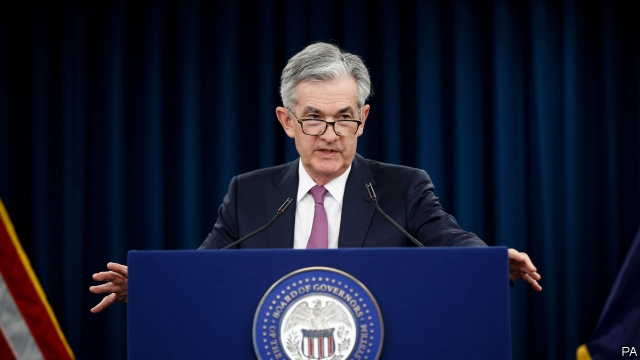

###### America’s robust economy

# Fears of recession have faded 

##### But stubbornly low inflation means the Fed cannot relax 

 

> May 2nd 2019 

INVESTORS STARTED the year brooding about the risk of an American recession. Torsten Slok of Deutsche Bank, Germany’s biggest lender, says clients around the globe were worried. Financial indicators were flashing red, the stockmarket was weak and yields on low-grade corporate debt had jumped. The Federal Reserve’s decision to raise interest rates in December had been unsurprising, but unwelcome. 

At the end of the year a model from economists at JPMorgan Chase had put the chances of a recession within 12 months, based on the S&P 500 index and corporate-credit spreads, at 65%. But the mood has now improved. By April 29th JPMorgan’s model was putting the chances of a recession at just 15%. 

“It’s eye-popping how quickly the narrative has changed,” says Mr Slok. One reason for the improvement in sentiment is the Fed’s evolving monetary-policy stance. In January it turned more doveish, abandoning its plans to raise rates in 2019. “We don’t see any evidence at all of overheating,” said Jerome Powell, the chairman of the Federal Reserve, on May 1st after announcing that the Fed would maintain its patient stance. He also repeated his view that the data do not warrant higher rates. 

Investors have been delighted by the Fed’s pause. But the timing and extent of their change of mood suggests that is not the full story. One possibility is that their previous gloom may have been overblown. “The market collapse in December was driven by the calendar,” says Catherine Mann of Citigroup, a bank, as investors repositioned for tax purposes. The “inverted yield curve”—that is, yields on long-term bonds below those on short-term ones, historically a sign that a recession is on the way—has been ringing alarm bells recently. But Ms Mann doubts its continued predictive power after a long period in which central-bank intervention depressed interest rates. 

The real economy had also shown some signs of an approaching downturn, however. Business confidence had soured and the housing market, so often a leading indicator of economic trouble, had sagged. At the start of 2019 came more bad news, as a lengthy partial federal-government shutdown depressed both output and consumer sentiment. The economy had been expected to cool a little anyway, as the impetus from the Trump administration’s fiscal stimulus faded. The fear that a soft landing might turn into a hard one did not seem far-fetched. 

Jesse Edgerton, an economist at JPMorgan Chase, says there are still reasons to be cautious, notably weak business confidence. But more recent data have looked rosier. Sentiment among consumers has rebounded. Jobs growth in March recovered from a hiccup in February (April’s figures are due on May 3rd, after The Economist went to press). And although GDPgrowth of 3.2% in the first quarter hid some softening components, recent trends suggest that they will bounce back. 

Investors in the stockmarket seem to have forgotten the whole scare, and to believe that the economy will grow fast enough to produce profits but not so fast that the Fed will have to intervene. Investors in government debt seem warier. They are still betting that the Fed will cut interest rates at least once by the end of the year. 

For now, the Fed has decided to sit tight. Since the stockmarket wobbles late last year, a different difficulty has become much more obvious. Inflation, which the Fed had expected to hover around 2%, fell to just 1.6% in March, based on a measure that excludes (volatile) food and energy prices. On May 1st Mr Powell said that he saw good reasons to expect it to be “transitory”. But that is not the behaviour expected of an economy that is humming along nicely. It is a better problem for the Fed to face than an imminent recession—but it is a problem, all the same. 

-- 

 单词注释:

1.robust[rәu'bʌst]:a. 健康的, 强健的, 要用力气的, 坚定的, 粗野的 [计] 健壮性 

2.recession[ri'seʃәn]:n. 后退, 凹处, 衰退, 归还 [医] 退缩 

3.stubbornly[]:adv. 倔强地；顽固地 

4.inflation[in'fleiʃәn]:n. 胀大, 夸张, 通货膨胀 [化] 充气吹胀; 膨胀 

5.cannot['kænɒt]:aux. 无法, 不能 

6.investor[in'vestә]:n. 投资者 [经] 投资者 

7.torsten[]:n. (Torsten)人名；(德、芬、瑞典)托尔斯滕 

8.deutsche[]:n. 德意志联邦共和国马克 

9.lender['lendә]:n. 出借人, 贷方 [经] 出借者, 贷方, 贷款人 

10.client['klaiәnt]:n. 客户, 顾客, 委托人 [计] 客户, 客户机, 客户机程序 

11.indicator['indikeitә]:n. 指示器, 指示剂, 指标 [计] 指示器 

12.stockmarket[s'tɒkmɑ:kɪt]: 证券市场; 证券交易所; 证券行情 

13.corporate['kɒ:pәrit]:a. 社团的, 合伙的, 公司的 [经] 团体的, 法人的, 社团的 

14.unsurprise[]:[网络] 不好意思 

15.unwelcome[ʌn'welkәm]:a. 不受欢迎的, 讨厌的 n. 冷淡 vt. 冷淡地对待, 冷淡地接受 

16.economist[i:'kɒnәmist]:n. 经济学者, 经济家 [经] 经济学家 

17.jpmorgan[]:[网络] 摩根大通；摩根大通银行；摩根大通公司 

18.quickly['kwikli]:adv. 很快地 

19.narrative['nærәtiv]:n. 叙述, 故事 a. 叙述的, 叙事的, 故事体的 

20.sentiment['sentimәnt]:n. 感情, 感伤, 情操, 情绪, 感想, 意见 [医] 情感, 情操 

21.stance[stæns]:n. 准备击球姿势, 站立的姿势, 位置, 姿态 [经] 地位, 形势 

22.doveish[]:[网络] 鸽子 

23.overheating[]:[经] 过分的经济活动 

24.jerome[dʒә'rәum]:n. 杰罗姆（男子名） 

25.powell['pәuәl, 'pauәl]:n. 鲍威尔（英国物理学家） 

26.datum['deitәm]:n. 论据, 材料, 资料, 已知数 [医] 材料, 资料, 论据 

27.warrant['wɒ:rәnt]:n. 授权, 正当理由, 根据, 证明, 批准, 凭证, 令状, 委任状 vt. 授权给, 保证, 担保, 批准, 使有正当理由 

28.timing['taimiŋ]:n. 时间选择, 时间测定, 定时, 调速 [计] 定时器时钟 

29.gloom[glu:m]:n. 忧郁, 暗处, 幽暗 vi. 变忧沉, 变黑暗 vt. 使忧郁, 使黑暗 

30.overblown[.әuvә'blәun]:a. 停息的, 盛开过的, 浮夸的 overblow的过去分词 

31.catherine['kæθәrin]:n. 轮圈外缘装有倒钩的车轮, 侧翻筋斗, 轮转烟火, 车轮窗 

32.mann[mæn]:n. 曼（姓氏）；曼恩法案（美国国会1910年6月通过的一项法案, 禁止州与州之间贩运妇女） 

33.citigroup[]:n. 花旗集团1998年4月6日; 花旗公司与旅行者集团宣布合并; 合并组成的新公司称为“花旗集团”; 其商标为旅行者集团的红雨伞和花旗银行的兰色字标。 

34.reposition[.ripә'ziʃәn]:n. 复位, 储藏 vt. 改变...的位置, 使...复位 

35.invert[in'vә:t]:a. 转化的 vt. 使反转, 使颠倒, 使转化 n. 颠倒的事物 [计] 倒置; 反转 

36.historically[his'tɔrikәli]:adv. 历史上地；从历史观点上说 

37.predictive[pri'diktiv]:a. 预言性的, 成为前兆的 

38.intervention[.intә'venʃәn]:n. 插入, 介入, 调停 [经] 干预 

39.downturn['dauntә:n]:n. (尤指经济方面的)衰退, 下降趋势 [电] 低迷时期 

40.sag[sæg]:vi. 下垂, 倾斜, 萎靡, 萧条, 变得乏味 vt. 使下垂 n. 下垂, 倾斜, 萧条 [计] 系统分析组, 语法分析生成程序, 电压下降 

41.lengthy['leŋθi]:a. 冗长的, 漫长的 

42.shutdown['ʃʌtdaun]:n. 关门, 停工, 停机 [经] 停工 

43.impetus['impitәs]:n. 动力, 推动力, 动量 [医] 冲动, 动能, 起始(病) 

44.fiscal['fiskәl]:a. 财政的, 国库的 [经] 财政上的, 会计的, 国库的 

45.stimulus['stimjulәs]:n. 刺激, 激励, 刺激品 [医] 刺激特, 刺激 

46.Jesse['desi]:n. 耶西(<<圣径>>故事人物) 

47.edgerton[]: [人名] [英格兰人姓氏] 埃杰顿 Egerton的变体; [地名] [加拿大、美国] 埃杰顿 

48.notably['nәjtbәli]:adv. 显著地, 著名地, 尤其, 特别 

49.rosy['rәuzi]:a. 蔷薇色的, 玫瑰红色的 

50.sentiment['sentimәnt]:n. 感情, 感伤, 情操, 情绪, 感想, 意见 [医] 情感, 情操 

51.rebound[ri'baund]:vi. 弹回, 返回, 产生事与愿违的结果 vt. 使弹回, 使返回 n. 反弹, 返回, 篮板球, 振作 rebind的过去式和过去分词 

52.hiccup['hikʌp]:n. 打嗝 v. 打嗝 

53.economist[i:'kɒnәmist]:n. 经济学者, 经济家 [经] 经济学家 

54.soften['sɒftn]:v. (使)变柔软, (使)变柔和 

55.intervene[.intә'vi:n]:vi. 插入, 调停, 干涉 [经] 进场干预 

56.wary['wєәri]:a. 谨慎的, 小心的, 机警的, 周到的, 唯恐的 

57.wobble['wɒbl]:n. 摆动, 摇晃, 不稳定, 抖动 vi. 摇晃, 摇摆, 游移不定 vt. 使摇摆, 使颤动 

58.inflation[in'fleiʃәn]:n. 胀大, 夸张, 通货膨胀 [化] 充气吹胀; 膨胀 

59.hover['hʌvә]:vi. 盘旋, 翱翔, 徘徊 vt. 孵 n. 翱翔 

60.volatile['vɒlәtail]:a. 挥发性的, 可变的, 不稳定的, 飞行的, 轻快的, 爆炸性的 n. 有翅动物, 挥发物 [计] 易失的 

61.transitory['trænsitәri]:a. 暂时的, 短暂的, 昙花一现的 [法] 临时性诉讼, 可选择管辖区的诉讼; 临时的, 过渡的 

62.hum[hʌm]:n. 嗡嗡声, 哼声, 杂声 vi. 发低哼声 vt. 哼, 用哼声表示 interj. 哼, 嗯 

63.nicely['naisli]:adv. 漂亮地, 谨慎地, 恰好地 

64.imminent['iminәnt]:a. 即将来临的, 逼近的 

