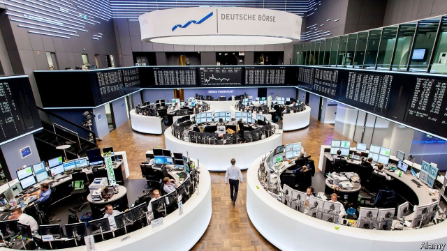

###### Voice over

# Foreign-exchange trading is finally turning digital 

##### The market’s leap into the 21st century will slash costs for consumers 

 

> May 4th 2019 

THE FOREIGN-EXCHANGE (FX) market is as opaque and old-fashioned as it is enormous. Most of its $5trn of daily trading happens “over-the-counter” (OTC), in deals negotiated between banks and private customers, rather than on exchanges. Many orders are still placed by phone. Gauging the market’s size and structure usually means relying on outdated surveys. The most comprehensive review, by the Bank for International Settlements, is conducted only once every three years.  

Yet modernity is arriving—in fits and starts. Last month it emerged that Deutsche Börse, Europe’s third-largest stock exchange, was close to buying FX all, an electronic FX-trading platform, for a reported $3.5bn. If it happens the deal could end up being one of the largest in Deutsche Börse’s history. It hints at a shake-up in a sector that has long been deemed antediluvian.  

The FX market serves not only investors, but corporations and governments seeking to protect trade or bonds against currency swings. FX contracts can be “spot” (for immediate delivery), “forward” (for delivery at a later date) or “swap” (when currency is exchanged back at maturity). Buyers go through dealers (mostly banks), which source liquidity. Specific needs, such as matching cash-flow dates, are more easily met using OTC trades, which can be tailored, than over exchanges.  

That is not about to change. Rather, Deutsche Börse is betting that buyers will abandon “voice” orders, placed via single banks, in favour of digital platforms that pool prices from multiple dealers. The trend is already boosting e-trading in spot FX. Volumes have doubled over the last decade—FX all’s share of this electronic activity has reached 40%. 

Longer-dated FX-derivatives contracts, such as forwards, have withstood the shift: the longer the maturities, the fewer the transactions, and the harder it is to connect enough users simultaneously in order to get e-trading to work. Yet here too, change is afoot. Tighter regulation is increasing costs, which asset managers are seeking to offset elsewhere. European regulators also require them to be able to demonstrate that they are trading at the best possible price. By connecting buyers with multiple dealers in an instant, e-trading achieves both, as well as leaving a clear audit trail. And long-dated contracts are becoming more common, which boosts liquidity. 

As FX goes digital, the ranks of dealers will be thinned. At the spot end, the trend has opened the door to “principal” trading firms, which buy and sell on their own account using algorithms. It has also fuelled competition among banks, slashing margins and pushing many towards the exit. That is leaving the bulk of deals to a handful of big banks, often in partnership with principal trading firms. Maturities beyond a week have been little affected so far, but consolidation is “creeping up the curve”, says Joanna Nader of RBC Capital Markets.  

The rise of centralised clearing is also helping to level the playing field. Only 3% of FX derivatives trades currently go through clearing houses, which absorb the risk one party defaults. Clearing is set to become more attractive for traders, in part because regulators are requiring higher collateral to be held on some uncleared FX deals. E-trading already makes it easier for users to find nonbank dealers. By removing counterparty risk, clearing will weaken the advantage that banks with big balance-sheets enjoy over the newer trading firms. 

As trading costs fall, FX buyers will cheer. So will Deutsche Börse, which owns Eurex, a clearing house that will soon launch FX products. 

-- 

 单词注释:

1.slash[slæʃ]:v. 猛砍, 乱砍 n. 猛砍, 乱砍, 删减 [计] 斜线 

2.fx[]:abbr. 外汇（Foreign Exchange）；固定电台（Fixed Station） 

3.opaque[әu'peik]:n. 不透明物 a. 不透明的, 不传热的, 不传导的, 阴暗的 [计] 白底 

4.otc[]:abbr. 技术合作处（Office of Technical Cooperation） 

5.outdate[.aut'deit]:vt. 使过时 

6.modernity[mɒ'dә:nәti]:n. 现代性, 现代状态, 现代东西 

7.deutsche[]:n. 德意志联邦共和国马克 

8.sector['sektә]:n. 扇形, 部门, 部分, 函数尺, 象限仪, 段, 区段 vt. 把...分成扇形 [计] 扇面; 扇区; 段; 区段 

9.deem[di:m]:v. 认为, 相信 

10.investor[in'vestә]:n. 投资者 [经] 投资者 

11.maturity[mә'tjuәriti]:n. 成熟, 完备, 到期 [医] 成熟, 成熟期, 发育期 

12.buyer['baiә]:n. 买主, 买方 [经] 买主, 买方, 买手 

13.dealer['di:lә]:n. 经销商, 商人 [经] 交易员, 贩卖商 

14.liquidity[li'kwiditi]:n. 流动性, 流畅 [经] 流动性 

15.transaction[træn'sækʃәn]:n. 交易, 办理, 学报, 和解协议 [计] 事务处理 

16.simultaneously[simәl'teiniәsly; (?@) saim-]:adv. 同时发生, 一齐, 同时, 同时存在 

17.afoot[ә'fut]:a. 徒步的, 在进行中的, 活动中的 adv. 徒步, 在进行中 

18.asset['æset]:n. 资产, 有益的东西 

19.offset['ɒ:fset]:n. 抵消, 把...并列, 旁系, 支管, 用胶印法印 vt. 弥补, 抵消, 胶印 vi. 装支管 n. 偏移量 [计] 偏移量 

20.regulator['regjuleitә]:n. 调整者, 校准者, 校准器, 调整器, 标准钟 [化] 调节剂; 调节器 

21.audit['ɒ:dit]:n. 审计, 查帐 vt. 查(帐), 旁听 vi. 查账 [计] 查帐; 审查; 检查 

22.algorithm['ælgәriðm]:n. 算法 [计] 算法 

23.partnership['pɑ:tnәʃip]:n. 合伙, 合股, 合作关系 [经] 合伙(合作)关系, 全体合伙人 

24.consolidation[kәn.sɒli'deiʃәn]:n. 巩固, 团结, 合并, 加强 [医] 实变 

25.joanna[dʒәu'ænә]:n. 乔安娜（女子名） 

26.nader[]:n. 内德（姓氏） 

27.RBC[]:红血球, 红细胞 [医] 红细胞计数 

28.centralise['sentrәlɑiz]:vt. 形成中心, 把统治权集中于中央, 把...集中起来, 成为...的中心, 集中 

29.derivative[di'rivәtiv]:a. 引出的, 派生的 n. 引出之物, 派生物, 衍生字 

30.currently['kʌrәntli]:adv. 现在, 当前, 一般, 普通 [计] 当前 

31.default[di'fɒ:lt]:n. 违约, 不履行责任, 缺席, 默认值 v. 疏怠职责, 缺席, 拖欠, 默认 [计] 默认; 默认值; 缺省值 

32.trader['treidә]:n. 商人, 商船 [经] 交易者, 商船 

33.collateral[kә'lætәrәl]:a. 并行的, 附随的, 旁系的 n. 旁系亲属, 担保品 

34.uncleared[]:[经] 未付清的 

35.nonbank['nɔn'bæŋk]:a. (机构等)非银行的, 与银行无关的, 不由银行办理的 

36.counterparty['kauntə,pɑ:ti]: 合同的一方; 对手方 

37.EUREX[]:n. 欧洲期货交易所 

