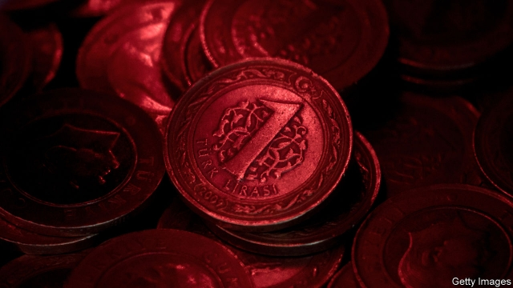
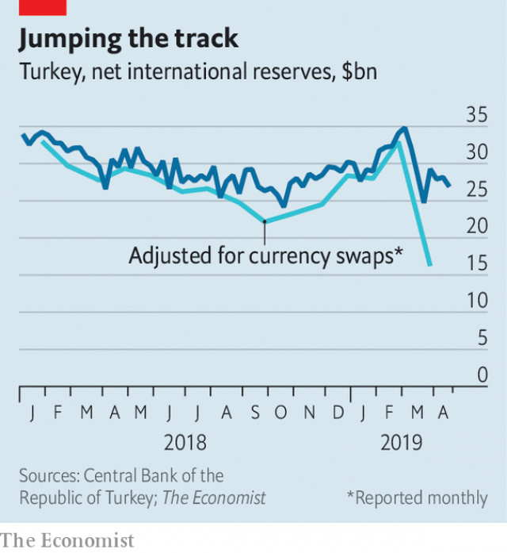

###### The cost of concision

# How a few missing words hurt Turkey’s turnaround 

##### Investors worry that the central bank is being economical with the truth 

 

> May 4th 2019 

A CENTRAL BANK’S words have power. Three of them (“whatever it takes”) calmed the euro area’s debt panic in 2012. Another few (the Federal Reserve mulling a “step down in our pace of purchases”) started the taper tantrum that upset emerging markets in 2013. 

What is left unsaid can also be powerful. After its interest-rate meeting on April 25th, Turkey’s central bank failed to repeat eight words that had been included in each of its seven previous statements: “if needed, further monetary tightening will be delivered”. The omission cast doubt on its commitment to fight inflation, which was almost 20% in the year to March. In response, the lira fell by more than 1% against the dollar. It has fallen by 11% this year. 

The mishap was an uncomfortable reminder of last summer’s currency turmoil, when the central bank (browbeaten by Recep Tayyip Erdogan, Turkey’s president) failed to raise interest rates swiftly enough to prevent a collapse in the currency. But the parallels should not obscure what has changed in the interim. Turkey’s economy is better balanced now than it was then. 

In September the central bank reasserted itself, increasing interest rates to 24%, where they have stayed since. The combination of tighter money and a cheaper currency curbed import spending and encouraged exports. As a result, Turkey’s current-account deficit has narrowed far more swiftly than even the government had envisaged. Although its import bill is hardly the only claim on its foreign earnings (its banks and firms must also service heavy external debts), the lira was relatively stable from December to February. 

 

Local elections in March were supposed to bring a similar stability to politics, concluding a maddening cycle in which Turks marched to the polls seven times in five years. Instead, the weeks before and since have done the opposite, unsettling both Turkey’s politics and the markets. 

Mr Erdogan’s party, which lost in most of the country’s big cities, has so far refused to accept its narrow defeat in the Istanbul mayoral contest. Citing alleged irregularities, it has asked for a new vote. That would trigger yet more political turmoil, which could bring protesters onto the streets and send foreign capital running for the exit. Investors distinguish clearly between countries that do and do not have free and peaceful elections, says Ibrahim Turhan, a former chair of the Istanbul stock exchange. “No one would like to see Turkey in the second group.” 

In the month before the elections, Mr Erdogan encouraged state banks to increase the amount they lent at cheap rates. Banks also came under pressure to lower lira deposit rates, making other currencies more attractive by comparison. Turkish residents now hold over half of their deposits in dollars and other hard currencies. 

None of this has helped the lira. On March 21st the central bank revealed it had burned through $6.3bn (over 18%) of its net reserves in a fortnight, presumably in an undeclared effort to prop up the lira. After the news spooked investors, the government squeezed the offshore lira market, making it harder for foreign speculators to borrow the currency in order to sell it. 

But the squeeze also posed a problem for Turkey’s banks, points out Brad Setser of the Council on Foreign Relations, an American think-tank, because they depend on lira funding in the overseas market. To ease their discomfort, the authorities made it easier for banks to swap their dollars for lira from the central bank. That had the effect of temporarily bolstering the central bank’s dollar reserves, until the currencies are swapped back again. As the financial markets cottoned on to what was happening, investors began to distrust the central bank’s weekly reserves figures. 

Was it trying to mislead investors? Probably not. As required by IMF standards, it duly reported the swaps in its monthly reserves statement, which is published with a 30-day lag. And in a press conference on April 30th, it explained the source of its sudden dollar infusion. 

But although it clarified why its reserves had abruptly gone up, it did not reveal why they had suddenly gone down in the weeks before. Judging by the financial markets’ reaction, the conference did little to bolster investors’ faith in the lira. The words of central banks can be powerful. But although they choose what to say, markets decide what to hear. 

-- 

 单词注释:

1.concision[kәn'siʒәn]:n. 切断, 简明, 简洁 

2.turnaround['tә:nә.raund]:n. 转向, 回车道, 转变 [化] 小修; 预防(性)修理 

3.investor[in'vestә]:n. 投资者 [经] 投资者 

4.euro['juәrәu]:n. 欧元（欧盟的统一货币单位） 

5.mull[mʌl]:n. 软薄布, 混乱 vt. 研磨, 细想 vi. 深思熟虑 

6.taper['teipә]:n. 带子操作工, 小蜡烛, 尖细, 渐弱, 锥形, 尖塔 a. 尖细的, 分等级的 v. (使)一头逐渐变细, (使)逐渐减少 

7.tantrum['tæntrәm]:n. 发脾气, 发怒 [医] 暴怒, 发脾气 

8.unsay[.ʌn'sei]:vt. 取消, 撤回 

9.monetary['mʌnitәri]:a. 货币的, 金钱的 [经] 货币的, 金融的 

10.tighten['taitn]:vt. 勒紧, 使变紧 vi. 变紧, 绷紧 

11.omission[әu'miʃәn]:n. 省略, 遗漏, 疏忽 [化] 省略 

12.inflation[in'fleiʃәn]:n. 胀大, 夸张, 通货膨胀 [化] 充气吹胀; 膨胀 

13.lira['liәrә]:n. 里拉 

14.mishap['mishæp]:n. 不幸之事, 灾祸, 恶运 

15.reminder[ri'maindә]:n. 提醒的人, 暗示 [经] 催单 

16.turmoil['tә:mɒil]:n. 骚动, 混乱 

17.browbeat['brajbi:t]:vt. 对...吹胡子瞪眼睛, 吓唬 

18.recep[]:n. (Recep)人名；(土)雷杰普 

19.tayyip[]:[网络] 塔伊普 

20.erdogan[]:[网络] 埃尔多安；土耳其总理埃尔多安；艾尔多安 

21.swiftly['swiftli]:adv. 很快地, 即刻 

22.interim['intәrim]:a. 暂时的, 临时的, 间歇的 n. 过渡时期 

23.reassert[.ri:ә'sә:t]:vt. 再断言, 重复主张 

24.curb[kә:b]:n. 抑制, 勒马绳, 边石 vt. 抑制, 束缚, 勒住 

25.deficit['defisit]:n. 赤字, 不足额 [医] 短缺 

26.envisage[in'vizidʒ]:vt. 面对, 正视, 想象 

27.earning['ә:niŋ]:n. 收入（earn的现在分词） 

28.politic['pɒlitik]:a. 精明的, 明智的, 策略的 

29.madden['mædn]:vt. 使发狂, 激怒 vi. 发狂, 发怒 

30.Turk[tә:k]:n. 土耳其人, 土耳其马 

31.unsettle[.ʌn'setl]:vt. 使移动, 搅乱, 使动摇, 使不安宁 vi. 动荡不定, 离开固定位置 

32.Istanbul[.istæn'bu:l]:n. 伊斯坦布尔 

33.mayoral['mєәrәl]:a. 市长的 

34.cite[sait]:vt. 引用, 引证, 表彰 [建] 引证, 指引 

35.allege[ә'ledʒ]:vt. 宣称, 主张, 提出, 断言 [法] 断言, 指称, 指证 

36.irregularity[i.regju'læriti]:n. 不规则, 例外, 违反规则的行为 [化] 不匀度 

37.trigger['trigә]:n. 触发器, 扳机 vt. 触发, 发射, 引起 vi. 松开扳柄 [计] 切换开关 

38.protester[]:n. 抗议者, 持异议者, 拒付者 [经] 反对者 

39.Ibrahim[]:n. 易卜拉欣（与阿丹、努哈、穆萨、尔撒和穆罕默德并称为安拉的六大使者, 亦系犹太教和基督教推崇的圣人和希伯来人的祖先） 

40.turhan[]:[网络] 图尔汗；图论 

41.Turkish['tә:kiʃ]:n. 土耳其语 a. 土耳其的, 土耳其人的, 土耳其语的 

42.undeclared[.ʌndi'klєәd]:a. 未申报的, 未宣布的 

43.prop[prɒp]:n. 支柱, 支持者, 倚靠人, 道具, 螺旋桨 vt. 支撑, 维持 

44.spook[spu:k]:n. 幽灵, 鬼 vt. 惊吓, 鬼怪般地出没 vi. 惊吓而逃窜, 受惊 

45.speculator['spekjuleitә]:n. 投机者, 投机商人, 思索者 [经] 投机买卖者, 投机商 

46.brad[bræd]:n. 角钉, 曲头钉 

47.setser[]:[网络] 塞特瑟；荀谌 

48.oversea['әuvә'si:]:adv. 海外, 向国外, 向海外, 国外 a. 外国的, 在国外的, 在海外的, 舶来的 

49.discomfort[dis'kʌmfәt]:n. 困苦, 不适 [医] 不舒适, 不舒, 烦闷, 不快活 

50.temporarily['tempәrәrәli]:adv. 暂时, 一时, 临时 

51.bolster['bәulstә]:n. 支持, 长枕 vt. 支持, 支撑 

52.distrust[dis'trʌst]:n. 不信任 vt. 不信任 

53.IMF[]:国际货币基金组织 [经] 国际货币基金 

54.duly['dju:li]:adv. 恰当地, 充分地, 适当地, 及时地 

55.infusion[in'fju:ʒәn]:n. 注入, 泡制, 注入物 [化] 浸渍; 浸泡 

56.abruptly[ә'brʌptli]:adv. 突然地, 唐突地 

