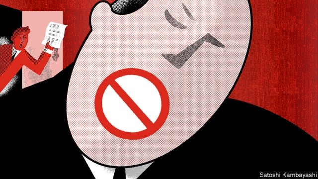
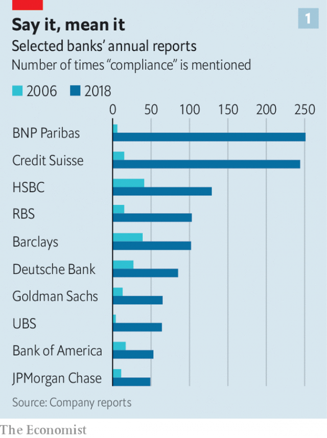
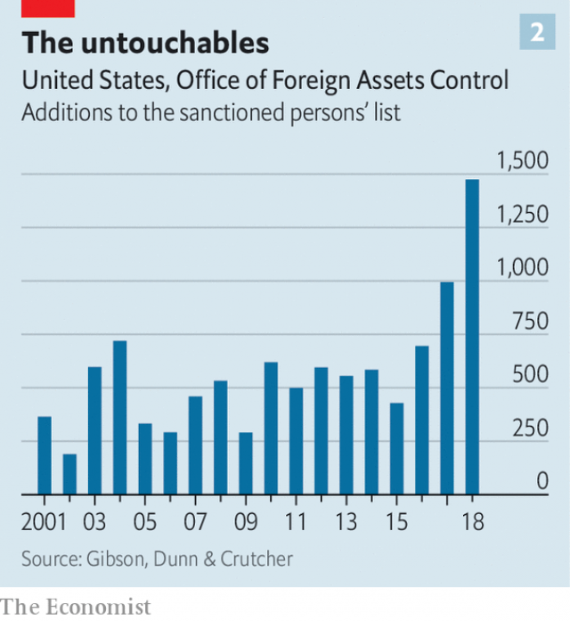

###### Rise of the No Men

# The past decade has brought a compliance boom in banking 

##### Staff trying to keep banks on the right side of regulators are in high demand 

 

> May 2nd 2019 

COMPLIANCE OFFICERS are the killjoys of finance. To bankers and traders keen to let rip, they are the po-faced types who frown at any transaction that might breach this rule or contravene that regulation. A recent episode of “Billions”, a television drama about Wall Street, captured the rainmakers’ frustration: so fed up is “Dollar” Bill Stern with having his wings clipped by Ari Spyros that the veteran trader rams the side of the compliance chief’s Porsche when he pulls out of the car park of their hedge fund, Axe Capital. 

But pity not finance’s in-house policemen, for they have had a golden decade since the crisis. While swathes of banking have laboured under cutbacks and stiff capital requirements, their headcount and clout have grown. Banks fined for aiding corruption, money-laundering and sanctions-busting have beefed up their compliance, risk, legal and internal-audit teams. Compliance officers will never be the rock stars of finance, but they have moved from drums to rhythm guitar. And though some banks hint at having reached “Peak Compliance”, staffing and investment are likely to remain well above pre-crisis levels. 

Combating financial crime is central to compliance. Enforcement has tightened since America passed the Patriot Act, which targeted money flowing to terrorists and other bad actors, after the September 11th attacks. Regulators have fined financial firms at least $28.4bn for money-laundering and sanctions violations since 2008; BNP Paribas alone paid up $8.9bn for sanctions shenanigans. Aiding tax evaders has cost banks at least another $9.5bn. There is more to come: Scandinavian banks embroiled in scandals involving laundered Russian money, including Danske Bank and Swedbank, are bracing for penalties. 

Compliance is also about keeping on top of a plethora of regulations, covering everything from capital and corporate governance to disclosure and diversity. Compliance teams even have to fret about seemingly innocent diversions like “office pools”—sweepstakes on sports events—in case they fall foul of gambling laws. Thomson Reuters, which tracks regulatory alerts, reckons that 56,321 were issued by 900 bodies in 2017. “You have to build an industrial-scale operation just to digest all the regulatory changes,” says Colin Bell, HSBC’s chief compliance officer (CCO). 

 

Keen to show that compliance is a priority, banks highlight it much more in filings than they used to (see chart 1). Though disclosure is patchy and banks define compliance and related functions in varying ways, they seem to have backed up talk with action. Disclosures, such as they are, suggest that it accounts for 10% or more of the workforce at large banks, up from perhaps half that in the mid-2000s. 

At the end of 2018, some 30,000 (or 15%) of the 204,000 employees of Citigroup, an American bank, worked in compliance, risk and other control functions—enough to fill more than two-thirds of the seats at Citi Field, the New York Mets’ baseball stadium. At the end of 2008 it was just over 4% of employees. JPMorgan Chase could just about fill it with the 43,000 it claims to employ in “fortress controls” (a category that is probably broader). 

HSBC, which was fined $1.9bn in 2012 for banking Mexican drug money and other lapses, has around 5,000 employees in anti-money-laundering (AML) compliance. Standard Chartered, which has coughed up $1.8bn for breaches of sanctions, has 3,500. Both banks spend $500m a year on AML alone—for Standard Chartered, the equivalent of a fifth of its pre-tax profit for 2018. British banks’ annual AML spend is £5bn ($6.5bn), according to the Financial Conduct Authority. Since BNP Paribas was hit with its mega-fine in 2014, it has nearly doubled staffing in compliance and other control functions, to almost 13,000. Growing demand for AML sleuths has been a boon for those who certify them, too. The Association of Certified Anti-Money-Laundering Specialists, based in Miami, has seen worldwide membership grow from 5,600 to 70,000 since 2007. 

Banks caught up in dirty-money scandals are not only rushing to hire, but advertising the fact to soothe markets. Danske Bank has said it will hire 600 new compliance staff this year; it has already quadrupled the number since 2015, to 1,200. ABN AMRO, under scrutiny because an operation that it used to own may have been connected with the Troika Laundromat, a Russian money-washing scheme, has revealed details of its investment in AML (including a tripling of staff engaged in “client due diligence”). Banks are also throwing money at staff training—and policing it. Gone are the days when traders could get interns to take their computer-based compliance tests for them while they popped out for a pint. Such ruses are now a sacking offence. 

Compliance is gaining not just investment, but clout. In the past it was often buried in the legal or risk department, and CCOs reported to chief risk officers or general counsels. Now they are more likely to have a direct line to the top: for instance, HSBC’s Mr Bell reports directly to the chief executive. The role now involves much more than ensuring the firm is within the law: liaising with the board, ensuring investors and regulators have the information they need, and helping shape the bank’s risk culture. “It has become a much more influential position,” says Mark Jackson of Heidrick & Struggles, a recruitment firm. 

After the financial crisis, the compliance jobs market became one of the hottest in finance. CCOs earn far less than banks’ rainmakers, but the best-paid can expect basic annual salaries of over $1m. (Compliance also weighs heavily in pay for top dogs: at HSBC, “risk and compliance” is the biggest element the board considers when assessing the CEO, weighted at 25%. Profit counts for 20% and revenue growth 10%.) 

Consequently, compliance is attracting more big names than it used to. Jennifer Calvery, HSBC’s head of financial-crime threat mitigation, was previously head of FinCEN, America’s AML regulator, a role that strikes fear into bankers’ hearts the world over. Recruiters say talented lawyers who would previously have shunned compliance roles are now more interested. 

So too are banks’ profit generators. In recent years BNP Paribas has encouraged employees to move between the business side and compliance to “disseminate the compliance and conduct culture”, says Nathalie Hartmann, its compliance chief—and previously head of portfolio management. Under BNP’s post-fine compliance framework, “conduct and control officers” wander trading floors and sales desks, spotting wayward behaviour earlier than would previously have been possible. 

Banks such as BNP and HSBC, which are now several years into compliance-boosting efforts, have entered a “stabilisation” phase, says a consultant. Having started by throwing people at the problem, they are now seeking to increase efficiency and lower costs. Some, including UBS, have even suggested it may be time to pare back after the boom. Spending on compliance at HSBC peaked in 2017, says Mr Bell. “As in any cycle of transformation, there is a settling-in phase, when you can, for instance, do without some of those who did the initial training or initiated technology projects that are now up and running.” 

Some financial firms are outsourcing compliance functions or specific projects. Compliance Risk Concepts, an American firm that does such work, has seen demand grow by over 30% a year, says Mitch Avnet, its managing partner. And in America, which strengthened controls earlier than Europe did, the market for jobs in compliance has eased a bit. Jack Kelly of Compliance Search Group, a recruiter, attributes this partly to regulatory forbearance: not so much actual deregulation (the Trump administration has cut less red tape than promised) as “winks and nods” from regulators to signal they will enforce rules less stringently. John Gilmore of Barker-Gilmore, another recruiter, says that though the market remains strong, “we’re no longer seeing amazing bidding wars for well-qualified compliance officers where there would be two other offers on the table and you couldn’t be sure the guy would start until he actually walked through the door.” 

Now, the biggest question for bank controllers is how many humans they can replace with bots without compromising compliance. HSBC is looking at the possibility of using big data to assign a financial-crime-risk score to each customer. Banks are going into partnership with some of the hundreds of “regtechs” that have sprouted in recent years: startups with names like RegBot and Arachnys that promote cutting-edge compliance. According to HTF, a market-research firm, global regtech market revenue was $1.4bn in 2018 and is forecast to reach $6.4bn by 2025. 

The most mature part is AML screening, which is dominated by bigger firms such as Refinitiv and Dow Jones that help banks and companies vet clients and potential trading partners for money-laundering, sanctions and terrorist-finance risks. It continues to grow at quite a clip. Sales increased 18% in 2018, reckons Burton-Taylor, another research firm. Some big hitters are backing the robot revolution. “Over time, AI will…dramatically improve [AML processes] as well as other complex compliance requirements,” wrote Jamie Dimon, the chief executive of JPMorgan Chase, in his latest letter to shareholders. 

For now, though, many banks struggle to choose between the myriad products hustling for attention, says Stacey English of Thomson Reuters. “AI carries risks we don’t understand,” says a large bank’s compliance chief. Regulators will need convincing, too. In December a group of American regulators urged banks to use “innovative approaches”, including AI, to enhance money-laundering compliance. But banks remain nervous that they will be penalised if techno-experiments fail. 

The idea of compliance algorithms replacing warm-blooded sleuths is fanciful, say experts. Sujata Dasgupta, the head of financial-crimes compliance at Tata Consultancy Services, sees compliance staff moving into “higher-quality investigations”, with bots used for “more rule-based, repetitive screening tasks”. 

 

Moreover, bankers expect no let-up in either financial-crime enforcement or new regulation. America’s increased use of sanctions as a foreign-policy tool under Donald Trump means banks must be more vigilant than ever (see chart 2). Demand is growing for people who can help banks negotiate new data-protection and privacy rules, such as the EU’s GDPR. Tougher enforcement is increasing compliance risks, too. Britain, for instance, has increased personal liability for senior executives at financial firms. 

Also rewarding more vigorous compliance is the growing tendency of regulators, including America’s Department of Justice, to offer big cuts to penalties for firms that self-report violations in financial-crime and corruption cases. Hardly surprising, then, that a global study of risk and compliance officers at 800 financial firms in 2018 found that 43% expected their team to grow in the next 12 months, with only 5% expecting a reduction. If the Russian laundromat scandal claims more victims, another hiring spree may be round the corner. 

A picture of Eliot Spitzer hangs on the wall of Mr Kelly’s compliance-recruitment firm. As New York’s attorney-general from 1999 to 2006, Mr Spitzer (later brought down by another type of scandal himself) was a scourge of Wall Street, tilting at banks for various alleged transgressions and sparking an earlier compliance hiring spree. “He’s one of my heroes,” chuckles Mr Kelly, “and scandals are my friend.” 

-- 

 单词注释:

1.compliance[kәm'plaiәns]:n. 遵从, 顺从, 屈从 [化] 柔顺; 顺应 

2.regulator['regjuleitә]:n. 调整者, 校准者, 校准器, 调整器, 标准钟 [化] 调节剂; 调节器 

3.compliance[kәm'plaiәns]:n. 遵从, 顺从, 屈从 [化] 柔顺; 顺应 

4.killjoy['kildʒɒi]:n. 令人扫兴的人, 煞风景 

5.banker['bæŋkә]:n. 银行家, 庄家 [经] 银行业者, 银行家 

6.trader['treidә]:n. 商人, 商船 [经] 交易者, 商船 

7.rip[rip]:n. 裂痕, 破绽, 拉裂, 浪子, 巨浪 vi. 被拉开, 裂开, 猛冲 vt. 撕, 扯, 劈 

8.transaction[træn'sækʃәn]:n. 交易, 办理, 学报, 和解协议 [计] 事务处理 

9.breach[bri:tʃ]:n. 裂口, 违背, 破坏, 违反, 突破, 破裂 vt. 攻破, 突破 vi. 跳出水面 

10.contravene[,kɔntrә'vi:n]:vt. 违反, 触犯, 否认, 反驳, 抵触, 与...冲突 [法] 触法, 违反, 否定 

11.clip[klip]:n. 修剪, 夹子, 回形针, 剪下来的东西 vt. 修剪, 痛打, 夹牢, 剪报 vi. 剪报 

12.ari[]:[化] 未熟紫胶; 木熟虫胶(紫胶虫涌散前采收的紫胶) 

13.spyros[]:[网络] 施皮罗斯；斯派罗；皮洛斯 

14.ram[ræm]:n. 公羊, 撞锤 vi. 猛击, 撞 vt. 猛击, 填塞, 反复灌输 n. 只读内存, 随机存取内存, 随机存取存储器 [计] 随机存取存储器 

15.porsche[]:n. 保时捷（德国知名汽车厂商或其出产的轿车品牌名） 

16.axe[]:n. 斧, 斧头 vt. 削减(人员、经费、计划、机构等) 

17.swathe[sweiθ]:vt. 绑, 裹, 包围 n. 带子, 绷带 

18.cutback['kʌtbæk]:n. 情节倒叙, 减少, 短截植物 [经] 减少 

19.headcount[ˈhedkaʊnt]:n. 点人头数总人数, 职员总数 

20.clout[klaut]:n. 敲击, 破布 vt. 打补钉 

21.corruption[kә'rʌpʃәn]:n. 腐败, 堕落, 贪污 [计] 论误 

22.compliance[kәm'plaiәns]:n. 遵从, 顺从, 屈从 [化] 柔顺; 顺应 

23.staffing['stɑ:fiŋ]:[计] 人员指挥 [经] 配备职工 

24.combat['kɒmbæt]:n. 争斗, 战斗 vi. 战斗, 争斗 vt. 与...战斗, 与...斗争 

25.enforcement[in'fɒ:smәnt]:n. 执行, 强制 [法] 实施, 加强, 厉行 

26.tighten['taitn]:vt. 勒紧, 使变紧 vi. 变紧, 绷紧 

27.patriot['peitriәt]:n. 爱国者, 爱国主义者 

28.terrorist['terәrist]:n. 恐怖分子 [法] 恐怖份子, 恐怖主义 

29.sanction['sæŋkʃәn]:n. 核准, 制裁, 处罚, 约束力 vt. 制定制裁规则, 认可, 核准, 同意 

30.violation[.vaiә'leiʃәn]:n. 违反, 违背, 妨碍 [法] 违犯, 违背, 违反 

31.shenanigan[ʃә'næni^әn]:n. 鬼把戏, 诡计, 淘气, 恶作剧, 胡闹 

32.evader[i'veidә(r)]:n. 逃避者,逃避物 

33.Scandinavian[,skændi'neivjәn]:n. 斯堪的纳维亚人, 斯堪的纳维亚语, 北欧日耳曼语系 a. 斯堪的纳维亚人的, 斯堪的纳维亚语的, 北欧日耳曼语系的 

34.embroil[im'brɒil]:vt. 使卷入, 牵连 

35.launder['lɒ:ndә]:n. 流水槽 v. 洗衣, 烫衣 

36.danske[]:[网络] 银行丹斯克；丹麦丹克斯银行；丹麦文 

37.brace[breis]:n. 支柱, 曲柄, 支撑, 一对 vt. 紧缚, 支撑, 激励 vi. 打起精神 [计] 花括号 

38.penalty['penәlti]:n. 处罚, 刑罚, 罚款, 罚球, 报应, 不利结果, 妨碍 [经] 罚金(款), 违约金 

39.plethora['pleθәrә]:n. 过多, 过剩, 多血症 [医] 多血[症] 

40.corporate['kɒ:pәrit]:a. 社团的, 合伙的, 公司的 [经] 团体的, 法人的, 社团的 

41.governance['gʌvәnәns]:n. 统治, 统辖, 管理 [法] 统治, 管理, 支配 

42.disclosure[dis'klәuʒә]:n. 揭发, 泄露, 揭发(或暴露)的事实 [经] 揭示, 披露 

43.diversity[dai'vә:siti]:n. 差异, 多样性 [化] 多样性 

44.fret[fret]:n. 烦躁, 磨损, 焦急, 网状饰物 vi. 烦恼, 不满, 磨损 vt. 使烦恼, 腐蚀, 使磨损, 使起波纹 

45.seemingly['si:miŋli]:adv. 看来似乎, 表面上看来 

46.diversion[dai'vә:ʒәn]:n. 转移 [医] 转向 

47.foul[faul]:a. 污秽的, 邪恶的, 恶臭的, 肮脏的, 恶劣的, 淤塞的 vt. 弄脏, 妨害, 污蔑, 犯规, 淤塞 vi. 腐烂, 犯规, 缠结 adv. 违反规则地, 不正当地 n. 犯规, 缠绕 

48.gamble['gæmbl]:n. 赌博, 冒险 v. 赌博, 孤注一掷 

49.thomson['tɔmsn]:n. 汤姆森（①姓氏 ②Sir George Paget, 1892-1975, 英国物理学家, 曾获1937年诺贝尔物理学奖 ③Sir Joseph John, 1856-1940, 英国物理学家, 曾获1906年诺贝尔物理学奖） 

50.Reuter['rɔitә]:n. 路透社, 路透通讯社 

51.regulatory['regjulәtәri]:a. 受控制的, 统制的, 调整的 [经] 规则的 

52.reckon['rekәn]:vt. 计算, 总计, 估计, 认为, 猜想 vi. 数, 计算, 估计, 依赖, 料想 

53.colin['kɔlin]:n. 科林（男子名） 

54.CCO[]:abbr. Central Coding Office 中央编码室 

55.filing['failiŋ]:n. 锉, 琢磨, 锉屑 [计] 编档; 文件编排 

56.patchy['pætʃi]:a. 补缀的, 凑合的, 不调和的, 散落的, 斑驳的, 不完全的 

57.citigroup[]:n. 花旗集团1998年4月6日; 花旗公司与旅行者集团宣布合并; 合并组成的新公司称为“花旗集团”; 其商标为旅行者集团的红雨伞和花旗银行的兰色字标。 

58.citi[]:n. 花旗集团 

59.york[jɔ:k]:n. 约克郡；约克王朝 

60.jpmorgan[]:[网络] 摩根大通；摩根大通银行；摩根大通公司 

61.fortress['fɒ:tris]:n. 城堡, 要塞 vt. 筑要塞, 以要塞防守 

62.hsbc[]:abbr. 汇丰银行（Hong Kong and Shang Hai Banking Corporation） 

63.lapse[læps]:n. 过失, 流逝, 失效 vi. 犯错, 堕落, 减退, 消失, 流逝 vt. 使失效 

64.AML[]:[计] 先进数学库, 应用模块库, 阵列机语言, 汇编微程序库 

65.charter['tʃɑ:tә]:n. 特许状, 执照, 宪章 vt. 特许, 发给特许执照 

66.boon[bu:n]:n. 恩惠 

67.certify['sә:tifai]:v. 证明, 保证 

68.Miami[mai'æmi]:n. 迈阿密 

69.membership['membәʃip]:n. 会员的资格, 全体会员, 会员数目 [法] 会员资格, 成员资格, 会籍 

70.advertising['ædvәtaiziŋ]:n. 广告业, 广告 a. 广告的 [计] 发广告 

71.soothe[su:ð]:vt. 缓和, 使安静, 安慰, 奉承 vi. 起安慰作用 

72.quadruple['kwɒdrupl]:a. 四倍的, 四重的, 四部分组成的 n. 四倍 vt. 使成四倍 vi. 成为四倍 

73.scrutiny['skru:tini]:n. 细看, 仔细检查, 监视, 选票检查 [经] 复查, 评核, 仔细检查 

74.troika['trɒikә]:n. 三头马车 

75.laundromat['lɑ:ndrә,mæt, lɔ:n-]:n. 自助洗衣店, 自动洗衣店 

76.triple['tripl]:n. 三倍数, 三个一组 a. 三倍的 vt. 使增至三倍 vi. 增至三倍 

77.client['klaiәnt]:n. 客户, 顾客, 委托人 [计] 客户, 客户机, 客户机程序 

78.diligence['dilidʒәns]:n. 勤奋 

79.ruse[ru:z]:n. 计策, 谋略, 诡计 [法] 诡计, 计策 

80.counsel['kaunsәl]:n. 商议, 忠告, 法律顾问 v. 商议, 劝告 

81.liaise[li'eiz]:vi. 保持联络, 担任联络官 

82.investor[in'vestә]:n. 投资者 [经] 投资者 

83.jackson['dʒæksn]:n. 杰克逊（男子名）；杰克逊（美国密西西比州的城市） 

84.heidrick[]: [人名] 海德里克; [地名] [美国] 海德里克 

85.recruitment[ri'kru:tmәnt]:n. 新兵征召 [医] 募集[反应], 募集[现象](生理), 复聪(耳科) 

86.les[lei]:abbr. 发射脱离系统（Launch Escape System） 

87.rainmaker['rein.meikә]:n. 唤雨巫师, 人工雨工作者 

88.jennifer['dʒenifә]:n. 詹尼弗（女子名） 

89.mitigation[.miti'geiʃәn]:n. 缓和, 减轻 [法] 减, 减轻, 缓和 

90.fincen[]:[网络] 金融犯罪执法网络(Financial Crimes Enforcement Network)；金融犯罪执行网络；金融犯罪执法网路 

91.recruiter[ri'kru:tә]:n. 招聘人员, 征兵人员 

92.talented['tælәntid]:a. 天资高的, 有才能的 

93.shun[ʃʌn]:vt. 避开, 规避, 避免 

94.disseminate[di'semineit]:vt. 散播, 传播, 宣传 vi. 广为传播 

95.nathalie[]:n. 娜塔莉（女子名） 

96.Hartmann['hɑ:tmәn]:哈特曼(姓氏) 

97.portfolio[pɒ:t'fәuliәu]:n. 皮包, 公文包, 部长职务, 有价证券财产目录, 艺术代表作选辑 [法] 公文包, 文件夹, 阁员职务 

98.wayward['weiwәd]:a. 任性的, 难以捉摸的, 不稳定的, 刚愎的 [法] 顽强的, 任性的, 不规则的 

99.stabilisation[ˌsteɪbɪlaɪ'zeɪʃən]: 稳定 

100.pare[pєә]:vt. 剥, 削, 消减 

101.initiate[i'niʃieit]:n. 入会, 开始 a. 新加入的 vt. 开始, 传授基本知识给 

102.outsource[aut'sɔ:s]:vt. 把…外包 

103.mitch[mitʃ]:vi. [方言]逃学 

104.avnet[]:[网络] 安富利；安富利公司；安富利香港有限公司 

105.jack[dʒæk]:n. 插座, 千斤顶, 男人 vt. 抬起, 提醒, 扛举, 增加, 提高, 放弃 a. 雄的 [计] 插座 

106.Kelly['keli]:n. 凯利（男子名）；[古]战士 

107.deregulation[di:.regju'leiʃәn]:n. 撤消(价格等的)管制规定, 解除控制 

108.wink[wiŋk]:n. 眨眼, 使眼色, 瞬间 vi. 眨眼, 使眼色, 闪烁 vt. 眨 

109.stringently[ˈstrɪndʒəntlɪ]:adv. 严格地, 严厉地 

110.john[dʒɔn]:n. 盥洗室, 厕所, 嫖客 

111.GILMORE[]:吉尔摩（人名） 吉尔摩（地名） 

112.controller[kәn'trәulә]:n. 控制器, 管理者 [计] 控制器 

113.BOT[bɔt]:[计] 磁带开始标志, 计算机角色 [医] 肤蝇[类]幼虫 

114.datum['deitәm]:n. 论据, 材料, 资料, 已知数 [医] 材料, 资料, 论据 

115.partnership['pɑ:tnәʃip]:n. 合伙, 合股, 合作关系 [经] 合伙(合作)关系, 全体合伙人 

116.sprout[spraut]:n. 芽, 萌芽 vt. 使发芽, 摘去芽 vi. 长芽, 抽条 

117.startup[]:[计] 启动 

118.dow[daj]:n. 美国陶氏；美国陶氏化学；道琼斯平均指数 

119.jones[dʒәunz]:n. 琼斯（姓氏） 

120.vet[vet]:n. 兽医 vi. 当兽医 vt. 诊断, 检审 

121.hitter['hitә]:n. 打手, 打击的人 

122.jamie[]:n. 杰米（男子名） 

123.dimon[]:戴蒙 

124.shareholder['ʃєә.hәuldә]:n. 股东 [法] 股东, 股票持有人 

125.myriad['miriәd]:n. 无数, 无数的人(或物) a. 无数的, 种种的 

126.hustle['hʌsl]:n. 心碌, 挤, 推, 拥挤喧嚷 vt. 催促, 乱挤活动, 硬逼, 强夺 vi. 赶紧, 硬挤过去 

127.stacey[]:n. 史黛丝（女子名） 

128.innovative['inәjveitiv]:a. 革新的, 创新的, 富有革新精神的 

129.penalise[]:vt. 对...处以刑罚/刑事惩罚, 惩罚, 处罚, 使处于严重不利地位 

130.algorithm['ælgәriðm]:n. 算法 [计] 算法 

131.sleuth[slu:θ]:n. 警犬, 侦探 vi. 做侦探 

132.fanciful['fænsiful]:a. 奇怪的, 稀奇的, 想像的 

133.sujata[]: [电影]苏耶妲 

134.dasgupta[]:[网络] 达斯噶普塔；达斯古普塔；达斯哥普塔 

135.tata[.tæ'tɑ:. .tɑ:-]:int. [英国口语]再见 

136.consultancy[]:n. 商量, 协商, 磋商, 会诊, 与...商量, 咨询, 请教, 找(医生)看病, 查阅, 考虑 [经] 咨询业务, 咨询服务 

137.repetitive[ri'petitiv]:a. 重复的, 反复性的 

138.enforcement[in'fɒ:smәnt]:n. 执行, 强制 [法] 实施, 加强, 厉行 

139.vigilant['vidʒilәnt]:a. 警觉的, 警戒的, 警惕的 [法] 警醒的, 警戒的, 注意的 

140.privacy['praivәsi]:n. 隐私, 隐居, 秘密 [计] 个人保密权 

141.liability[laiә'biliti]:n. 责任, 债务, 倾向 [经] 责任, 义务, 负债 

142.laundromat['lɑ:ndrә,mæt, lɔ:n-]:n. 自助洗衣店, 自动洗衣店 

143.spree[spri:]:n. 戏耍, 喧闹, 宴会, 狂饮 vi. 狂欢, 狂饮 

144.eliot['eljәt]:n. 艾略特（姓氏） 

145.spitzer['spitsә]:尖头式(弹头) 

146.scourge[skә:dʒ]:n. 鞭, 苦难根源, 灾祸 vt. 鞭打, 痛斥, 蹂躏 

147.tilt[tilt]:n. 倾斜, 倾向, 船篷, 车篷 vt. 使倾斜, 使倾侧, 用帆布篷遮盖 vi. 倾斜, 翘起, 冲, 评击 [计] 倾斜 

148.allege[ә'ledʒ]:vt. 宣称, 主张, 提出, 断言 [法] 断言, 指称, 指证 

149.transgression[træns'greʃәn]:n. 违反, 犯罪 [医] 亲和转移 

150.chuckle['tʃʌkl]:n. 咯咯的笑声, 轻笑 vi. 咯咯的笑, 咕咕叫 

