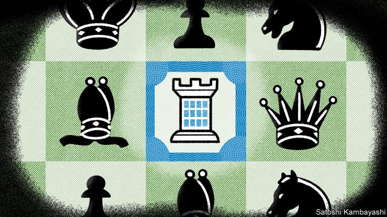

###### Buttonwood

# The quest to find companies that have a lasting competitive edge 

##### Finding companies protected by what Warren Buffett calls a “moat” is easy to talk about, but hard to do 

 

> May 2nd 2019 

IN 1965 WARREN BUFFETT acquired Berkshire Hathaway, a textile company based in New England, for his investment partnership. When he began buying the stock, in 1962, Berkshire had working capital worth $16 a share; the shares sold for $8. So Mr Buffett was getting the rest of the firm’s assets for less than nothing. This was the sort of “value investing” that had made Mr Buffett and his partners a tidy pile over the preceding decade. 

Berkshire would become a wildly successful investment vehicle. On May 4th, 40,000 of its shareholders gather for its annual general meeting in Omaha, Nebraska, for a dose of Mr Buffett’s folksy wisdom. It continues to make a wide range of financial investments: witness this week’s offer to buy $10bn of debt-like securities and warrants in Occidental, an oil firm that is negotiating a merger. 

Yet he came to regret buying Berkshire stock. The return on investment was paltry, because the firm had no unique edge or products. Textiles are commodities. No one ever asked his tailor for a Hathaway suit lining. 

In its way, Berkshire provided a valuable lesson. Mr Buffett’s strategy shifted. Instead of “buying fair companies at wonderful prices”, he would buy “wonderful companies at fair prices”. To make the grade, a firm must have a lucrative position in the marketplace. But it needs more. To be a truly great investment, the company should also have a “moat”. 

This is Mr Buffett’s shorthand for a company with a lasting competitive edge—the philosopher’s stone of business strategists and stockpickers. Its profits are secure because other companies cannot easily replicate what it does. A niche of this kind acts like a moat around a castle, keeping rival firms out. It is super-wonderful if the castle is run by a knight who spends his riches on widening the moat, rather than blowing it all on banquets or natty coats of arms. But the moat is the main thing. 

Looking back, Mr Buffett has invested in firms with two sorts of moat. The first type operates in a market that has room for just one profitable firm. In the 1970s Mr Buffett’s monopoly of choice was citywide newspapers, which had a lock on advertising. BNSF, America’s largest freight railway, which Berkshire has owned outright since 2009, is a more recent example. The moat’s contours are not as clear for the second type. The firm has competitors. But it has a bond with its customers based on a reputation for products of a consistently high quality. So strong is the firm’s brand that consumers are slow to switch allegiance, even when prices are raised. 

Mr Buffett’s first big bet on a consumer franchise of this kind was American Express, on which Berkshire staked a quarter of its capital in 1964. Amex had an enviable position in charge cards. Over the years, other franchise stocks were snapped up: See’s Candies, a maker of fancy chocolates; Gillette (now part of P&G); Wells Fargo; and latterly Apple. The apex of this strategy was the frenzied acquisition of shares in Coca Cola in the late 1980s. Mr Buffett saw that its profits were about to accelerate as it conquered new markets. 

With hindsight, Coke, Gillette and the rest look like sure-fire winners. That Berkshire made losing bets on firms with apparently unbreachable moats shows the difficulty of foresight. An example was Tesco, a British grocery chain. It was the leading firm in an oligopoly—a classic Buffett play. But after it issued several profit warnings, Berkshire sold at a hefty loss in 2014. Other moats are springing leaks. The marriage of Heinz and Kraft, two food-manufacturing giants, brokered by Berkshire and 3G, a private-equity firm, is in trouble. New brands built on social media and online sales are challenging the established order. 

“Moats are lame,” teased Elon Musk, a tech entrepreneur, last year. What gives firms a competitive edge, he said, is the pace of innovation. In fact, investors’ enthusiasm for tech firms such as Amazon, Facebook and Google has been because they appear to have deep moats. (Mr Buffett has admitted he has no insights on tech.) In any event, it is wrong to think that innovation is a guarantee of profits. Firms that come up with ideas often see rivals reap the benefit. 

It is hard enough to find a firm with a moat; it is much harder not to overpay for its stock. Many of the signature purchases of Mr Buffett’s career, such as Amex and Wells Fargo, were at knock-down prices. The strategy (buy stocks with moats) sounds simple; but it is not easy. Carrying it out takes skill, nerve and discipline. If it were easy, everybody could do it. 

-- 

 单词注释:

1.buttonwood['bʌtnwʊd]: 美洲悬铃木 

2.quest[kwest]:n. 探索, 寻求, 调查 v. 寻找, 找, 追寻猎物 

3.warren['wɒrәn]:n. 养兔场, 拥挤的地区 

4.buffett['bʌfit]: [人名] 巴菲特 

5.moat[mәut]:n. 壕沟, 护城河 vt. 将...围以壕沟 

6.warren['wɒrәn]:n. 养兔场, 拥挤的地区 

7.buffett['bʌfit]: [人名] 巴菲特 

8.Berkshire['bә:kʃә]:n. 巴克夏猪 

9.Hathaway[]:n. 哈撒韦（衬衫品牌）；海瑟薇（人名） 

10.partnership['pɑ:tnәʃip]:n. 合伙, 合股, 合作关系 [经] 合伙(合作)关系, 全体合伙人 

11.asset['æset]:n. 资产, 有益的东西 

12.les[lei]:abbr. 发射脱离系统（Launch Escape System） 

13.precede[.pri:'si:d]:vt. 在...之前, 优于, 较...优先 vi. 在前面 

14.wildly[]:adv. 狂暴地, 激动地, 狂热地, 鲁莽地, 轻率地 

15.shareholder['ʃєә.hәuldә]:n. 股东 [法] 股东, 股票持有人 

16.omaha['әumәhɑ:]:n. 奥马哈市（美国内布拉斯加州）；美国奥马哈族印第安人；奥马哈 

17.Nebraska[ni'bræskә]:[经] 内布拉斯加州, (美国中西部的一州) 

18.folksy['fәuksi]:a. 和气的, 有民间风味的 

19.warrant['wɒ:rәnt]:n. 授权, 正当理由, 根据, 证明, 批准, 凭证, 令状, 委任状 vt. 授权给, 保证, 担保, 批准, 使有正当理由 

20.occidental[.ɒksi'dentәl]:n. 欧美人, 西方人 a. 欧美的, 西方的, 西方国家的 

21.merger['mә:dʒә]:n. 合并, 归并 [经] 购并 

22.paltry['pɒ:ltri]:a. 不足取的, 琐碎的, 可鄙的 

23.commodity[kә'mɒditi]:n. 农产品, 商品, 有用的物品 [经] 商品, 货物, 日用品 

24.lucrative['lu:krәtiv]:a. 有利益的, 获利的, 合算的 

25.marketplace['mɑ:kit'pleis]:n. 市场 

26.shorthand['ʃɒ:thænd]:n. 速记 [法] 速记法, 速记, 记录文字 

27.strategist['strætidʒist]:n. 战略家 

28.stockpickers[]:[网络] 选股王 

29.cannot['kænɒt]:aux. 无法, 不能 

30.replicate['replikeit]:vt. 折叠, 折转, 复制 n. 复现试验, 复制品, 高八度音 a. 复现的, 复制的, 折转的, 弯回的 

31.niche[nitʃ]:n. 壁龛 vt. 放入壁龛, 安顿 

32.knight[nait]:n. 骑士, 爵士 vt. 授以爵位 

33.riche[]:n. 暴发户 

34.banquet['bæŋkwit]:n. 宴会 

35.natty['næti]:a. 整洁的, 帅的, 清楚的, 敏捷的 

36.monopoly[mә'nɒpәli]:n. 垄断, 专卖权, 独占事业 [经] 垄断, 专利品, 垄断(权)独占 

37.citywide['siti.waid]:a. 全市的, 全市性的 

38.advertising['ædvәtaiziŋ]:n. 广告业, 广告 a. 广告的 [计] 发广告 

39.bnsf[]:[网络] 伯灵顿北方圣太菲铁路公司(Burlington Northern Santa Fe)；林顿铁路公司；伯灵顿北方圣大菲铁路公司 

40.outright['autrait]:a. 率直的, 完全的, 总共的, 直率的 adv. 完全地, 率直地, 立刻地, 一直向前 

41.contour['kɒntuә]:n. 轮廓 vt. 画轮廓 a. 显示轮廓的 [计] 轮廓 

42.consistently[]:adv. 坚固, 坚实, 一致, 始终如一, 连贯 [计] 相容地 

43.allegiance[ә'li:dʒәns]:n. 忠贞, 效忠 

44.franchise['fræntʃaiz]:n. 公民权, 特权, 特许经营权, 免赔额 vt. 给以特权, 给以...公民权 

45.Amex['æmeks]:n. 美国证券交易所 

46.enviable['enviәbl]:a. 令人羡慕的, 可羡慕的 

47.maker['meikә]:n. 制造者, 上帝 [经] 制造者, 出票人 

48.gillette[]:n. 吉列公司（财富500强公司之一） 

49.fargo['fɑ:ɡəu]:n. 法戈（美国北达科他州东南部城市） 

50.latterly['lætәli]:adv. 近来, 最近 

51.apex['eipeks]:n. 顶, 尖端, 最高潮 [医] 尖, 尖端 

52.frenzy['frenzi]:n. 疯狂, 狂暴, 狂怒 [医] 暴怒, 狂乱 

53.coca['kәukә]:n. 古柯, 古柯叶 [医] 古柯 

54.cola['kәulә]:结肠, 冒号, 科朗 [化] 可乐果; 可乐果属; 可乐果干子叶 

55.hindsight['haindsait]:n. 枪的表尺, 事后聪明 

56.apparently[ә'pærәntli]:adv. 表面上, 清楚地, 显然地 

57.unbreachable[]:[网络] 不可分割 

58.foresight['fɒ:sait]:n. 远见, 深谋远虑 [法] 先见, 预见, 预见的能力 

59.Tesco[teskəu]:n. 特斯科（财富500强公司之一） 

60.hefty['hefti]:a. 重的, 肌肉发达的 

61.heinz[]:n. 海因茨（姓氏）；亨氏食品公司（世界著名的食品供应商, 主要产品包括调味品和餐食两大类） 

62.kraft[krɑ:ft]:n. 牛皮纸 

63.broker['brәukә]:n. 掮客, 经纪人 [经] 经纪人, 掮客 

64.online[]:[计] 联机 

65.elon[i'lɔn]:n. 埃伦（可溶性显影剂粉末） 

66.musk[mʌsk]:n. 麝香, 麝香的气味 [化] 麝香 

67.tech[tek]:n. 技术学院或学校 

68.entrepreneur[.ɒntrәprә'nә:]:n. 企业家, 主办人 [经] 承包商, 企业家 

69.innovation[.inәu'veiʃәn]:n. 改革, 创新 [法] 创新, 改革, 刷新 

70.amazon['æmәzɒn]:n. 亚马孙河 [医] 无乳腺者 

71.facebook[]:n. 脸谱网 

72.google[]:谷歌；搜索引擎技术；谷歌公司 

73.overpay[.әuvә'pei]:vt. 多付, 多给报酬 vi. 付得过多 

