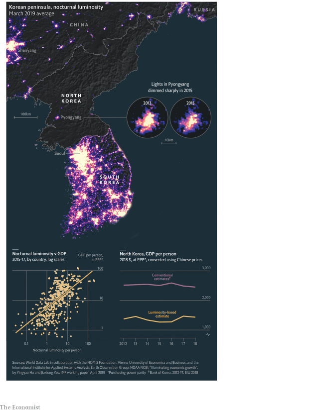

###### When the lights go out

# Satellite data shed new light on North Korea’s opaque economy 

##### The country’s nocturnal luminosity fell by 40% from 2013-15 

 

> May 4th 2019 

VIEWED FROM space at night, North Korea looks like the recently released first image of a black hole: an abyss, ringed by the brilliant glow of South Korea, China and Russia, from which nothing can escape. But the Hermit Kingdom does emit a bit of light, which orbiting satellites detect. And nocturnal luminosity is one of the few reliable sources of information about the country. It implies that North Korea’s economy is poorer, more volatile and more vulnerable to weather than formerly thought. 

Night lights are a strong proxy for economic activity. A new paper by the IMF finds that they explain 44% of the variation in countries’ GDP per person—as close a tie as that between a person’s height and hand size. In places where records are poor or manipulated, night lights offer an alternative measure of output. One study found that among countries with similar luminosity, autocracies reported GDP growth 15-30% higher than democracies did. 

Nowhere are good economic data rarer than in North Korea. The most detailed numbers come from South Korea’s central bank, which derives them from figures on production volumes of various goods. When adjusted for the cost of living in a developing Asian economy, the bank’s most recent estimate of North Korea’s annual GDP per person is enough to buy goods and services that would cost $2,500 in America. 

The picture painted by night lights, however, is even grimmer. In 2013 a group of scholars compared luminosity and GDP within rural China, obtaining an equation to estimate economic output from light. A forthcoming paper by World Data Lab, a startup, and a team of researchers applies this formula to North Korea. It yields a standard of living that would cost $1,400 a year in America, making North Korea one of the world’s ten poorest countries. 

The data also suggest that the economy has been unusually volatile. In 2013-15 luminosity fell by 40%. That implies a 12% reduction in GDP, including 19% in the capital region, Pyongyang. Since 2016, however, the country has brightened again. 

International sanctions are unlikely to have produced this darkening. They were made stricter in 2016-17, just as luminosity rose. A drop in the prices of North Korean exports, like coal, may have played a part. 

But the main cause was probably weather. North Korea relies on hydropower, and in 2015 it was parched by a drought. The Bank of Korea also reckons that electricity, gas and water output fell by 13% in 2015. 

The economy may not have shrunk as much as the dimming suggests. Recessions caused by power cuts could disproportionately reduce lighting. Many North Koreans own solar panels, which power daytime activity not shown in night lights. And state buildings, whose illumination is a political choice, make up much of the capital’s glow. As with physics inside a black hole, no one knows what economic laws apply within North Korea’s eerie silhouette. 

Nonetheless, a 40% drop in luminosity indicates a serious recession. And this year the government has admitted publicly that heatwaves, floods and drought have caused a dire food shortfall. The regime appears much better prepared to weather trade sanctions than the wrath of nature. 

-- 

 单词注释:

1.datum['deitәm]:n. 论据, 材料, 资料, 已知数 [医] 材料, 资料, 论据 

2.opaque[әu'peik]:n. 不透明物 a. 不透明的, 不传热的, 不传导的, 阴暗的 [计] 白底 

3.nocturnal[nɒk'tә:nәl]:a. 夜的, 夜曲的 [医] 夜间的 

4.luminosity[.lu:mi'nɒsiti]:n. 光明, 光辉, 光度, 亮度 [计] 亮度 

5.Korea[kә'riә]:n. 朝鲜, 韩国 

6.abyss[ә'bis]:n. 深渊, 深邃, 地狱 

7.ringe[]: [地名] [德国] 林格; [地名] [丹麦] 灵厄 

8.hermit['hә:mit]:n. 隐士, 隐居者 

9.volatile['vɒlәtail]:a. 挥发性的, 可变的, 不稳定的, 飞行的, 轻快的, 爆炸性的 n. 有翅动物, 挥发物 [计] 易失的 

10.vulnerable['vʌlnәrәbl]:a. 易受伤害的, 有弱点的, 易受影响的, 脆弱的, 成局的 [医] 易损的 

11.formerly['fɒ:mәli]:adv. 从前, 以前 

12.proxy['prɒksi]:n. 代理, 代理人, 委托书 [经] 代理人, 代表权, 授权书 

13.IMF[]:国际货币基金组织 [经] 国际货币基金 

14.manipulate[mә'nipjuleit]:vt. 操纵, 利用, 操作, 巧妙地处理, 假造 

15.autocracy[ɒ:'tɒkrәsi]:n. 独裁统治, 独裁统治的国家 [法] 独裁政治, 专制政治, 独裁政府 

16.grim[grim]:a. 冷酷的, 坚强的, 残忍的, 可怕的, 讨厌的 

17.forthcoming['fɒ:θ'kʌmɑŋ]:a. 即将来临的 n. 来临 

18.startup[]:[计] 启动 

19.Pyongyang['pjɔŋ'jæŋ]:n. 平壤(朝鲜民主主义人民共和国首都) 

20.sanction['sæŋkʃәn]:n. 核准, 制裁, 处罚, 约束力 vt. 制定制裁规则, 认可, 核准, 同意 

21.darken['dɑ:kn]:vt. 弄暗, 使模糊 vi. 暗下来, 颜色变深 

22.Korean[kә'riәn]:n. 朝鲜人, 朝鲜语 a. 朝鲜人的, 朝鲜语的 

23.hydropower['haidrәupauә]:n. 水力发出的电力 

24.parch[pɑ:tʃ]:vt. 烤, 烘, 使干透 vi. 烤干, 焦干 

25.reckon['rekәn]:vt. 计算, 总计, 估计, 认为, 猜想 vi. 数, 计算, 估计, 依赖, 料想 

26.recession[ri'seʃәn]:n. 后退, 凹处, 衰退, 归还 [医] 退缩 

27.disproportionately[]:adv. 不匀称, 不相称 

28.Korean[kә'riәn]:n. 朝鲜人, 朝鲜语 a. 朝鲜人的, 朝鲜语的 

29.daytime['deitaim]:n. 白天, 日间 

30.illumination[i.lju:mi'neiʃәn]:n. 照明, 阐明, 启发 [医] 照明, 映光 

31.physic['fizik]:n. 药品, 泻药, 医学 vt. 给...服药, 治愈, 使通便 

32.eerie['iәri]:a. 怪诞的, 可怕的, 奇异的, 令人迷惑不解的 

33.silhouette[.silu:'et]:n. 黑色半身侧面影, 影子, 轮廓, 剪影 vt. 描绘...成侧面影, 使照出影子来, 使仅仅显出轮廓 

34.nonetheless[,nʌnðә'les]:conj. 然而, 尽管, 不过 adv. 不过, 仍然, 尽管如此, 然而 

35.heatwave[ˈhi:tweɪv]:n. 热浪[波], 酷暑期 

36.dire[daiә]:a. 可怕的, 悲惨的, 阴沉的, 极端的 

37.shortfall['ʃɒ:tfɒ:l]:n. 不足, 不足量 [经] 缺少, 不足, 亏舱运费 

38.regime[rei'ʒi:m]:n. 政权, 当权期间, 政体, 社会制度, 体制, 情态 [医] 制度, 生活制度 

39.wrath[rɒ:θ]:n. 愤怒, 激怒, 愤怒的举动, (自然现象等)严酷 

