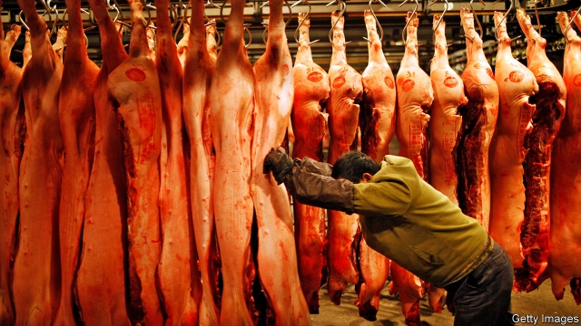
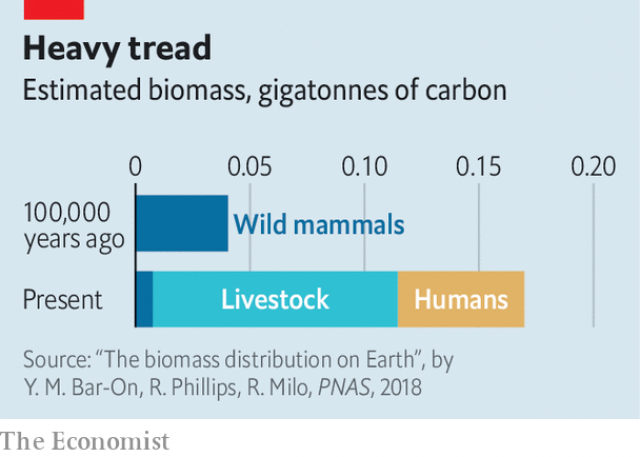
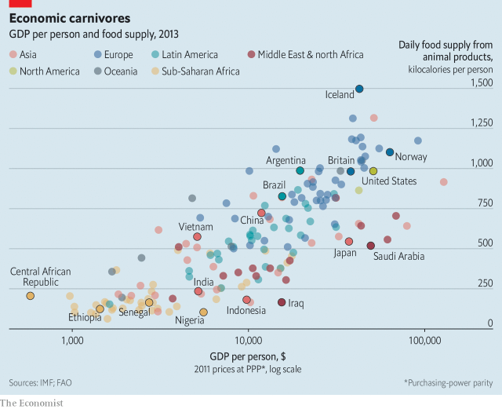
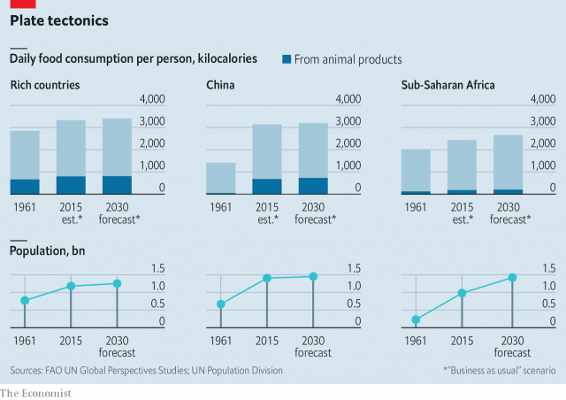
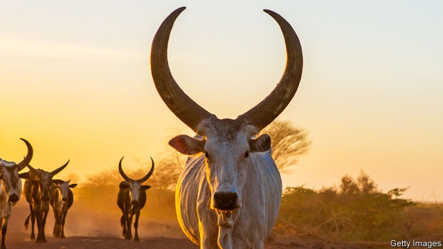

###### The way of more flesh

# Global meat-eating is on the rise, bringing surprising benefits 

##### As Africans get richer, they will eat more meat and live longer, healthier lives 

 

> May 2nd 2019 

THINGS WERE different 28 years ago, when Zhou Xueyu and her husband moved from the coastal province of Shandong to Beijing and began selling fresh pork. The Xinfadi agricultural market where they opened their stall was then a small outpost of the capital. Only at the busiest times of year, around holidays, might the couple sell more than 100kg of meat in a day. With China’s economic boom just beginning, pork was still a luxury for most people. 

Ms Zhou now sells about two tonnes of meat a day. In between expert whacks of her heavy cleaver, she explains how her business has grown. She used to rely on a few suppliers in nearby provinces. Now the meat travels along China’s excellent motorway network from as far away as Heilongjiang, in the far north-east, and Sichuan, in the south-west. The Xinfadi market has changed, too. It is 100 times larger than when it opened in 1988, and now lies within Beijing, which has sprawled around it. 

Between 1961 and 2013 the average Chinese person went from eating 4kg of meat a year to 62kg. Half of the world’s pork is eaten in the country. More liberal agricultural policies have allowed farms to produce more—in 1961 China was suffering under the awful experiment in collectivisation known as the “great leap forward”. But the main reason the Chinese are eating more meat is simply that they are wealthier. 

 

In rich countries people go vegan for January and pour oat milk over their breakfast cereal. In the world as a whole, the trend is the other way. In the decade to 2017 global meat consumption rose by an average of 1.9% a year and fresh dairy consumption by 2.1%—both about twice as fast as population growth. Almost four-fifths of all agricultural land is dedicated to feeding livestock, if you count not just pasture but also cropland used to grow animal feed. Humans have bred so many animals for food that Earth’s mammalian biomass is thought to have quadrupled since the stone age (see chart). 

Barring a big leap forward in laboratory-grown meat, this is likely to continue. The Food and Agriculture Organisation (FAO), an agency of the UN, estimates that the global number of ruminant livestock (that is, cattle, buffalo, sheep and goats) will rise from 4.1bn to 5.8bn between 2015 and 2050 under a business-as-usual scenario. The population of chickens is expected to grow even faster. The chicken is already by far the most common bird in the world, with about 23bn alive at the moment compared with 500m house sparrows. 

 

Meanwhile the geography of meat-eating is changing. The countries that drove the global rise in the consumption of animal products over the past few decades are not the ones that will do so in future. Tastes in meat are changing, too. In some countries people are moving from pork or mutton to beef, whereas in others beef is giving way to chicken. These shifts from meat to meat and from country to country are just as important as the overall pattern of growth. They are also more cheering. On a planetary scale, the rise of meat- and dairy-eating is a giant environmental problem. Locally, however, it can be a boon. 

Over the past few decades no animal has bulked up faster than the Chinese pig. Annual pork production in that country has grown more than 30-fold since the early 1960s, to 55m tonnes. It is mostly to feed the legions of porkers that China imports 100m tonnes of soybeans every year—two-thirds of trade in that commodity. It is largely through eating more pork and dairy that Chinese diets have come to resemble Western ones, rich in protein and fat. And it is mostly because their diets have altered that Chinese people have changed shape. The average 12-year-old urban boy was nine centimetres taller in 2010 than in 1985, the average girl seven centimetres taller. Boys in particular have also grown fatter. 

China’s pork suppliers are swelling, too. Three-fifths of pigs already come from farms that produce more than 500 a year, and Wan Hongjian, vice-president of WH Group Ltd, China’s largest pork producer, thinks the proportion will rise. Disease is one reason. African swine fever, a viral disease fatal to pigs though harmless to people, has swept China and has led to the culling of about 1m hogs. The virus is tough, and can be eradicated only if farms maintain excellent hygiene. Bigger producers are likely to prove better at that. 

Yet China’s pork companies are grabbing larger shares of a market that appears almost to have stopped growing. The OECD, a club of mostly rich countries, estimates that pork consumption in China has been more or less flat since 2014. It predicts growth of just under 1% a year over the next decade. If a country that eats so much of the stuff is indeed approaching peak pork, it hints at a big shift in global animal populations. Pigs will become a smaller presence on the global farm. 

In 2015 animal products supplied 22% of the average Chinese person’s calorie intake, according to the FAO. That is only a shade below the average in rich countries (24%). “Unlike decades ago, there are no longer large chunks of the population out there that are not yet eating meat,” says Joel Haggard of the US Meat Export Federation, an industry group. And demography is beginning to prove a drag on demand. China’s population will start falling in about ten years’ time. The country is already ageing, which suppresses food consumption because old people eat less than young people do. UN demographers project that, between 2015 and 2050, the number of Chinese in their 20s will crash from 231m to 139m. 

Besides, pork has strong competitors. “All over China there are people eating beef at McDonald’s and chicken at KFC,” says Mr Wan. Another fashion—hotpot restaurants where patrons cook meat in boiling pots of broth at the table—is boosting consumption of beef and lamb. Last year China overtook Brazil to become the world’s second-biggest beef market after America, according to the United States Department of Agriculture. Australia exports so much beef to China that the Global Times, a pugnacious state-owned newspaper, has suggested crimping the trade to punish Australia for various provocations. 

 

The shift from pork to beef in the world’s most populous country is bad news for the environment. Because pigs require no pasture, and are efficient at converting feed into flesh, pork is among the greenest of meats. Cattle are usually much less efficient, although they can be farmed in different ways. And because cows are ruminants, they belch methane, a powerful greenhouse gas. A study of American farm data in 2014 estimated that, calorie for calorie, beef production requires three times as much animal feed as pork production and produces almost five times as much greenhouse gases. Other estimates suggest it uses two and a half times as much water. 

Fortunately, even as the Chinese develop the taste for beef, Americans are losing it. Consumption per head peaked in 1976; around 1990 beef was overtaken by chicken as America’s favourite meat. Academics at Kansas State University linked that to the rise of women’s paid work. Between 1982 and 2007 a 1% increase in the female employment rate was associated with a 0.6% drop in demand for beef and a similar rise in demand for chicken. Perhaps working women think beef is more trouble to cook. Beef-eating has risen a little recently, probably because Americans are feeling wealthier. But chicken remains king. 

Shifts like that are probably the most that can be expected in rich countries over the next few years. Despite eager predictions of a “second nutrition transition” to diets lower in meat and higher in grains and vegetables, Western diets are so far changing only in the details. Beef is a little less popular in some countries, but chicken is more so; people are drinking less milk but eating more cheese. The EU expects only a tiny decline in meat-eating, from 69.3kg per person to 68.7kg, between 2018 and 2030. Collectively, Europeans and Americans seem to desire neither more animal proteins nor fewer. 

If the West is sated, and China is getting there, where is the growth coming from? One answer is India. Although Indians still eat astonishingly little meat—just 4kg a year—they are drinking far more milk, eating more cheese and cooking with more ghee (clarified butter) than before. In the 1970s India embarked on a top-down “white revolution” to match the green one. Dairy farmers were organised into co-operatives and encouraged to bring their milk to collection centres with refrigerated tanks. Milk production shot up from 20m tonnes in 1970 to 174m tonnes in 2018, making India the world’s biggest milk producer. The OECD expects India will produce 244m tonnes of milk in 2027. 

All that dairy is both a source of national pride and a problem in a country governed by Hindu nationalists. Hindus hold cows to be sacred. Through laws, hectoring and “cow protection” squads, zealots have tried to prevent all Indians from eating beef or even exporting it to other countries. When cows grow too old to produce much milk, farmers are supposed to send them to bovine retirement homes. In fact, Indian dairy farmers seem to be ditching the holy cows for water buffalo. When these stop producing milk, they are killed and their rather stringy meat is eaten or exported. Much of it goes to Vietnam, then to China (often illegally, because of fears of foot-and-mouth disease). 

But neither an Indian milk co-operative nor a large Chinese pig farm really represents the future of food. Look instead to a small, scruffy chicken farm just east of Dakar, the capital of Senegal. Some 2,000 birds squeeze into a simple concrete shed with large openings in the walls, which are covered with wire mesh. Though breezes blow through the building, the chickens’ droppings emit an ammoniac reek that clings to the nostrils. A few steps outside, the ground is brown with blood. Chickens have been stuffed into a makeshift apparatus of steel cones to protect their wings, and their necks cut with a knife. 

Though it looks primitive, this represents a great advance over traditional west African farming methods. The chickens in the shed hardly resemble the variegated brown birds that can be seen pecking at the ground in any number of villages. They are commercial broilers—white creatures with big appetites that grow to 2kg in weight after just 35 days. All have been vaccinated against two widespread chicken-killers—Newcastle disease and infectious bursal disease. A vet, Mamadou Diouf, checks on them regularly (and chastises the farmers for killing too close to the shed). Mr Diouf says that when he started working in the district, in 2013, many farmers refused to let him in. 

Official statistics suggest that the number of chickens in Senegal has increased from 24m to 60m since 2000. As people move from villages to cities, they have less time to make traditional stews—which might involve fish, mutton or beef as well as vegetables and spices, and are delicious. Instead they eat in cafés, or buy food that they can cook quickly. By the roads into Dakar posters advertise “le poulet prêt à cuire”, wrapped in plastic. Broiler farms are so productive that supermarket chickens are not just convenient but cheap. 

Many sub-Saharan Africans still eat almost no meat, dairy or fish. The FAO estimates that just 7% of people’s dietary energy comes from animal products, one-third of the proportion in China. This is seldom the result of religious or cultural prohibitions. If animal foods were cheaper, or if people had more money, they would eat more of them. Richard Waite of the World Resources Institute, an American think-tank, points out that when Africans move to rich countries and open restaurants, they tend to write meat-heavy menus. 

Yet this frugal continent is beginning to sway the global food system. The UN thinks that the population of sub-Saharan Africa will reach 2bn in the mid-2040s, up from 1.1bn today. That would lead to a huge increase in meat- and dairy-eating even if people’s diets stayed the same. But they will not. The population of Kenya has grown by 58% since 2000, while the output of beef has more than doubled. 

Africa already imports more meat each year than does China, and the OECD’s forecasters expect imports to keep growing by more than 3% a year. But most of the continent’s meat will probably be home-grown. The FAO predicts that in 2050 almost two out of every five ruminant livestock animals in the world will be African. The number of chickens in Africa is projected to quadruple, to 7bn. 

This will strain the environment. Although African broilers and battery hens are more or less as productive as chickens anywhere, African cattle are the world’s feeblest. Not only are they poorly fed and seldom visited by vets; in many areas they are treated more as stores of wealth than producers of food. Africa has 23% of the world’s cattle but produces 10% of the world’s beef and just 5% of its milk. 

Lorenzo Bellù of the FAO points out that herders routinely encroach on national parks and private lands in east Africa. He finds it hard to imagine that the continent’s hunger for meat will be supplied entirely by making farming more efficient. Almost certainly, much forest will be cut down. Other consequences will be global. Sub-Saharan Africans currently have tiny carbon footprints because they use so little energy—excluding South Africa, the entire continent produces about as much electricity as France. The armies of cattle, goats and sheep will raise Africans’ collective contribution to global climate change, though not to near Western or Chinese levels. 

 

People will probably become healthier, though. Many African children are stunted (notably small for their age) partly because they do not get enough micronutrients such as Vitamin A. Iron deficiency is startlingly common. In Senegal a health survey in 2017 found that 42% of young children and 14% of women are moderately or severely anaemic. Poor nutrition stunts brains as well as bodies. 

Animal products are excellent sources of essential vitamins and minerals. Studies in several developing countries have shown that giving milk to schoolchildren makes them taller. Recent research in rural western Kenya found that children who regularly ate eggs grew 5% faster than children who did not; cow’s milk had a smaller effect. But meat—or, rather, animals—can be dangerous, too. In Africa chickens are often allowed to run in and out of people’s homes. Their eggs and flesh seem to improve human health; their droppings do not. One study of Ghana finds that childhood anaemia is more common in chicken-owning households, perhaps because the nippers caught more diseases. 

Africans’ changing diets also create opportunities for local businesses. As cities grow, and as people in those cities demand more animal protein, national supply chains become bigger and more sophisticated. Animal breeders, hatcheries, vets and trucking companies multiply. People stop feeding kitchen scraps to animals and start using commercial feed. In Nigeria the amount of maize used for animal-feed shot up from 300,000 tonnes to 1.8m tonnes between 2003 and 2015. 

You can see this on the outskirts of Dakar—indeed, the building is so big that you can hardly miss it. NMA Sanders, a feed-mill, turned out some 140,000 tonnes of chicken feed last year, up from 122,000 the year before, according to its director of quality, Cheikh Alioune Konaté. The warehouse floor is piled high with raw ingredients: maize from Morocco, Egypt and Brazil; soya cake from Mali; fishmeal from local suppliers. The mill has created many jobs, from the labourers who fill bags with pelleted feed to the technicians who run the computer system, and managers like Mr Konaté. Lorries come and go. 

It is often said that sub-Saharan Africa lacks an industrial base, and this is true. Just one car in every 85 is made in Africa, according to the International Organisation of Motor Vehicle Manufacturers. But to look only for high-tech, export-oriented industries risks overlooking the continent’s increasingly sophisticated food-producers, who are responding to urban demand. Ideally, Africa would learn to fill shipping containers with clothes and gadgets. For now, there are some jobs to be had filling bellies with meat. 

-- 

 单词注释:

1.zhou[dʒәj]:n. 周（中国姓氏）；周朝（中国古代王朝） 

2.coastal['kәustәl]:a. 海岸的, 沿海的, 沿岸的 [法] 海岸的, 沿海的 

3.Shandong['ʃæn'djŋ]:山东(位于中国东部沿海、黄河下游) 

4.stall[stɒ:l]:n. 厩, 停车处, 牧师职位, 货摊, 托辞, 拖延 vt. 关入厩, 停顿, 推托, 支吾, 使陷于泥中 vi. 被关在厩内, 陷于泥中, 停止, 支吾 

5.outpost['autpәust]:n. 前哨, 前哨部队, 前哨基地 

6.tonne[tʌn]:n. 吨, 公吨 [经] 吨 

7.whack[hwæk]:vt. 猛击, 重打, 削减 vi. 重击 n. 重击, 重打 

8.cleaver['kli:vә]:n. 切肉刀, 切割者, 劈脊 [医] 劈刀 

9.supplier[sә'plaiә]:n. 供应者, 供给国, 供应商 [化] 承制厂; 供应厂商 

10.motorway['mәutәwei]:n. 高速公路 

11.Heilongjiang['hei'ljŋ'dʒjɑ:ŋ]:黑龙江(位于中国东北地区北部) 

12.Sichuan['si:tʃ'wɑ:n]:四川(位于中国西南部、长江上游) 

13.sprawl[sprɒ:l]:vi. 伸开手足躺, 爬行, 蔓生, 蔓延 vt. 懒散地伸开, 使蔓生, 使不规则地伸展 n. 伸开手足躺卧姿势 

14.collectivisation[kә,lektivai'zeiʃәn; - vi'z-]:n. <主英> =collectivization 

15.vegan['vegәn]:n. 严格的素食主义者 [医] 绝对素食者 

16.oat[әut]:n. 燕麦, 燕麦田 [医] 燕麦, 雀麦 

17.cereal['siәriәl]:n. 谷类食品, 谷类植物 a. 谷类的 

18.dedicate['dedikeit]:vt. 献出, 贡献 

19.pasture['pæstʃә]:n. 牧场, 草地, 牧草 vt. 放牧 vi. 吃草 

20.cropland['krɔplænd]:[经] 农地 

21.mammalian[mæ'meiljәn]:n. 哺乳动物 a. 哺乳动物的 

22.biomass['baiәumæs]:n. 生物量 [化] 生物质; 生物量 

23.quadruple['kwɒdrupl]:a. 四倍的, 四重的, 四部分组成的 n. 四倍 vt. 使成四倍 vi. 成为四倍 

24.organisation[,ɔ: ^әnaizeiʃən; - ni'z-]:n. 组织, 团体, 体制, 编制 

25.FAO[faj]:(联合国)粮食及农业组织 

26.UN[ʌn]:pron. 家伙, 东西 [经] 联合国 

27.ruminant['ru:minәnt]:a. 反刍类的, 沉思的, 默想的 n. 反刍动物 

28.buffalo['bʌfәlәu]:n. 水牛 [机] 水牛 

29.scenario[si'nɑ:riәu]:n. 剧本提纲, 情节, 剧本, 方案, 事态 [计] 方案 

30.planetary['plænitri]:a. 行星的, 流浪的, 迁移不定的, 地球上的, 现世的 

31.environmental[in.vaiәrәn'mentәl]:a. 周围的, 环境的 [经] 环境的, 环保的 

32.locally['lәukәli]:adv. 地方性地, 局部性地, 在当地 

33.boon[bu:n]:n. 恩惠 

34.legion['li:dʒәn]:n. 军团, 军队, 众多的人 

35.porker['pɒ:kә]:n. 食用猪, 肥小猪 

36.soybean['sɒibi:n]:n. 大豆 [化] 大豆 

37.commodity[kә'mɒditi]:n. 农产品, 商品, 有用的物品 [经] 商品, 货物, 日用品 

38.wan[wɒn]:a. 苍白的, 无血色的, 病态的, 暗淡的 v. (使)变苍白 [计] 广域网 

39.wh[]:abbr. 瓦特小时（Watt Hours）；白宫（White House）；白色（white） 

40.Ltd['limitid]:有限的 

41.producer[prә'dju:sә]:n. 生产者, 制作者, 制作人 [化] 发生器; (炉煤气)发生炉; 制气炉; 生产者 

42.swine[swain]:n. 猪, 卑鄙的家伙 

43.viral['vairәl]:a. 病毒的, 病毒引起的 [医] 病毒的 

44.cull[kʌl]:vt. 采, 摘, 拣 n. 拣出的等外品, 被剔出的动物 

45.hog[hɒg]:n. 猪, 贪婪者, 象猪般的人 v. (使)拱起 

46.eradicate[i'rædikeit]:vt. 根除, 扑灭, 根绝, 消灭 

47.hygiene['haidʒi:n]:n. 卫生保健, 卫生学, 保健法 [医] 卫生, 卫生学 

48.grab[græb]:n. 抓握, 掠夺, 强占, 东方沿岸帆船 vi. 抓取, 抢去 vt. 攫取, 捕获, 霸占 

49.Oecd[]:[经] 已开发国家组织 

50.les[lei]:abbr. 发射脱离系统（Launch Escape System） 

51.calorie['kælәri]:n. 卡路里（热量单位） 

52.intake['inteik]:n. 入口, 吸入, 吸入量 [医] 摄取量 

53.chunk[tʃʌŋk]:n. 大块, 矮胖的人(或物) [经] 定样 

54.Joel['dʒәuәl]:n. 约珥(<<圣经>>人物), <<约珥书>> 

55.haggard['hægәd]:n. 野鹰 a. 憔悴的, 形容枯槁的, 野性的 

56.federation[fedә'reiʃәn]:n. 联邦, 联合, 联盟 [法] 联邦, 联盟, 联邦政府 

57.demography[di:'mɒgrәfi]:n. 人口统计学 [医] 人口学, 人口统计学 

58.suppress[sә'pres]:vt. 镇压, 使止住, 禁止, 抑制, 查禁 [法] 镇压, 平定, 禁止出版 

59.demographer[di:'mɒgrәfә]:n. 人口统计学家 

60.kfc[]:abbr. 肯德基（Kentucky Fried Chicken, 快餐连锁店品牌） 

61.patron['peitrәn]:n. 赞助人, 顾客, 保护人 [法] 保护人, 庇护人, 赞助人 

62.broth[brɒθ]:n. 原汁清汤, 肉汤 [医] 肉汤(培养基) 

63.Brazil[brә'zil]:n. 巴西 

64.pugnacious[pʌg'neiʃәs]:a. 好斗的 

65.crimp[krimp]:n. 诱人当兵的人, 拳曲, 鬈发 vt. 诱...去当兵, 使拳曲, 使有褶 

66.provocation[.prɒvә'keiʃәn]:n. 激怒, 刺激, 挑拨 [医] 激发[作用] 

67.populous['pɒpjulәs]:a. 人口多的, 人口稠密的 

68.belch[beltʃ]:vi. 打嗝, 喷吐 vt. 打嗝, 吼叫着发出(命令), 喷吐 n. 打嗝, 喷吐 

69.methane['meθein]:n. 甲烷, 沼气 [化] 甲烷; 沼气 

70.datum['deitәm]:n. 论据, 材料, 资料, 已知数 [医] 材料, 资料, 论据 

71.kansa[]:n. （日语）监察；堪萨人（旧时居住在美国堪萨斯州一带的印第安人） 

72.prediction[pri'dikʃәn]:n. 预言, 预报 [化] 预测 

73.transition[træn'ziʃәn]:n. 转变, 转换, 变迁, 过渡时期, 临时转调 [化] 跃迁 

74.EU[]:[化] 富集铀; 浓缩铀 [医] 铕(63号元素) 

75.collectively[]:adv. 集合, 聚合性, 共同, 集体主义, 集团, 集体 

76.sate[seit]:vt. 充分满足, 过分满意, 使厌腻 

77.astonishingly[ə'stɔniʃiŋli]:adv. 令人惊讶地 

78.ghee[gi:]:n. 印度液体奶油 [化] 印度酥油 

79.embark[im'bɑ:k]:vi. 乘船, 着手, 从事, 上飞机 vt. 使上船, 使上飞机, 使从事 

80.refrigerate[ri'fridʒәreit]:vt. 使冷却, 使清凉, 冷藏 [机] 冷冻 

81.Hindu['hindu:]:a. 印度教教徒的 n. 印度教教徒 

82.nationalist['næʃәnәlist]:n. 国家主义者, 民族主义者 

83.Hindu['hindu:]:a. 印度教教徒的 n. 印度教教徒 

84.squad[skwɒd]:n. 班, 小队, 小集团 vt. 编成班 

85.zealot['zelәt]:n. 热心者, 狂热者, 犹太教狂热信徒 [法] 狂热分子, 激烈分子 

86.bovine['bәuvain]:a. 牛的；似牛的；迟钝的 

87.retirement[ri'taiәmәnt]:n. 退休, 隐居, 撤退 [经] 退休, 退股, (固定资产)报废 

88.stringy['striŋi]:a. 线, 绳的, 纤维的, 粘性的 

89.Vietnam[.vjet'næm]:n. 越南 

90.illegally[]:[法] 非法地, 不合法地, 违法地 

91.scruffy['skrʌfi]:a. 不整齐的, 肮脏的, 破旧的, 褴褛的 

92.dakar['dækә]:n. 达喀尔（塞内加尔首都） 

93.Senegal[,seni'^ɔ:l]:n. 塞内加尔 

94.mesh[meʃ]:n. 网孔, 网丝, 网眼, 网状物, 圈套, 陷阱, 啮合 vt. 以网捕捉, 啮合, 使缠住 vi. 落网, 相啮合 

95.dropping['drɒpiŋ]:n. 点滴, 滴下, 落下 [医] 跛行步态 

96.ammoniac[ә'mәuniæk]:a. 氨的, 含氨的 n. 氨草胶 

97.reek[ri:k]:n. 烟, 水蒸气, 臭气散发 vi. 冒烟, 发臭气, 散发 vt. 用烟熏, 散发 

98.cling[kliŋ]:vi. 粘紧, 附着, 紧贴, 坚持 

99.nostril['nɒstril]:n. 鼻孔 [医] 鼻孔 

100.makeshift['meikʃift]:n. 权宜之计, 临时代用品 a. 权宜的, 临时代用的 

101.cone[kәun]:n. 圆锥体, 球果 vt. 使成锥形 

102.variegate['vєәrigeit]:vt. 使成斑驳, 使多样化 

103.peck[pek]:n. 配克(英美干量单位), 啄痕, 啄食, 许多 vt. 啄, 啄食, 琢, 凿成, 扔 vi. 啄, 吹毛求疵, 啄食, 勉强吃 [计] 取数 

104.vaccinate['væksineit]:v. 预防接种 

105.infectious[in'fekʃәs]:a. 有传染性的, 易传染的 [医] 传染性的 

106.bursal[]:[医] 囊的, 粘液囊的 

107.vet[vet]:n. 兽医 vi. 当兽医 vt. 诊断, 检审 

108.mamadou[]:[网络] 马马杜；马度；马马多 

109.diouf[]:un. 迪乌夫(Abdou,1935-,塞内加尔共和国总统,1983年当选) [网络] 迪奥夫；号迪乌夫 

110.chastise[tʃæ'staiz]:vt. 责骂, 惩罚 [法] 责罚, 惩戒, 严惩 

111.statistic[stә'tistik]:n. 统计量 a. 统计的, 统计学的 

112.spice[spais]:n. 香料, 药料, 香气, 调味品, 情趣, 少许 vt. 加香料, 使添趣味 

113.quickly['kwikli]:adv. 很快地 

114.LE[]:[计] 小于或等于 

115.poulet[]: [人名] 波利特 

116.cuire[]:[网络] 教育中心；地下设施研究和教育中心；地下基础设施研究中心 

117.broiler['brɔilә(r)]:n. 小鸡, 适合于烤焙的小鸡, 烤肉师傅, 烤焙用具, 大热天 

118.dietary['daiәtәri]:a. 饮食的 n. 规定食物 

119.cultural['kʌltʃәrәl]:a. 文化的, 教养的, 修养的 [医] 培养的 

120.prohibition[.prәuhi'biʃәn]:n. 禁令, 禁止 

121.richard['ritʃәd]:n. 理查德（男子名） 

122.waite[]:n. 韦特（人名） 

123.frugal['fru:gәl]:a. 节俭的, 朴素的 

124.Kenya['kenjә]:n. 肯尼亚 

125.forecaster['fɔ:kɑ:stә]:n. 预报员 

126.broiler['brɔilә(r)]:n. 小鸡, 适合于烤焙的小鸡, 烤肉师傅, 烤焙用具, 大热天 

127.feeblest[ˈfi:blɪst]:a. 虚弱的( feeble的最高级 ); 无效的; 缺乏决心的; 无力的 

128.poorly['puәli]:adv. 贫穷地, 不充分地, 贫乏地 a. 身体不舒服的 

129.Lorenzo[lɔ'renzәu]:洛伦佐(男子名) 

130.herder['h\\:dә(r)]:n. 牧人, (美)(非正式)监狱看守 [计] 首部, 首标, 标题, 头标, 报头, 管座, 端板 

131.routinely[]:adv. 日常, 乏味, 常规, 例行 

132.encroach[in'krәutʃ]:vi. 侵犯, 侵蚀, 蚕食 [法] 侵犯, 侵入, 侵占 

133.entirely[in'taiәli]:adv. 完全, 全然, 一概 

134.currently['kʌrәntli]:adv. 现在, 当前, 一般, 普通 [计] 当前 

135.footprint['futprint]:n. 足迹 [计] 印迹 

136.stunt[stʌnt]:n. 特技, 绝技, 花招, 噱头, 手腕, 发育不良 vt. 阻碍成长 vi. 表演特技 

137.notably['nәjtbәli]:adv. 显著地, 著名地, 尤其, 特别 

138.micronutrient[,maikrәj'nju:triәnt]:n. 微量营养素 [机] 微量营养 

139.deficiency[di'fiʃәnsi]:n. 缺乏, 不足 [医] 缺乏, 不足 

140.startlingly['sta:tliŋli]:adv. 惊人地 

141.moderately['mɒdәrәtli]:adv. 适当地, 适度地, 中庸地 

142.anaemic[ә'ni:mik]:a. 贫血的, 患贫血症的, 无活力的 

143.schoolchild['sku:ltʃaild]:n. 学童 

144.Ghana['gɑ:nә]:n. 加纳 

145.anaemia[ә'ni:mjә]:n. 贫血, 贫血症, 无活力 [医] 贫血 

146.nipper['nipә]:n. 镊子, 手铐 [医] 马切牙; 钳, 镊子 

147.sophisticate[sә'fistikeit]:n. 久经世故的人, 精于...之道的人 vt. 篡改, 曲解, 使变得世故, 掺合, 弄复杂 vi. 诡辩 

148.breeder['bri:dә]:n. 饲养员, 养育员, 起因, 起源者 

149.hatchery['hætʃәri]:n. 孵卵处 

150.scrap[skræp]:n. 碎片, 残余物, 些微, 片断, 铁屑, 吵架 vt. 扔弃, 敲碎, 拆毁 vi. 互相殴打 a. 零碎拼凑成的, 废弃的 

151.Nigeria[nai'dʒiriә]:n. 尼日利亚 

152.maize[meiz]:n. 玉蜀黍, 黄色 a. 玉蜀黍色的, 黄色的 

153.NMA[]:NetWare管理代理 

154.sander['sændә]:[电] 散沙 

155.cheikh[]:[网络] 凯茜 

156.alioune[]:n. (Alioune)人名；(几、塞内)阿利翁 

157.Morocco[mә'rɒkәu]:n. 摩洛哥, 摩洛哥皮革 [机] 摩洛哥革 

158.Egypt['i:dʒipt]:n. 埃及 

159.soya['sɔiә]:[医] 大豆 

160.Mali['mɑ:li]:n. 马里 

161.fishmeal['fɪʃmi:l]:n. 鱼粉 

162.pellete['pelɪteɪ]: [医]压片机, 制粒机 

163.ideally[ai'diәli]:adv. 完美地, 理想地 

164.gadget['gædʒit]:n. 小配件, 小玩意, 诡计 

