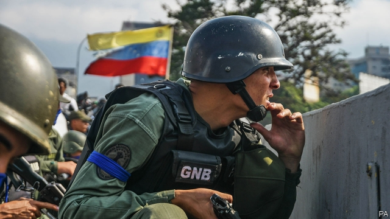

###### Venezuela

# How to get rid of Nicolás Maduro 

##### An attempt to depose the dictator appears to have failed. Try again 

 

> May 2nd 2019 

APRIL 30TH DAWNED promisingly in Venezuela. Juan Guaidó, acknowledged as the country’s interim president by many democracies and millions of Venezuelans, appeared outside an air-force base in Caracas flanked by national guardsmen to declare that the end of the dictatorship was imminent. By his side was a leader of the opposition, Leopoldo López, who had somehow been freed from house arrest. His presence, and that of the guards, suggested that Venezuela’s security forces were ready at last to withdraw their support for Nicolás Maduro, who has ruled his country catastrophically and brutally for the past six years. 

Thus began two days of rumour, intrigue and violence (see article). As The Economist went to press the regime was still in charge and the generals were proclaiming their loyalty to it. Mr Maduro had appeared on television to declare that the “coup-mongering adventure” had failed. Yet this week’s events reveal that his hold on power is weaker than he claims. Mr Guaidó, the United States, which supports him, and the commanders of Venezuela’s security apparatus must work together to put an end to it. 

That may well have been the plan. John Bolton, America’s national security adviser, said on April 30th that senior regime officials, including the defence minister and the commander of the presidential guard, had agreed to dump Mr Maduro and transfer power to Mr Guaidó. Mike Pompeo, America’s secretary of state, later insisted that Mr Maduro had been worried enough to have a plane waiting to spirit him to Havana but was dissuaded by his Russian allies. 

How true these claims are and what went wrong is uncertain. A letter on social media attributed to the general in charge of Venezuela’s intelligence service, who has abruptly left his job, gave Mr Bolton’s assertion some support by saying that people close to Mr Maduro were negotiating behind his back. Some newspaper reports say that the plan was to remove him on May 2nd but that Mr Guaidó had acted early, perhaps because Mr Maduro had got wind of the plan. The plotters got cold feet. 

The false start, if that’s what it was, shows the way ahead. Both Mr Guaidó and the administration of Donald Trump will need to induce the top brass to switch sides by making clear that there is a role for them in a democratic Venezuela. The army gave up power in 1958 and helped usher in civilian rule. Today’s opposition and soldiers could co-operate in a similar fashion. Although Mr Maduro and his closest associates need to go, Mr Guaidó should welcome less tainted leaders of the chavista regime into a transitional government, which would relieve the humanitarian crisis while preparing for free elections. That could yet take many months. 

The Trump administration has lumped Venezuela in with Cuba and Nicaragua in a “troika of tyranny”. It seems as eager to dislodge Cuba’s 60-year-old communist regime as it is to get rid of Mr Maduro. To that end it recently intensified America’s embargo on the island, including by letting American citizens sue European and Canadian companies that do business using Cuban assets stolen after the revolution. 

American disdain for Cuba’s regime is justified. Its hundreds of spies in Venezuela help keep Mr Maduro in power. But the swipes at Cuba will tighten this bond precisely when America should be trying to prise it apart. Lawsuits against European firms will frustrate concerted diplomatic action against Venezuela. In the cause of removing Mr Maduro, America should for the time being set its quarrel with Cuba to one side. 

The crucial choice lies with Venezuela’s army commanders. Mr Maduro’s misrule offers them no future. It has crushed the economy, starved the people, strangled democracy and forced more than 3m Venezuelans into exile. The hardship is bound to worsen with new American oil sanctions this year. The generals must begin to act like patriots. They need to destroy the regime, before the regime destroys their country. 

-- 

 单词注释:

1.Venezuela[,vene'zweilә]:n. 委内瑞拉 

2.maduro[mә'duәrәu]:a. 色深味浓的烟草做的, (雪茄)色深味浓的 

3.depose[di'pәuz]:vt. 免职, 废黜, 作证 vi. 作证, 供证 

4.dictator['dikteitә]:n. 命令者, 独裁者 

5.promisingly['prɒmɪsɪŋli]:adv. （通常只是开头）给人以希望地, 良好地 

6.juan[hwɑ:n]:n. 胡安（男子名） 

7.interim['intәrim]:a. 暂时的, 临时的, 间歇的 n. 过渡时期 

8.venezuelan[,venә'zweilәŋ]:a. 委内瑞拉的；委内瑞拉人的 

9.caracas[kә'rækәs]:n. 加拉加斯（委内瑞拉首都） 

10.flank[flæŋk]:n. 侧面, 侧腹, 胁, 腰窝肉 vt. 攻击侧面, 守侧面 vi. 侧面与...相接 

11.guardsman['gɑ:dzmәn]:n. 卫兵, (英)近卫兵, (美)国民警卫队士兵 

12.dictatorship[dik'teitәʃip]:n. 独裁者之职位, 独裁, 独裁政权 [法] 专攻, 独裁权 

13.imminent['iminәnt]:a. 即将来临的, 逼近的 

14.opposition[.ɒpә'ziʃәn]:n. 反对, 敌对, 相反, 在野党 [医] 对生, 对向, 反抗, 反对症 

15.leopoldo[]:n. (Leopoldo)人名；(西、意、葡)莱奥波尔多 

16.López[]:[地名] 洛佩斯 ( 阿根、厄 ) 

17.catastrophically[]:灾难性地 

18.brutally[]:adv. 残忍地, 蛮横地 

19.intrigue[in'tri:g]:n. 阴谋, 复杂的事 vi. 密谋, 私通 vt. 激起...的兴趣, 用诡计取得 

20.economist[i:'kɒnәmist]:n. 经济学者, 经济家 [经] 经济学家 

21.regime[rei'ʒi:m]:n. 政权, 当权期间, 政体, 社会制度, 体制, 情态 [医] 制度, 生活制度 

22.john[dʒɔn]:n. 盥洗室, 厕所, 嫖客 

23.bolton['bәultәn]:a. 可用螺栓固定的 

24.adviser[әd'vaizә]:n. 顾问, 劝告者, 指导教师 [法] 顾问, 劝告者 

25.presidential[.prezi'denʃәl]:a. 总统制的, 总统的, 首长的, 统辖的 [法] 总统的, 议长的, 总经理的 

26.mike[maik]:vi. 偷懒, 游手好闲 n. 休息, 游手好闲, 扩音器, 话筒 

27.pompeo[]:n. (Pompeo)人名；(意)蓬佩奥 

28.Havana[hә'vænә]:n. 哈瓦那, 哈瓦那雪茄烟 

29.dissuade[di'sweid]:vt. 劝阻 [法] 劝阻, 劝止 

30.ally['ælai. ә'lai]:n. 同盟者, 同盟国, 助手 vt. 使联盟, 使联合, 使有关系 vi. 结盟 

31.abruptly[ә'brʌptli]:adv. 突然地, 唐突地 

32.assertion[ә'sә:ʃәn]:n. 断言, 主张 [法] 宣称, 断言, 维护 

33.plotter['plɒtә]:n. 密谋者, 策划者, 绘图员, 绘图仪 [计] 绘图仪 

34.induce[in'dju:s]:vt. 引诱, 招致, 归纳出, 感应 [医] 诱导, 感应 

35.usher['ʌʃә]:n. 引座员, 招待员 vt. 引导, 招待 vi. 作招待员 

36.les[lei]:abbr. 发射脱离系统（Launch Escape System） 

37.taint[teint]:n. 污点, 耻辱, 感染 vt. 污染, 使腐败, 沾染, 腐蚀 

38.chavista[]:[网络] 查维斯派人士；查维兹党人；查维斯主义者 

39.transitional[træn'siʒәnl]:a. 变迁的, 过渡期的 [医] 转变的, 过渡的; 过渡型单核白细胞 

40.humanitarian[hju:.mæni'tєәriәn]:n. 人道主义者, 博爱者, 基督凡人论者 a. 人道主义的, 博爱的, 凡人论的 

41.Cuba['kju:bә]:n. 古巴 

42.Nicaragua[,nikә'rɑ:^wә, ,nikә'ræ^juә]:[经] 尼加拉瓜 

43.troika['trɒikә]:n. 三头马车 

44.tyranny['tirәni]:n. 专制, 暴政 [法] 苛政, 暴政, 专横 

45.dislodge[dis'lɒdʒ]:vt. 逐出, 使移动, 驱逐 vi. 离开原位 

46.intensify[in'tensifai]:vt. 加强 vi. 强化 

47.embargo[im'bɑ:gәu]:n. 封港令, 禁运 vt. 禁止出入港口, 禁运 

48.sue[su:]:vt. 控告, 起诉, 请求 vi. 提出诉讼, 提出请求 

49.Cuban['kju:bәn]:a. 古巴的, 古巴人的 n. 古巴人 

50.asset['æset]:n. 资产, 有益的东西 

51.disdain[dis'dein]:n. 蔑视 vt. 蔑视, 鄙弃 

52.swipe[swaip]:n. 强打, 用力挥击, 尖刻的话, 碰擦, 起重杆 vt. 强打, 用力挥击, 偷 

53.tighten['taitn]:vt. 勒紧, 使变紧 vi. 变紧, 绷紧 

54.precisely[pri'saisli]:adv. 精确地, 明确地, 刻板地, 拘泥地, 正好, 恰恰, 对, 正是如此, 确实如此, 不错 

55.prise[praiz]:vt. 撬, 撬开, 撬动 

56.lawsuit['lɒ:sju:t]:n. 诉讼 [法] 诉讼, 诉讼案件 

57.concerted[kәn'sә:tid]:a. 商定的, 协定的, 一致的 [法] 一致的, 协力的, 共同的 

58.diplomatic[.diplә'mætik]:a. 外交的, 老练的 [法] 外交的, 外交上的, 文献上的 

59.misrule[mis'ru:l]:vt. 施暴政 n. 暴政 

60.strangle['stræŋgl]:vt. 勒死, 扼死, 压制, 使窒息, 抑制 vi. 被扼死, 被绞死, 窒息而死 

61.exile['eksail]:n. 放逐, 流放, 被放逐者 vt. 放逐, 流放, 使背井离乡 

62.worsen['wә:sn]:vt. 使更坏, 使恶化 vi. 变得更坏, 恶化 

63.sanction['sæŋkʃәn]:n. 核准, 制裁, 处罚, 约束力 vt. 制定制裁规则, 认可, 核准, 同意 

64.patriot['peitriәt]:n. 爱国者, 爱国主义者 

