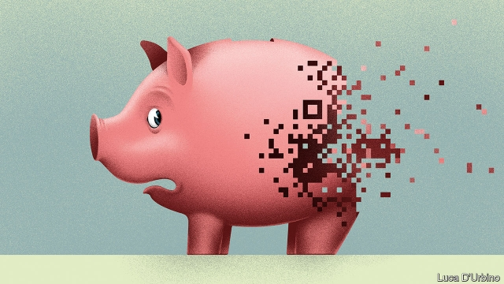

###### Banking services

# Tech’s raid on the banks 

##### Digital disruption is coming to banking at last 

 

> May 2nd 2019 

OVER THE past two decades people across the world have seen digital services transform the economy and their lives. Taxis, films, novels, noodles, doctors and dog-walkers can all be summoned with a tap of a screen. Giant firms in retailing, carmaking and the media have been humbled by new competitors. Yet one industry has withstood the tumult: banking. In rich countries it is perfectly normal to queue in branches, correspond with your bank by post and deposit cheques stamped with the logo of firms founded in the 19th century. 

Yet, as our special report this week explains, technology is at last shaking up banking. In Asia payment apps are a way of life for over 1bn users. In the West mobile banking is reaching critical mass—49% of Americans bank on their phones—and tech giants are muscling in. Apple unveiled a credit card with Goldman Sachs on March 25th. Facebook is proposing a payments service to let users buy tickets and settle bills (see article). 

The implications are profound because banks are not ordinary firms. It is one thing for Blockbuster Video to be wiped out by a technological shift, but quite another if the victim is Bank of America. It is not just that banks have over $100trn of assets globally. Using the difficult trick of “maturity transformation” (turning deposits that you can demand back at any time into long-term loans) they enable savers to defer consumption and investment and borrowers to bring them forward. Banks are so vital that the economy reels when they stumble, as the crisis of 2008-09 showed. 

Bankers and politicians may thus be tempted to resist technological change. But that would be wrong because its benefits—a leaner, more user-friendly and more open financial system—easily outweigh the risks. 

Banking is late to the smartphone age because entrepreneurs have been put off by regulations. And, since the financial crisis, Western banks have been preoccupied with repairing their balance-sheets and old-fashioned cost-cutting. Late is better than never, however. Several new business models are emerging. In Asia payment apps are bundled with e-commerce, chat and ride-hailing services offered by firms such as Alibaba and Tencent in China and Grab in South-East Asia. These networks link to banks but are vying to control the customer relationship. In America and Europe big banks are still more or less in control and are rushing to offer digital products—JPMorgan Chase can open a deposit account in five minutes. But threats loom. Mobile-only “neobanks” that do not bear the cost of branches are nibbling at customer bases. Payments firms like PayPal work with Western banks but are expected to capture a greater share of profits. Lucrative niches like foreign exchange and asset management are being harried by new entrants. 

The pace of change will accelerate. Younger people no longer stay with the same bank as their parents—15% of British 18- to 23-year-olds use a neobank. Tech firms that people trust, such as Apple and Amazon, are natural candidates to grow big financial arms. The biggest four American banks are spending a total of over $25bn a year on perfecting better customer applications and learning to mine data more cleverly. Venture-capital firms invested $37bn in upstart financial firms last year. 

The benefits of technological change are likely to be vast. Costs should tumble as branches are shut, creaking mainframe systems retired and bureaucracy culled. If the world’s listed banks chopped expenses by a third, the saving would be worth $80 a year for every person on Earth. In 2000 the Netherlands had more bank branches per head than America; it now has just a third as many. Rotten service will improve—it is easier to get money to a friend using a chat app than it is to ask your bank to transfer cash. The system will get better at its vital job of allocating capital. Richer data will allow banks to take risks that currently baffle underwriters. Fraud should be easier to spot. Lower costs and the democratising effect of social media will give more people better access to finance. And more firms with good ideas should be able to get loans faster, boosting growth. 

Yet change also poses risks. Because the financial system is embedded in the economy, innovation tends to create turbulence. The credit card’s arrival in 1950 revolutionised shopping but also sparked America’s consumer-debt culture. Securitisation lubricated capital markets in the 1980s but fuelled the subprime crisis. In addition, it is unclear who will win today’s battle. One dystopian scenario is that power becomes more concentrated, as a few big banks learn to exploit data as ruthlessly as social-media firms do. Imagine a crossbreed of Facebook and Wells Fargo that predicts and manipulates how customers behave and is able to use proprietary economic data to squeeze rivals. 

Another dystopia involves fragmentation and destabilisation. Banks could lose depositors to untested neobanks, creating a mismatch between their assets and liabilities that could lead to a credit crunch. If bank customers transact via tech or payment platforms, banks could end up with huge balance-sheets but without a direct connection to their clients. If they thus became unprofitable, they could be broken up, with the job of financing mortgages and absorbing short-term savings left entirely to capital markets, which are volatile. 

To tap the benefits of technology safely, governments should give consumers control over their data, protecting privacy and preventing firms hoarding information. Innovation-friendly regulation would help; in 2017 the industry faced a regulatory alert every nine minutes (see article). And governments should keep the system’s safety buffers at today’s overall size (global banks hold $7trn of core capital). If new entrants are properly capitalised, central banks could extend to them the lender-of-last-resort facilities that provide shelter in a storm. 

Banking’s dirty secret is that it is backward, inefficient and hidebound. Banks have formidable lobbying power, however. Wary of change, customers, politicians and unions complain when branches are closed and jobs cut—witness the recent collapse of a German mega-merger that depended on both. Regulators love dealing with a few big firms. The thing is that global growth is sluggish and productivity gains are hard to come by. A smartphone revolution in finance offers one of the best ways to boost the economy and spread the benefits. 

-- 

 单词注释:

1.disruption[dis'rʌpʃәn]:n. 分裂, 崩溃, 瓦解 

2.summon['sʌmәn]:vt. 召唤, 召集, 号召, 振奋, 唤起, 鼓起 [经] 传唤, 传讯 

3.carmaking[]:[网络] 汽车制造 

4.logo['lәugәu]:n. 连合活字, 商标, 徽标 [计] 徽标 

5.APP[]:[计] 应用, 应用程序; 相联并行处理器 

6.tech[tek]:n. 技术学院或学校 

7.unveil[.ʌn'veil]:vt. 揭开, 揭幕, 除去...的面纱 vi. 显露, 除去面纱 

8.goldman[]:n. 高曼（姓氏） 

9.Sachs[zaks]:n. 萨克斯（汽车零配件生产厂商） 

10.facebook[]:n. 脸谱网 

11.profound[prә'faund]:a. 极深的, 深厚的, 深刻的, 渊博的 

12.blockbuster['blɒkbʌstә]:n. 巨型炸弹 

13.technological[.teknә'lɒdʒikl]:a. 技术的 [经] 工艺的, 技术的 

14.asset['æset]:n. 资产, 有益的东西 

15.globally[]:[计] 全局地 

16.maturity[mә'tjuәriti]:n. 成熟, 完备, 到期 [医] 成熟, 成熟期, 发育期 

17.saver['seivә]:n. 节省...的器具, 节约装置, 省俭的人 [化] 回收器; 收集器 

18.defer[di'fә:]:vi. 推迟, 延期, 听从 vt. 使推迟, 使延期 

19.borrower['bɒrәuә]:n. 借用人, 剽窃者 [经] 借款人, 借用人 

20.banker['bæŋkә]:n. 银行家, 庄家 [经] 银行业者, 银行家 

21.outweigh[.aut'wei]:vt. 比...重, 比...重要, 比...有价值 

22.smartphone[]:n. 智能手机 

23.entrepreneur[.ɒntrәprә'nә:]:n. 企业家, 主办人 [经] 承包商, 企业家 

24.preoccupy[pri:'ɒkjupai]:vt. 抢先占领, 使全神贯注 

25.alibaba[]:n. 阿里巴巴（公司名） 

26.Tencent[]:[网络] 腾讯；腾讯公司；腾讯控股 

27.grab[græb]:n. 抓握, 掠夺, 强占, 东方沿岸帆船 vi. 抓取, 抢去 vt. 攫取, 捕获, 霸占 

28.vie[vai]:vi. 争, 竞争, 争胜 vt. 提出...来竞争, 以...作较量 

29.les[lei]:abbr. 发射脱离系统（Launch Escape System） 

30.loom[lu:m]:n. 织布机, 若隐若现的景象 vi. 朦胧地出现, 隐约可见, 可怕地出现 

31.nibble['nibl]:n. 少量食物, 细咬, 轻咬, 啃 v. 一点一点地咬, 细咬, 吹毛求疵 [计] 半字节 

32.paypal[]:n. 贝宝（全球最大的在线支付平台） 

33.lucrative['lu:krәtiv]:a. 有利益的, 获利的, 合算的 

34.nich[]:abbr. 新生儿颅内出血（neonatal intracranial hemorrhage） 

35.harry['hæri]:vt. 掠夺, 使苦恼, 强使前行, 折磨, 骚扰 

36.entrant['entrәnt]:n. 新会员, 新成员, 进入者 

37.tech[tek]:n. 技术学院或学校 

38.amazon['æmәzɒn]:n. 亚马孙河 [医] 无乳腺者 

39.datum['deitәm]:n. 论据, 材料, 资料, 已知数 [医] 材料, 资料, 论据 

40.cleverly[]:adv. 聪明地, 全然, 完全, 巧妙地 

41.upstart['ʌpstɑ:t]:n. 新贵, 暴发户, 自命不凡者 a. 暴富的 

42.creak[kri:k]:n. 辗轧声, 嘎吱嘎吱声 vi. 作辗轧声, 发出辗轧声 

43.mainframe['meinfreim]:n. 主机 [电] 主机 

44.bureaucracy[bjuә'rɒkrәsi]:n. 官僚, 官吏 [法] 官僚主义, 官僚政治, 官僚机构 

45.cull[kʌl]:vt. 采, 摘, 拣 n. 拣出的等外品, 被剔出的动物 

46.Netherlands['neðәlәndz]:n. 荷兰 

47.currently['kʌrәntli]:adv. 现在, 当前, 一般, 普通 [计] 当前 

48.baffle['bæfl]:vt. 困惑, 为难, 使挫折 vi. 徒作挣扎 n. 迷惑, 挡板 

49.underwriter['ʌndә.raitә]:n. 保险业者, 证券包销者 [法] 承保人, 保险人, 保险商 

50.fraud[frɒ:d]:n. 欺骗, 欺诈, 诡计, 骗子 [经] 欺诈, 舞弊, 骗子 

51.democratise[di'mɔkrәtaiz]:v. <主英> = democratize 

52.embed[im'bed]:vt. 使插入, 使嵌入, 使深留脑中 [计] 嵌入 

53.innovation[.inәu'veiʃәn]:n. 改革, 创新 [法] 创新, 改革, 刷新 

54.turbulence['tә:bjulәns]:n. 混乱, 动荡, 骚乱, 紊流 [化] 湍流; 紊流 

55.revolutionise[,revә'lju:ʃənaiz]:vt. 使革命化, 彻底改革, 彻底改变 

56.securitisation[si,kjurətai'zeiʃən]:n. 证券化 

57.subprime[ˌsʌb'praɪm]:a. 准一流的, 近乎头等的; 准最低贷款利率的 

58.unclear[.ʌn'kliә]:a. 不易了解的, 不清楚的, 含混的 

59.dystopian[dis'tәjpiәn]:a. 反面乌托邦的,反面假想国的  n. 反面乌托邦的鼓吹者(或描写者) 

60.scenario[si'nɑ:riәu]:n. 剧本提纲, 情节, 剧本, 方案, 事态 [计] 方案 

61.ruthlessly['ru:θləslɪ]:adv. 无情地, 冷酷地, 残忍地 

62.crossbreed['krɒ:sbri:d]:n. 杂种 v. 异种交配, 培育杂种, (使)杂交 

63.fargo['fɑ:ɡəu]:n. 法戈（美国北达科他州东南部城市） 

64.manipulate[mә'nipjuleit]:vt. 操纵, 利用, 操作, 巧妙地处理, 假造 

65.proprietary[prә'praiәtәri]:a. 所有者的, 所有权的, 私有的 n. 所有者, 业主, 所有权 

66.dystopia[dis'tәupiә]:n. 非理想化的地方 [医] 异位, 错位 

67.fragmentation[.frægmәn'teiʃәn]:n. 分裂, 破碎 [计] 在IP层将打包文件切成适当大小的程序 

68.destabilisation[di:,steibilai'zeiʃən; -li'z-]:n. destabilise的变形 

69.depositor[di'pɒzitә]:n. 存放者, 存款人 [经] 存款人, 储户, 委托人 

70.untested[ʌn'testid]:a. 未经试验的, 未经考验的 

71.mismatch[mis'mætʃ]:n. 错配 vt. 错配, 使...成不相配的婚姻 

72.liability[laiә'biliti]:n. 责任, 债务, 倾向 [经] 责任, 义务, 负债 

73.crunch[krʌntʃ]:v. 嘎吱嘎吱的咬嚼, 压碎, 嘎吱嘎吱地踏过 n. 咬碎, 咬碎声 

74.transact[træn'sækt]:vt. 办理, 处理 vi. 作交易, 谈判 

75.client['klaiәnt]:n. 客户, 顾客, 委托人 [计] 客户, 客户机, 客户机程序 

76.unprofitable[.ʌn'prɒfitәbl]:a. 无利益的, 不赚钱的, 不上算的 [法] 无利可图的, 无益的 

77.mortgage['mɒ:gidʒ]:n. 抵押, 约束性义务, 抵押借款 vt. 抵押, 以...作担保, 把...许给 

78.entirely[in'taiәli]:adv. 完全, 全然, 一概 

79.volatile['vɒlәtail]:a. 挥发性的, 可变的, 不稳定的, 飞行的, 轻快的, 爆炸性的 n. 有翅动物, 挥发物 [计] 易失的 

80.privacy['praivәsi]:n. 隐私, 隐居, 秘密 [计] 个人保密权 

81.hoard[hɒ:d]:n. 贮藏物, 密藏的金钱 v. 囤积, 贮藏 

82.regulatory['regjulәtәri]:a. 受控制的, 统制的, 调整的 [经] 规则的 

83.buffer['bʌfә]:n. 缓冲器, 缓冲区 vt. 缓冲 [计] 缓冲区, 缓冲器 

84.capitalise['kæpitәlaiz]:vt. 用大写字母写, 用大写字母印, 投资于, 使变为资本, 提供资本给 vi. 利用 

85.hidebound['haidbaund]:a. 思想偏狭顽固的, 死板的, 量小的 [医] 绷紧的, 包紧的(皮肤) 

86.formidable['fɒ:midәbl]:a. 巨大的, 优秀的, 可怕的, 艰难的 

87.lobby['lɒbi]:n. 大厅, 休息室, 游说议员者 vi. 游说议员, 游说 vt. 游说 

88.wary['wєәri]:a. 谨慎的, 小心的, 机警的, 周到的, 唯恐的 

89.regulator['regjuleitә]:n. 调整者, 校准者, 校准器, 调整器, 标准钟 [化] 调节剂; 调节器 

90.sluggish['slʌgiʃ]:a. 偷懒的, 懒惰的, 迟钝的 [经] 萧条的, 呆滞的 

91.productivity[.prәudʌk'tiviti]:n. 生产力 [经] 生产率, 生产能力 

