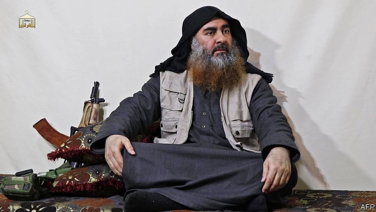

###### Crisis in the Sahel

# The West is fighting a forgotten war against jihadists in Africa 

##### It is too soon to bring the troops back home 

 

> May 2nd 2019 

LOOKING SOMEWHAT dishevelled and sometimes confused, the leader of Islamic State (IS), Abu Bakr al-Baghdadi, issued his first video message in five years on April 29th. His tone was mostly gloomy. His followers have been vanquished in battle. His “caliphate” in Iraq and Syria lost its last bit of territory in March. Yet the fanatic who popularised beheading videos also offered his followers some hope. He welcomed the recent pledges of allegiance to IS from jihadist groups in Mali and Burkina Faso, and singled out for praise Abu Walid al-Sahrawi, the leader of Islamic State in the Greater Sahara. The front line of the jihadists’ war against everyone else has moved to Africa. 

Last year almost 10,000 people, mostly civilians, were killed in jihadist-related violence in Africa. That is almost as many as were killed in conflict with jihadists in Iraq and Syria. The number of Western and allied troops battling jihadists in Africa may also soon surpass those fighting them elsewhere. On any given day America’s armed forces have about 7,000 people deployed on the continent. France has perhaps 4,500 in the Sahel. Throw in Germany and Italy, each with almost 1,000, and allies such as Canada, Spain, Estonia and Denmark, and the number surpasses the 14,000 Americans in Afghanistan. 

The conflict is spread across a broad expanse of Africa, from Somalia in the east to the Atlantic Ocean in the west. It is concentrated in some of the poorest countries on Earth, where it is fuelled by bad governance. Some of these states barely control much of their own supposed territory. Many jihadist recruits come from ethnic minorities, such as the Fulani, who see officials as alien and predatory. Many join up after being beaten or robbed by police. Global warming, meanwhile, has withered pastures, intensifying conflict over land. 

These pressures are most keenly felt in the Sahel, on the southern fringe of the Sahara desert. In Mali, Burkina Faso and Niger the number of people killed by jihadists has doubled in each of the past two years, to more than 1,100 in 2018. In the Sahel as a whole, some 5,000 have been killed in the past five months. In the area around Lake Chad some 2.4m people have fled from attacks by Boko Haram, a group that straps bombs to children. The number of jihadist groups in the Sahel has multiplied, from one in 2012 to more than ten at the last count by America’s defence department. 

The jihadists have deftly prised open pre-existing fracture lines. The mayhem is metastasising into a broader conflict between ethnic militias, farmers and herders. In many cases jihadists have started a cycle of tit-for-tat killings by attacking villages and provoking reprisals by militias. In March a militia hacked, shot and burned over 170 Fulani men, women and children to death in central Mali, in apparent revenge for an attack on the army by jihadists. In Burkina Faso in January a militia killed about 210 people in and around Yirgou, a desert village. 

Sahelian governments deserve much of the blame for all this bloodshed (see article). Several have supported ethnic militias, which they see as a cheap, arm’s-length way of killing jihadists and their supporters. This tactic has backfired. The militias are so brutal and ill-disciplined that they almost certainly increase support for the jihadists. The conflict could break apart fragile states, displacing millions of people. 

The jihadist African insurgency has too many deep-seated causes to be put down easily or fast. All the more reason, therefore, to get some essential things right. Governments in the Sahel should start by disarming the militias. At the same time, they could work harder to curb corruption and human-rights abuses by their armies and police forces. Since economic growth would foster stability, they should also open up to investment and improve infrastructure such as roads, ports and power. 

Given the potential for African jihadism to spread attacks abroad, outsiders have an interest, too. America, under Donald Trump, revealed plans last year to reduce its forces in Africa by 10%. That is premature. Western troops will be needed in the region for years, training and supporting local forces. Military support should aim to go hand in hand with democratisation and economic reform—rather than propping up regimes whose corruption sparked unrest in the first place. 

Like the cold war before it, the struggle against those who take up arms in pursuit of an imaginary Islamist Utopia will probably last for decades. And as in the struggle against communism, winning hearts and minds will be the key to victory. 

-- 

 单词注释:

1.Sahel['sɑ:hel]:荒漠草原(西非) 

2.jihadist[]:n. 伊斯兰圣战士 

3.dishevel[di'ʃevl]:vt. 使蓬乱, 使头发凌乱 

4.Islamic[iz'læmik]:a. 伊斯兰教的, 穆斯林的 

5.abu[]:abbr. 亚洲广播联盟（Asian Broadcast Union） 

6.bakr[]:n. (Bakr)人名；(阿拉伯、孟)贝克尔 

7.follower['fɒlәuә]:n. 从者, 属下, 追补者 [电] 随动机 

8.vanquish['væŋkwiʃ]:vt. 打败, 征服, 克服 [法] 征服, 战胜, 击败 

9.caliphate['kælifeit]:n. 伊斯兰教国王的职权或其领域 

10.Iraq[i'rɑ:k]:n. 伊拉克 

11.Syria['siriә]:n. 叙利亚 [经] 叙利亚 

12.fanatic[fә'nætik]:n. 狂热者, 盲信 a. 狂热的, 盲信的 

13.popularise['pɔpjjlәraiz]:vt.vi. 使通俗化, 使受欢迎, 使大众化, 使普及, 宣传, 推广 

14.behead[bi'hed]:vt. 斩首, 砍头 

15.pledge[pledʒ]:n. 诺言, 保证, 誓言, 抵押, 信物, 保人, 祝愿 vt. 许诺, 保证, 使发誓, 抵押, 典当, 举杯祝...健康 

16.allegiance[ә'li:dʒәns]:n. 忠贞, 效忠 

17.Mali['mɑ:li]:n. 马里 

18.burkina[]:[网络] 布基纳法索；布加纳法索；布基纳法索地图 

19.Faso[]:n. (Faso)人名；(意)法索 

20.walid[]:[网络] 瓦利德；华利德；里德 

21.Sahara[sә'hɑ:rә]:n. 撒哈拉沙漠 

22.ally['ælai. ә'lai]:n. 同盟者, 同盟国, 助手 vt. 使联盟, 使联合, 使有关系 vi. 结盟 

23.surpass[sә'pɑ:s]:vt. 超越, 凌驾, 胜过 

24.deploy[di'plɒi]:v. 展开, 配置 

25.Spain[spein]:n. 西班牙 

26.Estonia[es'tәuniә]:n. 爱沙尼亚 

27.Denmark['denmɑ:k]:n. 丹麦 

28.Afghanistan[æf'gænistæn]:n. 阿富汗 

29.expanse[ik'spæns]:n. 宽阔区域, 宽阔, 天空 

30.Somalia[sәu'mɑ:liә]:n. 索马里 

31.governance['gʌvәnәns]:n. 统治, 统辖, 管理 [法] 统治, 管理, 支配 

32.ethnic['eθnik]:a. 人种的, 种族的 [医] 人种的 

33.Fulani['fu:lɑ:ni]:富拉尼人(即富尔贝人) 

34.alien['eiljәn]:n. 外国人, 外侨 a. 外国的, 相异的 

35.predatory['predәtәri]:a. 掠夺成性的, 捕食生物的, 掠夺的 [医] 捕食的 

36.wither['wiðә]:vt. 使凋谢, 使消亡, 使畏缩 vi. 枯萎, 衰退 

37.pasture['pæstʃә]:n. 牧场, 草地, 牧草 vt. 放牧 vi. 吃草 

38.intensify[in'tensifai]:vt. 加强 vi. 强化 

39.keenly['ki:nli]:adv. 锐利地, 敏捷地, 激烈地 

40.fringe[frindʒ]:n. 边缘, 端, 流苏, 穗, 初步 vt. 加穗于, 加饰边于 a. 边缘的, 附加的 

41.Niger['naidʒә]:n. 尼日尔 [化] 皂脚 

42.Chad[tʃæd]:n. 乍得 [计] 孔屑 

43.boko['bәukәu]:n. <英俚>鼻子 

44.haram['heәrәm]:n. (=harem)(伊斯兰教徒)女眷居住的内室,闺房, (伊斯兰教徒的)女眷,共配一雄的一群雌性动物 

45.deftly[]:adv. 灵巧地；熟练地；敏捷地 

46.prise[praiz]:vt. 撬, 撬开, 撬动 

47.fracture['fræktʃә]:n. 破碎, 骨折 v. (使)破碎, (使)破裂 

48.mayhem['meihem]:n. 蓄意的破坏, 故意的伤害罪 [医] 伤残, 残废 

49.metastasise[mə'tæstəsaiz]:vi. [英国英语] = metastasize 

50.militia[mi'liʃә]:n. 义勇军, 民兵组织, 国民军 

51.herder['h\\:dә(r)]:n. 牧人, (美)(非正式)监狱看守 [计] 首部, 首标, 标题, 头标, 报头, 管座, 端板 

52.killing['kiliŋ]:n. 谋杀, 杀戮 a. 杀害的, 疲惫的, 迷人的 

53.provoke[prә'vәuk]:vt. 激怒, 惹起, 诱导 [法] 刺激, 煽动, 激怒 

54.reprisal[ri'praizl]:n. 报复, 报仇, 报复性劫掠 [法] 复仇, 报复, 报复性暴力为 

55.hack[hæk]:n. 劈, 砍, 砍痕, 出租车, 干咳, 晒架, 鹤嘴锄 vt. 劈, 砍, 出租, 用旧 vi. 劈, 砍, 干咳, 驾驶出租车 a. 出租的 

56.Sahelian[sә'heiliәn,-'hi:-]:a. 萨赫勒地区的 

57.bloodshed['blʌdʃed]:n. 流血 

58.supporter[sә'pɒ:tә]:n. 支持者, 后盾, 迫随者, 护身织物 [法] 支持者, 赡养者, 抚养者 

59.tactic['tæktik]:n. 一项战术, 一条策略 a. 战术的, 顺序的, 排列的 

60.backfire[.bæk'faiә]:n. 逆火, 回火, 放火 vi. 放逆火, 预先放火, 发生意外 

61.brutal['bru:tәl]:a. 残忍的, 野蛮的, 不讲理的 

62.displace[dis'pleis]:vt. 移置, 替换, 转移 

63.insurgency[in'sә:dʒәnsi]:n. 叛乱状态, 发生暴动 [法] 暴动, 起义, 叛乱 

64.disarm[dis'ɑ:m]:vt. 解除武装, 裁军, 缓和 vi. 放下武器 

65.curb[kә:b]:n. 抑制, 勒马绳, 边石 vt. 抑制, 束缚, 勒住 

66.corruption[kә'rʌpʃәn]:n. 腐败, 堕落, 贪污 [计] 论误 

67.foster['fɒstә]:a. 收养的, 养育的 vt. 养育, 抚育, 培养, 鼓励, 抱(希望) 

68.infrastructure['infrәstrʌktʃә]:n. 基础结构, 基础设施 [经] 基础设施 

69.jihadism[]:[网络] 圣战主义；吉哈德主义；杰哈德主义 

70.outsider[' aut'saidә]:n. 外人, 局外人, 非会员, 外行, 门外汉, 比赛中获胜可能性不大的选手 [经] 外船公司 

71.premature[.premә'tjuә]:a. 早产的, 过早的, 不成熟的 n. 早产儿, 过早发生的事物 

72.democratisation[]:民主化 

73.prop[prɒp]:n. 支柱, 支持者, 倚靠人, 道具, 螺旋桨 vt. 支撑, 维持 

74.regime[rei'ʒi:m]:n. 政权, 当权期间, 政体, 社会制度, 体制, 情态 [医] 制度, 生活制度 

75.Islamist[iz'lɑ:mist]:n. 伊斯兰教主义者；回教教徒 

76.Utopia[ju:'tәupiә]:n. 乌托邦, 理想国 

