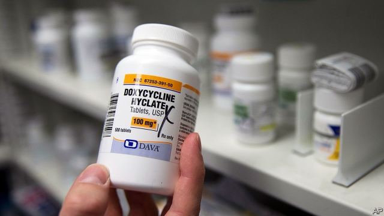

###### Netflix and pills

# The antibiotic industry is broken 

##### Take inspiration from the entertainment industry 

 

> May 2nd 2019 

A WORLD WITHOUT antibiotics is horrible to contemplate. They underpin much of modern medicine and are essential for patients undergoing chemotherapy for cancer, organ transplants or common surgeries such as caesarean sections. Yet the global rise of antimicrobial resistance, exemplified by the spread of Candida auris—the latest infection terrorising hospitals—and super-resistant gonorrhoea, is alarming. Resistance could kill 10m people a year by 2050, up from 700,000 today. This week a UN commission recommended immediate and co-ordinated action to avoid a calamity whose economic cost, the World Bank reckons, could rival that of the financial crisis of 2008-09. 

That the pharmaceutical market does not always work well is hardly news. It has failed to develop many kinds of drugs, including new vaccines and treatments for diseases that mainly afflict the poor. But when it comes to antibiotics, matters are particularly bad. To prevent microbes from developing resistance to them, novel antibiotics tend to be reserved for use by doctors as a last line of defence and used for short periods. Hence volumes are meagre. That would not matter if prices were high. But unlike new drugs for cancer or rare diseases, prices of antibiotics are kept low in many countries, creating little incentive for drug companies to develop new ones. As a result, investors avoid new antibiotic firms and are fearful that they will run out of cash. The recent bankruptcy of Achaogen, a biotech firm, suggests they are right to fret (see article). Big drug companies have largely bowed out of the game. 

Governments and charities have scrambled to stimulate activity by putting money into basic research, giving grants to drugs startups and taking equity stakes in them, but that has not been enough. Bringing a drug from the laboratory to the clinic typically takes a decade and costs around $1bn. A more extreme option would be to nationalise antibiotic production, but that would only cause private-sector innovation to shrivel even further. Instead, stimulating the development of new antibiotics requires governments to embrace two ideas. 

 

The first is that the antibiotics business needs to offer the prospect of decent profits. Asking people to pay more for drugs at a time of public outrage over the cost of medicines, from insulin to cystic-fibrosis treatments, is hard. But there are already moves in this direction. In America Medicare is paying more for some new antibiotics. And Britain’s notoriously tight-fisted drug-reimbursement agency has agreed to look at how its method for assessing value can be adjusted to incorporate the broader societal benefits of having a new antibiotic. 

The second idea is to accept some unusual new ways to generate those higher profits, other than selling by the dose. Economists, including Jim O’Neill, have recommended that “market entry” prizes of $1bn or more should go to drugmakers that launch the most valuable new antibiotics. Split between G20 countries, a prize kitty even ten times as large would be affordable—and value for money. 

But the most promising idea is for drugs firms to change how they charge governments and health insurers for antibiotics, by switching to a Netflix-style subscription model. Just as Netflix subscribers pay the same each month, whether they binge-watch boxsets all day or watch nothing at all, so health-care providers would pay a flat rate for access to an antibiotic, regardless of the volume. When the drug is new and being saved as a last line of defence, the drugs company still gets paid. And if the antibiotic has to be more widely used, the price does not go up. It may sound crazy, but subscriptions are already being tried in America to pay for hepatitis C drugs. Using this model for antibiotics can square the circle of incentivising drugs companies to develop a treatment that doctors will then try to use as little as possible. 

This will not solve antibiotic resistance all on its own. Reducing the misuse of existing antibiotics, in medicine and agriculture, is also necessary. And more could be done to improve sanitation and processes, in hospitals and elsewhere, to minimise the risk of infection in the first place. Fixing the pricing model is not a silver bullet, then. But it is a vital part of the answer. 

-- 

 单词注释:

1.netflix[]:n. 全球十大视频网站中唯一收费站点 

2.antibiotic[.æntibai'ɒtik]:n. 抗生素 a. 抗生的 

3.inspiration[.inspә'reiʃәn]:n. 灵感, 鼓舞人心的人或物, 妙计, 吸气 [医] 吸[气] 

4.contemplate['kɒntempleit]:vt. 注视, 沉思, 盘算 vi. 冥思苦想 

5.underpin[.ʌndә'pin]:vt. 从下面支承, 支撑, 支持 [经] 支撑 

6.chemotherapy[.kemәu'θerәpi]:n. 化学疗法 [化] 化学疗法 

7.Caesarean[si'zєәriәn]:a. 恺撒的, 帝国的 n. 专制独裁者 

8.antimicrobial[,æntimai'krәubiәl]:a. 抗菌的 n. 抗菌剂 

9.exemplify[ig'zemplifai]:vt. 例证, 例示 [法] 制作经公章证明的誊本, 例证 

10.Candida['kændidә]:[医] 念珠菌属 

11.infection[in'fekʃәn]:n. 传染, 影响, 传染病 [医] 传染, 感染 

12.terrorise['terәraiz]:vt. 使恐怖, 恐吓, 威胁, 胁迫 vi. 引起恐怖, 实行恐怖统治 

13.gonorrhoea[,^ɔnә'ri:ә]:n. 淋病 

14.UN[ʌn]:pron. 家伙, 东西 [经] 联合国 

15.calamity[kә'læmiti]:n. 灾难, 不幸事件 

16.reckon['rekәn]:vt. 计算, 总计, 估计, 认为, 猜想 vi. 数, 计算, 估计, 依赖, 料想 

17.pharmaceutical[,fɑ:mә'sju:tikәl]:a. 药学的, 制药的, 药用的, 药物的, 药剂师的, 药师的 n. 药品, 成药, 药剂 

18.alway['ɔ:lwei]:adv. 永远；总是（等于always） 

19.vaccine['væksi:n]:n. 牛痘苗, 疫苗 a. 疫苗的, 牛痘的 

20.afflict[ә'flikt]:vt. 使苦恼, 折磨 

21.microbe['maikrәub]:n. 微生物, 细菌 [医] 微生物 

22.meagre['mi:^ә(r)]:a. 瘦的, 不毛的, 贫乏的, 贫弱的, 少量的, 力量不够的, 质不高的, 量不足的 

23.incentive[in'sentiv]:n. 动机 a. 激励的 

24.investor[in'vestә]:n. 投资者 [经] 投资者 

25.bankruptcy['bæŋkrәptsi]:n. 破产者 [经] 破产, 倒闭 

26.biotech['baɪəʊtek]:n. 生物技术 

27.fret[fret]:n. 烦躁, 磨损, 焦急, 网状饰物 vi. 烦恼, 不满, 磨损 vt. 使烦恼, 腐蚀, 使磨损, 使起波纹 

28.scramble['skræmbl]:n. 攀缘, 爬行, 抢夺, 混乱, 紧急起飞 vi. 攀缘, 杂乱蔓延, 争夺, 拼凑, 匆忙 vt. 攀登, 扰乱, 使混杂 

29.startup[]:[计] 启动 

30.equity['ekwiti]:n. 公平, 公正 [经] 权益, 产权 

31.typically['tipikәli]:adv. 代表性地；作为特色地 

32.nationalise['næʃәnәlaiz]:vt. 把...收归国有, 使具有某国国籍, 使国有化 

33.innovation[.inәu'veiʃәn]:n. 改革, 创新 [法] 创新, 改革, 刷新 

34.shrivel['ʃrivl]:v. (使)起皱纹, (使)枯萎, (使)束手无策 

35.outrage['autreidʒ]:n. 暴行, 侮辱, 愤怒 vt. 凌辱, 虐待, 触犯 

36.insulin['insjulin]:n. 胰岛素 [化] 胰岛素 

37.medicare['medi,keә]:n. 医疗照顾方案, 医疗照顾项目 [法] 公办的医疗保险制 

38.notoriously[]:adv. 臭名昭著的, 声名狼藉的 

39.incorporate[in'kɒ:pәreit]:a. 合并的, 组成公司的, 一体化的 vt. 吸收, 合并, 使组成公司, 体现 vi. 合并, 混合, 组成公司 

40.societal[sә'saiәtl]:a. 社会的 

41.economist[i:'kɒnәmist]:n. 经济学者, 经济家 [经] 经济学家 

42.jim[dʒim]:n. 吉姆（人名） 

43.drugmaker['drʌ^,meikә(r)]:制药者 

44.kitty['kiti]:n. 小猫, 全部赌注 

45.insurer[in'ʃuәrә]:n. 保险公司 [法] 保险人, 承保人, 保险公司 

46.subscription[sәb'skripʃәn]:n. 捐献, 订金, 订阅, 签署, 同意 [化] 订购 

47.subscriber[sʌbs'kraibә]:n. 签署者, 捐献者, 订户 [经] 定户 

48.boxsets[]:[网络] 礼盒；盒装；套装精选辑 

49.provider[prә'vaidә]:n. 供应者, 供养人, 伙食承办人 [计] 提供器 

50.hepatitis[.hepә'taitis]:n. 肝炎 [医] 肝炎 

51.C[si:]:[计] 调用, 访问, 呼叫；电容, 进位, 通道, 字符, 清除, 常数, 控制, 周期；C 程序设计语言 [化] 碳的化学符号; 胞苷 

52.incentivising[]:[网络] 激励 

53.misuse[.mis'ju:z]:n. 误用, 滥用 vt. 误用, 滥用, 虐待 

54.sanitation[sæni'teiʃәn]:n. (环境)卫生, 环境卫生的提倡/维持, 卫生设备, 下水道设施, 卫生设施 [医] 环境卫生 

55.minimise[]:vt. 使减到最少/最小, 使降到最低限度, 使缩到最小, 极度轻视 

