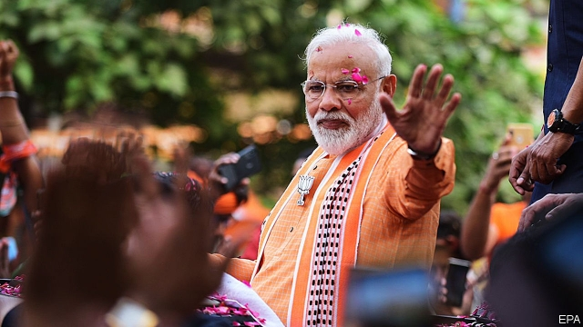

###### Agent orange

# Under Narendra Modi, India’s ruling party poses a threat to democracy 

##### Voters should turf it out, or at least force it to govern in coalition 

 

> May 2nd 2019 

WHEN THE Bharatiya Janata Party (BJP) won a landslide victory in India’s general election in 2014, its leader, Narendra Modi, was something of a mystery. Would his government initiate an economic lift-off, as businessfolk hoped, or spark a sectarian conflagration, as secularists feared? In his five years as prime minister, Mr Modi has been neither as good for India as his cheerleaders foretold, nor as bad as his critics, including this newspaper, imagined. But today the risks still outweigh the rewards. Indians, who are in the midst of voting in a fresh election (see article), would be better off with a different leader. 

Mr Modi is campaigning as a strongman with the character to stand up to Pakistan for having abetted terrorism. In fact, sending warplanes to bomb India’s nuclear neighbour earlier this year was not so much an act of strength as recklessness that could have ended in disaster. Mr Modi’s tough-guy approach has indeed been a disaster in the disputed state of Jammu & Kashmir, where he has inflamed a separatist insurgency rather than quelling it, while at the same time alienating moderate Kashmiris by brutally repressing protests. 

This impetuousness disguised as decisiveness has infected economic policymaking, too. In 2016 Mr Modi abruptly cancelled most Indian banknotes in an effort to thwart money-laundering. The plan failed, but not without causing huge disruption to farmers and small businesses. He has pushed through a nationwide sales tax and an overhaul of the bankruptcy code, two much-needed reforms. But the economy has grown only marginally faster during his tenure than it did over the previous ten years, when the Congress party was in government, despite receiving a big boost from low oil prices. Unemployment has risen, breaking promises to the contrary. 

Indians hear such criticisms less often because Mr Modi has cowed the press, showering bounty on flatterers while starving, controlling and bullying critics. He himself appears only at major events. He has also suborned respected government institutions, hounding the boss of the central bank from office, for example, as well as loosing tax collectors on political opponents, packing state universities with ideologues and cocking a snook at rules meant to insulate the army from politics. 

Mr Modi’s biggest fault, however, is his relentless stoking of Hindu-Muslim tensions. He personally chose as chief minister of Uttar Pradesh, India’s most populous state, a fiery Hindu cleric who paints the election campaign as a battle between the two faiths. Mr Modi’s number two calls Muslim migrants from neighbouring Bangladesh “termites”, but promises a warm welcome to Bangladeshi Hindus. One of the BJP’s candidates is on trial for helping orchestrate a bombing that killed six Muslims. And Mr Modi himself has never apologised for failing to prevent the deaths of at least 1,000 people, most of them Muslims, during sectarian riots in the state of Gujarat while he was chief minister there. The closest he has come has been to express the sort of regret you might feel “if a puppy comes under the wheel” of a car. 

This is not just despicable, it is dangerous. India is too combustible a place to be put into the hands of politicians who campaign with flamethrowers. As it is, vigilantes often beat up or lynch Muslims they suspect of harming cows, a holy animal for Hindus. Kashmiris studying in other parts of India have been set upon by angry nationalist mobs. And even if the BJP’s Muslim-baiting does not ignite any more full-scale pogroms, it still leaves 175m Indians feeling like second-class citizens. 

Congress, the BJP’s only national rival, may be hidebound and corrupt, but at least it does not set Indians at one another’s throats. It has come up with an impressive manifesto, with thoughtful ideas about how to help the poorest Indians. Its leader, Rahul Gandhi, although a much-derided dynast, has helped modernise the party a little, raising its profile on social media, for example. It is a worthier recipient of Indians’ votes than the BJP. 

With less than a tenth of the seats in parliament, Congress will not improve its showing enough to form a government on its own. If it and its regional allies do better than expected, they may just be able to cobble together a majority. But even if, as is more likely, the BJP remains in charge, it would be preferable if it were forced to govern in coalition. (The current government is technically a coalition, but since the BJP has the numbers to rule without its partners, they have little influence.) The risk is that reforms get delayed yet again—but they were not progressing quickly anyway. A degree of bickering and stasis would be a price worth paying to curb the BJP’s excesses. At the very least, coalition partners might be able to bring down a truly wayward BJP government by leaving it. 

-- 

 单词注释:

1.narendra[]:[网络] 纳伦德拉；纳兰德；纳然陀 

2.MODI['mәudai]:[计] 模块化光学数字接口 

3.voter['vәutә]:n. 选民, 投票人 [法] 选民, 选举人, 投票人 

4.turf[tә:f]:n. 草皮, 泥炭, 跑马场 vt. 覆草皮于 

5.coalition[.kәuә'liʃәn]:n. 结合体, 结合, 联合 [经] 联合, 联盟 

6.Bharatiya[]:[网络] 巴拉蒂亚 

7.Janata['dʒʌnətɑ:]:n. （印度）人民团体；人民党（印度联合政党） 

8.bjp[]: [医][=Bence Jones protein]本周（氏）蛋白，凝溶蛋白 

9.landslide['lændslaid]:n. 山崩 [化] 滑坡 

10.initiate[i'niʃieit]:n. 入会, 开始 a. 新加入的 vt. 开始, 传授基本知识给 

11.businessfolk[]:[网络] 商务人士 

12.sectarian[sek'tєәriәn]:a. 宗派的, 党派的, 偏狭的 n. 宗派成员, 闹宗派的人 

13.conflagration[.kɒnflә'greiʃәn]:n. 大火灾, 大火, 冲突 [化] 暴燃; 快速燃烧 

14.secularist['sekjulәrist]:n. 现世主义者, 宗教与教育分离论者 

15.cheerleader['tʃiәli:dә]:n. 啦啦队长 

16.foretell[fɒ:'tel]:vt. 预言, 预告, 预示 

17.outweigh[.aut'wei]:vt. 比...重, 比...重要, 比...有价值 

18.strongman[ˈstrɒŋmæn]:n. 大力士 

19.Pakistan[.pɑ:ki'stɑ:n]:n. 巴基斯坦 

20.abet[ә'bet]:vt. 教唆, 煽动, 怂恿, 帮助, 支持 

21.terrorism['terәrizm]:n. 恐怖主义, 恐怖统治, 恐怖状态 [法] 胁迫, 暴政, 恐怖政治 

22.warplane['wɒ:plein]:n. 军用飞机 

23.recklessness[]:[法] 鲁莽, 粗心大意 

24.Jammu['dʒʌmu:]:查谟(城市, 位于亚洲查谟和克什米尔的西南) 

25.Kashmir['kæʃmiә]:n. 克什米尔 

26.inflame[in'fleim]:vt. 激怒, 点火, 激起 vi. 着火, 激动, 发炎 

27.separatist['sepәreitist]:n. 分离主义者, 独立派 

28.insurgency[in'sә:dʒәnsi]:n. 叛乱状态, 发生暴动 [法] 暴动, 起义, 叛乱 

29.quell[kwel]:vt. 压制, 平息, 减轻 

30.alienate['eiljәneit]:vt. 使疏远, 离间, 转让 [法] 转让, 让与, 疏远 

31.Kashmiri[kæʃ'miәri]:n. 克什米尔语, 克什米尔人 

32.brutally[]:adv. 残忍地, 蛮横地 

33.repress[ri'pres]:vt. 镇压, 抑制, 压制 vi. 压制 

34.impetuousness[ɪm'petʃʊəsnəs]:n. 冲动; 急躁 

35.decisiveness[dɪˈsaɪsɪvnəs]: 果断性 

36.policymaking['pɔlәsi,meikiŋ]:[法] 政策制定者, 决策人 

37.abruptly[ә'brʌptli]:adv. 突然地, 唐突地 

38.banknote['bæŋknәut]:n. 钞票 

39.thwart[θwɒ:t]:a. 横放的 vt. 反对, 阻挠, 横过 prep. 横过 adv. 横过 

40.disruption[dis'rʌpʃәn]:n. 分裂, 崩溃, 瓦解 

41.overhaul[.әuvә'hɒ:l]:vt. 分解检查, 翻修, 精细检查, 彻底革新 n. 分解检查, 精细检查, 大检修 

42.bankruptcy['bæŋkrәptsi]:n. 破产者 [经] 破产, 倒闭 

43.marginally[]:adv. 记在页边, 有旁注, 边缘, 边沿地区, 边际, 限界, 勉强够格, 无关紧要, 少量 

44.tenure['tenjuә]:n. 享有, 保有期 [经] (财产,职位等的)占有, 占有权 

45.les[lei]:abbr. 发射脱离系统（Launch Escape System） 

46.bounty['baunti]:n. 慷慨, 宽大, 礼物 [经] 奖励金, 补贴 

47.flatterer['flætәrә]:n. 阿谀者, 谄媚者 

48.bully['buli]:n. 欺凌弱小者, 土霸 vt. 威胁, 恐吓, 欺负 vi. 欺负 a. 特好的, 第一流的 adv. 十分 

49.suborn[sʌ'bɒ:n]:vt. 使作伪证, 唆使, 怂恿, 收买 

50.hound[haund]:n. 猎犬 vt. 带猎犬狩猎, 追捕, 激励, 使追逐 

51.collector[kә'lektә]:n. 收集家, 收取款项的人 [化] 集电极; 捕收剂 

52.ideologue['aidi:әulɔ^]:n. 理论家, 思想家,空想家 

53.snook[snu:k. snuk]:n. [口]大拇指按鼻端, 其余四指张开以示轻蔑的手势 

54.insulate['insjuleit]:vt. 使绝缘, 隔离 [医] 绝缘 

55.politic['pɒlitik]:a. 精明的, 明智的, 策略的 

56.relentless[ri'lentlis]:a. 无情的, 冷酷的, 残酷的 

57.stoke[stәuk]:v. 司炉, (使)大吃 

58.uttar[]:[网络] 北方；乌塔茹阿；太邦 

59.Pradesh[]:邦 

60.populous['pɒpjulәs]:a. 人口多的, 人口稠密的 

61.fiery['faiәri]:a. 炽热的, 热烈的, 暴躁的 

62.Hindu['hindu:]:a. 印度教教徒的 n. 印度教教徒 

63.cleric['klerik]:a. 牧师的, 教士的 

64.Muslim['mjzlim; (?@) 'mʌzlem]:n. 伊斯兰教, 伊斯兰教教徒 

65.migrant['maigrәnt]:n. 候鸟, 移居者 [法] 移居者 

66.Bangladesh[,bɑ:ŋ^lә'deʃ]:n. 孟加拉国 [经] 孟加拉共和国 

67.termite['tә:mait]:n. 白蚁 

68.Bangladeshi[-ʃi]:n. 孟加拉国人 a. 孟加拉国(人)的 

69.Hindu['hindu:]:a. 印度教教徒的 n. 印度教教徒 

70.orchestrate['ɒ:kistreit]:v. 编管弦乐曲 

71.Muslim['mjzlim; (?@) 'mʌzlem]:n. 伊斯兰教, 伊斯兰教教徒 

72.apologise[ә'pɔlәdʒaiz]:vi. 道歉（等于apologize） 

73.riot['raiәt]:n. 暴动, 喧闹, 放纵 vi. 发动, 暴动, 纵情, 放荡 vt. 浪费, 挥霍 

74.Gujarat[,ɡu:dʒe'rɑ:t]:n. 古吉拉特邦（印度西部的邦） 

75.puppy['pʌpi]:n. 小狗, 小动物, 自负的年轻人 

76.despicable['despikәbl]:a. 可鄙的, 卑劣的 

77.combustible[kәm'bʌstibl]:a. 易燃的, 燃烧性的, 易动激情的 n. 易燃物, 可燃物 

78.flamethrower['fleim.θrәuә]:n. 喷火器操纵者, 喷火器 

79.vigilante[.vidʒi'lænti]:n. 警戒会会员 

80.lynch[lintʃ]:n. 私刑, 私罚 vt. 处以私刑处死, 加私刑 

81.nationalist['næʃәnәlist]:n. 国家主义者, 民族主义者 

82.mob[mɒb]:n. 暴民, 民众, 暴徒 vt. 大举包围, 蜂拥进入, 围攻 vi. 聚众生事 

83.ignite[ig'nait]:vt. 点燃, 使灼热, 使兴奋 

84.pogrom['pɒgrәm]:n. 集体迫害, 大屠杀 vt. 集体迫害, 大屠杀 

85.hidebound['haidbaund]:a. 思想偏狭顽固的, 死板的, 量小的 [医] 绷紧的, 包紧的(皮肤) 

86.manifesto[.mæni'festәu]:n. 宣言, 声明 

87.rahul[]:n. 拉胡尔（人名） 

88.Gandhi['gændi:]:n. 甘地 

89.dynast['dainæst]:n. (尤指世袭的)君主, 开国君主 

90.modernise['mɔdәnaiz]:vt.vi. (使)现代化, (使)适应现代需要 vi. 用现代方法 

91.profile['prәufail]:n. 侧面, 轮廓, 传略 vt. 描绘...轮廓, 写...的传略 [计] 提问档; 剖面图法; 剖面法 

92.recipient[ri'sipiәnt]:a. 领受的, 容易接受的, 感受性强的 n. 领受者, 容纳者, 容器 

93.regional['ri:dʒәnәl]:a. 地方的, 地域性的 [医] 区的, 部位的 

94.ally['ælai. ә'lai]:n. 同盟者, 同盟国, 助手 vt. 使联盟, 使联合, 使有关系 vi. 结盟 

95.cobble['kɒbl]:n. 圆石, 鹅卵石 vt. 铺鹅卵石, 修, 粗粗地修补 

96.technically['teknikli]:adv. 技术上, 学术上, 专门地 

97.quickly['kwikli]:adv. 很快地 

98.bicker['bikә]:vi. 斗嘴, 潺潺而流, 闪动 n. 口角, 流水声 

99.stasis['steisis]:n. 停滞, 郁积 [医] 停滞, 郁滞 

100.curb[kә:b]:n. 抑制, 勒马绳, 边石 vt. 抑制, 束缚, 勒住 

101.wayward['weiwәd]:a. 任性的, 难以捉摸的, 不稳定的, 刚愎的 [法] 顽强的, 任性的, 不规则的 

