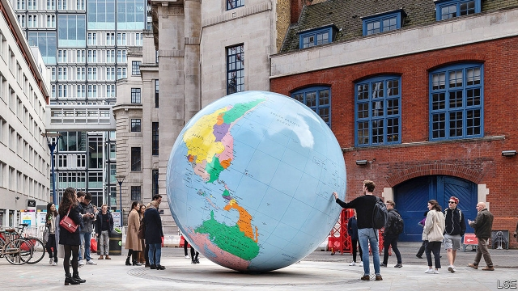

###### On Notre Dame, South Africa, diplomacy, LSE, private education, YIMBYs

# Letters to the editor 

##### A selection of correspondence 

> May 4th 2019 

Your leader about Notre Dame cathedral attributed the enormous emotional response to the fire to such factors as global tourism and a uniting love of culture (“The human spark”, April 20th). All true. Yet for the French, Notre Dame is the closest physical embodiment of their deep sense of nationhood. Their concern arises directly from the sudden physical threat to this unparalleled national symbol. The response is above all a powerful and positive expression of national identity, culture and history; a contrast to the destructive “rising threat” of nationalism that you mentioned. 

DAVID GRIFFITHSChiddingfold, Surrey 

You pondered the human instinct “to care more about a building than about people”. Let’s do a thought experiment. Donald Trump tweets, “I am more concerned about the fire at Notre Dame than I am about 1,000 black Africans.” It is easy to imagine the reaction. I’m sure The Economist would be first in line to condemn him with no small hint of superciliousness. 

NISHU SOODNew York 

I hope that, like Quasimodo, you ultimately realise that gargoyles and statues are an inadequate substitute for true human connection. A single life is more valuable than any building. 

ADAM NELSONOakland, California 

Your endorsement of the ruling African National Congress ahead of South Africa’s general election was unconscionable (“South Africa’s best bet”, April 27th). The ANC is a criminal syndicate that will destroy South Africa if it remains in power for another decade. Your argument that a stronger mandate will help President Cyril Ramaphosa push through a reform agenda by somehow strengthening him against the crooks in his party is deeply flawed, as no mechanism exists for this. 

The ANC’s candidate lists prove he has already lost that battle. They are jam-packed with crooks. This is the same crowd that supported Jacob Zuma through eight motions of no confidence as he destroyed the country’s institutions. South Africa is on its knees after 25 years of one-party dominance by a patronage-driven party that works only to enrich a connected elite. Our democracy urgently needs a strong alternative.  

A strong showing for the liberal Democratic Alliance will make the ANC more responsive to the country’s interests and prevent it, together with the socialist Economic Freedom Fighters, from achieving the majority required to change the constitution to enable expropriation without compensation. As for Mr Ramaphosa’s supposed “reform agenda”, there is little evidence of this other than his tepid fight against corruption. He has supported the attack on property rights and the forced investment of pension funds into chronically corrupt, bankrupt state-owned enterprises as well as the nationalisation of the central bank and of the health system. Mr Ramaphosa was tasked with fixing Eskom in 2015; today the power utility is in a death spiral and looks set to take our economy down with it. 

The Economist’s endorsement places it on the wrong side of history.  

JOHN STEENHUISENChief whip of the Democratic Alliance in the National AssemblyCape Town* There will be many liberal democrats in South Africa who will agree with your support for Cyril Ramaphosa. In fact that makes sense to a lot of Democrats. But voting for the ANC is a very different matter. Democratic Alliance members who are persuaded by your excellent analysis to vote ANC will simply be swallowed up in the ANC numbers to the loss of the one party in South Africa with a genuine and proven commitment to liberal values and constitutional democracy. This is because there is no way of validating their votes, as general elections in South Africa, as in Britain, are about support for parties and not individuals. Also, the fact is that the stronger the DA emerges from this election the better for the country as a whole and Cyril Ramaphosa. 

This election, or more specifically its outcome, is almost completely irrelevant to the state the country is in. The election will happen on May 8th, but the next day many South Africans will still wake up to being hungry and not having a job or access to the most elementary domestic services; to an unreliable Eskom, to a bankrupt SAA, a debt-burdened SABC and numerous other similarly crippled state entities, so adding to a shocking government debt of 55% of GDP and increasing by the day; low and declining economic growth and the lack of domestic and international investor confidence; one of the worlds’s top mining industries and a source of enormous employment broken as a consequence of government policy and interference; high levels of unemployment, particularly in respect to youth; delivery service failures mainly affecting the poorer classes; deteriorating credit-worthiness and declining productivity and a grossly incompetent and bloated public service. Yet one of the most costly governments around.So South Africans will wake up after the excitement and buzz of the election to a country which has been mismanaged for 25 years. And if our political system as presently operated, and our politicians can’t turn things around, what should be done?R.W. Johnson has mentioned the possibility of South Africa needing an IMF bail-out. This is the best course if South Africa is to avoid a serious calamity as a country and a people. Given that the election is unlikely even marginally to change the South African social and economic reality for the better or improve the lives of citizens or seriously contribute to solving the challenges we face, spelling out and promoting IMF involvement becomes a post-election imperative. That’s when Mr Ramaphosa and the people closest to him, either as president or leader of the Ramaphosa faction of a divided ANC, is going to need support. And that is why the stronger the Democratic Alliance is, the better.DENIS WORRALLFormer South African ambassador to London 

Charlemagne justifiably argues that a common European foreign policy is hard to achieve given historic differences among member states (April 20th). But don’t underestimate the value of trying. Without the effort to achieve a common view, divergences would be all the greater. Failures in Libya or the Middle East should not overshadow the relative successes on China, Russia, Iran, the Sahel and Somalia. Other powers will always seek to divide EU member states in order to weaken them. So an effective voice in the world requires hanging together rather than hanging apart. It requires infinite patience and endless ingenuity with no guarantee of success; but that’s diplomacy. 

NICHOLAS WESTCOTTDirectorRoyal African SocietyLondon 

 

A cartographic clash* The possible change of the colour depicting Taiwan on “The World Turned Upside Down” sculpture at London School of Economics is of grave concern (“Art attack”, April 13th). Since Taiwan has never been part of the People’s Republic of China, changing the colour of Taiwan on the sculpture is erroneous as it simply does not reflect the fact. Moreover, it is Britain’s longstanding government policy and position to refer to Taiwan simply as “Taiwan”.The LSE’s citing United Nations delineations, rather than its own government’s policy, as the authority to decide the content of public artwork, and more importantly, to represent its own perspective and position, will seriously damage its own reputation as one of the freest and most respected academic institutions in the world.In this respect, it is important that the LSE will acknowledge the reality of the existence of democratic Taiwan and the democratically-elected president, Dr. Tsai Ing-wen, who, insidentally, is also a proud alumna of the LSE.Following the announcement of the LSE’s decision on the sculpture, we have received many messages of support both from politicians and members of the public regarding keeping the sculpture in its originally intended state, including an online petition that has garnered over 10,000 signatures, evidencing support against the aggressive moves of Chinese students to alter the status quo.I therefore strongly urge the LSE not to bow to Chinese students’ pressure and maintain the sculpture’s original depiction of Taiwan.DAVID LIN Representative Taipei Representative Office in the United KingdomLondon 

The arguments you presented in favour of private education don’t stack up against the evidence (“A class apart”, April 13th). Studies from the OECD, UNESCO and the World Bank, among others, clearly find that private schools do not perform better than public schools. Private education also perpetuates disadvantage and exclusion. The EU has adopted a resolution stipulating that member states must not use development aid to support commercial educational establishments, because they go against the grain of the EU’s principles, aligned to the UN’s goal of inclusive education. 

Empowered educators and robust teachers’ unions make for strong education systems, according to the OECD. Teachers and their unions are part of the solution. Instead of urging governments to weaken unions, you should persuade them to work with unions to strengthen public education. 

DAVID EDWARDSEducation InternationalBrussels 

I wish you had devoted more analysis to the American system. During the gradual move towards more “choice” in education, such as charter schools and the use of vouchers, mathematics results have declined in America when ranked with other countries or in time-series tests. The performance of high-school sophomores in the OECD’s PISA studies have placed America below the mean of all countries. A measure to test college readiness for maths in 2018 revealed that 60% had failed. That is after a decade of more school choice. More research to explain this decline is needed. 

BERTRAND HORWITZAsheville, North Carolina 

You cited data showing the greater efficiency (outcome per dollar) of private education in India. Yet the reverse is the case in developed countries. As you noted, educational outcomes are about equal in private and public systems in OECD countries, even though spending per student is substantially higher in the private sector. Efficiency and equity therefore imply using the tax system to increase spending in public education, rather than encouraging private expenditure. 

Moreover, public education is a means of achieving integration in societies with lots of migrants. Yet, in Australia at least, subsidies to private education have enabled recent migrant groups to segregate their children into low-fee private schools. 

In a free society, parents must be able to choose private education. This does not imply the right to public subsidies. 

REX DEIGHTON-SMITHParis 

The acronym YIMBY, “yes in my backyard”, is not quite right (“Sorry, we’re full”, April 20th). When you look closely at the backers of this movement for new development and housing in the crowded Bay Area, you find that the acronym is more accurately YIYBY, “yes in your backyard”. 

GEORGE DODDINGTONWalnut Creek, California 

* Letters appear online only 

-- 

 单词注释:

1.notre[]:a. （法）我们的 

2.dame[deim]:n. 夫人 

3.diplomacy[di'plәumәsi]:n. 外交, 外交手腕, 交际手段 [法] 外交, 外交手腕, 权谋 

4.lse[]:abbr. 伦敦证券交易所（London Stock Exchange）；伦敦大学经济政治学系（ 	London School of Economics and Political Science）；伦敦政经学院（London School of Economics） 

5.correspondence[.kɒri'spɒndәns]:n. 相符, 通信, 信件 [医] 对应, 相对 

6.embodiment[im'bɒdimәnt]:n. 具体化, 化身 

7.nationhood['neiʃәnhud]:n. 国家地位 [法] 成为国家的事实或状态, 民族主义 

8.unparalleled[.ʌn'pærәleld]:a. 无比的, 无双的, 空前的 

9.nationalism['næʃәnәlizm]:n. 民族主义, 民族特性 

10.david['deivid]:n. 大卫；戴维（男子名） 

11.surrey['sʌri]:n. 四轮双座轻便游览马车 

12.ponder['pɒndә]:v. 沉思, 考虑 

13.tweet[twi:t]:vi. 啁啾 n. 小鸟叫声 

14.economist[i:'kɒnәmist]:n. 经济学者, 经济家 [经] 经济学家 

15.superciliousness[sjuːpәˊsiliәsnis]:n. 高傲 

16.york[jɔ:k]:n. 约克郡；约克王朝 

17.quasimodo[,kwɑ:zi'məudəu]:n. 复活节后的第一个星期天 

18.gargoyle['ɡɑ:ɡɔil]:n. 滴水嘴 

19.inadequate[in'ædikwәt]:a. 不充分的, 不适当的 [法] 不充分的, 不适当的 

20.Adam['ædәm]:n. 亚当 [计] 自动直接存取管理 

21.California[.kæli'fɒ:njә]:n. 加利福尼亚 

22.endorsement[in'dɒ:smәnt]:n. 支持, 认可, 背书 [经] 背书, 担保, 保证 

23.unconscionable[.ʌn'kɒnʃәnәbl]:a. 不受良心支配的, 不合理的, 过度的 

24.anc[]:abbr. 非洲民族会议（African National Council）；美国新闻社（American News Company）；（美国）大气氮公司（Atmospheric Nitrogen Corporation）；自动噪声消除器（Automatic Noise Canceller） 

25.syndicate['sindikit]:n. 企业联合, 辛迪加, 财团 v. 联合成辛迪加 

26.mandate['mændeit]:n. 命令, 指令, 要求 vt. 委任统治 

27.cyril['siril]:n. 西里尔（男子名） 

28.ramaphosa[]:[网络] 拉马福萨；拉马弗萨 

29.crook[kruk]:n. 钩, 弯曲部分, 坏蛋 vt. 使弯曲, 诈骗 vi. 弯曲 

30.flaw[flɒ:]:n. 缺点, 裂纹, 瑕疵, 一阵狂风 [化] 划痕; 裂缝; 裂纹 

31.mechanism['mekәnizm]:n. 机械, 机构, 结构, 机理, 技巧 [化] 机理; 历程; 机构 

32.jacob['dʒeikәb]:n. [圣经]雅各（以色列人的祖先）；雅各布（男子名） 

33.zuma[]: 祖玛 

34.dominance['dɔminәns]:n. 优势, 显性, 统治, 控制, 支配 [计] 控制, 扰势 

35.enrich[in'ritʃ]:vt. 使富足, 使肥沃 

36.elite[ei'li:t]:n. 精华, 精锐, 中坚分子 

37.urgently[]:adv. 急切地；迫切地；紧急地 

38.alliance[ә'laiәns]:n. 联盟, 联合 [法] 同盟, 联盟, 联姻 

39.responsive[ri'spɒnsiv]:a. 回答的, 应答的, 易感应的 

40.expropriation[eks.prәupri'eiʃәn]:n. 征用, 收用, 征收 [经] 征用, 没收, 征购 

41.compensation[.kɒmpen'seiʃәn]:n. 补偿, 赔偿金, 工资 [医] 代偿(机能), 补偿 

42.tepid['tepid]:a. 微温的, 温热的, 不太热烈的 [医] 微温的 

43.corruption[kә'rʌpʃәn]:n. 腐败, 堕落, 贪污 [计] 论误 

44.chronically['krɒnikli]:adv. 慢性地, 长期地, 习惯性地 

45.bankrupt['bæŋkrʌpt]:n. 破产者 a. 破产的 vt. 使破产 

46.nationalisation[,næʃәnәlai'zeiʃәn; -li'z-]:n. 国有化, 国营 

47.eskom[]:[网络] 南非电力公司；南非国家电力公司；斯康 

48.spiral['spairәl]:n. 螺旋形之物, 螺线 a. 螺旋形的, 盘旋的 vi. 螺旋形下降, 螺旋形上升, 螺旋形行进 vt. 使螺旋形行进 

49.john[dʒɔn]:n. 盥洗室, 厕所, 嫖客 

50.democrat['demәkræt]:n. 民主人士, 民主主义者, 民主党党员 [经] 民主党 

51.constitutional[.kɒnsti'tju:ʃәnl]:a. 宪法的, 立宪的, 体质的 [医] 全身的; 体质的 

52.validate['vælideit]:vt. 使有效, 使生效, 确认, 证实, 验证 [计] 验证 

53.DA[,di:'ei]:美国地方检察官 [计] 数据采集, 数据管理员, 数据分析, 设计自动化 

54.specifically[spi'sifikli]:adv. 特定地, 明确地, 按特性 

55.irrelevant[i'relәvәnt]:a. 不恰当的, 无关系的, 不相干的 [法] 无关的, 不相干的, 离题的 

56.unreliable[.ʌnri'laiәbl]:a. 不可靠的 [法] 不可靠的, 靠不住的 

57.SAA[]:[计] 系统应用体系结构 

58.sabc[]:abbr. South African Broadcasting Corporation 南非广播公司 

59.entity['entiti]:n. 实体, 实存物, 存在 [计] 实体 

60.investor[in'vestә]:n. 投资者 [经] 投资者 

61.deteriorate[di'tiәriәreit]:v. (使)恶化 

62.productivity[.prәudʌk'tiviti]:n. 生产力 [经] 生产率, 生产能力 

63.grossly['grәusli]:adv. 非常, 很, 粗 

64.incompetent[in'kɒmpitәnt]:a. 无能力的, 无资格的, 机能不全的, 不胜任的 n. 无能力者 

65.bloat[blәut]:vt. 使膨胀, 腌制, 使自大 vi. 膨胀, 肿起 n. 肿胀病人 

66.buzz[bʌz]:n. 嗡嗡声, 流言 vi. 发出嗡嗡声, 说闲话 vt. 使嗡嗡叫, 散布 

67.mismanage[mis'mænidʒ]:vt. 处置失当, 对...管理不善 

68.johnson['dʒɔnsn]:n. 约翰逊（姓氏） 

69.IMF[]:国际货币基金组织 [经] 国际货币基金 

70.calamity[kә'læmiti]:n. 灾难, 不幸事件 

71.marginally[]:adv. 记在页边, 有旁注, 边缘, 边沿地区, 边际, 限界, 勉强够格, 无关紧要, 少量 

72.involvement[in'vɔlvmәnt]:n. 卷入, 牵连, 包含, 困窘 [经] 财政困难, 经济上的困窘 

73.imperative[im'perәtiv]:n. 命令, 必要的事, 规则, 祈使语气 a. 命令式的, 急需的, 势在必行的, 强制的 

74.faction['fækʃәn]:n. 小派系, 内讧 [法] 宗派, 派别, 小集团 

75.Charlemagne['ʃɑ:lә'mein]:查理曼大帝(742-814, 世称 Charles the Great或Charles I, 768-814为法兰克王, 800-814为西罗马帝国皇帝) 

76.justifiably[dʒʌstɪ'faɪəblɪ]:adv. 无可非议地 

77.historic[hi'stɒrik]:a. 历史上著名的, 有历史性的 

78.underestimate[.ʌndәr'estimeit]:n. 低估 vt. 低估, 看轻 

79.divergence[dai'vә:dʒәns]:n. 分歧 [计] 分散度 

80.Libya['libiә]:n. 利比亚 

81.overshadow[.әuvә'ʃædәu]:vt. 遮阴, 使阴暗, 使失色, 使相形见绌, 使蒙上阴影 

82.Iran[i'rɑ:n]:n. 伊朗 

83.Sahel['sɑ:hel]:荒漠草原(西非) 

84.Somalia[sәu'mɑ:liә]:n. 索马里 

85.alway['ɔ:lwei]:adv. 永远；总是（等于always） 

86.EU[]:[化] 富集铀; 浓缩铀 [医] 铕(63号元素) 

87.ingenuity[.indʒi'nju:iti]:n. 心灵手巧, 精巧, 精巧设计 

88.nicholas['nikәlәs]:n. 尼古拉斯（男子名） 

89.cartographic[]:[计] 制图的 

90.depict[di'pikt]:vt. 描述, 描写 

91.taiwan['tai'wɑ:n]:n. 台湾 

92.upside['ʌpsaid]:n. 上侧, 上段, 上部 [机] 上侧, 上部 

93.erroneous[i'rәuniәs]:a. 错误的, 不正确的 [法] 错误的, 不正确的 

94.longstanding['lɔŋ'stændiŋ;'lɔ:ŋ-]:a. 长期间的, 长期存在的 

95.cite[sait]:vt. 引用, 引证, 表彰 [建] 引证, 指引 

96.delineation[di.lini'eiʃәn]:n. 画轮廓, 略图, 描述 

97.artwork['ɑ:twә:k]:n. 插图, 艺术作品 [计] 原图 

98.importantly[]:adv. 重要地；大量地；有名望地；自命不凡地 

99.tsai[]:n. 蔡（姓氏） 

100.alumna[ә'lʌmnә]:n. 女毕业生, 女校友 

101.originally[ә'ridʒәnli]:adv. 本来, 原来, 最初, 就起源而论, 独创地 

102.online[]:[计] 联机 

103.petition[pi'tiʃәn]:n. 请愿, 诉状, 陈情书, 申请, 祈求, 祷文 v. 正式请求, 恳求, 请愿 

104.garner['gɑ:nә]:n. 谷仓, 积蓄 vt. 储存, 贮藏 

105.statu[]:[网络] 状态查看；雕像；特级雪花白 

106.quoi[]:[网络] 对你的十个疑问 

107.depiction[di'pikʃәn]:n. 描写, 叙述 

108.lin[]:n. 林 

109.taipei['tai'pei, -'bei]:n. 台北 

110.Oecd[]:[经] 已开发国家组织 

111.UNESCO[ju:'neskәj]:联合国教育科学及文化组织, 联合国教科文组织 

112.perpetuate[pә'petjueit]:vt. 使永存, 使不朽, 保持 

113.exclusion[ik'sklu:ʒәn]:n. 排除, 除外, 逐出 [医] 排除, 除外, 分离术 

114.stipulate['stipjuleit]:v. 规定, 保证 

115.educational[.edju'keiʃәnl]:a. 教育的, 教育性的 

116.align[ә'lain]:vi. 排列, 排成一行, 结盟 vt. 使结盟, 使成一行, 校正 

117.inclusive[in'klu:siv]:a. 包含的, 包括的 

118.empower[im'pauә]:vt. 授予权力, 允许, 使能够 [法] 授权, 准许, 转委 

119.robust[rәu'bʌst]:a. 健康的, 强健的, 要用力气的, 坚定的, 粗野的 [计] 健壮性 

120.charter['tʃɑ:tә]:n. 特许状, 执照, 宪章 vt. 特许, 发给特许执照 

121.voucher['vautʃә]:n. 证人, 保证人, 证明者, 凭证, 凭单 vt. 证实...的可靠性 

122.sophomore['sɒfәmɒ:]:n. (大学)二年级生 a. 二年级学生的, 二年级的 

123.Pisa['pi:zә]:n. 比萨城 

124.readiness['redinis]:n. 预备, 准备, 敏捷 

125.Bertrand['b\\:trәnd]:n. 伯特兰(男子名) 

126.Carolina[.kærә'lainә]:n. 北(或南)卡罗来纳州 

127.datum['deitәm]:n. 论据, 材料, 资料, 已知数 [医] 材料, 资料, 论据 

128.substantially[sәb'stænʃәli]:adv. 实质上, 本质上, 大体上 

129.sector['sektә]:n. 扇形, 部门, 部分, 函数尺, 象限仪, 段, 区段 vt. 把...分成扇形 [计] 扇面; 扇区; 段; 区段 

130.equity['ekwiti]:n. 公平, 公正 [经] 权益, 产权 

131.integration[.inti'greiʃәn]:n. 综合, 与环境协调的行为, 集成 [化] 集成; 整合 

132.migrant['maigrәnt]:n. 候鸟, 移居者 [法] 移居者 

133.segregate['segrigeit]:a. 分离的, 被隔离的 vi. 分离, 隔离, 分凝 vt. 使分离, 使隔离 

134.rex[reks]:n. 雷克斯（男子名）；国王；君主 

135.acronym['ækrәunim]:n. 首字母缩拼词, 首字母组合词 [计] 字首组合词 

136.yimby[]:[网络] 迎毗设施 

137.backyard['bæk'jɑ:d]:n. 后院, 后庭 

138.backer['bækә]:n. 援助者, 支持者 [经] 背书人, 支持人 

139.accurately['ækjurәtli]:adv. 正确地, 精确地 

140.george[dʒɔ:dʒ]:n. 乔治（男子名）；自动操纵装置；英国最高勋爵勋章上的圣乔治诛龙图 

141.creek[kri:k]:n. 小溪, 小河, 小湾 

