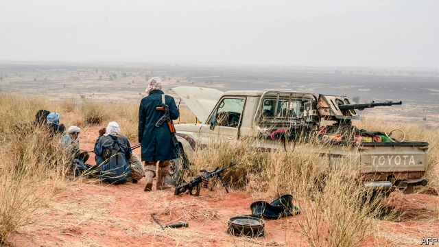

###### Malicious militias

# States in the Sahel have unleashed ethnic gangs with guns 

##### A cycle of tit-for-tat murder has begun 

 

> May 2nd 2019 

THE FIRST sound of danger was the roar of motorbikes. Then came the gunfire as about 20 men attacked Samani, a village in central Mali, killing three people and cutting off body parts as trophies. They took the chief’s 30-year-old son, “cut him in half, and took his heart out”, says Amadou Barry, an elder who managed to escape to Bamako, Mali’s capital. 

The gunmen were from an ethnic militia, one of hundreds that have sprouted in Mali and Burkina Faso, and that have killed at least 800 people since the beginning of 2018. The militias are most active in Mali, which has battled a jihadist insurgency since 2012. Many emerged from groups of hunters, who used to stalk game with flintlock guns. Now they are armed with assault rifles and speed about on motorbikes. They say they hunt jihadists. In reality they are targeting Fulanis, a mainly Muslim minority group. Photos on social media show Fulani villages in which families have been shot, their bodies thrown down wells or cut to pieces. “We should call it what it is: ethnic cleansing,” says Héni Nsaibia, from the Armed Conflict Location & Event Data Project, an NGO. 

The army has made no serious attempt to disarm these militias, said Human Rights Watch, a watchdog, in December. Instead, the government has helped them. Some army units patrol with them. They have been exempted from a ban on motorbikes (supposedly the jihadists’ favourite ride) in central Mali. This allows the militias to attack with ease. Emboldened by the government’s inaction, militiamen hacked and burned to death more than 170 people in Ogossagou, central Mali, in March. This favouritism plays into the hands of the jihadists, who find it easiest to recruit among oppressed minorities such as the Fulani, which are also forming their own militias. Some jihadists have urged all Fulanis to join their fight. 

The situation is hardly better in Burkina Faso, where thousands of men have joined groups called Koglweogo (guardians of the bush). They started out as vigilante groups that beat or killed alleged criminals. But many now demand money from villagers and torture those who do not pay. 

Some estimate there are about 4,500 Koglweogo groups, most with at least 20 men, mainly from the majority Mossi ethnic group. They are being sucked into conflict with the Fulani. In January Koglweogo fighters massacred some 210 mostly Fulani people in Yirgou in northern Burkina Faso. Instead of arresting the attackers, the government told the victims to forgive them. 

The government’s shameful reaction partly reflects its weakness. But there may be a darker motive. Many members of the government are Mossi, and may think it useful to have an ethnic militia on hand before elections next year. 

Yet by allowing militias to arm and multiply, governments “have created a monster”, says a UN official in the Sahel. Having let this demon out of the box, they will struggle to put it back. 

-- 

 单词注释:

1.malicious[mә'liʃәs]:a. 怀恶意的, 恶毒的 

2.militia[mi'liʃә]:n. 义勇军, 民兵组织, 国民军 

3.Sahel['sɑ:hel]:荒漠草原(西非) 

4.unleash[.ʌn'li:ʃ]:vt. 解开...的皮带, 发出, 发动 

5.ethnic['eθnik]:a. 人种的, 种族的 [医] 人种的 

6.gunfire['gʌnfaiә]:n. 炮火, 号炮报时, 炮击 

7.Samani[]:[地名] 样似 ( 日 ) 

8.Mali['mɑ:li]:n. 马里 

9.trophy['trәufi]:n. 战利品, 奖品 vt. 用战利品装饰 

10.amadou['æmәdu:]:n. 火绒(止血和引火用) 

11.Barry['bæri]:n. 巴里（男子名） 

12.Bamako['bɑ:mәkәu]:巴马科(马里首都) 

13.gunman['gʌnmәn]:n. 枪手, 持枪的歹徒, 制造枪械者 [法] 持枪歹徒, 持枪抢劫或杀人者, 枪炮工人 

14.sprout[spraut]:n. 芽, 萌芽 vt. 使发芽, 摘去芽 vi. 长芽, 抽条 

15.burkina[]:[网络] 布基纳法索；布加纳法索；布基纳法索地图 

16.Faso[]:n. (Faso)人名；(意)法索 

17.jihadist[]:n. 伊斯兰圣战士 

18.insurgency[in'sә:dʒәnsi]:n. 叛乱状态, 发生暴动 [法] 暴动, 起义, 叛乱 

19.stalk[stɒ:k]:n. 茎, 追踪, 高视阔步 vi. 悄悄靠近, 蹑手蹑脚地走近, 蔓延, 高视阔步 vt. 追踪, 搜索 

20.flintlock['flintlɒk]:n. 燧石发火装置, 燧发机, 明火枪 

21.assault[ә'sɒ:t]:n. 攻击, 袭击 vt. 袭击, 攻击 vi. 发动攻击 

22.Fulani['fu:lɑ:ni]:富拉尼人(即富尔贝人) 

23.Muslim['mjzlim; (?@) 'mʌzlem]:n. 伊斯兰教, 伊斯兰教教徒 

24.Fulani['fu:lɑ:ni]:富拉尼人(即富尔贝人) 

25.cleanse[klenz]:vt. 使清洁, 净化, 使纯净 [建] 纯化, 净化, 精炼 

26.datum['deitәm]:n. 论据, 材料, 资料, 已知数 [医] 材料, 资料, 论据 

27.ngo[]:abbr. 民间组织；非政府组织（Non-Governmental Organization） 

28.disarm[dis'ɑ:m]:vt. 解除武装, 裁军, 缓和 vi. 放下武器 

29.watchdog['wɒtʃdɒg]:n. 看门狗, 监察人 [化] 监控设备; 监视器 

30.patrol[pә'trәul]:n. 巡逻, 巡逻员, 侦察队 v. 巡逻, 巡视 

31.exempt[ig'zempt]:n. 免税者, 被免除义务者 a. 免除的 vt. 使免除, 豁免 

32.supposedly[sә'pәuzidli]:adv. 想象上, 看上去像, 被认为是, 恐怕, 按照推测 

33.embolden[im'bәuldn]:vt. 使大胆, 使有胆量 

34.inaction[in'ækʃәn]:n. 不活动, 无为, 怠惰, 迟钝 [医] 无作用 

35.militiaman[mi'liʃәmәn]:n. 国民兵, 民兵 

36.hack[hæk]:n. 劈, 砍, 砍痕, 出租车, 干咳, 晒架, 鹤嘴锄 vt. 劈, 砍, 出租, 用旧 vi. 劈, 砍, 干咳, 驾驶出租车 a. 出租的 

37.favouritism[]:n. 偏爱, 徇私, 宠信, 得宠, 偏袒 

38.guardian['gɑ:diәn]:n. 看守者, 监护人, 保护人 a. 保护的 

39.vigilante[.vidʒi'lænti]:n. 警戒会会员 

40.allege[ә'ledʒ]:vt. 宣称, 主张, 提出, 断言 [法] 断言, 指称, 指证 

41.Mossi['mɔ:si:]:(pl. Mossi, Mossis) 莫西人, 莫西族(苏丹中西部一部族名) 

42.attacker[ә'tækә]:n. 攻击者 

43.shameful['ʃeimful]:a. 可耻的, 丢脸的, 不道德的, 淫猥的, 猥亵的, 不体面的 

44.monster['mɒnstә]:n. 怪物, 恶人, 巨物 [医] 畸胎 

45.UN[ʌn]:pron. 家伙, 东西 [经] 联合国 

46.demon['di:mәn]:n. 魔鬼 

