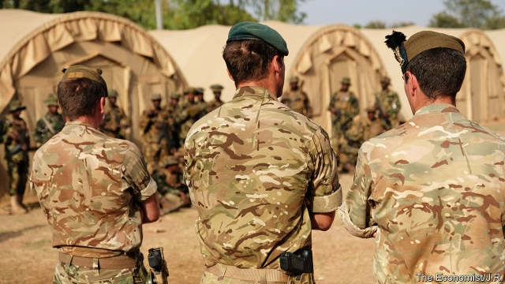
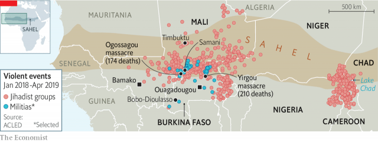

###### The new war on jihadism

# The West’s new front against jihadism is in the Sahel 

##### Even with help, governments are struggling to contain Islamist insurgencies 

 

> May 2nd 2019 

NIGERIAN TROOPS huddle around their captain for a briefing. Several rest their rifle muzzles in the sandy ground, which could block and damage them. During the assault on a terrorist training camp, many forget their training, firing wildly and running off their line of advance. After capturing it, they mill about and ignore the booms of incoming artillery. Finally they are brought up short by an angry Scotsman, who shouts: “Ibrahim, you’re dead!” 

This less-than-successful mock attack took place near the town of Bobo-Dioulasso, in the west of Burkina Faso. It was part of an American-led training exercise earlier this year involving some 2,000 elite troops from more than 30 countries. These two-week war games are the most visible part of a big Western push to turn the tide in a bloody, forgotten war. Jihadists are sweeping across the Sahel, an arid swathe of scrubland on the southern edge of the Sahara that stretches most of the way across Africa. They are also causing mayhem in Somalia. America, Britain, France and other Western powers are trying to help local forces in at least 16 countries beat them back. It is not going well. 

Since the collapse of the “caliphate” in Syria and Iraq, Islamic State (IS) has been looking for other places to raise its black flag. Africa, and especially the Sahel, is vulnerable. Governments are weak, unpopular and often have only a tenuous grip over remote parts of their territory. Abu Bakr al-Baghdadi, the leader of IS, sees an opportunity. In a video released on April 29th, to prove that he is not dead (his first such appearance in five years), the bearded zealot waxed enthusiastic about Africa. “Your brothers in Burkina Faso and Mali...we congratulate them for their joining the convoy of the caliphate,” he said, according to the SITE Intelligence Group, which monitors jihadist communications. 

Major General Mark Hicks, who commands America’s special forces in Africa (and was in Burkina Faso for the war games) fears that IS is not the only terrorist group extending its franchise into his patch. “Al-Qaeda has taken a very serious long-term view of expanding here in the Sahel, and they’re seeing real success,” he says. His intelligence officers reckon that the groups they track contain about 10,500 jihadist fighters. 

Most jihadists in Africa are fighting their own governments. But some attack Western targets. “If we don’t fight them here we will have to fight them on the streets of Madrid or Paris,” says a European intelligence officer. 

One cannot generalise easily about African jihadist groups. Some are strictly local, having taken up arms to fight over farmland or against corrupt local government. Some adopt the “jihadist” label only because they happen to be Muslim. Many young men who join such groups do so because they have been robbed by officials or beaten up by police, or seen their friends humiliated in this way. 

 

Other groups, such as al-Shabab in Somalia, are steeped in the teachings of al-Qaeda, the group behind the attacks on America on September 11th 2001. They tend to focus on spectacular atrocities, such as a truck bomb in 2017 in the Somali capital, Mogadishu, that killed almost 600 people. The most worrying groups are adherents of IS that seek to hold territory. An offshoot of Boko Haram, for example, is building a proto-caliphate in northern Nigeria. 

Jihadist groups of all varieties are expanding their reach in the Sahel and around Lake Chad. Last year conflicts with jihadists in Africa claimed more than 9,300 lives, mostly civilian. This is almost as many as were killed in conflict with jihadists in Syria and Iraq combined. About two-fifths of those deaths were in Somalia, where al-Shabab frequently detonates car bombs in crowded streets. Many of the rest were in Nigeria, where the schoolgirl-kidnappers of Boko Haram and its odious offshoot, Islamic State West Africa Province, shoot villagers and behead nurses. 

However, the area that aid workers and Western spooks worry about most is the Sahel. In Niger, Mali and Burkina Faso the number of people killed in jihad-related violence has doubled for each of the past two years, to more than 1,100 in 2018. And the violence is spreading, spilling across borders and threatening to tear apart poor, fragile states with bad rulers and swelling populations. Such places are already beset by droughts, possibly caused by global warming. Over the longer term “the Sahel is our biggest worry,” says Mark Lowcock, who is in charge of emergency relief at the UN. Peter Maurer, the president of the International Committee of the Red Cross, frets that conflict and climate change are prompting huge flows of migrants out of the Sahel. 

Fear of refugees is one of the main reasons why European military powers are trying to stabilise the region. France has 4,500 troops fighting jihadists there. Germany and Italy each have about 1,000 soldiers in Africa. Britain has set up two specialised infantry units dedicated to training African soldiers in Nigeria and Somalia. America, which is more concerned about terrorism than refugee flows in this part of the world, has more than 7,000 military personnel in Africa. 

The majority of Western troops do not fight jihadists directly—except in Somalia, where drone-fired missiles have killed many of al-Shabab’s fighters. Most are training local forces. They often have to start with the basics. In Nigeria, for instance, jihadists often sneak up and overrun army bases because the bush around them has not been cleared. Or they start shooting at them with a small force to goad the defenders into using up their ammunition firing back, leaving them helpless when the main attack begins. 

Efforts to contain the spread of jihadism by training local armies or killing insurgent leaders are not obviously working. Take Mali, where in 2012 Tuareg separatists and jihadists allied to al-Qaeda swept out of the desert and conquered the north of the country using weapons looted from the arsenals of Libya’s dead dictator, Muammar Qaddafi. The rebels seemed ready to march on the capital, Bamako, and the south, which contains 90% of the population and sustains most of the economy. 

French troops pushed them back from the main cities. But not even their expertise and firepower could defeat the rebels, who simply melted back into the desert. There they have survived a seven-year-long counterinsurgency campaign. Pundits in Paris are calling Mali “France’s Afghanistan”. And with good reason. The UN now has more than 16,000 peacekeepers in Mali, of whom 195 have been killed, making it the blue helmets’ most dangerous mission since its start in 2013. Nonetheless, the jihadists have continued to spread south into Niger and Burkina Faso. 

The government of Mali has shown little interest in trying to restore security in the northern half of the country, contenting itself with holding the gold-rich south. “They have basically ceded the territory and aren’t willing to fight for it,” complains a Western army officer. Worse still, the government has allowed—if not actively supported—the formation of pro-government ethnic militias that are responsible for a rapidly increasing number of attacks on civilians from minority groups (see article). A flood of weapons from the Gulf of Guinea feeds the mayhem. There are so many assault rifles in Mali that the price has fallen from $600 two years ago to $260 today, says an official. 

Western governments and armies have started to focus less on Mali and Nigeria and more on Niger and Burkina Faso, hoping that these countries can act as bulwarks to halt the spread of jihadism. “We have a window of opportunity to help this country draw a line that they can hold,” says Andrew Young, America’s ambassador to Burkina Faso. 

Unfortunately, many of the mistakes that were made in Mali are also being made in Burkina Faso. Militias are proliferating; a cycle of ethnic violence has begun. 

Too little is being done to fix the underlying problems that fuel conflict, such as failing agriculture, poor governance and poverty. Local elites seldom want to end the corruption that enriches them, or allow the kind of democratic accountability that might limit their power. 

Furthermore, the threat of jihadism has prompted some Western governments quietly to stop promoting democracy in Africa, just as during the cold war, when they propped up awful regimes if they were anti-communist. A similar approach seems evident now: almost any ruler who is anti-jihadist can seem a suitable ally. Earlier this year, for example, French warplanes bombed rebels in Chad to protect Idriss Déby, who has ruled since 1990. In Cameroon special forces trained by the West have been implicated in brutal abuses against opponents of Paul Biya, who has been president since 1982. 

The Sahel is so unstable that foreign troops will probably be there for years. But unless local governance improves, they will not eliminate the jihadist threat. As one Western officer muses: “Are we just building sandcastles at low tide?” 

-- 

 单词注释:

1.jihadism[]:[网络] 圣战主义；吉哈德主义；杰哈德主义 

2.Sahel['sɑ:hel]:荒漠草原(西非) 

3.Islamist[iz'lɑ:mist]:n. 伊斯兰教主义者；回教教徒 

4.insurgency[in'sә:dʒәnsi]:n. 叛乱状态, 发生暴动 [法] 暴动, 起义, 叛乱 

5.Nigerian[nai'dʒiriәn]:n. 尼日利亚人 

6.huddle['hʌdl]:n. 杂乱一团, 混乱, 拥挤 vt. 把...挤在一起, 乱堆, 草率了事, 蜷曲 vi. 挤作一团, 蜷缩 

7.muzzle['mʌzl]:n. 动物之鼻口, 口套, 枪口 vt. 戴口套于, 使缄默 

8.assault[ә'sɒ:t]:n. 攻击, 袭击 vt. 袭击, 攻击 vi. 发动攻击 

9.terrorist['terәrist]:n. 恐怖分子 [法] 恐怖份子, 恐怖主义 

10.wildly[]:adv. 狂暴地, 激动地, 狂热地, 鲁莽地, 轻率地 

11.incoming['inkʌmiŋ]:a. 进来的, 刚开始的, 新来的 n. 进来 

12.artillery[ɑ:'tilәri]:n. 火炮, 炮兵, 炮术 [机] 火炮, 炮兵 

13.scotsman['skɔtsmәn]:n. 苏格兰人 

14.Ibrahim[]:n. 易卜拉欣（与阿丹、努哈、穆萨、尔撒和穆罕默德并称为安拉的六大使者, 亦系犹太教和基督教推崇的圣人和希伯来人的祖先） 

15.mock[mɒk]:n. 嘲笑, 戏弄, 模仿 a. 假的, 伪造的, 模拟的 adv. 虚伪地 vt. 嘲弄, 模仿, 使失望, 欺骗, 挫败 vi. 嘲弄 

16.burkina[]:[网络] 布基纳法索；布加纳法索；布基纳法索地图 

17.Faso[]:n. (Faso)人名；(意)法索 

18.elite[ei'li:t]:n. 精华, 精锐, 中坚分子 

19.bloody['blʌdi]:a. 血腥的, 嗜杀的, 有血的 

20.jihadist[]:n. 伊斯兰圣战士 

21.arid['ærid]:a. 干燥的, 不毛的 

22.swathe[sweiθ]:vt. 绑, 裹, 包围 n. 带子, 绷带 

23.scrubland['skrʌblænd]:n. 灌木丛林地 

24.Sahara[sә'hɑ:rә]:n. 撒哈拉沙漠 

25.mayhem['meihem]:n. 蓄意的破坏, 故意的伤害罪 [医] 伤残, 残废 

26.Somalia[sәu'mɑ:liә]:n. 索马里 

27.caliphate['kælifeit]:n. 伊斯兰教国王的职权或其领域 

28.Syria['siriә]:n. 叙利亚 [经] 叙利亚 

29.Iraq[i'rɑ:k]:n. 伊拉克 

30.Islamic[iz'læmik]:a. 伊斯兰教的, 穆斯林的 

31.vulnerable['vʌlnәrәbl]:a. 易受伤害的, 有弱点的, 易受影响的, 脆弱的, 成局的 [医] 易损的 

32.unpopular['ʌn'pɔpjulә]:a. 不得人心的, 不受欢迎的, 不流行的 

33.tenuous['tenjuәs]:a. 稀薄的, 微细的, 纤细的, 脆弱的 [医] 细薄的, 纤细的 

34.abu[]:abbr. 亚洲广播联盟（Asian Broadcast Union） 

35.bakr[]:n. (Bakr)人名；(阿拉伯、孟)贝克尔 

36.zealot['zelәt]:n. 热心者, 狂热者, 犹太教狂热信徒 [法] 狂热分子, 激烈分子 

37.convoy['kɒnvɒi. kәn'vɒi]:n. 护送, 护卫 vt. 护航, 护送 

38.hick[hik]:n. 乡下人, 土头土脑的人, 反应迟钝的人 

39.franchise['fræntʃaiz]:n. 公民权, 特权, 特许经营权, 免赔额 vt. 给以特权, 给以...公民权 

40.reckon['rekәn]:vt. 计算, 总计, 估计, 认为, 猜想 vi. 数, 计算, 估计, 依赖, 料想 

41.Madrid[mә'drid]:n. 马德里 

42.cannot['kænɒt]:aux. 无法, 不能 

43.generalise['dʒenәrәlaiz]:vt.vi. (使)一般化, 从...引出一般性结论, 泛论, 概括出, 归纳出, 使广义化 

44.farmland['fɑ:mlænd]:n. 农田 

45.Muslim['mjzlim; (?@) 'mʌzlem]:n. 伊斯兰教, 伊斯兰教教徒 

46.humiliate[hju:'milieit]:vt. 使丢脸, 使蒙羞, 屈辱 

47.spectacular[spek'tækjulә]:a. 公开展示的, 惊人的, 壮观的 n. 奇观, 惊人之举, 展览物 

48.atrocity[ә'trɒsiti]:n. 残暴, 凶恶, 暴行 [法] 暴行, 残酷, 残忍 

49.Somali[sәu'mɑ:li]:n. 索马里人 

50.Mogadishu[,mɔ:^ɑ:'di:ʃu:]:摩加迪沙[索马里首都] 

51.adherent[әd'hiәrәnt]:n. 信徒, 追随者 a. 附着的, 发生联系的 

52.offshoot['ɒ:fʃu:t]:n. 分支, 旁系, 衍生事物 

53.boko['bәukәu]:n. <英俚>鼻子 

54.haram['heәrәm]:n. (=harem)(伊斯兰教徒)女眷居住的内室,闺房, (伊斯兰教徒的)女眷,共配一雄的一群雌性动物 

55.Nigeria[nai'dʒiriә]:n. 尼日利亚 

56.jihadist[]:n. 伊斯兰圣战士 

57.Chad[tʃæd]:n. 乍得 [计] 孔屑 

58.detonate['detәneit]:vt. 引爆, 使爆炸, 使爆裂 vi. 爆炸, 发爆炸声 

59.odious['әudiәs]:a. 可憎的, 可厌的, 丑恶的 

60.behead[bi'hed]:vt. 斩首, 砍头 

61.spook[spu:k]:n. 幽灵, 鬼 vt. 惊吓, 鬼怪般地出没 vi. 惊吓而逃窜, 受惊 

62.Niger['naidʒә]:n. 尼日尔 [化] 皂脚 

63.Mali['mɑ:li]:n. 马里 

64.beset[bi'set]:vt. 围绕, 使苦恼, 镶嵌 

65.UN[ʌn]:pron. 家伙, 东西 [经] 联合国 

66.peter['pi:tә]:vi. 逐渐消失, 逐渐减少 

67.Maurer[]:n. 毛雷尔 

68.fret[fret]:n. 烦躁, 磨损, 焦急, 网状饰物 vi. 烦恼, 不满, 磨损 vt. 使烦恼, 腐蚀, 使磨损, 使起波纹 

69.migrant['maigrәnt]:n. 候鸟, 移居者 [法] 移居者 

70.refugee[.refju'dʒi:]:n. 难民, 流亡者 [法] 避难者, 流亡者, 难民 

71.stabilise['steibilaiz]:vt.vi. (使)稳定, (使)安定, (使)坚固 vt. 装稳定器 

72.specialise['speʃә,laiz]:vt. 特加指明, 列举, 使专门化, 限定...的范围 vt.vi. (使)特化, (使)专化 vi. 成为专家, 专务, 专攻, 专门研究, 逐条详述 

73.infantry['infәntri]:n. 步兵, 步兵团 

74.dedicate['dedikeit]:vt. 献出, 贡献 

75.terrorism['terәrizm]:n. 恐怖主义, 恐怖统治, 恐怖状态 [法] 胁迫, 暴政, 恐怖政治 

76.sneak[sni:k]:vi. 鬼鬼祟祟做事 vt. 偷偷地做 n. 鬼鬼祟祟的人, 偷偷摸摸的行为, 帆布胶底运动鞋 a. 暗中进行的 

77.overrun[.әuvә'rʌn]:n. 蔓延, 风行一时, 超过限度 vt. 蔓延, 蹂躏, 超过, 泛滥 vi. 泛滥, 超载限度 [计] 超限 

78.goad[gәud]:n. 赶牛棒, 激励, 刺激 vt. 用刺棒驱赶, 激励, 刺激, 唆使, 煽动 

79.defender[di'fendә]:n. 防卫者, 防护者, 辩护者 [法] 辩护人, 保护人 

80.ammunition[.æmju'niʃәn]:n. 军火, 弹药 [机] 弹药 

81.insurgent[in'sә:dʒәnt]:a. 谋叛的, 起义的, 澎湃的 n. 起义者, 叛乱者 

82.tuareg['twɑ:re^]:(pl. Tuareg, Tuaregs)西撒哈拉和中撒哈拉的柏柏尔人, 柏柏尔语 

83.separatist['sepәreitist]:n. 分离主义者, 独立派 

84.ally['ælai. ә'lai]:n. 同盟者, 同盟国, 助手 vt. 使联盟, 使联合, 使有关系 vi. 结盟 

85.loot[lu:t]:n. 赃物, 洗劫, 抢夺 v. 洗劫, 抢夺 

86.arsenal['ɑ:snәl]:n. 兵工厂, 军械库 [机] 兵工厂 

87.dictator['dikteitә]:n. 命令者, 独裁者 

88.Muammar[]:穆阿迈尔（人名） 

89.Qaddafi[]:n. (Qaddafi)人名；(阿拉伯)卡扎菲 卡扎菲 

90.Bamako['bɑ:mәkәu]:巴马科(马里首都) 

91.expertise[.ekspә:'ti:z]:n. 专家意见, 专门技术 [法] 专门知识, 专家意见 

92.firepower['faiәpauә]:n. 火力 

93.counterinsurgency['kauntәrin'sә:dʒәnsi]:n. 反暴动 

94.pundit['pʌndit]:n. 学者, 梵文学者, 博学的印度人, 权威 

95.Afghanistan[æf'gænistæn]:n. 阿富汗 

96.peacekeeper['pi:s,ki:pә(r)]:n. (交战国间的)停火执行者(或小组) 

97.nonetheless[,nʌnðә'les]:conj. 然而, 尽管, 不过 adv. 不过, 仍然, 尽管如此, 然而 

98.cede[si:d]:vt. 割让 [法] 割让, 让与, 放弃 

99.actively['æktivli]:adv. 活跃地, 积极地 

100.ethnic['eθnik]:a. 人种的, 种族的 [医] 人种的 

101.militia[mi'liʃә]:n. 义勇军, 民兵组织, 国民军 

102.guinea['gini]:n. 几内亚 

103.les[lei]:abbr. 发射脱离系统（Launch Escape System） 

104.bulwark['bʌlwәk]:n. 保障, 壁垒, 防波堤 

105.andrew['ændru:]:n. 安德鲁（男子名） 

106.proliferate[prәәu'lifәreit]:vi. 增殖, 激增, 扩散 vt. 使激增 

107.underlie[.ʌndә'lai]:vt. 位于...之下, 成为...的基础 

108.governance['gʌvәnәns]:n. 统治, 统辖, 管理 [法] 统治, 管理, 支配 

109.corruption[kә'rʌpʃәn]:n. 腐败, 堕落, 贪污 [计] 论误 

110.enrich[in'ritʃ]:vt. 使富足, 使肥沃 

111.accountability[ә.kauntә'biliti]:n. 负有责任, 可说明性 [化] 衡算计量 

112.quietly['kwaiәtli]:adv. 安静地, 沉着地, 秘密地 

113.prop[prɒp]:n. 支柱, 支持者, 倚靠人, 道具, 螺旋桨 vt. 支撑, 维持 

114.regime[rei'ʒi:m]:n. 政权, 当权期间, 政体, 社会制度, 体制, 情态 [医] 制度, 生活制度 

115.warplane['wɒ:plein]:n. 军用飞机 

116.idriss[]: [人名] 伊德里斯 

117.Cameroon['kæmәru:n]:n. 喀麦隆 

118.implicate['implikeit]:vt. 涉及, 含意, 暗示, 牵连 n. 包含的东西 

119.brutal['bru:tәl]:a. 残忍的, 野蛮的, 不讲理的 

120.paul[pɔ:l]:n. 保罗（男子名） 

121.biya[]: [地名] [俄罗斯] 比亚河 

122.sandcastle['sændkɑ:s(ә)l]:n. 沙堡 

