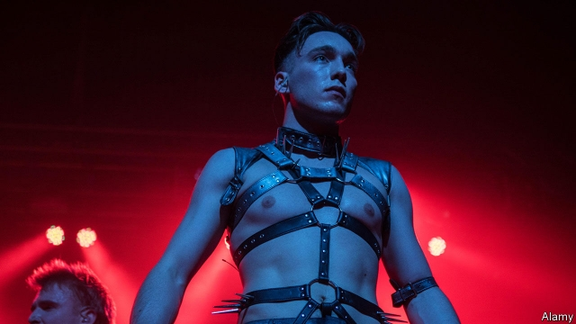

###### BDS meets BDSM

# When Eurovision goes to Israel 

##### Calls for a boycott of the kitschy contest have so far gone unanswered 

 

> May 2nd 2019 

“HATRED WILL prevail!” screams the man on stage, as two leather-clad women gyrate in cages behind him. On a pedestal above, a man in a black leotard slices the air with a staff shaped like a toilet plunger. Meet Hatari (pictured), a self-described “anti-capitalist, BDSM [bondage-discipline-sadism-masochism] techno band”. They are Iceland’s entry for this year’s Eurovision song contest, best known for featuring cheesy ballads and launching the careers of ABBA and Céline Dion. 

But Hatari are not in the spotlight for their bizarre appearance or performances. The band’s members have caused a stir by threatening to use their platform to criticise this year’s host, Israel, for its treatment of the Palestinians. They also challenged Binyamin Netanyahu, Israel’s prime minister, to a “friendly match of traditional Icelandic trouser grip wrestling”. (He appears to be ducking this intriguing challenge.) 

It might seem odd for Israel to be hosting Eurovision, given that it is not in Europe. But its broadcasting authority is a member of the European Broadcasting Union (EBU), which runs the event. (For the same reason, Morocco has competed in the past.) Israel’s representative, Netta Barzilai, won last year, so it gets to host this year. Hawks wanted the event to be held in the contested city of Jerusalem, which Israel calls its capital. But the state broadcasting authority and the EBU chose Tel Aviv. 

The singing doesn’t begin until May 14th, but the sniping started months ago. Leaders of the campaign for boycotts, divestment and sanctions against Israel, widely known as BDS, have called on artists and broadcasters to withdraw from the event. “Israel is using Eurovision to art-wash its egregious crimes against the Palestinian people,” says the movement. Dozens of British celebrities, such as Peter Gabriel and Roger Waters, signed a letter in January calling on the BBC to press for Eurovision to be relocated. Other artists have since come out against a boycott. 

The backdrop to all of this is an increasingly complicated relationship between Europe and Israel. Many European leaders are outspoken supporters of a Palestinian state and critical of Israeli policies in the occupied territories. Despite having a trade agreement with Israel, the EU requires that products made in Israeli settlements be labelled as such. Mr Netanyahu, for his part, talks of a “plague” of anti-Semitism in Europe. He has reached out to nationalist and far-right European politicians who are often more sympathetic to Israeli positions (though some have also used anti-Semitic rhetoric in the past). 

The politicisation of Eurovision is nothing new. The victory of a bearded drag queen from Austria upset social conservatives in Belarus and Russia in 2014. Russia was also peeved about Ukraine’s win in 2016 with a song about Josef Stalin’s deportation of Crimean Tatars. (Russia invaded and annexed Crimea in 2014.) In 2017 Ukraine banned Russia’s candidate, who had performed in Crimea; this year Ukraine’s act withdrew to avoid a ban on singing in Russia. 

No one has yet pulled out of this year’s event over the host country. But some fear Israel will not allow in contestants who have voiced pro-Palestinian views. Hatari think they might be banned by Eurovision’s organisers. The rules state that “no lyrics, speeches, gestures of a political, commercial or similar nature shall be permitted during the Eurovision Song Contest.” Save them for the wrestling match. 

-- 

 单词注释:

1.bds[]:abbr. 用硬纸板作封面（bound in boards） 

2.bdsm[]:abbr. 绑缚与调教、支配与臣服、施虐与受虐（bondage & discipline, dominance & submission, sadism & masochism） 

3.Eurovision['juәrәviʒәn]:n. 欧洲电视网 

4.Israel['izreil]:n. 以色列, 以色列后裔, 犹太人 

5.kitschy['kitʃi]:艺术上浅薄鄙俗但技巧娴熟的 

6.unanswered[.ʌn'ɑ:nsәd]:a. 未答复的, 无反应的 

7.gyrate['dʒaireit]:a. 旋涡状的 vi. 旋转, 不停地转动 

8.pedestal['pedistl]:n. 支柱, 基架, 基座, 基础 vt. 加座, 搁在台上, 支持, 提高...的地位 

9.leotard['li:әutɑ:d]:n. 紧身衣 

10.plung[]:n. 塞子, 插头 vt.塞 

11.techno[]:[计] 技术 

12.cheesy['tʃi:zi]:a. 干酪质的, 俊俏的, 优秀的 [医] 干酪样的 

13.ballad['bælәd]:n. 歌谣 

14.Abba['æbә]:n. 阿爸父(耶稣对上帝的尊称) 

15.dion['daiәn]:n. 聚脂 

16.spotlight['spɒtlait]:n. 照明灯, 反光灯, 聚光灯 

17.bizarre[bi'zɑ:]:a. 奇异的 

18.criticise['kritisaiz]:v. 批评, 吹毛求疵, 非难 

19.Palestinian[,pælis'tiniәn]:[经] 巴勒斯坦的 

20.binyamin[]:本雅明 

21.Netanyahu[]:n. 内塔尼亚胡（人名） 

22.Icelandic[.ais'lændik]:a. 冰岛的, 冰岛人的, 冰岛语的 n. 冰岛语 

23.trouser['trauzә]:a. 裤子的 

24.intrigue[in'tri:g]:n. 阴谋, 复杂的事 vi. 密谋, 私通 vt. 激起...的兴趣, 用诡计取得 

25.EBU[]:abbr. European Broadcast Union 欧洲广播联盟 

26.Morocco[mә'rɒkәu]:n. 摩洛哥, 摩洛哥皮革 [机] 摩洛哥革 

27.netta['netə]:n. 内特（女子名, 等于Nettie） 

28.barzilai[]: [人名] 巴尔齐莱 

29.Jerusalem[dʒә'ru:sәlәm]:n. 耶路撒冷 

30.tel[tel]:abbr. 试验仪器清单（Test Equipment List） 

31.Aviv[ɑ:'viv]:n. 大自然的重生 n. (Aviv)人名；(俄)阿维夫 

32.snipe[snaip]:n. 沙锥, 香烟屁股, 狙击, 街头流浪儿 vi. 猎鸟, 狙击, 诽谤 vt. 狙击 

33.divestment[dai'vestmәnt,di-]:n. (=divesfiture) 剥夺, 夺取 

34.sanction['sæŋkʃәn]:n. 核准, 制裁, 处罚, 约束力 vt. 制定制裁规则, 认可, 核准, 同意 

35.broadcaster['brɒ:dkæstә]:n. 播送者, 广播装置, 播种机 

36.egregious[i'gri:dʒiәs]:a. 异乎寻常的, 过分的, 惊人的 

37.Palestinian[,pælis'tiniәn]:[经] 巴勒斯坦的 

38.celebrity[si'lebrti]:n. 名声, 名人 

39.peter['pi:tә]:vi. 逐渐消失, 逐渐减少 

40.Gabriel['geibriәl]:n. 加百利(<<经经>>中七大天使之一) 

41.roger['rɔdʒә]:interj. 对!, 行!, 好! 

42.BBC[]:英国广播公司 

43.relocate[ri:'lәukeit]:vt. 重新安置, 再配置, 放在新地方 [计] 再定位; 浮动 

44.backdrop['bækdrɒp]:n. 背景幕, 背景 

45.supporter[sә'pɒ:tә]:n. 支持者, 后盾, 迫随者, 护身织物 [法] 支持者, 赡养者, 抚养者 

46.Israeli[iz'reili]:a. 以色列的, 以色列人(语)的 n. 以色列人 

47.EU[]:[化] 富集铀; 浓缩铀 [医] 铕(63号元素) 

48.plague[pleig]:n. 瘟疫, 天罚, 麻烦, 灾祸 vt. 折磨, 使苦恼, 使得灾祸 

49.nationalist['næʃәnәlist]:n. 国家主义者, 民族主义者 

50.rhetoric['retәrik]:n. 修辞, 修辞学, 雄辩(术) 

51.politicisation[]:[网络] 科学政治化 

52.Austria['ɒstriә]:n. 奥地利 

53.Belarus['belərəs]:n. 白俄罗斯, 白俄罗斯共和国 

54.peeve[pi:v]:v. (使)气恼, (使)焦躁, (使)忿怒 n. 麻烦的事物, 怨恨, 生气, 触怒 

55.Josef[]:n. 约瑟夫（人名） 

56.deportation[.di:pɒ:'teiʃәn]:n. 驱逐出境, 放逐 [法] 递解出境, 放逐, 驱逐 

57.crimean[krai'miәn]:a. 克里米亚半岛的 

58.tatar['tɑ:tә]:n. 鞑靼人[语] 

59.annex[ә'neks]:n. 附加物, 附属建筑物 vt. 附加, 盖(印), 并吞 

60.Crimea[krai'miә]:n. 克里米亚, 克里米亚半岛 

61.ukraine[ju(:)'krein]:n. 乌克兰（原苏联一加盟共和国, 现已独立） 

62.contestant[kәn'testәnt]:n. 竞争者 [法] 争辩者, 竞争者 

63.lyric['lirik]:n. 抒情诗, 歌词 a. 抒情的 

