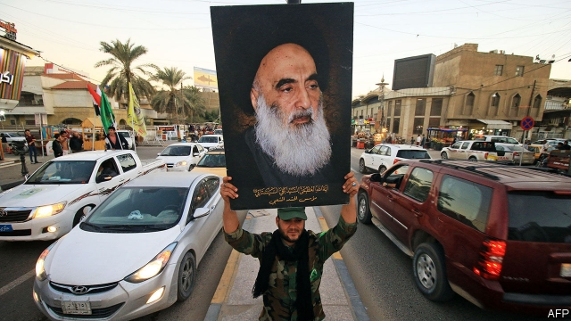
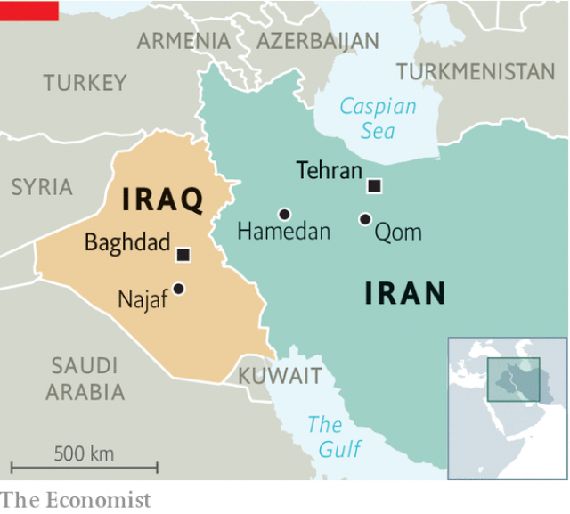

###### Battle of the ayatollahs

# Why Shia clerics are turning on Iran’s theocracy 

##### An economic crisis is making clerical rule look even less appealing 

 

> May 2nd 2019 

THE MURDER of an imam ought to provoke horror. But after a bodybuilder gunned down Mostafa Qassemi, a cleric in the western Iranian city of Hamedan, on April 27th over 100,000 people followed the killer on Instagram. Posts by his followers railed against Iran’s supreme leader, Ayatollah Ali Khamenei. “One less cleric,” women mutter on Tehran’s underground. 

Such is the anger at Iran’s ruling clerics, who preside over a shrinking economy. American sanctions on oil exports have sent the currency crashing. Inflation is near 40%; wages are falling in real terms. Basics such as chicken and clothes are becoming luxuries. The IMF forecasts that GDP will contract by 6% this year. The theocrats offer no way out of the crisis. “We’re approaching a turning point,” says Sadegh Haghighat of Mofid University in the Shia holy city of Qom. Clerics there increasingly question the system of velayat-e faqih, or clerical rule. 

Some clerics are distancing themselves from the regime, which corners much of Iran’s wealth through its vast business empire. Esmail Azarinejad, a poor cleric, drives around neglected villages distributing children’s books from the back of his old Peugeot. Others openly challenge the mullahs in charge. The following of Seyed Aghamiri, who says temporal power corrupts, grew after a clerical court defrocked him. Older sages have met with reformers. A growing number look to Iraq’s holy city of Najaf, 675km away, for a different model of mosque-state relations. 

For decades Najaf was Qom’s poor relation. Under Saddam Hussein, Iraq’s old dictator, yearly enrolment at its Shia seminaries dropped to just a few hundred, while Iran funded training for 110,000 clerics. But since the overthrow of Saddam, who was Sunni, and the return of relative calm to Iraq, Najaf’s prestige among Shias has soared. Its shrine of Imam Ali, founder of the Shia sect, attracts millions of pilgrims a year. Its colleges are free of state interference, unlike those in Qom. And it is the seat of the most popular Shia cleric, Grand Ayatollah Ali al-Sistani (pictured). 

 

Mr Sistani champions the separation of mosque and state. Clerics should advise, he says, not rule. Revered as Shiism’s pre-eminent marja, or religious reference, Mr Sistani has influence in Qom too. Last month Ayatollah Abdollah Javadi-Amoli, a conservative stalwart in Qom, said the quality of teaching is better in Najaf. Senior Iranian clerics are moving there, including Ali Khomeini, the respected grandson of the Islamic Republic’s founder. “If you’re under the heavy hand of Iran’s religious establishment, which tells you what to think and what to wear, it makes you look to the intellectual freedom of Najaf,” says Abbas Kadhim, Mr Sistani’s biographer. 

In March Hassan Rouhani travelled to Najaf, becoming the first Iranian president to meet Mr Sistani. By law Mr Rouhani’s allegiance should be to Mr Khamenei, but he hoped Mr Sistani’s blessing would boost his standing in the face of pressure from hardliners. An observer said it looked as if the president was meeting the pope. “Rouhani is sending a signal that there’s room in the Islamic republic for those who don’t believe the rule of the [Islamic] jurist is an article of faith,” says Robert Gleave of Exeter University in Britain. 

If so, some in Iraq want to help him out. “Velayat-e faqih is a dictatorial regime,” says Saleh al-Hakeem, a globe-trotting cleric from Najaf. “The clerics of Najaf should support civil society in Iran, not theocracy.” Mr Sistani, himself an Iranian national, is more cautious. But after his meeting with Mr Rouhani he called for Iraqi sovereignty to be respected. Clerical casuists understood that as a criticism of Mr Khamenei’s claim to be supreme leader not just of Iran, but of all Shias. 

Mr Sistani is quietly projecting his influence. His representative (and son-in-law) in Qom, Jawad al-Shahristani, collects tithes from Iranian followers and funds a countrywide charitable network that includes poor houses and hospitals. Mr Sistani also supports 49,000 religious students, about 45% of Iran’s total, with stipends. Short of cash, Mr Rouhani, meanwhile, has cut seminary funding by a third. “Mr Sistani’s office is very powerful in Qom,” says Mr Haghighat. 

Mr Khamenei is responding by tightening his grip. In March he installed Ebrahim Raisi, a hardliner who lost to Mr Rouhani in the last election, as chief justice. He appointed another hardliner to head the Expediency Council, his government watchdog. Conservative ideologues get airtime on state television, where they chide clerics for losing faith in velayat-e faqih. The doubters have their funding cut or are demoted by the Society of Seminary Teachers of Qom, a state regulator. Some have had their offices ransacked. The worst offenders are hauled before a clerical court and held under house arrest. 

Most of Qom’s top clerics, each more learned than Mr Khamenei, have begun to bite their tongues or speak in riddles. But the more coercive Mr Khamenei’s rule gets the more attractive Mr Sistani’s teachings appear. Far from elevating clerics, say dissidents, Mr Khamenei’s bullies treat them like state functionaries. “The Islamic Republic’s crackdown on the clergy has reached an extent unprecedented even under the Shah,” says Mohsen Kadivar, a scholar from Qom now in America. 

Ayatollahs tend to live long lives, but Mr Sistani is 88 and Mr Khamenei is 80 (and said to be fighting cancer). The question their followers often ask is what comes next. For years it seemed as though clerics in Qom would determine the future of religious leadership in Najaf. Now the talk is of the clerics in Najaf shaping the future of Iran’s clerical rule. 

-- 

 单词注释:

1.ayatollah[,aɪə'tɒlə]:n. 阿亚图拉（对伊朗等国伊斯兰教什叶派领袖的尊称） 

2.shia[]:n. 什叶；什叶派（等于Shiah） 

3.cleric['klerik]:a. 牧师的, 教士的 

4.theocracy[θi'ɒkrәsi]:n. 神权政治, 神权国 

5.clerical['klerikәl]:n. 牧师 a. 文书的, 事务上的, 抄写员的, 牧师的 

6.les[lei]:abbr. 发射脱离系统（Launch Escape System） 

7.imam[i'mɑ:m]:n. 阿訇, 伊玛目 

8.provoke[prә'vәuk]:vt. 激怒, 惹起, 诱导 [法] 刺激, 煽动, 激怒 

9.bodybuilder[]:n. 健美运动者；锻炼肌肉者 

10.mostafa[]:n. (Mostafa)人名；(伊朗)穆斯塔法；(阿拉伯)穆斯塔法 

11.Iranian[i'reiniәn]:a. 伊朗的, 伊朗语系的 n. 伊朗人, 伊朗语 

12.Hamedan[]:[网络] 哈马丹；哈麦丹；哈玛丹市 

13.killer['kilә]:n. (非正式)杀人者, 屠杀者, 猛兽, 致死(疾病), 杀手, 止痛药, 限制器, 瞄准器 [计] 删除程序; 断路器 

14.Instagram[]:一款图片分享应用 

15.follower['fɒlәuә]:n. 从者, 属下, 追补者 [电] 随动机 

16.ayatollah[,aɪə'tɒlə]:n. 阿亚图拉（对伊朗等国伊斯兰教什叶派领袖的尊称） 

17.ALI[]:[计] 异步线路接口 

18.Khamenei[]:n. (Khamenei)人名；(伊朗)哈梅内伊 

19.preside[pri'zaid]:vi. 统辖, 当主人, 主持 [法] 主持, 负责, 指挥 

20.sanction['sæŋkʃәn]:n. 核准, 制裁, 处罚, 约束力 vt. 制定制裁规则, 认可, 核准, 同意 

21.inflation[in'fleiʃәn]:n. 胀大, 夸张, 通货膨胀 [化] 充气吹胀; 膨胀 

22.IMF[]:国际货币基金组织 [经] 国际货币基金 

23.theocrat['θi:әkræt]:n. 神权政治家, 神政主义者 

24.sadegh[]:[网络] 萨迪克 

25.mofid[]:[网络] 莫桑比克第一发展有限公司；莫桑比克第一国际；菲德 

26.Qom[kәjm]:库姆[伊朗西北部城市](什叶派穆斯林的圣城) 

27.faqih[]:[网络] 法基赫；教法学家；询求伊斯兰教法师 

28.regime[rei'ʒi:m]:n. 政权, 当权期间, 政体, 社会制度, 体制, 情态 [医] 制度, 生活制度 

29.esmail[]: [医]Medazepan; [人名] 伊斯梅尔 

30.peugeot[]:n. 法国标致（法国汽车公司） 

31.openly['әjpәnli]:adv. 公开地, 坦率地, 直率地, 公然地 

32.mullah['mʌlә]:n. 毛拉 

33.sey[sai]:n. 一块牛肉 

34.Aghamiri[]:[网络] 阿哈米里 

35.temporal['tempәrәl]:a. 时间的, 暂时的, 现世的, 世俗的, 颞的, 太阳穴的 n. 世间万物, 教会财产 

36.defrock[di'frɔk]:v. 剥去法衣, 解除僧职 

37.sage[seidʒ]:n. 圣人, 哲人, 鼠尾草属植物 a. 贤明的, 明智的 

38.reformer[ri'fɒ:mә]:n. 改革家, 改革运动者 [化] 转化炉; 转化器; 重整器; 重整炉 

39.Najaf['nædʒæf]:纳贾夫[伊拉克中南部城市](伊斯兰教什叶派圣地) 

40.saddam[]:n. 萨达姆（伊拉克前总统） 

41.Hussein[]:n. 侯赛因（姓氏） 

42.dictator['dikteitә]:n. 命令者, 独裁者 

43.enrolment[in'rәulmәnt]:n. 登记, 注册, 入伍, 入学, 入会, 注册人数, 入学人数 

44.seminary['seminәri]:n. 神学院, 发源地 

45.Iran[i'rɑ:n]:n. 伊朗 

46.overthrow[.әuvә'θrәu]:n. 推翻, 瓦解, 倾覆 vt. 打倒, 推翻, 倾覆 

47.Sunni['suni:]:n. 〈伊斯兰〉逊尼派教徒 

48.Iraq[i'rɑ:k]:n. 伊拉克 

49.prestige[pre'sti:ʒ]:n. 声望, 威望, 威信 [经] 商誉, 声誉 

50.shia[]:n. 什叶；什叶派（等于Shiah） 

51.soar[sɒ:]:n. 高扬, 翱翔 vi. 往上飞舞, 高耸, 翱翔 

52.shrine[ʃrain]:n. 圣地, 神龛, 庙 vt. 将...置于神龛内 

53.imam[i'mɑ:m]:n. 阿訇, 伊玛目 

54.founder['faundә]:n. 创立者, 建立者 vt. 使沉没, 使摔倒, 弄跛, 浸水, 破坏 vi. 沉没, 摔到, 变跛, 倒塌, 失败 

55.sect[sekt]:n. 宗派, 教派 

56.pilgrim['pilgrim]:n. 旅行者, 朝圣者, 香客 vi. 朝圣 

57.sistani[]:[网络] 西斯塔尼；锡斯坦尼 

58.mosque[mɒsk]:n. 清真寺 

59.rever[]:n. 作梦（歌名） 

60.marja[]:n. (Marja)人名；(芬、波)玛丽亚 

61.abdollah[]:[网络] 阿卜杜拉赫 

62.stalwart['stɒ:lwәt]:n. 健壮的人 a. 高大结实的, 坚定的 

63.Khomeini[]:霍梅尼（人名） 

64.Islamic[iz'læmik]:a. 伊斯兰教的, 穆斯林的 

65.Abba['æbә]:n. 阿爸父(耶稣对上帝的尊称) 

66.kadhim[]:[网络] 卡德姆 

67.biographer[bai'ɒgrәfә]:n. 传记作者 

68.Hassan[]:n. 哈山（男子名） 

69.rouhani[]:n. (Rouhani)人名；(伊朗)鲁哈尼 

70.allegiance[ә'li:dʒәns]:n. 忠贞, 效忠 

71.hardliner[ˌhɑ:d'laɪnə(r)]:n. 强硬路线者 

72.pope[pәup]:n. 罗马教皇, 主教 

73.jurist['dʒuәrist]:n. 法学家, 法律学者, 法律著作家 [法] 法学家, 律师, 法官 

74.Robert['rɔbәt]:[法] 警察 

75.gleave[]:[网络] 格里夫 

76.exeter['eksәtә]:n. 埃克塞特（英国英格兰西南部城市） 

77.dictatorial[diktә'tɒ:riәl]:a. 独裁者的, 独裁的, 独断的 

78.Saleh[]:n. 萨利赫（人名） 

79.Iraqi[i'rɑ:ki]:n. 伊拉克人, 伊拉克阿拉伯语 a. 伊拉克的, 伊拉克人的 

80.sovereignty['sɒvrәnti]:n. 主权, 独立国 [法] 主权, 主权国家, 统治权 

81.clerical['klerikәl]:n. 牧师 a. 文书的, 事务上的, 抄写员的, 牧师的 

82.casuist['kæzjuist]:n. 决疑论者, 诡辩家 

83.quietly['kwaiәtli]:adv. 安静地, 沉着地, 秘密地 

84.jawad[]:[网络] 贾瓦德；哲瓦德；贾华德 

85.tithe[taið]:n. 什一税, 十分之一, 小部分 vt. 课什一税 vi. 缴什一税 

86.countrywide['kʌntriwaid]:a. 全国范围的 

87.charitable['tʃæritәbl]:a. 大慈大悲的, 宽厚的, 慈善的 [法] 慈善的, 慷慨的, 宽恕的 

88.stipend['staipend]:n. 薪金, 定期生活津贴 [经] 薪水 

89.tighten['taitn]:vt. 勒紧, 使变紧 vi. 变紧, 绷紧 

90.ebrahim[]:[网络] 伊卜拉欣 

91.expediency[ik'spi:djәnsi]:n. 权宜, 方便, 私利 

92.watchdog['wɒtʃdɒg]:n. 看门狗, 监察人 [化] 监控设备; 监视器 

93.ideologue['aidi:әulɔ^]:n. 理论家, 思想家,空想家 

94.airtime['eәtaim]:电影或电视节目开始的时间 

95.chide[tʃaid]:v. 斥责, 责骂 

96.doubter['dautә]:n. 抱怀疑态度的人；不信宗教的人；怀疑论者 

97.demote[.di:'mәut]:vt. 使降级, 使降职 

98.seminary['seminәri]:n. 神学院, 发源地 

99.regulator['regjuleitә]:n. 调整者, 校准者, 校准器, 调整器, 标准钟 [化] 调节剂; 调节器 

100.ransack['rænsæk]:vt. 到处搜索, 遍寻, 掠夺, 洗劫 [法] 洗劫, 抢劫, 掠夺 

101.offender[ә'fendә]:n. 罪犯, 无礼的人, 得罪人的人 

102.haul[hɒ:l]:n. 用力拖拉, 拖运, 强拉, 捕获量, 拖运距离 vi. 拖, 拉, 改变方向, 改变主意 vt. 拖拉, 拖运 

103.coercive[kәu'ә:siv]:a. 强制的, 强压的, 强迫的 [法] 强制的, 强迫的, 强行的 

104.elevate['eliveit]:vt. 举起, 提拔, 鼓舞 

105.dissident['disidәnt]:a. 意见不同的, 持不同政见的 n. 意见不同的人, 持不同政见者 

106.bully['buli]:n. 欺凌弱小者, 土霸 vt. 威胁, 恐吓, 欺负 vi. 欺负 a. 特好的, 第一流的 adv. 十分 

107.functionary['fʌŋkʃәnәri]:n. 职员, 负责人员, 官员 a. 机能的, 作用的, 职务的 

108.crackdown['krækdaun]:n. 制裁, 镇压, 痛击 

109.clergy['klә:dʒi]:n. 牧师, 僧侣, 神职人员 

110.unprecedented[.ʌn'presidentid]:a. 空前的 [经] 空前的, 无前例的 

111.shah[ʃɑ:]:n. 沙(伊朗国王的称号) 

112.mohsen[]:[网络] 联系人；毛森；莫桑 

113.kadivar[]:[网络] 卡迪瓦尔 

