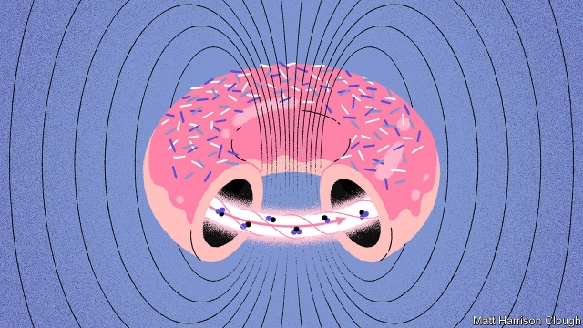
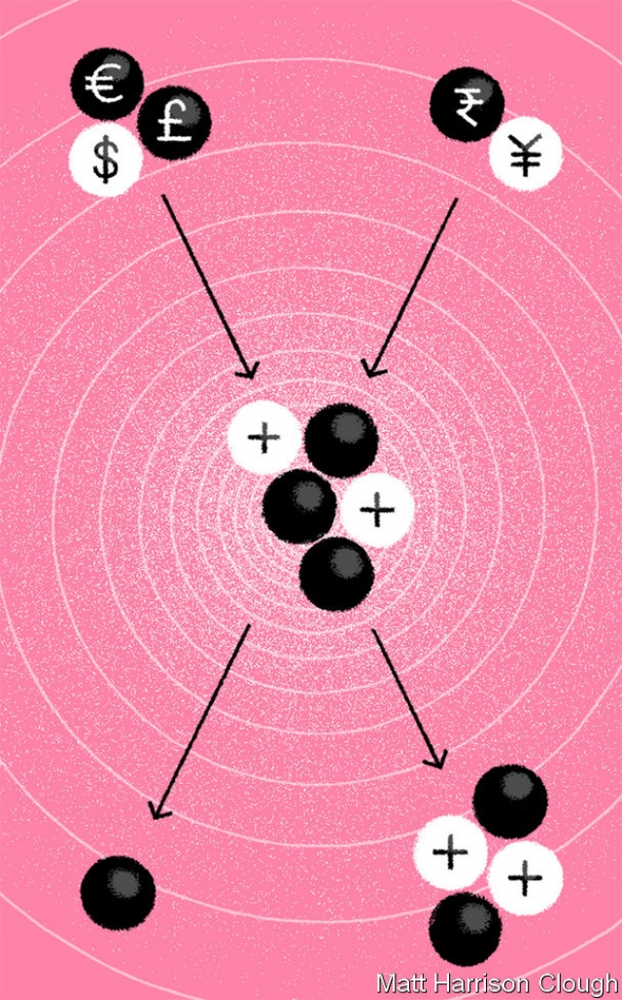

###### Alternative energy

# Fusion power is attracting private-sector interest 

##### Reactor designs are inspired by everything from smoke rings to shrimps 

 

> May 2nd 2019 

IN 1920 Arthur Eddington, an English astrophysicist, gave a lecture to the British Association for the Advancement of Science on the internal structure of stars. In it, he hypothesised that what makes the sun shine—then a matter of much debate—was some sort of nuclear reaction. “This reservoir”, he said, “can scarcely be other than the subatomic energy which, it is known, exists abundantly in all matter; we sometimes dream that man will one day learn how to release it and use it for his service. The store is well nigh inexhaustible, if only it could be tapped.” 

Eddington speculated that the energy in question was released by the nuclei of hydrogen atoms fusing to form the nuclei of helium atoms. He knew that a helium nucleus weighs slightly less than four hydrogen nuclei and he suspected that the difference, converted into energy according to the then-recently discovered formula, E=mc2, would be enough to power the sun. He was right about this. He was also right about people’s dreams of exploiting it. They began looking shortly after Eddington’s speculations were confirmed, and they still dream of it today—for the fuel needed is abundant, and the process of generation carbon-free. 

In one important aspect, though, the dream of human-controlled nuclear fusion has changed in recent years. From Zeta, the first, fumbling attempt to build a fusion reactor, at Harwell in southern England, in the 1950s, to Iter, the latest over-budget, over-deadline behemoth in the south of France (see article), fusion has been the province of governments. Not any more. Now there is commercial interest. Firms in North America and Europe are designing and planning to build what they hope will be profitable fusion reactors. Their projects have different approaches and different amounts of money behind them. But they all have one thing in common, a desire to bury the old joke that commercial fusion power is 30 years away—and always will be. 

In light of the work of Eddington and his successors fusion power on Earth is often described as mimicking the process which powers the sun. That is not quite true. Solar fusion builds up helium nuclei, which are composed of two protons and two neutrons, one particle at a time out of individual protons, the nuclei of hydrogen atoms—with the surplus positive electric charges being spirited away by particles of antimatter called positrons. The average period required to complete this reaction is about a billion years. 

Fortunately, there is a short cut. This is to employ hydrogen atoms pre-loaded with neutrons—either one (deuterium) or two (tritium). One in every 6,000 hydrogen atoms on Earth is actually deuterium, meaning the substance can be extracted from water. Tritium, which is radioactive, is much rarer and has to be synthesised. But the process is easy and the raw material, lithium, abundant. 

Deuterium and tritium react together far more readily than do naked protons—and no positrons are involved. The result is helium and a spare neutron. All you need do to create a fusion reactor, therefore, is design and build a device that can contain a mixture of deuterium and tritium at the temperatures and densities required for long enough for the reaction to yield more energy than is put into promoting it. In any given machine these parameters of temperature, density and time can be traded off against each other. Their optimal mix in a given set of circumstances is known as the Lawson criterion, after John Lawson, who was associated with Zeta. 

These days most attempts to achieve the Lawson criterion are made using machines called tokamaks, which were devised in the 1950s by Andrei Sakharov, a Soviet physicist who later became famous as a human-rights campaigner. And it is the tokamak route that several of the commercial fusion-power wannabes are travelling along. One such is Commonwealth Fusion Systems (CFS), a spin-out from the plasma physics laboratory of the Massachusetts Institute of Technology, in Cambridge, Massachusetts. Another is Tokamak Energy, a spin-out from the UK Atomic Energy Authority’s research laboratory at Culham—Harwell’s successor. 

A conventional tokamak is a hollow torus, reminiscent of a doughnut or a bagel, with superconducting electromagnets wound around it. This torus contains the fuel, which is a plasma (a gas in which the electrons and atomic nuclei have been separated) that is composed of deuterium and tritium. The magnets serve both to heat the plasma and to confine it—thus maintaining its density and keeping it away from the torus wall, for if it touches the wall it instantly cools down. 

Tokamaks are normally large machines. Iter’s torus, for example, will have a volume of 830 cubic metres. The CFS reactor’s torus, though, will have about a sixty-fifth of the volume of Iter’s. It can get away with such a small volume because it has more powerful magnets that squeeze the plasma more tightly. As a bonus, these magnets become superconducting at relatively high temperatures, so can be cooled using liquid nitrogen, which is cheap, rather than liquid helium, which is expensive. 

Tokamak Energy’s researchers have also been using nitrogen-cooled superconductors for their magnets. The firm has, however, eschewed the conventional shape of a tokamak in favour of something that, while still having a hole in the middle, more resembles a cored apple. Theory suggests plasma in such “spherical” toruses will remain more stable, and thus be easier to handle, than that in the doughnut-shaped variety. Also in contradistinction to CFS, Tokamak Energy has already built a series of working prototypes. The latest, ST40, has reached a plasma temperature of 15m°C. The company’s target is to reach 100m°C within the next few years. That is two-thirds of the way to the 150m°C a tokamak needs to achieve the Lawson criterion. 

Tokamaks are not, however, the only reactors in town. In Vancouver, Canada, a firm called General Fusion is working on one that uses a phenomenon called field-reversed configuration (FRC). In this the confining magnetism is generated by the movement of the electrically charged particles in the plasma itself, as that plasma spins in a vortex similar to a smoke ring. 

 

In General Fusion’s machine the spinning plasma is, after it has been fired into a spherical reaction chamber, compressed rapidly by the simultaneous release of hundreds of pistons attached to the chamber’s exterior. These induce a shock wave that compresses the deuterium-tritium fuel, increasing its density a thousandfold and pushing its temperature up from 5m°C to 150m°C. Improving these two parameters of the Lawson calculation means that the brevity of the third, time, no longer matters. That, at least, is the theory. Christofer Mowry, General Fusion’s boss, hopes to demonstrate the truth of it by building an experimental plant within five years. 

Another firm using the FRC approach is TAE Technologies, of Foothill Ranch, California. TAE’s latest device, unveiled in July 2017, is a 25-metre-long machine named Norman, after Norman Rostoker, a plasma physicist at the University of California, Irvine, who was the company’s founder and who died in 2014. 

Norman is a cylindrical reactor. Plasma injectors at each end of the cylinder fire FRCs simultaneously towards each other at around 1m kilometres a second. When the vortices meet, they merge into a cigar-shaped cloud three metres long and around half a metre wide that is kept spinning, and thus hot and stable, by beams of deuterium atoms fired into it from outside. 

So far, Norman has produced vortices with temperatures of 3.5m°C that last around ten milliseconds, rather than the microseconds of a conventional FRC. TAE hopes, by the end of this year, to have increased that temperature to around 30m°C, and tripled the plasma’s lifetime. All of which is clever. But what makes the firm’s approach special is that it plans to eschew deuterium and tritium in favour of normal hydrogen (the nucleus of which is a lone proton) and boron. Instead of a helium nucleus and a neutron, this reaction produces three helium nuclei. Indeed, TAE was originally known as Tri Alpha Energy because, in the field of nuclear physics, naked helium nuclei are called alpha particles. 

The absence of neutrons is crucial. When deuterium-tritium fusion takes place in a tokamak about 80% of the energy released is carried away by the neutrons. In a practical power station this kinetic energy would be collected by absorbing the neutrons in a suitable material, thus releasing the energy of motion as heat. That heat would be used to raise steam and drive a turbine. If the absorbing material chosen were lithium, this arrangement would have the bonus of generating new tritium to feed back into the reaction. 

The downside of such an approach is that the rest of the reactor will absorb neutrons as well, making the whole thing radioactive (though nothing like as radioactive as a conventional fission reactor) and ultimately damaging its structure. Also, each step in the process loses energy. The proton-boron method offers a more elegant way to generate electricity because alpha particles are positively charged, and can thus induce a current directly in an external conductor. No heating is involved and the alpha particles never escape to cause damage elsewhere. 

There is, of course, a catch. Proton-boron fusion requires temperatures of billions of degrees. That is an order of magnitude hotter than anything achieved so far in a fusion experiment. And although such plasma temperatures have been produced in laboratories in other circumstances, how TAE will do it with the equipment they are using is unclear. 

TAE is radical in its choice of fuel. But other forms of fusion radicalism are possible, too. And, in the actual design of its reactor, the most radical of the lot is probably the path being pursued by First Light Fusion—spun out of Oxford University. Though First Light’s process aims to extract energy from a conventional mixture of deuterium and tritium, the technology it plans to use to do so was inspired by a shrimp. 

Pistol shrimps are marine crustaceans that are among the loudest animals on the planet. Their noise is generated by a specialised claw half as long as the creature’s body, and is used to stun prey. When the claw snaps shut, the rapid change in pressure this creates produces vapour-filled voids called cavitation bubbles in the surrounding water. When these bubbles collapse the shock waves produce a sound as powerful as the noise made by a Saturn V rocket taking off. This is enough to kill small fish—which the shrimps then eat. 

Pistol shrimps were the subject of the doctorate awarded by Oxford to Nicholas Hawker, First Light’s founder. Armed with the results of his study, Dr Hawker wondered if he could scale up the shrimp’s technique to create plasmas that would meet the Lawson criterion. 

The core of First Light’s reactor design is a device in which one half of a pistol shrimp’s claw is replaced by a projectile made from a small disc of aluminium or copper. This is fired, at around 30km a second, at the replacement for the other half of the claw, a 10mm-sided cube that contains a cavity filled with fuel. The projectile’s impact creates shock waves, and thus cavitation bubbles, in the fuel. As those bubbles collapse the deuterium and tritium within them will, calculations suggest, be forced into a small enough space for long enough to fuse. Whether those calculations are correct will be tested later this year. 

There is, then, no shortage of ideas about how a practical fusion reactor might be built. But any investor also faces the question of how long it will take to get a new idea to work. In the field of fusion, the most crucial milestone on that road is probably the achievement of gain. This is the point when more energy comes out of a fusing plasma than went into creating it. 

Everyone talks a good story about this. CFS wants to achieve gain by 2025. So does Tokamak Energy. TAE’s next device, Copernicus, will, the firm says, not only achieve gain, but will also be a power-station demonstrator. Indeed, TAE aspires to supply fusion-based electricity to the grid by 2030. Which is also the year that Tokamak Energy says it will start generating grid-scale electricity—from power plants with a capacity of the order of 100MW. First Light Fusion predicts that reactors using its technology will be in place some time in the 2030s. 

All this optimism should be viewed cautiously, especially from companies that need to raise capital for future experiments. Capital is, however, being raised. TAE has rustled up $600m in private funding so far. General Fusion has raised over $100m, Tokamak Energy £50m ($65m) and First Light, which is still at the earliest stages of progress, £25m. 

Challenges no doubt lie ahead. As Stephen Dean, of Fusion Power Associates, a foundation that follows the field, observes, “the history of fusion doesn’t give you a lot of confidence that there won’t be a problem. You know we’ve been at it for 50 years and there’s always been a problem.” Nevertheless, he also says that he knows of no showstoppers for any of the private companies. “They’re all based on good physics. They’re all good people that are doing these programmes.” And the prize is enormous. If even one of the fusion startups succeeds, the world’s electricity supply will be guaranteed—and carbon free—for ever. 

-- 

 单词注释:

1.fusion['fju:ʒәn]:n. 熔合物, 结合, 熔合 [化] 熔融; 熔化; 聚变 

2.reactor[ri'æktә]:n. 反应者, 反应器, 反应堆, 电抗器 [化] 反应釜; 反应锅 

3.shrimp[ʃrimp]:n. 虾, 小虾, 矮子 vi. 捕小虾 

4.arthur['ɑ:θә]:n. 亚瑟（男子名）；亚瑟王（传说中六世纪前后英国的国王, 圆桌骑士团的首领） 

5.Eddington['ediŋtәn]:埃丁顿(姓氏) 

6.astrophysicist[.æstrәu'fizisist]:n. 天体物理学家 

7.advancement[әd'vɑ:nsmәnt]:n. 前进, 进步, 提升 [医] 徙前术 

8.hypothesise[haɪ'pɒθɪsaɪz]:v. （英）假定；设定；假设（等于hypothesize） 

9.reservoir['rezәvwɑ:]:n. 贮水池, 贮藏处, 贮备, 水库 vt. 储藏 

10.subatomic['sʌbә'tɔmik]:a. 逊原子的, 原子内的, 比原子更小的 [化] 亚原子的 

11.abundantly[ә'bʌndәntli]:adv. 大量地, 丰富地 

12.nigh[nai]:a. 在附近的 adv. 在附近地 prep. 近于 

13.inexhaustible[.inig'zɒ:stәbl]:a. 用不完的, 无穷尽的, 不知疲倦的 

14.speculate['spekjuleit]:vi. 深思, 推测, 投机 [经] 投机 

15.fuse[fju:z]:n. 保险丝, 导火线 v. 熔化, 融合 

16.helium['hi:liәm]:n. 氦 [化] 氦 

17.les[lei]:abbr. 发射脱离系统（Launch Escape System） 

18.speculation[.spekju'leiʃәn]:n. 沉思, 推测, 投机 [经] 投机交易, 买空卖空 

19.fusion['fju:ʒәn]:n. 熔合物, 结合, 熔合 [化] 熔融; 熔化; 聚变 

20.zeta['zi:tә. 'zei-]:n. 希腊语第六个字母 

21.fumble['fʌmbl]:n. 摸索, 笨拙的行动, 漏球 vt. 摸索, 乱摸, 笨拙的处理, 漏接(球) vi. 摸索, 笨手笨脚, 漏球 

22.reactor[ri'æktә]:n. 反应者, 反应器, 反应堆, 电抗器 [化] 反应釜; 反应锅 

23.Harwell[]:n. (Harwell)人名；(英)哈韦尔 

24.iter[]:[医] 导管, 通路 

25.behemoth[bi'hi:mɔθ]:n. 庞然大物 

26.alway['ɔ:lwei]:adv. 永远；总是（等于always） 

27.successor[sәk'sesә]:n. 继承者, 接任者 [计] 后继 

28.mimick[]:vt. 模仿, 摹拟 

29.proton['prәutɒn]:n. 质子 [化] 质子 

30.neutron['nju:trɒn]:n. 中子 [化] 中子 

31.antimatter['ænti.mætә]:n. 反物质 [化] 反物质 

32.positron['pɒzitrɒn]:n. 正电子 [化] 正子; 正电子 

33.deuterium[dju:'tiәriәm]:n. 氘, 重氢 [化] 氘; 重氢 

34.tritium['tritiәm]:n. 氚 [化] 氚 

35.extract[ik'strækt]:n. 榨出物, 精汁, 摘录, 选段 vt. (费力地)取出, 采掘, 榨取, 摘录, 吸取 [计] 提取 

36.tritium['tritiәm]:n. 氚 [化] 氚 

37.synthesise['sinθisaiz]:vt.vi. 综合, 合成, 接合 vt. 用合成法合成, 综合地处理 

38.lithium['liθiәm]:n. 锂 [化] 锂Li 

39.deuterium[dju:'tiәriәm]:n. 氘, 重氢 [化] 氘; 重氢 

40.parameter[pә'ræmitә]:n. 参变数, 参变量, 参数, 参量 [计] 参量; 参数 

41.optimal['ɒptimәl]:a. 最佳的, 最理想的 [化] 最优的 

42.Lawson['lɔ:sn]:n. [姓氏] 劳森 

43.john[dʒɔn]:n. 盥洗室, 厕所, 嫖客 

44.Tokamak['tɔkәmæk]:[化] 托卡马克; 托卡马克磁约束聚变环流器 

45.Andrei[]:安德烈（人名） 

46.Sakharov[]:n. (Sakharov)人名；(俄)萨哈罗夫 

47.campaigner[kæm'peinә]:n. 从军者, 老兵, 竞选者 

48.wannabe[ˈwɒnəbi]:n. 赶超崇拜者, 赶超崇拜者的人 

49.commonwealth['kɔmәnwelθ]:n. 共和国；联邦；国民整体 

50.CF[]:[医] 克里斯马斯因子, 补体结合 

51.plasma['plæzmә]:n. 血浆, 淋巴液, 原生质, 等离子体 [化] 等离体; 等离子体 

52.physic['fizik]:n. 药品, 泻药, 医学 vt. 给...服药, 治愈, 使通便 

53.Massachusetts[.mæsә'tʃu:sits]:n. 麻萨诸塞州 

54.Cambridge['keimbridʒ]:n. 剑桥 

55.Tokamak['tɔkәmæk]:[化] 托卡马克; 托卡马克磁约束聚变环流器 

56.UK[ju: 'kei]:n. 联合王国 

57.torus['tɒ:rәs]:n. 花托, 隆凸, 环面 [化] 螺绕环 

58.reminiscent[.remi'nisnt]:a. 回忆的, 怀旧的 n. 往事叙述者, 回忆录作者 

59.doughnut['dәunʌt]:n. 油炸圈饼, 环状物 [计] 圆环图 

60.bagel['beiɡәl]:n. 百吉饼（先蒸后烤的发面圈）；[俚]（体育比赛中）零蛋 

61.superconducting[,sju:pәkәn'dʌktiŋ]:a. 超导的, 超导电的 [计] 超导 

62.electromagnet[i.lektrәu'mægnit]:n. 电磁石 [化] 电磁体; 电磁铁 

63.tightly['taitli]:adv. 紧紧地, 坚固地 

64.superconductor[,sju:pәkәn'dʌktә]:n. 超导体, 超导电体 [计] 超导体 

65.eschew[is'tʃu:]:vt. 避开, 远避 

66.spherical['sferikl]:a. 球的, 球面的, 球状的, 天体的 [医] 球形的, 球状的 

67.toruses['tɔːrəs]:n. [植] 花托；圆环面；[解剖] 隆凸 

68.contradistinction[,kɔntrәdis'tiŋkʃәn]:n. 对比的区别 

69.sery[]:n. (Sery)人名；(俄)谢雷；(科特)塞里 

70.prototype['prәutәtaip]:n. 原型 [计] 样机; 原型 

71.vancouver[væn'ku:vә]:n. 温哥华（加拿大主要港市） 

72.configuration[kәn.figju'reiʃәn]:n. 结构, 表面配置, 外形, 配置 [计] 配置 

73.FRC[]:abbr. 货物交与承运人价格（Free Carrier-Named Point）；阻燃粘胶纤维 

74.magnetism['mægnitizm]:n. 磁性, 吸引力, 磁学, 催眠术 [化] 磁学 

75.electrically[i'lektrikәli]:adv. 电力地；有关电地 

76.vortex['vɒ:teks]:n. 旋涡, 旋风, 涡流 [化] 涡旋 

77.simultaneous[.simәl'teinjәs]:a. 同时的, 同时发生的 [计] 同时的 

78.piston['pistәn]:n. 活塞, 活塞阀键 [医] 活塞(如注射器的) 

79.induce[in'dju:s]:vt. 引诱, 招致, 归纳出, 感应 [医] 诱导, 感应 

80.thousandfold['θauznd'fәuld]:a. 千倍的 adv. 千倍地, 成千倍 

81.brevity['breviti]:n. 短暂, 简短 

82.mowry[]: [人名] 莫里 

83.tae[]:abbr. 教学质量评估（Teaching Assessment Exercise）；全部预测支出（Total Anticipated Expenditures ）；测试接入设备（Test Access Equipment） 

84.foothill['futhil]:n. 山麓小丘 

85.ranch[ræntʃ. rɑ:ntʃ]:n. 大牧场 v. 经营牧场 

86.California[.kæli'fɒ:njә]:n. 加利福尼亚 

87.unveil[.ʌn'veil]:vt. 揭开, 揭幕, 除去...的面纱 vi. 显露, 除去面纱 

88.norman['nɔ:mәn]:a. 诺曼第语的；诺曼第人的 

89.irvine['\\:vin]:n. [美俚]警官 

90.founder['faundә]:n. 创立者, 建立者 vt. 使沉没, 使摔倒, 弄跛, 浸水, 破坏 vi. 沉没, 摔到, 变跛, 倒塌, 失败 

91.cylindrical[si'lindrik(ә)l]:a. 圆柱体的, 圆筒形的 [计] 圆柱形的, 圆柱体的, 圆筒形的, 柱面的 

92.plasma['plæzmә]:n. 血浆, 淋巴液, 原生质, 等离子体 [化] 等离体; 等离子体 

93.injector[in'dʒektә]:n. 注射者, 注射器, 注水器 [化] 注射器; 喷射器 

94.cylinder['silindә]:n. 圆筒, 圆筒状物, 汽缸, 柱面 [计] 柱面 

95.frcs[]: 皇家外科学会会员 

96.simultaneously[simәl'teiniәsly; (?@) saim-]:adv. 同时发生, 一齐, 同时, 同时存在 

97.merge[mә:dʒ]:vt. 使合并, 使消失, 吞没 vi. 合并, 渐渐消失 [计] 合并 

98.millisecond['mili,sekәnd]:n. 毫秒 [计] 毫秒 

99.microsecond['maikrәusekәnd]:n. 微秒 [计] 微秒 

100.triple['tripl]:n. 三倍数, 三个一组 a. 三倍的 vt. 使增至三倍 vi. 增至三倍 

101.lone[lәun]:a. 孤单的, 孤立的, 单身的, 寂寞的 

102.boron['bɒ:rɒn]:n. 硼 [化] 硼B 

103.originally[ә'ridʒәnli]:adv. 本来, 原来, 最初, 就起源而论, 独创地 

104.tri[trai]:[计] 三 

105.alpha['ælfә]:n. 希腊字母表的第一个字母, 最初, 开端 [医] α(希腊文的第一个字母), 甲种 

106.alpha['ælfә]:n. 希腊字母表的第一个字母, 最初, 开端 [医] α(希腊文的第一个字母), 甲种 

107.kinetic[kai'netik]:a. 运动的, 运动引起的, 动力学的, 活动的 [医] 运动的, 动的, 动力的 

108.downside['daunsaid]:n. 底侧；下降趋势 

109.fission['fiʃәn]:n. 裂开, 分裂, 分体 [化] 裂变 

110.positively[]:adv. 明确地, 肯定地, 无疑地, (非正式)确实地, 真正地 

111.magnitude['mægnitju:d]:n. 巨大, 重大, 重要, 大小, 数量, 星等(指星的亮度) [计] 大小; 值 

112.unclear[.ʌn'kliә]:a. 不易了解的, 不清楚的, 含混的 

113.radicalism['rædikәlizm]:n. 激进主义 

114.Oxford['ɒksfәd]:n. 牛津, 牛津大学 

115.crustacean[krʌ'steiʃjәn]:a. 甲壳纲的 n. 甲壳纲动物 

116.specialise['speʃә,laiz]:vt. 特加指明, 列举, 使专门化, 限定...的范围 vt.vi. (使)特化, (使)专化 vi. 成为专家, 专务, 专攻, 专门研究, 逐条详述 

117.stun[stʌn]:vt. 使昏迷, 使震惊, 打昏 n. 昏迷, 猛击 

118.prey[prei]:n. 被掠食者, 牺牲者 vi. 捕食 

119.void[vɒid]:n. 空虚, 空间, 空白, 空隙, 空虚感 a. 空的, 无效的, 无人的, 没有的, 无用的 [计] 脱墨; 空白点 

120.cavitation[.kævi'teiʃәn]:n. 成穴, 空化(作用) [化] 空化; 空蚀; 气蚀; 汽蚀; 汽穴 

121.Saturn['sætәn]:n. 土星 

122.V[vi:]:[计] 溢出, 变量, 向量, 检验, 虚拟, 垂直 [医] 钒(23号元素) 

123.doctorate['dɒktәrit]:n. 博士头衔 

124.nicholas['nikәlәs]:n. 尼古拉斯（男子名） 

125.hawker['hɒ:kә]:n. 饲鹰者, 以鹰行猎者, 叫卖小贩 [经] 推车叫卖小贩 

126.projectile[prә'dʒektil]:n. 发射体, 抛射物 a. 发射的, 投射的 

127.disc[disk]:n. 圆盘, 唱片 vt. 灌唱片 

128.replacement[ri'pleismәnt]:n. 归还, 更换, 代替者 [医] 复位, 置换 

129.cavity['kæviti]:n. 洞, 空穴, 腔 [化] 空穴 

130.investor[in'vestә]:n. 投资者 [经] 投资者 

131.milestone['mailstәun]:n. 里程碑, 里程石, 里程标 

132.Copernicus[kәu'pә:nikәs]:n. 哥白尼 

133.demonstrator['demәnstreitә]:n. 论证者, 证明者, 指示者, 示威者 [医] 示教者 

134.aspire[ә'spaiә]:vi. 渴望, 立志于 

135.grid[grid]:n. 格子, 栅格 [计] 网格 

136.optimism['ɒptimizm]:n. 乐观主义, 乐观, 乐天 [医] 乐观主义, 乐观 

137.cautiously['kɒ:ʃәsli]:adv. 慎重地 

138.rustle['rʌsl]:n. 沙沙声, 瑟瑟声, 飒飒声, 急忙 vi. 发出沙沙声 vt. 使飒飒作响 

139.stephen['sti:vn]:n. 斯蒂芬（男子名） 

140.dean[di:n]:n. 院长, 主持牧师 [法] 外交团长, 学院院长, 教务长 

141.showstopper['ʃәu.stɒpә]:n. 被热烈掌声打断的表演 

142.startup[]:[计] 启动 

