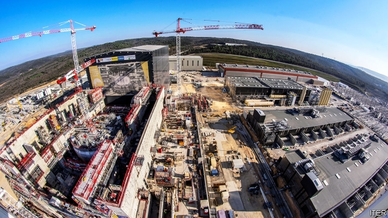

###### Fusion research

# Iter, a reactor in France, may deliver fusion power as early as 2045 

##### Whether commercial start-ups will beat it remains to be seen 

 

> May 2nd 2019 

PROVENCE, IN south-east France, is known for its pleasant weather, ratatouille and thickly wooded mountainsides. But it is also the site of what will be, if and when finished, one of the most complicated machines ever built. Iter (originally, “International Thermonuclear Experimental Reactor”, but now rebranded as Latin, thus meaning “journey”, “path” or “method”) will be a giant fusion reactor of a type called a tokamak. It will have over 1m components. Its main vessel will weigh more than 23,000 tonnes—three times the Eiffel tower. And it will cost at least $20bn. 

For the optimistic, Iter is an example of how people from around the world (35 countries are involved) can collaborate to achieve a lofty long-term ambition. For cynics, it is a boondoggle plagued by delays (it began in 2007 and was supposed to begin experiments in 2016, but this will not now happen until 2025), questionable management and ballooning costs (double the original estimate). 

It may, however, have emerged from its long, dark teatime of the soul. Bernard Bigot, a physicist who used to run France’s Atomic Energy Commission, and who has been director-general of the project since 2015, has shaken things up. The site at the Cadarache nuclear facility near St-Paul-lez-Durance is now busy with cranes and concrete-pouring lorries (see picture), and Dr Bigot says Iter is 60% of the way to the 2025 startup goal. 

Those first experiments, whenever they actually happen, will study the physics of deuterium-tritium plasmas in the reactor—these two isotopes of hydrogen being the front-running candidates as the fuel mixture for nuclear fusion. Only after a decade of such work will fusion experiments proper begin. The aim is to return at least ten times as much energy from nuclear reactions as is used to heat the plasma up in the first place. By 2045, Dr Bigot hopes, engineers will be able to start designing power stations based on Iter’s results. 

Faced with competition from firms that reckon they can build commercial fusion reactors well before then (see article) Dr Bigot says he is energised by these rivals, but has no concern about Iter becoming an also-ran. He says Iter will be true to its retrofitted name by being the one that shows the world the path to grid-scale fusion electricity. 

That, he says, is because it will work on problems that most of the private companies will not. It will, for example, develop new materials to withstand the extreme temperatures of the plasma. And it will develop and test ways to make tritium efficiently and safely on site at a power plant—for tritium, unlike deuterium, is radioactive and exists only transiently in nature. 

That Iter is based in France, the home of grands projets, has a certain appropriateness. Iter has grand scale and grand objectives. France is also, though, a country for whose soul dirigisme and laissez-faire are in constant struggle. Iter is dirigisme par excellence. But this is a battle that laissez-faire might win. 

-- 

 单词注释:

1.fusion['fju:ʒәn]:n. 熔合物, 结合, 熔合 [化] 熔融; 熔化; 聚变 

2.iter[]:[医] 导管, 通路 

3.reactor[ri'æktә]:n. 反应者, 反应器, 反应堆, 电抗器 [化] 反应釜; 反应锅 

4.fusion['fju:ʒәn]:n. 熔合物, 结合, 熔合 [化] 熔融; 熔化; 聚变 

5.Provence['prɒvens]:n. 普罗旺斯(在法国东南部) 

6.ratatouille[ˌrætə'tu:ɪ]:n. 蔬菜杂烩 

7.thickly[]:adv. 厚地；浓地 

8.wooded['wudid]:a. 树木繁茂的 

9.mountainside['mauntinsaid]:n. 山腹, 山腰 

10.originally[ә'ridʒәnli]:adv. 本来, 原来, 最初, 就起源而论, 独创地 

11.thermonuclear[.θә:mәu'nju:kliә]:a. 热核的, 热核武器的 

12.reactor[ri'æktә]:n. 反应者, 反应器, 反应堆, 电抗器 [化] 反应釜; 反应锅 

13.rebrand[ˌri:ˈbrænd]:v. 给（产品或组织）重新命名（或包装）, 重塑…的形象 

14.Tokamak['tɔkәmæk]:[化] 托卡马克; 托卡马克磁约束聚变环流器 

15.eiffel['aifәl]:n. 艾菲尔铁塔（法国著名建筑）；埃菲尔（姓氏） 

16.lofty['lɒfti]:a. 高的, 傲慢的, 崇高的, 高级的, 玄虚的 

17.cynic['sinik]:n. 犬儒学派的人, 玩世不恭的人, 愤世嫉俗者, 好挖苦人的人 a. 犬儒学派的 

18.boondoggle['bu:ndɒgl]:vi. 做细小而无用的事 n. 细小而无用的事, 手工品 

19.plague[pleig]:n. 瘟疫, 天罚, 麻烦, 灾祸 vt. 折磨, 使苦恼, 使得灾祸 

20.questionable['kwestʃәnәbl]:a. 可疑的 [法] 可疑的, 有问题的, 不可靠的 

21.teatime['ti:taim]:n. 下午茶时间 

22.bernard[bә:'nɑ:d, 'bә:nәd]:n. 伯纳德（男子名） 

23.bigot['bigәt]:n. 盲从者, 偏执的人 

24.Cadarache[]:[网络] 卡达拉舍；法国卡达拉舍；卡达拉什 

25.startup[]:[计] 启动 

26.physic['fizik]:n. 药品, 泻药, 医学 vt. 给...服药, 治愈, 使通便 

27.plasma['plæzmә]:n. 血浆, 淋巴液, 原生质, 等离子体 [化] 等离体; 等离子体 

28.isotope['aisәutәup]:n. 同位素 [化] 同位素 

29.reckon['rekәn]:vt. 计算, 总计, 估计, 认为, 猜想 vi. 数, 计算, 估计, 依赖, 料想 

30.energise['enәdʒaiz]:vt. 供给…能量；使精力充沛（等于energize） 

31.retrofit['retrә,fit]:n. 式样翻新 vt.vi. 式样翻新 [计] 更新; 改进 

32.tritium['tritiәm]:n. 氚 [化] 氚 

33.efficiently[i'fiʃәntli]:adv. 生效, 能胜任, 有能力, 效率高, 有效 

34.deuterium[dju:'tiәriәm]:n. 氘, 重氢 [化] 氘; 重氢 

35.transiently[]: [医]adv.短暂地, 仅持续片刻地 

36.projet[prәu'ʒei]:n. 设计,计划,条约草案 

37.appropriateness[ə'prəupriətnis]:n. 适当；适合 

38.dirigisme[,di:ri:'ʒi:sm]:n. <法> (政府对国民经济)干预或统制(主义) 

39.par[pɑ:]:n. 标准, 票面价值, 平均数量, 同等水平 a. 票面的, 平常的, 标准的, 平价的 [计] 重新传输的肯定回答 

40.excellence['ekslәns]:n. 优秀, 卓越, 优点 

