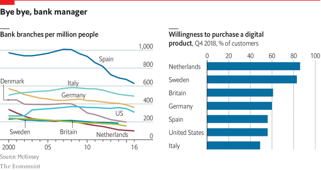

###### Neobanks

# Neobanks are changing Britain’s banking landscape 

##### Regulators have set up a “sandbox” to allow fintech experimentation 

 

> May 2nd 2019 

ANNE BODEN started her career in banking in 1981. After rising through the ranks, in 2012 she became chief operating officer at Allied Irish Banks. As she helped pick up the pieces after Ireland’s banks had blown up its economy, she started thinking that banking needed root-and-branch reform. And even as bankers were distracted by the aftermath of the financial crisis, the wider world was changing. “People were running their lives on mobile phones,” she says. “They were living on social media and buying music on Spotify, and financial services hadn’t caught up.” 

At the end of 2013 she resigned to travel and visit the most innovative banks she could find. But they seemed to be merely patching up their computer systems and closing branches, rather than rethinking their business models. Starting again, she concluded, was the only way to do something better. So she decided to launch a digital-only “neobank”, Starling, in Britain. Since getting a banking licence in 2016 it has opened 520,000 personal accounts. 

Starling is one in a flock of neobanks in Europe aiming to let digital natives bank on their mobile phones. Britain has the largest number; some 15 licences have been granted since 2005. These new banks are capturing a third of new revenue growth in Britain, says Alan McIntyre of Accenture, a consultancy. All are raising large amounts of capital and seeing customer numbers grow at a speedy clip. According to a survey by finder.com, a comparison-shopping website, 9% of British adults—and 15% of 18- to 23-year-olds—now have a neobank account. 

Monzo has opened 1.6m new accounts in Britain, with 30,000 more each week. Revolut, which started by offering foreign exchange and then added an e-money licence, now has a banking licence in Lithuania and will soon have deposit protection and be able to offer credit across the euro zone. N26 (named for the number of cubes that make up a Rubik’s cube), which launched in Austria and Germany in 2015, is now in 24 European countries. Starling is moving into “banking as a service”: enabling businesses to carry out activities such as payments by handling the regulated parts. 

Branches are closing and customers are becoming keener on digital financial products in many developed markets (see chart). But neobanks have flourished particularly in Britain. One reason is that high-street banks’ reputations were even more thoroughly wrecked in Britain than elsewhere, not just by the financial crisis but also by the mis-selling of insurance policies in the 1990s, for which compensation of more than £34bn ($44bn) has been paid so far. Another is that the regulator, the Financial Conduct Authority (FCA), is keen on new entrants. It has a mandate not just to protect the integrity of the financial system but to promote competition. When the FCA sets policy, says Chris Woolard, its director of strategy and competition, it considers “not just the risk that bad things will happen, but the risk that good things will not”. 

 

Britain’s approach to financial innovation also helps fintechs move towards bank status step by step. Its “open banking” rules were shaped partly by an investigation in 2016 into the retail-banking market that concluded more competition was needed. They include a particularly fintech-friendly interpretation of the “revised payments services directive”, an EU-wide rule requiring banks to give third parties direct access to account information (with the account-holder’s permission). The aim is to encourage startups that offer payment services, account aggregation and the like. 

Since 2016 the FCA has run a “sandbox” for financial innovation. Twice a year around 25 firms are allowed to sign up customers for a new product or operational approach, with full disclosure and an FCA guarantee that they will not lose out if things go wrong. Firms must comply with all the usual prudential measures and checks for money-laundering, fraud and so on, but are granted permission to innovate within the spirit of the rules. 

Mr Woolard draws an analogy with pharmaceutical trials, where a new medicine is tested against the standard treatment for a disease. Firms seem to value the opportunity to prove to investors that their approach works in a regulated setting, he says: applications for the sandbox exceed the number of places by a factor of three. The approach has spread: more than a dozen regulators elsewhere have set up sandboxes in the past couple of years. 

Neobanks have two big cost advantages: the absence of branches and their up-to-date cloud-based software. Branches and the associated staff are responsible for as much as half of a high-street bank’s costs. And if it is still running on a legacy mainframe, three-quarters of its IT budget is likely to go on “keeping the lights on”, says Dharmesh Mistry of Temenos, which sells cloud-native banking software. Industry insiders say that a conventional bank has to make in the region of $200-400 a year per customer to break even, and each new account adds significant marginal cost. For a neobank, even including product development, customer acquisition and so on, the equivalent figure is around $50-60, and the marginal cost of maintaining each extra account is close to zero. 

Economies of scale are encouraging a sprint for global growth. Starling is moving into the euro zone, with a base in Dublin; Monzo’s post-Brexit backup plan is an Irish licence, too. N26 and Revolut are both entering several countries in Asia. In Singapore, says Rishi Stocker, who is leading Revolut’s expansion, the regulator seems more interested in supporting incumbents than in encouraging competitors. But the island’s large foreign-born population makes it an attractive proposition for a bank with a reputation for cheap foreign exchange. Australians, with their penchant for travel, are also an appealing target. And Japan is just asking to be disrupted, says Mr Stocker. “The existing banks are ultra-expensive, and most don’t have apps or even desktop applications.” 

N26 and Revolut are open about their plans to break into America; Starling and Monzo are less forthcoming. The country’s handful of home-grown challengers, such as Simple and Moven, have been hampered by the patchwork of federal and state regulations, and rules that make it hard to operate without branches. Like the natives, the newcomers will take responsibility for customer service while partnering with local “white-label” banks—any of several dozen fully licensed banks that specialise in carrying out regulated activities such as holding deposits, handling payments and originating loans for institutions that lack a banking licence. 

The main criticism of challenger banks is that customers will use them merely to ring-fence discretionary spending, with their salaries still going into a high-street bank. But that is changing. Nearly two-thirds of Monzo’s active accounts have at least £500 a month coming in and a third have £1,000 a month. 

More important, they are realising that even secondary accounts can be monetised in novel ways. All want to act as marketplaces, not just for financial products but for other services, too. If a payment for an adventure holiday or mobile-phone bill goes out from your N26 account, muses Valentin Stalf, one of its co-founders, you could be shown options for travel insurance or phone contracts. Monzo allows customers to put money into interest-bearing pots held by Investec, a separate institution (Monzo’s own current accounts do not pay interest). It is working on offering the best deals on utility bills, and mortgages from across the market to customers whose fixed rate is ending, says Tom Blomfield, its chief executive, rather than leaving them to default to a worse product. “Monzo wants to liberate its clients from the ‘loyalty tax’,” he says. “There are a lot of industries in the UK where you get one year at a good rate and then you’re transferred to a rubbish one.” 

A balance-sheet-light business model that depends more on selling third-party products than on recycling deposits into new loans requires top-notch data analysis and frictionless service. All the neobanks spend heavily on data scientists and app developers; they roll out frequent updates and constantly tweak their recommendation algorithms. Since they have access to account data and have already checked their customers’ identities, referrals to third-party suppliers could potentially be done with fingerprint or facial recognition—as simple as one-click shopping on Amazon. 

For any of this to work, customers must trust their bank. This means no more sneaky charges, such as allowing a scheduled payment to put them in the red and charging a fee, rather than alerting them in advance. “The most successful thing about these new banks is that they are on the customers’ side of the table,” says Mr McIntyre of Accenture. “The possibility is fading of building your business model on the fact that customers make mistakes.” 

-- 

 单词注释:

1.landscape['lændskeip]:n. 风景, 山水, 风景画 vi. 从事景观美化 vt. 美化...景观 [计] 横向 

2.regulator['regjuleitә]:n. 调整者, 校准者, 校准器, 调整器, 标准钟 [化] 调节剂; 调节器 

3.sandbox['sændbɒks]:n. 沙箱, 沙盒 

4.fintech[]:[网络] 金融科技；表面处理技术展；金融资讯科技服务 

5.experimentation[eks,perimen'teiʃәn]:n. 实验, 试验, 实验法 [化] 实验; 实验过程 

6.anne[æn]:n. 安妮（女子名） 

7.Boden[]:n. 博登（人名, 地名） n. （德语）地面 

8.ally['ælai. ә'lai]:n. 同盟者, 同盟国, 助手 vt. 使联盟, 使联合, 使有关系 vi. 结盟 

9.banker['bæŋkә]:n. 银行家, 庄家 [经] 银行业者, 银行家 

10.distract[dis'trækt]:vt. 转移, 分心, 使发狂 

11.aftermath['ɑ:ftәmæθ]:n. 结果, 后果 [法] 后果, 结果 

12.spotify[]:[网络] 音乐播放器；音乐服务网站；网络音乐电台网站 

13.innovative['inәjveitiv]:a. 革新的, 创新的, 富有革新精神的 

14.rethink[ri:'θiŋk]:v. 再想, 重想 

15.starling['stɑ:liŋ]:n. 欧椋鸟, 桥墩尖端 

16.alan['ælәn]:n. 艾伦（男子名） 

17.McIntyre['mækintaiә]:麦金太尔(姓氏) 

18.accenture['æksentʃəl]:n. 埃森哲咨询公司 

19.consultancy[]:n. 商量, 协商, 磋商, 会诊, 与...商量, 咨询, 请教, 找(医生)看病, 查阅, 考虑 [经] 咨询业务, 咨询服务 

20.speedy['spi:di]:a. 快的, 迅速的 [经] 快的, 迅速的 

21.clip[klip]:n. 修剪, 夹子, 回形针, 剪下来的东西 vt. 修剪, 痛打, 夹牢, 剪报 vi. 剪报 

22.lithuania[,liθju(:)'einjә, -niә]:n. 立陶宛 

23.euro['juәrәu]:n. 欧元（欧盟的统一货币单位） 

24.Austria['ɒstriә]:n. 奥地利 

25.thoroughly['θʌrәli]:adv. 彻底地, 绝对地, 透彻地, 详尽地, 周到地, 完全地, 完善地, 全面地 

26.compensation[.kɒmpen'seiʃәn]:n. 补偿, 赔偿金, 工资 [医] 代偿(机能), 补偿 

27.FCA[]:[计] 纠错数组, 功能配置审查 

28.entrant['entrәnt]:n. 新会员, 新成员, 进入者 

29.mandate['mændeit]:n. 命令, 指令, 要求 vt. 委任统治 

30.integrity[in'tegriti]:n. 正直, 廉正, 完整 [计] 完整性 

31.chris[kris]:n. 克里斯（男子名）；克莉丝（女子名） 

32.woolard[]: [人名] [英格兰人姓氏] 伍拉德 Woolford的变体 

33.innovation[.inәu'veiʃәn]:n. 改革, 创新 [法] 创新, 改革, 刷新 

34.statu[]:[网络] 状态查看；雕像；特级雪花白 

35.directive[di'rektiv]:a. 指导的, 指挥的, 方向的 n. 指令 [计] 指令; 命令 

36.startup[]:[计] 启动 

37.aggregation[ægri'geiʃәn]:n. 集合, 聚合, 集合体 [化] 聚集; 聚集作用 

38.disclosure[dis'klәuʒә]:n. 揭发, 泄露, 揭发(或暴露)的事实 [经] 揭示, 披露 

39.comply[kәm'plai]:vi. 顺从, 依从 [法] 遵守, 承诺, 照做 

40.prudential[pru:'denʃәl]:a. 审慎的, 精明的, 起咨询作用的 

41.fraud[frɒ:d]:n. 欺骗, 欺诈, 诡计, 骗子 [经] 欺诈, 舞弊, 骗子 

42.innovate['inәuveit]:vi. 改革, 创新 

43.analogy[ә'nælәdʒi]:n. 相似, 类似 [计] 模拟 

44.pharmaceutical[,fɑ:mә'sju:tikәl]:a. 药学的, 制药的, 药用的, 药物的, 药剂师的, 药师的 n. 药品, 成药, 药剂 

45.investor[in'vestә]:n. 投资者 [经] 投资者 

46.legacy['legәsi]:n. 祖先传下来之物, 遗赠物 [经] 遗产, 遗赠物 

47.mainframe['meinfreim]:n. 主机 [电] 主机 

48.mistry[]: [人名] 米斯特里 

49.insider['in'saidә]:n. 内部的人, 权威人士, 知道内情的人 [经] 熟悉内情者 

50.marginal['mɑ:dʒinәl]:a. 边缘的, 最低限度的, 有旁注的 [医] 缘的 

51.sprint[sprint]:n. 短距离赛跑 vi. 全速跑, 冲刺 vt. 全速跑过 

52.Dublin['dʌblin]:n. 都柏林 

53.backup['bækʌp]:n. 倒车, 后退, 后援, 支持, 阻塞 vt. 做备份 a. 候补的, 支持的 [计] 备份; DOS外部命令:通常使用于将硬磁盘上指定的文件复制到软盘上 

54.Singapore[.siŋgә'pɒ:]:n. 新加坡 

55.rishi['riʃi,'ri:-]:n. (印度教)哲人,圣人, 富有灵感的诗人 

56.stocker['stɔkә]:n. 碎料工, 装料工, 储料器, 堆料机, 加煤机 [化] 堆料机; 堆垛机 

57.incumbent[in'kʌmbәnt]:a. 现任的, 依靠的, 负有义务的 n. 领圣俸者, 在职者 

58.proposition[.prɒpә'ziʃәn]:n. 建议, 命题, 主张 vt. 向...提议, 向...提出猥亵的要求 

59.penchant['pә:ŋʃә:ŋ]:n. 爱好, 嗜好 

60.disrupt[dis'rʌpt]:a. 分裂的, 中断的 vt. 使分裂, 使瓦解 

61.APP[]:[计] 应用, 应用程序; 相联并行处理器 

62.desktop['desktɔp]:n. 桌面 [计] 桌面 

63.les[lei]:abbr. 发射脱离系统（Launch Escape System） 

64.forthcoming['fɒ:θ'kʌmɑŋ]:a. 即将来临的 n. 来临 

65.challenger['tʃælindʒә]:n. 挑战者 [经] 申请回避的人 

66.moven[]:[网络] 莫文；陈俐雯；继续行 

67.hamper['hæpә]:n. 食篮, 阻碍物, 食盒 vt. 阻碍, 使困累, 妨碍, 牵制 

68.patchwork['pætʃwә:k]:n. 拼缝物, 拼凑物 

69.newcomer[nju:'kʌmә]:n. 新来者 

70.fully['fuli]:adv. 十分地, 完全地, 充分地 

71.specialise['speʃә,laiz]:vt. 特加指明, 列举, 使专门化, 限定...的范围 vt.vi. (使)特化, (使)专化 vi. 成为专家, 专务, 专攻, 专门研究, 逐条详述 

72.discretionary[dis'kreʃәnәri]:[计] 选择的 

73.monetise['mʌnitaiz]:vt. 使货币化；把…定位法定货币（等于monetize） 

74.marketplace['mɑ:kit'pleis]:n. 市场 

75.muse[mju:z]:n. 沉思, 冥想 v. 沉思, 冥想, 若有所思地凝望或说 

76.Valentin[]:n. 瓦伦汀（男子名） 

77.investec[]:[网络] 天达；天达资产管理；天达银行 

78.mortgage['mɒ:gidʒ]:n. 抵押, 约束性义务, 抵押借款 vt. 抵押, 以...作担保, 把...许给 

79.tom[tɒm]:n. 雄性动物, 雄猫 

80.blomfield[]: [人名] 布洛姆菲尔德 

81.default[di'fɒ:lt]:n. 违约, 不履行责任, 缺席, 默认值 v. 疏怠职责, 缺席, 拖欠, 默认 [计] 默认; 默认值; 缺省值 

82.client['klaiәnt]:n. 客户, 顾客, 委托人 [计] 客户, 客户机, 客户机程序 

83.UK[ju: 'kei]:n. 联合王国 

84.recycling[]:[电] 再循环 

85.datum['deitәm]:n. 论据, 材料, 资料, 已知数 [医] 材料, 资料, 论据 

86.frictionless[f'rɪkʃnles]: 无摩擦的 

87.developer[di'velәpә]:n. 开发者 [计] 显影器 

88.update[ʌp'deit]:vt. 更新, 使现代化 n. 更新 [计] 更新 

89.constantly['kɒnstәntli]:adv. 不变地, 不断地, 时常地 

90.tweak[twi:k]:n. 拧, 扭, 焦急 vt. 扭, 开足马力 

91.algorithm['ælgәriðm]:n. 算法 [计] 算法 

92.referral[ri'fә:rәl]:n. 参照, 介绍, 被介绍人, 转诊病人 

93.supplier[sә'plaiә]:n. 供应者, 供给国, 供应商 [化] 承制厂; 供应厂商 

94.potentially[pә'tenʃәli]:adv. 可能地, 潜在地 

95.fingerprint['fiŋgәprint]:n. 指纹 vt. 采指纹 

96.amazon['æmәzɒn]:n. 亚马孙河 [医] 无乳腺者 

97.sneaky['sni:ki]:a. 鬼祟的, 卑微的 

