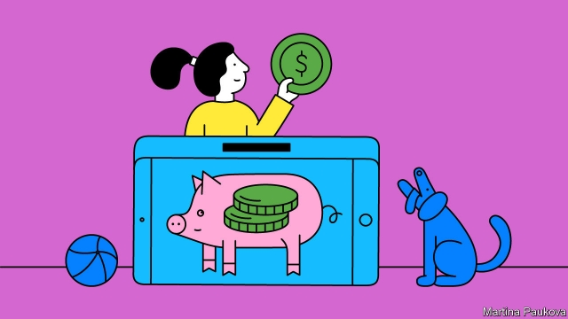

###### Coin of the virtual realm

# New apps are teaching children how to manage their money 

##### Digital piggy banks help kids budget and save 

 

> May 2nd 2019 

IN 2009 A GROUP of parents in Lymington, an English coastal town, started sharing worries about their children’s money-management skills. Pocket money was now stashed in a building society rather than a piggy bank; household shopping was done online; the children rarely saw their parents handling cash. They were spending online, too. Money had become intangible. How, then, were children to learn its value? 

The answer they came up with was GoHenry, an app now available in America as well as Britain. It is designed to help young people learn good financial habits through real-world money management. Parents sign up with their own bank accounts and pay a monthly fee of £2.99 or $3.99 for each child aged six or over. Adults and children download separate versions. At the end of last year 379,000 children had active accounts. 

Parents can schedule pocket money and set chores. When those are marked as done, the child is paid the agreed amount. Parents can see what the child has bought and where. And they can choose where the card can be used: in shops, online or at ATMs. 

Children get debit cards customised with their name (Henry was the first child to use one). They can put money in savings pots, view their spending and balances, and set savings targets. “They could decide to save ten dollars for a sibling’s birthday in four weeks’ time, or set a goal at 12 to have $2,000 to buy a car at age 18,” says Dean Brauer, one of GoHenry’s founders. “The app tells them how much to save each week to meet their goal.” 

Mr Brauer compares GoHenry to a fitness app, giving children feedback on their financial management and motivating them to spend better and save. It is just one of several money-management apps for parents and children; others include Osper, Nimbl and Pennybox. All charge subscription fees, since they lack banking licences and cannot make money by lending out deposits. They fill a gap left by banks, which do not serve such young customers or offer accounts that give parents oversight of children’s spending. 

A big benefit of such apps is that they inspire family conversations about money. According to research done in 2013 by academics at Cambridge University, more than half of British parents find the subject hard to discuss with their children. And yet most agree that children’s attitudes to money are formed in their early years. 

Some GoHenry customers are well-off parents who worry that their children will grow up financially careless and entitled, says Mr Brauer. Others have slender means but regard the subscription as an investment in their child’s future. Some say that they have been in debt and want their children to avoid that mistake when they grow up; others that the app is cost-effective because their children learn to budget. Even though young people no longer touch and hold money, they can still be taught to handle it well. 

-- 

 单词注释:

1.APP[]:[计] 应用, 应用程序; 相联并行处理器 

2.piggy['pigi]:n. 小猪 a. 贪心的, 似猪的, 邋遢的 

3.Lymington[]:[地名] 利明顿 ( 英 ) 

4.coastal['kәustәl]:a. 海岸的, 沿海的, 沿岸的 [法] 海岸的, 沿海的 

5.stash[stæʃ]:vt. 藏起来 n. 隐藏处, 隐藏物 

6.online[]:[计] 联机 

7.intangible[in'tændʒәbl]:a. 难以明了的, 无形的 [经] 无形的 

8.chore[tʃɒ:]:n. 零工, 家务 [经] 零工 

9.ATM[]:[计] 自动出纳机; 异步传输方式 

10.debit['debit]:n. 借方, 借 vt. 记入借方 

11.customise['kʌstәmaiz]:vt.<主英>=customize 

12.henry['henri]:n. 亨利 [医] 亨[利](电感应单位) 

13.dean[di:n]:n. 院长, 主持牧师 [法] 外交团长, 学院院长, 教务长 

14.brauer[]: [人名] 布劳尔 

15.founder['faundә]:n. 创立者, 建立者 vt. 使沉没, 使摔倒, 弄跛, 浸水, 破坏 vi. 沉没, 摔到, 变跛, 倒塌, 失败 

16.fitness['fitnis]:n. 适合, 合宜, 合理, 恰当, 健康 [医] 适合性, 适应性 

17.subscription[sәb'skripʃәn]:n. 捐献, 订金, 订阅, 签署, 同意 [化] 订购 

18.cannot['kænɒt]:aux. 无法, 不能 

19.oversight['әuvәsait]:n. 勘漏, 失察, 失败, 照料 [经] 监督权 

20.Cambridge['keimbridʒ]:n. 剑桥 

21.financially[]:adv. 金融上；财政上 

