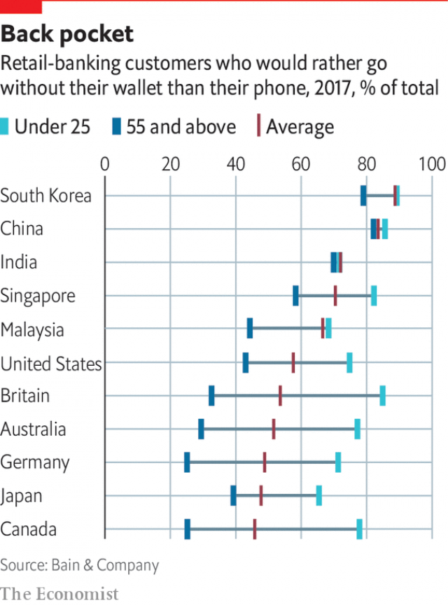

###### Kids these days

# What bankers need to know about the mobile generation 

##### Younger customers have high expectations for speedy, convenient service 

 

> May 2nd 2019 

IF YOU TURN 18 this year, you are younger than Amazon and Google. You turned three with Facebook’s arrival, four with YouTube, five with Spotify, six with the iPhone and eight with WhatsApp. If you are at the upper end of the 18-30 age range considered in this special report, you will remember a time before mobile internet, but not a time before mobile phones. If you are anywhere in that range, you use your mobile to read, chat and play, stream music and videos, hail taxis, order food, and search for dates and jobs. 

You use mobile phones to manage your money, too. Research last year by Raddon, a consultancy, found that 85% of American millennials (those born between 1981 and 1996) used mobile banking, and predicted that the share would be higher still for Gen Z (born after 1996). The main reason people choose a bank is convenience, the consultancy says. For older people that means a nearby branch; for younger ones it means an excellent app. 

You have cooled on cash. Half of American millennials use peer-to-peer payment services such as Venmo or Zelle at least once a week. In 2017 Bain & Company, another consultancy, asked people in 17 countries which they would miss more for a day: their phone or their wallet. Everywhere except Japan and Malaysia, the share of under-25s who would miss their phone more was above 70% (see chart). 

 

You are a demanding customer, with expectations of speedy, convenient service that have been set by Uber and Amazon Prime. You are generally willing to grant companies access to your data, but want something in return. You let Google Maps track your location to help you get where you are going; you like Netflix using your viewing habits for recommendations. 

In many developed countries, tuition fees mean you have much more debt than previous generations did. Soaring property prices have made it harder for you to become a homeowner. Growing up in the aftermath of the financial crisis has left you cautious about loans. According to bankrate.com, a comparison service, just one in three American millennials has a credit or debit card, a much lower share than for previous generations at the same age. All this means banks find it hard to make money from you. 

You also demand more from financial institutions than older people do, and care more about values-based investing and corporate social responsibility. The young expect an answer to the question: “Why are you in banking?”, says Rick Spitler of Novantas, a financial consultancy. “They think bankers should care about helping people to become wealthier, not just about their own bottom line.” 

-- 

 单词注释:

1.banker['bæŋkә]:n. 银行家, 庄家 [经] 银行业者, 银行家 

2.speedy['spi:di]:a. 快的, 迅速的 [经] 快的, 迅速的 

3.amazon['æmәzɒn]:n. 亚马孙河 [医] 无乳腺者 

4.google[]:谷歌；搜索引擎技术；谷歌公司 

5.youtube[]:n. 视频网站（可以让用户免费上传、观赏、分享视频短片的热门视频共享网站） 

6.spotify[]:[网络] 音乐播放器；音乐服务网站；网络音乐电台网站 

7.iphone[]:n. 苹果手机 

8.WhatsApp[]:[网络] 智能手机；联络电话；每月活跃用 

9.hail[heil]:n. 冰雹, 致敬, 欢呼, 招呼 vt. 向...欢呼, 致敬, 招呼, 使象下雹样落下 vi. 招呼, 下雹 interj. 万岁, 欢迎 

10.consultancy[]:n. 商量, 协商, 磋商, 会诊, 与...商量, 咨询, 请教, 找(医生)看病, 查阅, 考虑 [经] 咨询业务, 咨询服务 

11.millennials[mɪ'leniəl]:adj. 一千年的；一千年至福的 [网络] 千禧世代；千禧之子；千禧一代 

12.gen[dʒen]:n. 消息, 真相, 情报 [医] 基因, 遗传因子 

13.Z[zed; (?@) zi:]:[计] 阻抗, 零, 零标志 [医] 原子序数 

14.APP[]:[计] 应用, 应用程序; 相联并行处理器 

15.zelle[]: [人名] [英格兰人姓氏] 泽尔 Sell的变体 

16.bain[]:n. 贝恩（公司名称） 

17.Malaysia[mә'leiziә]:n. 马来西亚 [经] 马来西亚 

18.uber['ju:bә]:[医] 乳房 

19.datum['deitәm]:n. 论据, 材料, 资料, 已知数 [医] 材料, 资料, 论据 

20.netflix[]:n. 全球十大视频网站中唯一收费站点 

21.soar[sɒ:]:n. 高扬, 翱翔 vi. 往上飞舞, 高耸, 翱翔 

22.homeowner['hәum.әunә]:n. 私房屋主；自己拥有住房者 

23.aftermath['ɑ:ftәmæθ]:n. 结果, 后果 [法] 后果, 结果 

24.debit['debit]:n. 借方, 借 vt. 记入借方 

25.corporate['kɒ:pәrit]:a. 社团的, 合伙的, 公司的 [经] 团体的, 法人的, 社团的 

26.rick[rik]:n. 草堆 vt. 把...堆成垛 

27.spitler[]: [人名] 斯皮特勒 

28.Novantas[]:[网络] 诺瓦塔斯；建言的诺瓦塔斯 

