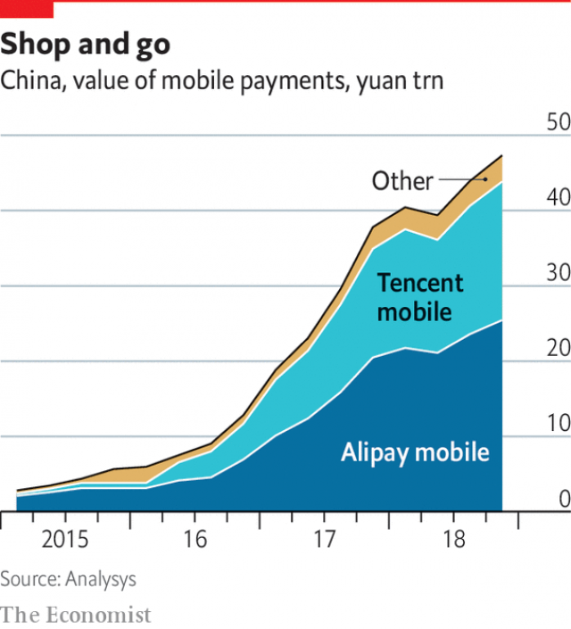

###### Banking

# Young people and their phones are shaking up banking 

##### Customer service is about to get a lot better, says Helen Joyce 

 

> May 2nd 2019 

“I  STARTED THE business because I love milk tea myself,” says Peng Yuxia. Meet the Cow, her shop in Hangzhou, 200km south-west of Shanghai, sells the cassava-based hot drink, also known as bubble tea, to passers-by—and, increasingly, to customers who pre-order on their phones. Recently she signed up to a small-business programme run by Ant Financial, China’s biggest fintech firm, which has its headquarters nearby. Now customers can order in advance from within Alipay, Ant’s payment app, and she has seen total numbers rise from about 50 a day to nearer 70. Payment is by scanning a QR (quick-response) code—so easy, she says, that a mother getting a pedicure next door can send a child in to order with her phone. 

In another part of Hangzhou, Zeng Ping’en looks around his electric-moped shop with pride. A loan from MYbank, Ant’s digital bank, helped with the cost of redecoration. Applying took just a few minutes, he says: “A click on the phone and I got my money.” He can draw down and repay funds at his convenience; interest amounts to a few yuan a day—“easily affordable”. Since China’s long-established banks lend mostly to companies, without the MYbank loan he would have had to wheedle loans from his friends. “Electric-moped shops are getting fancier,” he says. “I’d lose out to the competition if I didn’t renovate.” 

Ant’s origins lie in Alipay, set up in 2004 by Alibaba, then a newish e-commerce website, to make online payments easier. As Alibaba grew, its payment arm started to allow person-to-person transfers, and then purchases in bricks-and-mortar outlets. Alipay was spun off in 2011. Renamed Ant Financial in 2014, it is now one of the world’s biggest financial firms. Its most recent funding round, last year, valued it at $150bn. Alibaba holds a 33% stake. 

Together with its main rival, WeChat Pay, which sits within WeChat, the country’s dominant messaging app, Alipay has transformed Chinese commerce—and everyday life. They have enabled China to leapfrog straight to mobile payments using QR codes, bypassing credit and debit cards. All manner of things can be done from within their apps, including buying tickets for flights, train journeys and films, calling a taxi, paying an electricity bill, ordering food and much more. 

In the past five years Ant has expanded beyond payments and into other financial services. In 2013 it set up Yu’e Bao (“spare treasure”), a single-click, instant-access way to earn interest on excess Alipay balances by parking them in a money-market fund. By March 2018 the fund had 1.7trn yuan ($250bn) in assets, making it the world’s biggest money-market offering by a wide margin. 

In 2015 Ant started providing revolving consumer credit. The following year it launched MYbank, using Alipay data to set interest rates and credit limits for small-business loans. Ant Fortune, launched the same year, gives access to Yu’e Bao, now with a choice of money-market funds, and a range of wealth-management products from nearly 30 asset-management firms. 

Startled by Ant’s hectic growth, in the past couple of years Chinese regulators have sought to slow its pace, setting daily limits on transfers within Alipay and caps on those into and out of Yu’e Bao. Regulators abroad, too, have crimped Ant’s ambitions. Last year America’s investment-screening committee blocked Ant’s purchase of MoneyGram, a money-transfer firm, which would have given it access to 350,000 retail outlets globally—and a foothold in America, the biggest market for financial services. 

The setbacks forced a rethink. At home, Ant’s top brass now talk about supporting incumbents to find new customers and become technically more nimble. Its foreign plans have been slimmed down, too. It is focusing on enabling Chinese people to use Alipay abroad (now possible in 54 countries and hundreds of thousands of shops) and expanding into developing countries. Ant now has stakes in, or partnerships with, digital-payment firms in countries including Bangladesh, India, Malaysia, Mexico, the Philippines and Thailand. “We see our role as serving the unbanked and underbanked,” says Leiming Chen, its general counsel. 

Ant’s giddy growth is both a cause and a consequence of big changes in Chinese life: development, urbanisation and the emergence of a vast middle class ready to spend. But it also exemplifies a broader shift in the provision of financial services. That shift goes well beyond China’s borders. In hindsight, the pivotal year was 2007, when the credit crunch started and the iPhone was launched. The consequences of the crunch have preoccupied bankers everywhere for more than a decade. The smartphone, it is becoming clear, will matter at least as much for their future. 

Start with the threat from Ant itself. Many bankers in developed countries fear that its plans for aggressive expansion beyond China have merely been postponed. That worries rich-world incumbents, since a hungry new arrival would mean slimmer pickings for those already at the table. And Ant’s “platform” approach—offering a pick-and-mix of financial and non-financial products from other companies on its app—poses a challenge to the current (or checking) account that is the central relationship with banks of most people in rich countries. If that core were to break up, how would banks cross-sell loans, mortgages or insurance, profit from interest-rate spreads and commissions, or charge fat fees for occasional services such as foreign exchange or overdrafts? 

“I understand why [banks] would be a little scared: the sheer size of our user base and the variety of services we offer,” says Mr Chen. But incumbents everywhere have nothing to fear, he insists: Ant sees its role not as displacing them, but as helping them serve customers they would otherwise not be able to reach. Its expertise is in creating value from technology, not from deploying capital to support loans, he says. “The notion of us being a disrupter, or some creature that traditional financial institutions should be scared of, is misguided.” 

Many of those institutions are quaking nonetheless. And being disrupted by Ant is just one of their digitally induced nightmares. In another version a Western tech giant—Amazon is mentioned most often—decides to move into banking. Or a messaging or ride-hailing firm expands into financial services—like Kakao in South Korea, which owns the country’s favourite chat app and now offers payments and banking; or Grab and Gojek in South-East Asia, ride-hailing services that have moved into payments, insurance and loans. Some incumbents fret that customers might decamp en masse to a mobile-only “neobank” that offers its own current account but also acts as a broker for products offered by other financial institutions, such as Monzo in Britain or N26, now in 24 countries in Europe and planning to go farther afield. 

In such scenarios incumbents risk ending up as “dumb pipes”, holding bloated balance-sheets and originating products such as mortgages and loans that someone else sells to consumers. If they were to lose the ability to build a brand and the transaction data needed to understand their customers and cross-sell, their wares would become interchangeable. Margins would be driven down, even as they continued having to abide by onerous banking regulations and hold balance-sheet risk. 

The mobile phone allows financial products to be linked with other services in novel ways. Take Ant Financial’s main rival, Tencent, the social-media and gaming giant that owns WeChat. It moved into payments in 2013. Uptake was slow until the company spied an opportunity in the tradition of giving cash gifts in red envelopes to friends and relatives during Chinese new year. In 2014 it added a digital “red envelope” feature to WeChat; 40m were sent over the holiday period. In 2015 an astonishing 500m were sent on the single busiest day. 

 

Though Alipay hurriedly added its own red-envelope feature, the damage had been done: WeChat Pay had become a fixture on Chinese people’s phones. It continues to benefit from being embedded in an app that is used by most Chinese people many times daily, and which connects them to everyone they know. Its share of mobile transactions has risen steadily and now accounts for 39% by value (though somewhat more by number, since it tends to be used for smaller transactions), against 54% for Alipay (see chart). Tencent also offers personal loans and runs an online bank, WeBank. A move deeper into financial services would further threaten Ant’s position. 

This special report will argue that banking incumbents will need to reinvent themselves to survive the restructuring of their industry. It will also offer a way to understand the coming fight: as a co-evolution of incumbents, fintechs, neobanks and consumers, with developments in each country shaped by, among other things, the strength of existing banks, quirks of the local market and the attitude of regulators. 

It will focus on Asia, where the population is young, the market for low-cost financial products is growing fast and incumbents are weak; and on places where financial regulators are seeking to boost competition by encouraging new banks, notably Britain. It will have little to say about America, where digital banking has not yet had much effect on the industry. Incumbents are sheltered by a thicket of state and federal regulations, and running a free-standing digital-only bank is nigh-impossible. 

Since the evolutionary pressure comes from the mobile phone, the best way to view the fight is through the eyes of its most devoted users: the under-30s. Though people of every age are turning to mobile banking, the future of the industry is clearest to see in the hands of digital natives. A good place to start is South Korea, which is the world’s most connected country—and perhaps also its most overbanked. 

-- 

 单词注释:

1.helen['helәn]:n. 海伦（女子名, 火把、光亮的之义） 

2.joyce[dʒɔis]:n. 乔伊斯（女名） 

3.peng[]:n. 执业工程师 

4.hangzhou['hɑ:ŋ'dʒәj]:n. 杭州 

5.fintech[]:[网络] 金融科技；表面处理技术展；金融资讯科技服务 

6.headquarter[,hed'kwɔ:tә]:vt. 将...的总部设在 

7.alipay[]:n. 支付宝 

8.APP[]:[计] 应用, 应用程序; 相联并行处理器 

9.QR[]:[计] 商, 二次余数 

10.pedicure['pedikjuә]:n. 脚治疗, 脚治疗医师, 修趾甲术 vt. 修脚, 医脚 

11.zeng[]:n. 曾（中文姓氏） 

12.redecoration[ˌri:ˌdekə'reɪʃn]:n. 重新装饰, 再装饰（装修） 

13.repay[ri'pei]:v. 偿还, 报答, 报复 

14.affordable[]:[计] 普及型 

15.wheedle['hwi:dl]:vt. 以甜言蜜语诱惑, 用甜言蜜语骗 vi. 用甜言蜜语哄骗 

16.renovate['renәuveit]:vt. 更新, 革新, 刷新, 修复, 使恢复活力 

17.alibaba[]:n. 阿里巴巴（公司名） 

18.newish['nju:iʃ]:a. 尚新的 

19.online[]:[计] 联机 

20.rename[.ri:'neim]:vt. 重新命名, 再命名, 给...改名 [计] 重命名; DOS内部命令:更改文件名 

21.WeChat[]:[网络] 微信；微讯；腾讯微信 

22.dominant['dɒminәnt]:a. 占优势的, 支配的 [医] 优性的, 显性的 

23.leapfrog['li:pfrɒg]:n. 跳背游戏, 竞相提高 vi. 跳背, 交替前进 vt. 跃过 

24.bypass['baipɑ:s]:n. 旁路 vt. 省略, 绕过, 忽视, 回避 

25.debit['debit]:n. 借方, 借 vt. 记入借方 

26.bao[bau]:n. 非洲石子游戏棋 

27.asset['æset]:n. 资产, 有益的东西 

28.revolve[ri'vɒlv]:v. (使)旋转, 反复考虑, 循环出现 

29.datum['deitәm]:n. 论据, 材料, 资料, 已知数 [医] 材料, 资料, 论据 

30.hectic['hektik]:a. 脸上发红, 发热的, 潮热的, 肺病的 n. 脸红, 潮热病人 

31.regulator['regjuleitә]:n. 调整者, 校准者, 校准器, 调整器, 标准钟 [化] 调节剂; 调节器 

32.crimp[krimp]:n. 诱人当兵的人, 拳曲, 鬈发 vt. 诱...去当兵, 使拳曲, 使有褶 

33.moneygram[]:[网络] 速汇金；速汇金业务；速汇金国际有限公司 

34.foothold['futhәuld]:n. 立足处, 据点, 根据地 

35.setback['setbæk]:n. 挫折, 退步, 逆流 

36.rethink[ri:'θiŋk]:v. 再想, 重想 

37.incumbent[in'kʌmbәnt]:a. 现任的, 依靠的, 负有义务的 n. 领圣俸者, 在职者 

38.technically['teknikli]:adv. 技术上, 学术上, 专门地 

39.nimble['nimbl]:a. 敏捷的, 伶俐的, 聪明的 

40.partnership['pɑ:tnәʃip]:n. 合伙, 合股, 合作关系 [经] 合伙(合作)关系, 全体合伙人 

41.Bangladesh[,bɑ:ŋ^lә'deʃ]:n. 孟加拉国 [经] 孟加拉共和国 

42.Malaysia[mә'leiziә]:n. 马来西亚 [经] 马来西亚 

43.Philippine['filipi:n]:a. 菲律宾(群岛)的, 菲律宾人的 

44.Thailand['tailәnd]:n. 泰国 

45.unbanked[ʌn'bæŋkt]: [财]无银行账户 

46.underbanked[]:[网络] 未被银行服务；缺乏银行服务者；银行客户 

47.chen[]:n. 陈 

48.counsel['kaunsәl]:n. 商议, 忠告, 法律顾问 v. 商议, 劝告 

49.giddy['gidi]:a. 眼花的, 头晕的 v. (使)眼花, (使)眩晕 

50.urbanisation[ˌɜ:bənaɪ'zeɪʃən]:n. 城市化（等于urbanization） 

51.emergence[i'mә:dʒәns]:n. 出现, 浮现, 发生 

52.exemplify[ig'zemplifai]:vt. 例证, 例示 [法] 制作经公章证明的誊本, 例证 

53.hindsight['haindsait]:n. 枪的表尺, 事后聪明 

54.pivotal['pivәtәl]:a. 枢轴的, 关键的, 起中心作用的 

55.crunch[krʌntʃ]:v. 嘎吱嘎吱的咬嚼, 压碎, 嘎吱嘎吱地踏过 n. 咬碎, 咬碎声 

56.iphone[]:n. 苹果手机 

57.preoccupy[pri:'ɒkjupai]:vt. 抢先占领, 使全神贯注 

58.banker['bæŋkә]:n. 银行家, 庄家 [经] 银行业者, 银行家 

59.smartphone[]:n. 智能手机 

60.picking['pikiŋ]:n. 掘, 选择, 挑选, 采摘, 撬开, [U]采得物, 捡得物, 赃物, 扒窃物 [经] 挑拣 

61.mortgage['mɒ:gidʒ]:n. 抵押, 约束性义务, 抵押借款 vt. 抵押, 以...作担保, 把...许给 

62.sheer[ʃiә]:a. 绝对的, 全然的, 纯粹的, 透明的, 峻峭的 vi. 偏转, 偏航 vt. 使急转向, 使偏航 adv. 完全, 全然, 峻峭 n. 偏航 

63.displace[dis'pleis]:vt. 移置, 替换, 转移 

64.expertise[.ekspә:'ti:z]:n. 专家意见, 专门技术 [法] 专门知识, 专家意见 

65.deploy[di'plɒi]:v. 展开, 配置 

66.disrupter[]:n. 分裂者, 破坏者 

67.misguide[mis'gaid]:vt. 误导 

68.nonetheless[,nʌnðә'les]:conj. 然而, 尽管, 不过 adv. 不过, 仍然, 尽管如此, 然而 

69.disrupt[dis'rʌpt]:a. 分裂的, 中断的 vt. 使分裂, 使瓦解 

70.digitally[]:adv. 数位 

71.induce[in'dju:s]:vt. 引诱, 招致, 归纳出, 感应 [医] 诱导, 感应 

72.nightmare['naitmєә]:n. 梦魇, 恶梦, 可怕的事物(或情景、人物) [医] 梦魇, 恶梦 

73.tech[tek]:n. 技术学院或学校 

74.Kakao[]:[网络] 可可；可可粉；可可豆 

75.Korea[kә'riә]:n. 朝鲜, 韩国 

76.grab[græb]:n. 抓握, 掠夺, 强占, 东方沿岸帆船 vi. 抓取, 抢去 vt. 攫取, 捕获, 霸占 

77.fret[fret]:n. 烦躁, 磨损, 焦急, 网状饰物 vi. 烦恼, 不满, 磨损 vt. 使烦恼, 腐蚀, 使磨损, 使起波纹 

78.decamp[di'kæmp]:vi. 撤营, 逃走, 逃亡 [法] 撤退, 逃走, 逃亡 

79.en[en]:n. 字母N, (铅字)半方 prep. 在...中, 作为 

80.masse[mæ'sei]: [体]竖直挫球 

81.broker['brәukә]:n. 掮客, 经纪人 [经] 经纪人, 掮客 

82.afield[ә'fi:ld]:adv. 离开着, 偏离着, 在战场上 

83.scenario[si'nɑ:riәu]:n. 剧本提纲, 情节, 剧本, 方案, 事态 [计] 方案 

84.bloat[blәut]:vt. 使膨胀, 腌制, 使自大 vi. 膨胀, 肿起 n. 肿胀病人 

85.transaction[træn'sækʃәn]:n. 交易, 办理, 学报, 和解协议 [计] 事务处理 

86.ware[wєә]:n. 物品, 器具, 货物, 商品, 陶器 vt. 留心, 小心 a. 知道的, 意识到的, 留神的 

87.interchangeable[.intә'tʃeindʒәbl]:a. 可互换的 [化] 可互换的 

88.abide[ә'baid]:vi. 停留, 遵守, 居留, 继续下去 vt. 忍受, 经受, 屈从于 

89.onerous['ɒnәrәs]:a. 繁重的, 负有法律责任的 [法] 负有义务的, 艰巨的, 繁重的 

90.Tencent[]:[网络] 腾讯；腾讯公司；腾讯控股 

91.uptake['ʌpteik]:n. 举起, 拿起, 理解, 上风井, 摄入, 吸收 [化] 摄取 

92.hurriedly[]:adv. 仓促地；匆忙地 

93.fixture['fikstʃә]:n. 固定(状态), 固定物, 设备 [计] 夹具 

94.embed[im'bed]:vt. 使插入, 使嵌入, 使深留脑中 [计] 嵌入 

95.reinvent[.ri:in'vent]:vt. 重新使用；彻底改造；重复发明（在不知他人已发明的情况下） 

96.restructuring[]:[计] 重构的 

97.quirk[kwә:k]:n. 古怪举动, 俏皮话, 急转 

98.notably['nәjtbәli]:adv. 显著地, 著名地, 尤其, 特别 

99.thicket['θikit]:n. 丛林, 草丛 

100.evolutionary[,i:vә'lu:ʃәnәri]:a. 展开的, 进化论的, 进化的, 发展的 [计] 进化的, 改良的, 发展的 

101.overbanked[]:[网络] 银行已经过度；总体上看是一个银行过度；过度膨胀 

