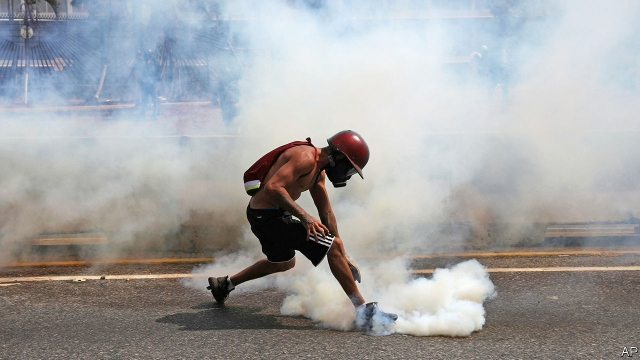

###### Tragicomedy in Caracas

# A failed uprising against Nicolás Maduro 

##### It leaves many unanswered questions about the Trump administration’s plan for regime change 

 

> May 2nd 2019 

ON MAY 1st, the day after the opposition announced a final push to oust Nicolás Maduro, Venezuela’s strongman was determined to show he was back in control. He used the method his regime knows best: swift, forceful repression of protests. Juan Guaidó, recognised by most Western and Latin American democracies as the country’s interim president, had promised the “biggest march in Venezuelan history” to prise open the cracks in the regime. It didn’t happen. When protesters approached La Carlota, an air base in eastern Caracas, they were dispersed by a rain of tear-gas canisters the moment they began aiming stones at the conscripts inside. Two people died in demonstrations and dozens were injured. 

Just a day earlier the opposition had hoped that its long struggle against Mr Maduro’s dictatorship was on the brink of success. But the collapse of what briefly looked like a co-ordinated uprising with military backing represents a big setback for the opposition and its backers in the Trump administration. At the same time, these events displayed Mr Maduro’s weakness as well as his strength. 

At dawn on April 30th Mr Guaidó had appeared outside La Carlota with a small group of national guardsmen to announce “Operation Liberty”. By his side stood Leopoldo López, the country’s most famous political prisoner, who had been freed from house arrest by his guards from SEBIN, the feared intelligence service. For several hours, rumours flew that the army had at last abandoned a hated regime and backed a transition to democracy. Then, one by one, General Vladimir Padrino, the defence minister, and other senior military figures posted on social media statements of loyalty to Mr Maduro and denunciations of what one called “a small coup”. 

In the evening of April 30th Mr Maduro at last appeared on television, flanked by the high command. He vowed to pursue all of those behind the uprising. “Sooner, rather than later, they will go to prison to pay for their treason and crimes,” he said later. The general in charge of SEBIN, Christopher Figuera, was apparently sacked. Mr López and his family took refuge in the Spanish ambassador’s residence, while two dozen rebel national guardsmen were reported to be in the Brazilian embassy. 

Mr Maduro, who started a second term in January after winning a sham election, has plunged the country into economic misery. But despite discontent, and occasional defections of small groups of soldiers, the regime has managed to keep the loyalty of the armed forces. American officials stress the role of Cuban intelligence surveillance in quashing military dissent. That is certainly important in preventing moves by individual commanders. 

But there is little doubt that the army could act as a body to dump Mr Maduro if the high command wanted. That was the supposition on which the opposition plan was based. Whether the commanders have sufficient incentives to do so is another matter. Mr Guaidó has offered them an amnesty. But some are too deeply implicated in criminal activities to qualify. To act, the armed forces need to be sure that their corporate interests will be protected. That probably means giving them a role in a transitional government of national unity, which is anathema to many hardliners in the opposition whose voices are heard in the White House. 

American officials claimed that the attempted uprising followed two months of conversations between Mr Guaidó’s people and senior figures in the regime. John Bolton, the national security adviser, said that the plan was that Maikel Moreno, the head of Venezuela’s supreme court, which has up till now acted as a regime puppet, was to declare Mr Maduro’s national constituent assembly illegitimate. This would have given legal cover to General Padrino and the high command to declare their obedience to the opposition-controlled national assembly, of which Mr Guaidó is the speaker. “For reasons that are still not clear, that didn’t go forward,” Mr Bolton said. He blamed Russian interference for dissuading Mr Maduro from fleeing to Cuba. 

Another explanation comes from Venezuelan military sources cited in El Confidencial, a Spanish digital newspaper. It holds that this plan was due to be put into effect on May 2nd. Perhaps because they thought Mr Maduro and his Cuban spies had discovered the plot, Mr Guaidó and Mr López jumped the gun. That prompted the high command to back off. According to a former American official, that may have been in part because of the presence of Mr López, whom they especially mistrust. 

It is not the first time that the opposition has seemingly overplayed its hand. Some sections of it have long believed that pressure from the streets is sufficient to overthrow Mr Maduro. It has not been. “When the opposition feels it has an advantage it always goes for the kill shot and fails,” says the former American official. 

General Figuera, the former intelligence chief, seemed to confirm Mr Bolton’s accounts of military disloyalty. A letter written to Mr Maduro and attributed to him said: “I discovered that many people you trust are negotiating behind your back.” Whether the dictator can still trust General Padrino, Mr Moreno and the others must now be open to doubt—a doubt the Americans are doing their best to inculcate. Assuming, that is, that the plot itself was not a Cuban-run intelligence operation to force the opposition’s hand, as some speculate. 

For now, the biggest blow is indeed to the momentum of the opposition. More than three months after Mr Guaidó proclaimed himself interim president, with the backing of the United States and over 50 other countries, the regime has not collapsed. In February Mr Guaidó’s attempt to bring in humanitarian aid from Colombia, watched by the world’s media, failed. 

It is widely asserted in Washington that the White House officials who have led the Venezuela effort believed that the army would switch sides in a matter of days. The longer the stand-off continues, the more problematic the strategy of President Donald Trump’s administration becomes. 

Mr Maduro’s government and that of Hugo Chávez before him have brought about Venezuela’s economic collapse. But from now on, American sanctions against Venezuelan oil and finance will play a role in aggravating the country’s humanitarian crisis and the exodus of migrants to neighbouring countries, a point officials in Washington are sensitive about. Unless the stand-off is resolved soon, there is a risk that any transitional government will inherit a country with the living conditions of Haiti. 

What is not in doubt is the determination of the Trump administration to get rid of Mr Maduro’s regime. Having joined this battle, it is one they can ill afford to lose. American diplomacy was initially deft in marshalling a broad coalition behind Mr Guaidó. Optimists think this week showed that it is only a matter of time before the regime fragments. “If Guaidó is not failing, he is winning,” says William Brownfield, a former American ambassador to Venezuela. Mr Guaidó has now called for strikes. But the counter-argument is also strong: Mr Maduro showed his staying power and will now crack down. 

The administration may soon face a choice: make good on Mr Trump’s threats of military action, or hold its nose while Europeans and Latin Americans negotiate with the regime. On May 1st America’s secretary of state, Mike Pompeo, repeated that military action is possible. Some White House officials are reported to be impatient for this, though the president himself may not be so enthusiastic. But military action in a large country with many guns in civilian hands would be highly risky. It has no support among the Latin American governments that back Mr Guaidó. 

For the many who want change in Venezuela, this week was intensely frustrating. The strategy of trying to win over the military high command was the correct one. Sadly, its execution was tragicomic. 

-- 

 单词注释:

1.tragicomedy[.trædʒi'kɒmәdi]:n. 悲喜剧 

2.caracas[kә'rækәs]:n. 加拉加斯（委内瑞拉首都） 

3.uprise[ʌp'raiz]:n. 升起, 起立, 上山坡, 出现 vi. 上升, 起义, 出现 

4.maduro[mә'duәrәu]:a. 色深味浓的烟草做的, (雪茄)色深味浓的 

5.unanswered[.ʌn'ɑ:nsәd]:a. 未答复的, 无反应的 

6.regime[rei'ʒi:m]:n. 政权, 当权期间, 政体, 社会制度, 体制, 情态 [医] 制度, 生活制度 

7.opposition[.ɒpә'ziʃәn]:n. 反对, 敌对, 相反, 在野党 [医] 对生, 对向, 反抗, 反对症 

8.oust[aust]:vt. 逐出, 罢黜, 剥夺, 驱逐 [法] 驱逐, 剥夺, 免职 

9.strongman[ˈstrɒŋmæn]:n. 大力士 

10.forceful['fɒ:sful]:a. 有力的, 强烈的, 有说服力的 

11.repression[ri'preʃәn]:n. 抑制, 压抑, 制止 [医] 压抑, 抑制 

12.juan[hwɑ:n]:n. 胡安（男子名） 

13.interim['intәrim]:a. 暂时的, 临时的, 间歇的 n. 过渡时期 

14.venezuelan[,venә'zweilәŋ]:a. 委内瑞拉的；委内瑞拉人的 

15.prise[praiz]:vt. 撬, 撬开, 撬动 

16.protester[]:n. 抗议者, 持异议者, 拒付者 [经] 反对者 

17.La[lɔ:, lɑ:]:[医] 镧(57号元素) 

18.carlota[]:卡洛塔（1840～1927, 墨西哥皇后, 马克西米连皇帝之妻） 

19.disperse[dis'pә:s]:vt. 分散, 传播, 散开 vi. 分散 a. 分散的 [计] 分散 

20.canister['kænistә]:n. 罐, 筒, 霰弹 [机] 罐, 滤毒罐 

21.conscript['kɒnskript]:a. 被征入伍的, 被征召的 n. 征兵 vt. 征召 

22.demonstration[.demәn'streiʃәn]:n. 示范, 实证 [医] 示教, 实物教授 

23.dictatorship[dik'teitәʃip]:n. 独裁者之职位, 独裁, 独裁政权 [法] 专攻, 独裁权 

24.brink[briŋk]:n. 边缘, 陡岸 

25.briefly['brifli]:adv. 简短地, 扼要地, 简明地, 简单地 

26.setback['setbæk]:n. 挫折, 退步, 逆流 

27.backer['bækә]:n. 援助者, 支持者 [经] 背书人, 支持人 

28.guardsman['gɑ:dzmәn]:n. 卫兵, (英)近卫兵, (美)国民警卫队士兵 

29.leopoldo[]:n. (Leopoldo)人名；(西、意、葡)莱奥波尔多 

30.López[]:[地名] 洛佩斯 ( 阿根、厄 ) 

31.Sebin[]:[网络] 国家情报局 

32.transition[træn'ziʃәn]:n. 转变, 转换, 变迁, 过渡时期, 临时转调 [化] 跃迁 

33.Vladimir[vlɑ'dimɪr]:n. 弗拉基米尔（古罗斯弗拉基米尔-苏兹达里公国的古都） 

34.padrino[]: 

35.denunciation[di.nʌnsi'eiʃәn]:n. 谴责, 告发 [经] 废止合同(契约), 宣告合同(契约等)无效 

36.coup['ku:]:n. 砰然的一击, 妙计, 出乎意料的行动, 政变 [医] 发作, 中, 击 

37.flank[flæŋk]:n. 侧面, 侧腹, 胁, 腰窝肉 vt. 攻击侧面, 守侧面 vi. 侧面与...相接 

38.vow[vau]:n. 誓约, 誓言, 许愿 vi. 起誓, 发誓, 郑重宣言 vt. 立誓, 起誓要, 郑重地宣布 

39.christopher['kristәfә]:n. 克里斯多夫（男子名） 

40.figuera[]:[网络] 无花果广场 

41.apparently[ә'pærәntli]:adv. 表面上, 清楚地, 显然地 

42.Brazilian[brә'ziljәn]:n. 巴西人 a. 巴西的, 巴西人的 

43.sham[ʃæm]:n. 假, 赝品, 骗子, 哄骗 a. 假的, 伪造的 vt. 假装, 冒充 vi. 装假 

44.misery['mizәri]:n. 痛苦, 悲惨, 不幸, 穷困 

45.discontent[.diskәn'tent]:n. 不满 

46.defection[di'fekʃәn]:n. 背叛, 缺乏, 毛病 [法] 缺点, 过失, 背叛 

47.Cuban['kju:bәn]:a. 古巴的, 古巴人的 n. 古巴人 

48.surveillance[sә:'veilәns]:n. 监视, 监督 [电] 侦测 

49.quash[kwɒʃ]:vt. 撤销, 平息, 镇压 [法] 撤销, 废止, 宣布无效 

50.dissent[di'sent]:n. 异议 vi. 持异议, 不同意 

51.supposition[.sʌpә'ziʃәn]:n. 想像, 推测, 推想 [法] 假定, 推定, 推测 

52.incentive[in'sentiv]:n. 动机 a. 激励的 

53.amnesty['æmnisti]:n. 大赦, 赦免 

54.implicate['implikeit]:vt. 涉及, 含意, 暗示, 牵连 n. 包含的东西 

55.corporate['kɒ:pәrit]:a. 社团的, 合伙的, 公司的 [经] 团体的, 法人的, 社团的 

56.transitional[træn'siʒәnl]:a. 变迁的, 过渡期的 [医] 转变的, 过渡的; 过渡型单核白细胞 

57.anathema[ә'næθәmә]:n. 令人厌恶的人, 强烈的遣责, 诅咒, 咒逐, 革出教门 

58.hardliner[ˌhɑ:d'laɪnə(r)]:n. 强硬路线者 

59.john[dʒɔn]:n. 盥洗室, 厕所, 嫖客 

60.bolton['bәultәn]:a. 可用螺栓固定的 

61.adviser[әd'vaizә]:n. 顾问, 劝告者, 指导教师 [法] 顾问, 劝告者 

62.maikel[]:[网络] 贝斯手麦克；麦克尔；马科尔 

63.Moreno[]:莫雷诺（男子名） 

64.constituent[kәn'stitjuәnt]:n. 成分, 选民, 构成物 a. 构成的, 组织的, 选举的 

65.illegitimate[.ili'dʒitimәt]:a. 不法的, 私生的, 不合规则的, 不合理的, 不符合习惯的 n. 无合法身份的人 vt. 宣告...为非法, 证明...为私生 

66.obedience[ә'bi:djәns]:n. 服从, 顺从, 忠实 [法] 服从, 顺从, 遵从 

67.dissuade[di'sweid]:vt. 劝阻 [法] 劝阻, 劝止 

68.Cuba['kju:bә]:n. 古巴 

69.cite[sait]:vt. 引用, 引证, 表彰 [建] 引证, 指引 

70.el[el]:abbr. 预期损失（Expected Loss） 

71.mistrust[.mis'trʌst]:n. 不信任, 疑惑 v. 不信任, 疑惑 

72.seemingly['si:miŋli]:adv. 看来似乎, 表面上看来 

73.overplay[,әuvә'plei]:vt. 把...做得过分, 过分依赖...的力量, 夸张, 把...演得过火 

74.overthrow[.әuvә'θrәu]:n. 推翻, 瓦解, 倾覆 vt. 打倒, 推翻, 倾覆 

75.alway['ɔ:lwei]:adv. 永远；总是（等于always） 

76.disloyalty[dis'lɒiәlti]:n. 不忠实, 不忠行为, 不义 

77.dictator['dikteitә]:n. 命令者, 独裁者 

78.inculcate['inkʌlkeit]:vt. 反复灌输, 谆谆教诲 

79.speculate['spekjuleit]:vi. 深思, 推测, 投机 [经] 投机 

80.momentum[mәu'mentәm]:n. 动力, 动量 [化] 动量 

81.humanitarian[hju:.mæni'tєәriәn]:n. 人道主义者, 博爱者, 基督凡人论者 a. 人道主义的, 博爱的, 凡人论的 

82.Colombia[kә'læmbiә]:n. 哥伦比亚 

83.assert[ә'sә:t]:vt. 主张, 坚称, 断言 [法] 宣称, 断言, 维护 

84.Washington['wɒʃiŋtn]:n. 华盛顿 

85.Venezuela[,vene'zweilә]:n. 委内瑞拉 

86.problematic[prɔblә'mætik]:a. 成问题的, 未定的, 疑难的, 有疑问的, 盖然性的, 或然性的 

87.hugo['hju:^әu]:n. 雨果（男子名, 等于Hugh） 

88.sanction['sæŋkʃәn]:n. 核准, 制裁, 处罚, 约束力 vt. 制定制裁规则, 认可, 核准, 同意 

89.aggravate['ægrәveit]:vt. 使恶化, 使更严重, 加重 

90.exodus['eksәdәs]:n. 大批的离去 [法] 退出, 大批离去, 成一外出 

91.migrant['maigrәnt]:n. 候鸟, 移居者 [法] 移居者 

92.Haiti['heiti]:n. 海地 

93.diplomacy[di'plәumәsi]:n. 外交, 外交手腕, 交际手段 [法] 外交, 外交手腕, 权谋 

94.initially[i'niʃәli]:adv. 最初, 开头 

95.deft[deft]:a. 敏捷熟练的, 灵巧的 

96.marshal['mɑ:ʃәl]:n. 元帅, 陆空军高级将官, 典礼官, 执法官 vt. 整理, 引领, 统率 vi. 排列, 各就各位 

97.coalition[.kәuә'liʃәn]:n. 结合体, 结合, 联合 [经] 联合, 联盟 

98.optimist['ɔptimist]:n. 乐观者, 乐观主义者 

99.william['wiljәm]:n. 威廉（男子名）；[常作W-][美俚]钞票, 纸币 

100.brownfield[ˈbraʊnfi:ld]:a. 棕色地带 

101.mike[maik]:vi. 偷懒, 游手好闲 n. 休息, 游手好闲, 扩音器, 话筒 

102.pompeo[]:n. (Pompeo)人名；(意)蓬佩奥 

103.risky['riski]:a. 危险的 

104.intensely[ɪn'tenslɪ]:adv. 强烈地; 极度; 剧烈地 

105.execution[.eksi'kju:ʃәn]:n. 实行, 完成, 执行, 死刑 [计] 执行 

106.tragicomic[,trædʒi'kɔmik]:a. 悲喜剧的, 又悲又喜的 

