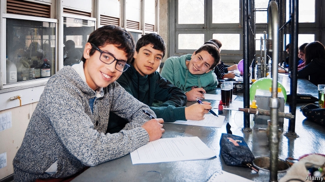

###### Picking pupils

# Chile may bring back selection in schools 

##### Sebastián Piñera wants to partly undo his predecessor’s egalitarian education reforms 

 

> May 2nd 2019 

THE BUILDING is grimy, with the odd broken window pane. Despite its scruffy appearance the Instituto Nacional, an inner-city secondary school for boys, is Chile’s most prestigious high school. Founded in 1813, it has educated 17 presidents and dozens of prominent artists and scientists. It helps bright children from poor families enter the best universities. Many commute long distances to get to the school in central Santiago. 

Its future, and that of a score of other “emblematic” schools (especially choosy grammar schools) is under threat. Policies brought in by the country’s previous president, the left-leaning Michelle Bachelet, do not allow such schools to select more than 30% of their pupils on academic merit. The rule takes effect in Santiago this year. Fernando Soto, the Instituto Nacional’s rector, says its “academic excellence” will be put in doubt “if children are admitted with no interest in studying”. Sylvia Eyzaguirre, an education specialist at the liberal Centre for Public Studies, says that the law “is destroying selective state schools”. 

Sebastián Piñera, Chile’s current centre-right president, wants to avoid that. He has introduced two bills that would partially undo Ms Bachelet’s reforms. The first would allow some 300 high-achieving schools, including the emblematics, to select pupils on academic merit. Of those, half would have to come from hard-up families. The measure would apply to 10% of high schools. A second bill would allow all other non-private schools to choose 30% of pupils to suit their educational programmes, which may include goals other than academic achievement. This “fair admission” policy will reward merit and hard work, the government claims. 

Academic elitism is a fraught subject in Chile. The school system is stratified. Graduates of the poshest schools, like The Grange, are as visible at the top of society as are Old Etonians in Britain. Two-thirds of private-school students who sit the university entrance exam get into one of the main universities. But just a third of those from state-supported independent schools, for which parents usually pay top-up fees, make the grade. For state-school students the success rate is just a fifth. In 2016, 18% of students admitted to the two best universities—Chile and Católica—came from state schools, which have 37% of enrolment. Of these, over half came from 19 emblematic schools. Run by local governments, they have been the main non-fee-paying route to good universities 

Chileans on the left have long demanded more equality in education. Among the loudest agitators were pupils at emblematic schools, which hurt the schools themselves. Months-long occupations of school buildings since 2011 caused enrolment and performance to fall. Instituto Nacional lost its place among the 20 best schools, as measured by the performance of their students in university entrance exams. In 2018 it ranked 78th. 

The pupils won, but at a further cost to their schools. Ms Bachelet imposed the cap on emblematic schools’ ability to select based on merit as part of her quest to make the education system more equal. (She also vowed to raise standards.) Other reforms included eliminating selection for most other schools, phasing out top-up fees at independent ones and providing more money for poor pupils and teacher training. The early signs are that the new system is increasing socio-economic diversity within schools, says Ms Eyzaguirre. 

But it has taken effect slowly. And parents are keener on selection than the reformers are. According to a recent poll by Cadem, 63% of Chileans are in favour of merit-based selection; 79% prefer it to “random” selection. Most Chileans are proud of emblematic schools. 

This ought to help Mr Piñera bring back some selection, but he faces a fight. His coalition lacks a majority in congress. “It’s difficult to create inclusion if you keep the practices underlying segregation,” says Miguel Crispi, a deputy for the left-leaning Frente Amplio alliance, who advised Ms Bachelet on her education reforms. Legislators like him will probably doom Mr Piñera’s plan to reintroduce an element of selection for all schools. Some have a soft spot for emblematic schools. This gives the bill aimed at the 300 high-performing schools a fighting chance. If it works, Instituto Nacional’s glory days could return. 

-- 

 单词注释:

1.Chile['tʃili]:n. 智利 [化] 番椒; 辣椒 

2.egalitarian[i.gæli'tєәriәn]:a. 平等主义的 n. 平等主义 

3.grimy['graimi]:a. 污秽的, 肮脏的 

4.scruffy['skrʌfi]:a. 不整齐的, 肮脏的, 破旧的, 褴褛的 

5.instituto[]:[网络] 联合队；图片 

6.Nacional[]:国家 

7.prestigious[pre'stidʒiәs]:a. 享有声望的 

8.commute[kә'mju:t]:vt. 交换, 折偿, 减轻 vi. 代偿, 经常乘车来往 

9.Santiago[sænti'ɑ:^әu]:n. 圣地亚哥 

10.emblematic[,embli'mætik]:a. 象征的, 典型的 

11.choosy['tʃu:zi]:a. 慎重选择的, 好挑剔的 

12.Michelle[mɪ'ʃɛl]:n. 米歇尔（女子名） 

13.bachelet[]:n. (Bachelet)人名；(法)巴舍莱；(西)巴切莱特 

14.Fernando[]:n. 费尔南多（男子名） 

15.Soto[]:n. 索托（手表品牌） 

16.rector['rektә]:n. 教区长, 校长, 院长 

17.excellence['ekslәns]:n. 优秀, 卓越, 优点 

18.sylvia[]:n. 西尔维亚（女子名） 

19.eyzaguirre[]:n. (Eyzaguirre)人名；(西)埃萨吉雷；(法)埃扎吉尔 

20.selective[si'lektiv]:a. 选择的, 选择性的 [经] 选择的, 选择性的 

21.educational[.edju'keiʃәnl]:a. 教育的, 教育性的 

22.elitism[ei'litizm]:n. 精英主义 

23.fraught[frɒ:t]:a. 含有...的, 伴着...的, 充满...的 

24.stratify['strætifai]:vt. (使)成层 [经] 分层 

25.posh[pɒʃ]:a. 豪华的, 漂亮的, 优雅的, 极好的 interj. 呸 

26.grange['greindʒ]:n. 农庄, 田庄 

27.etonian[i(:)'tәunjәn, -niәn]:a. 伊顿公学的, 伊顿公学般的 

28.enrolment[in'rәulmәnt]:n. 登记, 注册, 入伍, 入学, 入会, 注册人数, 入学人数 

29.Chilean['tʃiliәn]:n. 智利人, 智利讲的西班牙语 a. 智利文化的, 智利人的, 智利的 

30.agitator['ædʒiteitә]:n. 煽动者 [化] 搅拌器; 搅拌机; 搅抖装置 

31.quest[kwest]:n. 探索, 寻求, 调查 v. 寻找, 找, 追寻猎物 

32.vow[vau]:n. 誓约, 誓言, 许愿 vi. 起誓, 发誓, 郑重宣言 vt. 立誓, 起誓要, 郑重地宣布 

33.diversity[dai'vә:siti]:n. 差异, 多样性 [化] 多样性 

34.reformer[ri'fɒ:mә]:n. 改革家, 改革运动者 [化] 转化炉; 转化器; 重整器; 重整炉 

35.coalition[.kәuә'liʃәn]:n. 结合体, 结合, 联合 [经] 联合, 联盟 

36.inclusion[in'kluʒәn]:n. 包含, 内含物 [计] 蕴含 

37.underlie[.ʌndә'lai]:vt. 位于...之下, 成为...的基础 

38.segregation[.segri'geiʃәn]:n. 隔离, 偏析, 被隔离的部分, 种族隔离 [化] 分离; 分凝; 离析; 偏析; 分聚 

39.Miguel[mi'gel]:n. 米格尔（男子名） 

40.Crispi[]:n. (Crispi)人名；(法、意)克里斯皮 

41.frente[]:[网络] 佛朗迪合唱团；面对；在……前面 

42.amplio[]:[网络] 西宽广的，丰满的 

43.alliance[ә'laiәns]:n. 联盟, 联合 [法] 同盟, 联盟, 联姻 

44.legislator['ledʒisleitә]:n. 立法者, 立法官, 立法委员 [法] 立法者, 立法机关成员, 立法委员 

45.doom[du:m]:n. 厄运, 不幸, 法律, 宣告, 判决, 死亡 vt. 命中注定, 判决 

46.reintroduce[ri:intrә'dju:s]:vt. 再引进, 再介绍 

