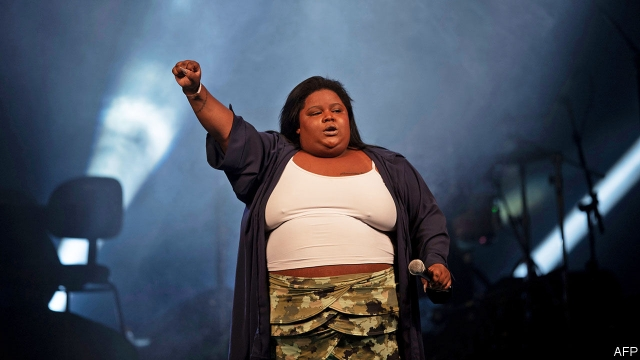

###### 100% feminista

# Female MCs are changing Brazilian funk music 

##### They are as rude as male singers, but more appealing to women 

 

> May 2nd 2019 

CAROLINA DE OLIVEIRA LOURENÇO first heard the word “feminism” in 2015 from friends who were taking Brazil’s college entrance exam, on which a question about it appeared. She was 22, and a rising star in the world of carioca funk, throbbing syncopated dance music born in the favelas of Rio de Janeiro. A year later, MC Carol, as she is known, released a song called “100% Feminista”. The lyrics describe her tough childhood: “I was five but I already understood/that a woman gets hit if she doesn’t make food,” she rapped. It was a hit. That did not stop nasty comments on social media about her appearance. “It’s not just hard to be a woman singing funk,” says MC Carol, who calls herself black and fat. “It’s hard to be a woman, period.” 

Funk, which has roots in American hip hop, is performed mostly by men. Its critics say its lyrics promote misogyny, promiscuity and crime. In 2017 20,000 Brazilians signed a petition calling on congress to declare it—along with bailes funk, massive dances where the music is played at ear-splitting volume—a public-health violation. (The legislature refused.) A particular target is funk proibidão (taboo funk), in which explicit lyrics both glorify and lament violence. Funk ostentação (ostentation funk), which celebrates money and fame, is especially popular in São Paulo. 

MC Carol’s mission, and that of other feminist funkeiras, is not to make the style less rude but to bring to it women’s viewpoints. MC (a hip-hop title derived from “master of ceremonies”) Carol started out singing putaria, a subgenre of proibidão that’s about sex. Some songs by women are frankly feminist. In the music video for “Não Sou Obrigada” (“I Don’t Have To”), which appears on Spotify’s Global Viral 50 list, MC Pocahontas chides her dopey boyfriend for bossing her around. In “Cai de Boca” (“Drop Your Mouth”), a putaria hit from 2018, MC Rebecca sings about men performing oral sex on women. A hair stylist and samba dancer from the favela Morro São João, she says the song is a call for sexual liberation in a world where “women are still seen as submissive”. 

Female funk performers and their messages bring new life to the subgenre “conscientious funk”, says Andressa Oliveira of Liga do Funk, a group in São Paulo that trains artists. It draws some of its energy from opposition to Brazil’s president, Jair Bolsonaro, who has aggressively conservative views on social issues. MC Rebecca, who came out as bisexual on Twitter, wrapped herself in a rainbow flag in a music video. Women are listening. ONErpm, a company that represents artists in negotiations with digital platforms, looked at data from YouTube for around 130 funk channels. It found that women are now 49.5% of the audience, up from 32% in 2014. 

Female stars are giving Brazilian funk global appeal. Larissa Machado, who calls herself Anitta, started out in a church choir, made her name in Rio’s funk scene and now has 37m Instagram followers, many of them abroad. The video for “Vai Malandra” (roughly, “Go Hustler”), which was filmed in a Rio favela, has been viewed 352m times on YouTube. Anitta refused to airbrush out the cellulite on her thighs, delighting women. “Vai Malandra” is the first Portuguese-language song to reach Spotify’s Global Top 50 list. That brought a singing gig with Madonna. 

Kamilla Fialho, whose marketing company, K2L, helped shape Anitta’s early career, compares her success to that of Beyoncé and Rihanna, who are politically active and flaunt their sexual empowerment. Her company is now coaching MC Rebecca by providing English lessons, among other things. Ms Fialho is not encouraging the young funkeira to stay away from the subject of sex. “If you want polite music, listen to classical,” she says. 

-- 

 单词注释:

1.feminista[]:[网络] 女性主义者 

2.MC[]:国会议员, 典礼官, 司仪, 医疗队 [计] 机器周期, 磁卡片, 主脉冲, 主控制 

3.Brazilian[brә'ziljәn]:n. 巴西人 a. 巴西的, 巴西人的 

4.funk[fʌŋk]:n. 怯懦, 恐惧, 臭味 vt. 畏缩, 害怕, 使闻到臭味 vi. 惊恐, 发出臭味 

5.Carolina[.kærә'lainә]:n. 北(或南)卡罗来纳州 

6.de[di:]:[化] 非对映体过量 [医] 铥(69号元素铥的别名,1916年Eder离得的假想元素) 

7.Oliveira[]:n. (Oliveira)人名；(西、葡)奥利韦拉 

8.feminism['feminizm]:n. 女权主义, 男女平等主义 [医] 男子女性 

9.carioca[kæri'әjkә]:n. 克力欧卡舞 

10.throb[θrɒb]:n. 跳动, 搏动 vi. 博动, 抽动, 颤动 

11.syncopate['siŋkәpeit]:vt. 把中间的字母省略掉 

12.favela[fɑ:'velɑ:]:n. (巴西的)贫民区 

13.rio[]:n. 里约（巴西共和国的旧首都） 

14.de[di:]:[化] 非对映体过量 [医] 铥(69号元素铥的别名,1916年Eder离得的假想元素) 

15.Janeiro[]:n. （葡）一月 

16.MC[]:国会议员, 典礼官, 司仪, 医疗队 [计] 机器周期, 磁卡片, 主脉冲, 主控制 

17.carol['kærәl]:n. 颂歌, 欢乐的歌 v. 歌颂, 欢唱 

18.feminista[]:[网络] 女性主义者 

19.lyric['lirik]:n. 抒情诗, 歌词 a. 抒情的 

20.rap[ræp]:n. 轻敲, 拍击, 责骂, 无价值的东西 vt. 轻敲, 厉声说出, 叱责, 抢走, 使着迷 vi. 敲击, 发敲击声, 交谈, 同情 [计] 随机存取程序, 资源分配处理器, 常驻汇编程序 

21.funk[fʌŋk]:n. 怯懦, 恐惧, 臭味 vt. 畏缩, 害怕, 使闻到臭味 vi. 惊恐, 发出臭味 

22.hip[hip]:n. 臀部, 蔷薇果, 忧郁 a. 熟悉内情的 vt. 使忧郁, 给(屋顶)造屋脊 interj. 喝彩声 

23.hop[hɒp]:n. 单脚跳, 跳跃, 舞会, 飞行 vi. 单脚跳, 跳跃 vt. 跃过, 跳上, 加蛇麻子于, 服麻醉药 [计] 跳跃式传输 

24.misogyny[mai'sɒdʒini]:n. 厌恶女人 [医] 厌女症, 厌恶女人 

25.promiscuity[.prɒmi'skju:iti]:n. 混乱, 杂乱, 放荡 

26.Brazilian[brә'ziljәn]:n. 巴西人 a. 巴西的, 巴西人的 

27.petition[pi'tiʃәn]:n. 请愿, 诉状, 陈情书, 申请, 祈求, 祷文 v. 正式请求, 恳求, 请愿 

28.baile[]: [法]委托方 

29.violation[.vaiә'leiʃәn]:n. 违反, 违背, 妨碍 [法] 违犯, 违背, 违反 

30.legislature['ledʒisleitʃә]:n. 立法机关, 议会, 立法院 [法] 立法机构, 立法机关 

31.taboo[tә'bu:]:n. 禁忌, 禁止接近, 禁止使用 a. 禁忌的, 忌讳的 vt. 禁忌, 忌讳, 禁止 

32.glorify['glɒ:rifai]:vt. 赞美, 美化, 赞扬, 使辉煌 

33.lament[lә'ment]:n. 悲叹, 悔恨, 恸哭, 挽歌, 悼词 vt. 哀悼 vi. 悔恨, 悲叹 

34.ostentation[.ɒsten'teiʃәn]:n. 虚饰, 虚有其表, 卖弄 

35.paulo[]:n. 保罗（男子名） 

36.les[lei]:abbr. 发射脱离系统（Launch Escape System） 

37.subgenre['sʌb,dʒeŋrə]: 亚种；亚美 

38.frankly['fræŋkli]:adv. 坦白地 

39.feminist['feminist]:n. 男女平等主义者 

40.sou[su:]:n. 苏（昔日法国之一种铜币）；无价值之物 

41.Pocahontas[,pəukə'hɔntəs]:n. 风中奇缘（电影名称） 

42.chide[tʃaid]:v. 斥责, 责骂 

43.dopey['dәupi]:a. 被麻醉的, 呆笨的, 迟钝的 

44.boyfriend['bɔifrend]:n. 男朋友 

45.CAI[]:计算机辅助教育, 计算机模拟输入 [计] 计算机辅助教学 

46.boca[]:abbr. 国际职业建筑人员与法规管理人员联合会 

47.rebecca[ri'bekә]:n. 丽贝卡（女子名, 寓意迷人的美） 

48.stylist['stailist]:n. 文体学家, 时装设计师 

49.samba['sæmbә]:n. 桑巴舞 vi. 跳桑巴舞 

50.dancer['dɑ:nsә]:n. 舞蹈演员, 跳舞者 

51.morro['mɔrәj,'mɔ:-]:n. [地]小丘, 岬角 

52.submissive[sәb'misiv]:a. 服从的, 顺从的 

53.Oliveira[]:n. (Oliveira)人名；(西、葡)奥利韦拉 

54.liga[]:n. 里加（地名） 

55.opposition[.ɒpә'ziʃәn]:n. 反对, 敌对, 相反, 在野党 [医] 对生, 对向, 反抗, 反对症 

56.jair[]:[网络] 睚珥；贾伊尔；睢珥 

57.aggressively[]:adv. (贬)侵略, 侵犯, 寻衅, (褒)敢作敢为, 有进取心, (武器)攻击性, 过分, 放肆 

58.bisexual[.bai'seksjuәl]:a. 两性的, 雌雄同体的 [医] 两性的 

59.twitter['twitә]:n. 啁啾, 唧唧喳喳声 vi. 啭, 啁啾, 颤抖 vt. 嘁嘁喳喳地讲, 抖动 

60.negotiation[ni.gәuʃi'eiʃәn]:n. 谈判, 磋商, 交涉 [经] 谈判, 协商 

61.youtube[]:n. 视频网站（可以让用户免费上传、观赏、分享视频短片的热门视频共享网站） 

62.larissa[]:n. 拉里萨（希腊地名）；拉瑞莎（女子名） 

63.Machado[]:n. (Machado)人名；(西)马查多；(意)马卡多；(葡)马沙多 

64.anitta[]: 阿尼塔 

65.Instagram[]:一款图片分享应用 

66.follower['fɒlәuә]:n. 从者, 属下, 追补者 [电] 随动机 

67.vai[]:abbr. 奥钢联（铸造机品牌）；工业增加值；辅助指令视频（Video Assisted Instruction） 

68.hustler['hʌslә]:n. 催促者, 拉客的人, 骗子 [法] 乱推乱挤的人, 非法赚钱的 

69.airbrush['єәbrʌʃ]:n. 喷枪 

70.cellulite[ˈseljulaɪt]:n. （胖女人臀腿部的）脂肪团 

71.thigh[θai]:n. 大腿, 股 [医] 股, 大腿 

72.gig[gig]:n. 旋转物, 轻便双轮马车, 赛艇, 鱼叉, 记过, 爵士乐演奏会 vi. 乘轻便双轮马车, 乘快艇, (用鱼叉)叉鱼 vt. (用鱼叉)叉, 刺激, 记过 

73.Madonna[mә'dɒnә]:n. 圣母玛利亚, 圣母像 

74.Fialho[]:菲亚略 

75.marketing['mɑ:kitiŋ]:n. 行销, 买卖 [经] 推销, 在市场买卖, 销售 

76.rihanna[]:n. [人名]蕾哈娜 

77.politically[]:adv. 政治上 

78.flaunt[flaunt]:n. 炫耀, 飘扬 v. 炫耀, 飘扬 

