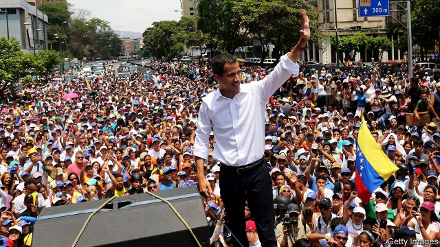

###### Missiles maketh the man

# Politics this week 

 

> May 2nd 2019 

Juan Guaidó, who is recognised as interim president of Venezuela by many democracies, appeared outside an air-force base in Caracas and urged the armed forces to overthrow the socialist dictatorship of Nicolás Maduro. Leopoldo López, an opposition figure kept under house arrest by the regime, appeared with Mr Guaidó after being freed by security personnel. America reiterated its support for Mr Guaidó. Backed by Russia and Cuba, Mr Maduro said he had defeated an attempted coup. Amid more protests, Mr Guaidó called for strikes to topple the government. See article. 

Unions staged a national strike in Argentina to protest against the austerity policies of Mauricio Macri, the president. Mr Macri’s popularity has taken a dive of late, and he is up for re-election in October. Cristina Fernández de Kirchner, a spendthrift populist ex-president, could unseat him, a prospect that scares investors. See article. 

China sentenced a Canadian citizen to death for drug-trafficking. It is the second time this year a Canadian has received a death sentence in China. Some observers think this is in reprisal for Canada arresting the finance director of Huawei, a Chinese telecoms-equipment company. 

Abu Bakr al-Baghdadi, the leader of Islamic State, appeared in a video for the first time since proclaiming the creation of a caliphate across parts of Iraq and Syria five years ago. (He has been heard in audio recordings since then.) In the new video Mr Baghdadi notes his group’s defeat at Baghuz, its last stronghold in Syria, but vows to fight on. See article. 

The White House said it was working towards designating the Muslim Brotherhood as a terrorist organisation. The decision would bring sanctions on what was once the world’s pre-eminent Islamist movement. Egypt’s president, Abdel-Fattah al-Sisi, who toppled a Brotherhood-led government in 2013, reportedly requested the move. 

The IMF said Iran’s GDP would contract by 6% this year, caused in large part by American sanctions on Iranian oil exports. Annual inflation could reach 37%, the fund warned. The crisis is fuelling popular discontent with the government and ruling clerics. See article. 

The African Union extended a deadline imposed on coup leaders in Sudan to hand power to a civilian administration. The military junta was initially given 15 days. This has been extended by another 60 days. 

China dropped its objection to a proposal in the UN to list Masood Azhar, the leader of a Pakistani jihadist group, as a terrorist. This allowed the UN to declare sanctions on Mr Azhar, including the freezing of his assets and a travel ban. His group, Jaish-e-Muhammad, claimed responsibility for a suicide-bombing that killed 40 soldiers in Indian-administered Kashmir in February. China had previously opposed such sanctions, apparently in deference to Pakistan, a close ally. 

Akihito, the emperor of Japan, abdicated. He was succeeded by his son, Naruhito. Akihito won acclaim during his 30-year reign for apologising for Japan’s misdeeds in the second world war. See article. 

The Indonesian government declared its intention to move its capital. Jakarta, with a population of 30m, is congested and polluted. Although a new location has not yet been chosen, Palangkaraya, a city of 260,000 in the Indonesian part of Borneo, is being considered. See article. 

Riots engulfed Honiara, the capital of the Solomon Islands, after parliament picked Manasseh Sogavare to serve a fourth non-consecutive term as prime minister. An opponent had secured a court order delaying the vote, but the governor-general ignored it. See article. 

William Barr, America’s attorney-general, was grilled in Congress over his handling of the publication of the Mueller report. Mr Barr issued a summary of the report before its full publication, but two letters emerged this week from Robert Mueller criticising that summary for its lack of context. 

A gunman opened fire at a synagogue near San Diego, killing a woman. The 19-year-old suspect had posted an anti-Semitic diatribe online shortly beforehand. The Anti-Defamation League recorded a big increase in the harassment of, and assaults on, Jews in America last year. 

Joe Biden said he would seek the Democratic nomination for president of the United States. He went to Pennsylvania, where he touted his working-class credentials and played down the kind of identity politics that his rivals espouse. The 76-year-old former vice-president is leading the polls at this early stage. See article. 

A court ruled that Michigan’s congressional districts had been drawn by the state legislature to favour Republicans and ordered that they be redrawn in time for the 2020 election. Several courts have ruled that partisan gerrymandering can be unconstitutional. 

Spain’s ruling Socialist Party won the most seats in a general election, though it is still well short of a majority. Pedro Sánchez, the prime minister, may try to continue in office as head of a minority government, or cobble together a coalition. There are obstacles to reaching a deal with either Podemos or Ciudadanos, two possible partners. Vox, a nationalist party, entered parliament for the first time. See article. 

The president of France, Emmanuel Macron, made new promises after long talks with voters. They included tax cuts, tax exemptions for bonuses and a commitment to close the elite civil-service college, ENA. The gilets jaunes protesters seemed unmollified. More than 200 arrests were made in Paris during riots on May Day. See article. 

Julian Assange was sentenced by a British court to 50 weeks in prison for jumping bail in 2012, when he took refuge in the Ecuadorean embassy in London. Mr Assange still faces extradition to America, where he has been charged in relation to the leak of a trove of classified documents by WikiLeaks, which he founded. 

Gavin Williamson was sacked as Britain’s defence secretary for leaking information from a national-security meeting that had discussed allowing Huawei to build 5G networks. Theresa May, the prime minister, dismissed him after a speedy inquiry. Mr Williamson denies the allegation and complains of a “kangaroo court”. The new defence secretary is Penny Mordaunt, who wrongly claimed during the Brexit campaign that as an EU member Britain would have no veto if Turkey tried to join the European Union. See article. 

-- 

 单词注释:

1.politic['pɒlitik]:a. 精明的, 明智的, 策略的 

2.juan[hwɑ:n]:n. 胡安（男子名） 

3.interim['intәrim]:a. 暂时的, 临时的, 间歇的 n. 过渡时期 

4.Venezuela[,vene'zweilә]:n. 委内瑞拉 

5.caracas[kә'rækәs]:n. 加拉加斯（委内瑞拉首都） 

6.overthrow[.әuvә'θrәu]:n. 推翻, 瓦解, 倾覆 vt. 打倒, 推翻, 倾覆 

7.dictatorship[dik'teitәʃip]:n. 独裁者之职位, 独裁, 独裁政权 [法] 专攻, 独裁权 

8.maduro[mә'duәrәu]:a. 色深味浓的烟草做的, (雪茄)色深味浓的 

9.leopoldo[]:n. (Leopoldo)人名；(西、意、葡)莱奥波尔多 

10.López[]:[地名] 洛佩斯 ( 阿根、厄 ) 

11.opposition[.ɒpә'ziʃәn]:n. 反对, 敌对, 相反, 在野党 [医] 对生, 对向, 反抗, 反对症 

12.regime[rei'ʒi:m]:n. 政权, 当权期间, 政体, 社会制度, 体制, 情态 [医] 制度, 生活制度 

13.reiterate[ri:'itәreit]:vt. 反复地说, 重申, 反复地做 [法] 重述, 重申, 反覆地做 

14.Cuba['kju:bә]:n. 古巴 

15.coup['ku:]:n. 砰然的一击, 妙计, 出乎意料的行动, 政变 [医] 发作, 中, 击 

16.amid[ә'mid]:prep. 在其间, 在其中 [经] 在...中 

17.topple['tɒpl]:vt. 推翻, 颠覆 vi. 倒塌, 摇摇欲坠 

18.Argentina[.ɑ:dʒәn'ti:nә]:n. 阿根廷 

19.austerity[ɒ'sterәti]:n. 朴素, 苦行, 严格, 严峻 

20.Mauricio[]:n. 毛利西奥（男子名） 

21.macri[]: [人名] 麦克里 

22.popularity[.pɒpju'læriti]:n. 名声, 受大众欢迎, 流行 

23.Cristina[]:n. 克里斯蒂娜（电视剧中的人物） 

24.de[di:]:[化] 非对映体过量 [医] 铥(69号元素铥的别名,1916年Eder离得的假想元素) 

25.kirchner[]:柯克纳（人名） 

26.spendthrift['spendθrift]:n. 浪费的人 a. 浪费的, 挥霍无度的 

27.Populist['pɔpjulist]:n. 民粹派的成员 

28.unseat['ʌn'si:t]:vt. 剥夺...的席位, 使失去资格, 使退位, 罢免, 使去职, 使退职 

29.reprisal[ri'praizl]:n. 报复, 报仇, 报复性劫掠 [法] 复仇, 报复, 报复性暴力为 

30.huawei[]: 华为 

31.abu[]:abbr. 亚洲广播联盟（Asian Broadcast Union） 

32.bakr[]:n. (Bakr)人名；(阿拉伯、孟)贝克尔 

33.Islamic[iz'læmik]:a. 伊斯兰教的, 穆斯林的 

34.creation[kri:'eiʃәn]:n. 创造, 创作物, 发明 [化] 产生 

35.caliphate['kælifeit]:n. 伊斯兰教国王的职权或其领域 

36.Iraq[i'rɑ:k]:n. 伊拉克 

37.Syria['siriә]:n. 叙利亚 [经] 叙利亚 

38.recording[ri'kɒ:diŋ]:a. 记录的, 记录用的 n. 录音 

39.Baghdadi[]:n. (Baghdadi)人名；(阿拉伯)巴格达迪 

40.stronghold['strɒŋhәuld]:n. 要塞, 堡垒, 大本营 

41.vow[vau]:n. 誓约, 誓言, 许愿 vi. 起誓, 发誓, 郑重宣言 vt. 立誓, 起誓要, 郑重地宣布 

42.designate['dezigneit]:vt. 指定, 指明, 称呼 a. 已选出而未上任的 

43.Muslim['mjzlim; (?@) 'mʌzlem]:n. 伊斯兰教, 伊斯兰教教徒 

44.terrorist['terәrist]:n. 恐怖分子 [法] 恐怖份子, 恐怖主义 

45.organisation[,ɔ: ^әnaizeiʃən; - ni'z-]:n. 组织, 团体, 体制, 编制 

46.sanction['sæŋkʃәn]:n. 核准, 制裁, 处罚, 约束力 vt. 制定制裁规则, 认可, 核准, 同意 

47.Islamist[iz'lɑ:mist]:n. 伊斯兰教主义者；回教教徒 

48.reportedly[ri'pɒ:tidli]:adv. 根据传说, 根据传闻, 据报道 

49.IMF[]:国际货币基金组织 [经] 国际货币基金 

50.Iranian[i'reiniәn]:a. 伊朗的, 伊朗语系的 n. 伊朗人, 伊朗语 

51.inflation[in'fleiʃәn]:n. 胀大, 夸张, 通货膨胀 [化] 充气吹胀; 膨胀 

52.discontent[.diskәn'tent]:n. 不满 

53.Sudan[su:'dæn]:n. 苏丹 [化] 苯偶氮间苯二酚; 苏丹 

54.junta['dʒʌntә]:n. 以武力政变上台的(军)政府, 私党, 阴谋小集团, 政务会 

55.initially[i'niʃәli]:adv. 最初, 开头 

56.UN[ʌn]:pron. 家伙, 东西 [经] 联合国 

57.masood[]:[网络] 马苏德 

58.azhar[]:n. (Azhar)人名；(阿拉伯、巴基)爱资哈尔 

59.Pakistani[.pɑ:ki'stɑ:ni]:a. 巴基斯坦的 n. 巴基斯坦人 

60.jihadist[]:n. 伊斯兰圣战士 

61.asset['æset]:n. 资产, 有益的东西 

62.Kashmir['kæʃmiә]:n. 克什米尔 

63.apparently[ә'pærәntli]:adv. 表面上, 清楚地, 显然地 

64.deference['defәrәns]:n. 顺从, 尊重 

65.Pakistan[.pɑ:ki'stɑ:n]:n. 巴基斯坦 

66.ally['ælai. ә'lai]:n. 同盟者, 同盟国, 助手 vt. 使联盟, 使联合, 使有关系 vi. 结盟 

67.Akihito[,ɑ:ki'hi:təu; ɑ:'ki:ji:tɔ]:n. （日）天皇明仁 

68.abdicate['æbdikeit]:vt. 正式放弃 vi. 退位, 退出, 辞职 

69.naruhito[]:[网络] 皇太子德仁；德仁皇太子 

70.acclaim[ә'kleim]:n. 喝彩, 欢呼, 赞同 v. 欢呼, 喝彩, 称赞 

71.apologise[ә'pɔlәdʒaiz]:vi. 道歉（等于apologize） 

72.misdeed['mis'di:d]:n. 罪行, 犯罪 [法] 不端行为, 犯罪, 恶性 

73.Indonesian[.indәu'ni:ʒәn]:a. 印尼的 n. 印尼人, 印尼语群 

74.jakarta[dʒә'kɑ:tә]:n. 雅加达（印尼首都, 等于Djakarta） 

75.congest[kәn'dʒest]:vt. 使充满, 使拥塞, 使充血 vi. 充塞, 充血, 拥挤 

76.Palangkaraya[]:[地名] 帕朗卡拉亚 ( 印尼 ) 

77.Borneo['bɒ:niәu]:n. 婆罗洲 

78.riot['raiәt]:n. 暴动, 喧闹, 放纵 vi. 发动, 暴动, 纵情, 放荡 vt. 浪费, 挥霍 

79.engulf[in'gʌlf]:vt. 卷入, 吸进, 吞没, 使全神贯注 

80.Honiara[,hәjni'ɑ:rә]:霍尼亚拉[西南太平洋岛国所罗门群岛首都] 

81.Solomon['sɒlәmәn]:n. 所罗门(古以色列国王), 聪明人, 贤人 [计] 所罗门阵列处理机 

82.Manasseh[mә'næsә]:玛拿西 

83.william['wiljәm]:n. 威廉（男子名）；[常作W-][美俚]钞票, 纸币 

84.barr[]:abbr. 翻转形态（Bump and Run Reversal） 

85.Mueller[]:米勒（人名） 

86.Robert['rɔbәt]:[法] 警察 

87.criticise['kritisaiz]:v. 批评, 吹毛求疵, 非难 

88.context['kɒntekst]:n. 上下文, 背景, 来龙去脉 n. 上下文 [计] 上下文 

89.gunman['gʌnmәn]:n. 枪手, 持枪的歹徒, 制造枪械者 [法] 持枪歹徒, 持枪抢劫或杀人者, 枪炮工人 

90.synagogue['sinәgɒg]:n. 犹太人集会, 犹太教会堂, 犹太教 

91.san[sɑ:n]:abbr. 存储区域网（Storage Area Networking） 

92.diego[]:n. 迭戈（男子名） 

93.diatribe['daiәtraib]:n. 抨击, 谴责 

94.online[]:[计] 联机 

95.harassment['hærәsmәnt]:n. 困扰, 烦扰, 烦恼 [法] 折磨, 骚扰, 侵扰 

96.assault[ә'sɒ:t]:n. 攻击, 袭击 vt. 袭击, 攻击 vi. 发动攻击 

97.Jew[dʒu:]:n. 犹太人, 守财奴, 犹太教信徒 vt. 欺骗, 杀价 

98.joe[dʒәu]:n. 乔（男子名） 

99.biden[baidən]: [人名] 拜登 

100.nomination[.nɒmi'neiʃәn]:n. 提名, 任命, 提名权 

101.Pennsylvania[.pensil'veinjә]:n. 宾夕法尼亚 

102.tout[taut]:vi. 招徕顾客, 兜售物品 vt. 招徕, 刺探...情报 n. 兜售者, 侦查者 

103.credential[kri'denʃәl]:n. 国书, 凭据, 证明书 [经] 凭证, 证书 

104.espouse[i'spauz]:vt. 支持, 赞成, 嫁, 娶 [法] 娶, 出嫁, 信奉 

105.congressional[kәn'greʃәnl]:a. 会议的, 议会的, 国会的 [法] 代表大会的, 大会的, 议会的 

106.legislature['ledʒisleitʃә]:n. 立法机关, 议会, 立法院 [法] 立法机构, 立法机关 

107.redraw[.ri:'drɒ:]:vt. 重画 vi. 刷新屏幕 [计] 刷新屏幕 

108.partisan['pɑ:tizn]:n. 党羽, 虔诚信徒, 同党, 游击队员 a. 党派的, 偏袒的, 效忠的, 献身的, 盲目推崇的 

109.gerrymander['dʒerimændә]:vt. 为政党利益改划选区 vi. 不公正地划分选区 n. 改变选举区 

110.unconstitutional['ʌnkɔnsti'tju:ʃәnәl]:a. 违反宪法的, 不符合宪法的 [法] 违反宪法的, 违宪的, 不合宪法规定的 

111.pedro['pi:drәu]:n. 彼得牌戏（一种纸牌戏） 

112.cobble['kɒbl]:n. 圆石, 鹅卵石 vt. 铺鹅卵石, 修, 粗粗地修补 

113.coalition[.kәuә'liʃәn]:n. 结合体, 结合, 联合 [经] 联合, 联盟 

114.podemos[]:[网络] 社会民主力量党；社会民主党；社会暨民主力量党 

115.vox[vɔks]:[医] 语音, 语声 

116.nationalist['næʃәnәlist]:n. 国家主义者, 民族主义者 

117.emmanuel[i'mænjuәl]:n. 以马内利（耶稣基督的别称）；伊曼纽尔（男子名, 等于Immanuel） 

118.macron['mækrәn]:n. 长音符号 

119.voter['vәutә]:n. 选民, 投票人 [法] 选民, 选举人, 投票人 

120.exemption[ig'zempʃәn]:n. 解除, 免除, 免税 [化] 免检 

121.elite[ei'li:t]:n. 精华, 精锐, 中坚分子 

122.Ena['enə]:n. (Ena)人名；(英、西、意)埃娜(女名), 埃纳 abbr. 可提取性核抗原（Extractable Nuclear Antigen） 

123.gilet[dʒi'lei]:n. 背心, 马甲 

124.jaune[]:[网络] 汝拉 

125.protester[]:n. 抗议者, 持异议者, 拒付者 [经] 反对者 

126.unmollified[]:[网络] 不明显 

127.Julian['dʒu:ljәn]:a. 尤利乌斯恺撒的 

128.Assange[]:[网络] 阿桑奇；阿桑奇先生；维基解密创办人阿尚吉 

129.bail[beil]:n. 保释, 拎环, 杓, 栅栏 vt. 保释, 舀水 

130.Ecuadorean[]:厄瓜多尔人 厄瓜多尔的 厄瓜多尔人的 

131.extradition[.ekstrә'diʃәn]:n. 引渡逃犯, 亡命者送还本国 [法] 引渡 

132.trove[trәuv]:n. 发现物, 收藏品 [法] 发现物, 收藏物 

133.wikileaks[]: 维基解密 

134.gavin[]:n. 加文（男子名） 

135.williamson['wiljәmsn]:n. 威廉姆森（姓氏名） 

136.theresa[ti'ri:zә]:n. 特丽萨（女子名） 

137.speedy['spi:di]:a. 快的, 迅速的 [经] 快的, 迅速的 

138.allegation[.æli'geiʃәn]:n. 断言, 主张, 申辩 [法] 声明, 事实陈述, 断言 

139.mordaunt[]:[网络] 敏特声；喇吧；莫当特 

140.wrongly[]:adv. 错误地, 不恰当地, 不正确地, 不正直地, 不公正地 

141.Brexit[]:[网络] 英国退出欧盟 

142.EU[]:[化] 富集铀; 浓缩铀 [医] 铕(63号元素) 

143.veto['vi:tәu]:n. 否决权 vt. 否决, 禁止 

