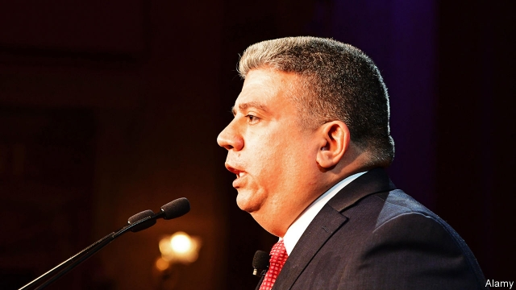

###### Case dismissed

# A new breed of prosecutors is tasked with getting people out of jail 

##### Conviction-review units are becoming more common in America’s big cities 

 

> May 4th 2019 

BLADIMIL ARROYO was sentenced to 20 years-to-life in a New York prison for murder, attempted robbery and assault. In February this year he was let out thanks to the efforts of the local government that had put him away 18 years ago. His conviction was overturned after the Brooklyn district attorney’s conviction review unit (CRU) found that he had been deprived of a fair trial, in part because not all of the detectives’ notes had been shared with the defence. Mr Arroyo was the 25th person to have his conviction quashed by Brooklyn’s district attorney (DA) since 2014. 

That year Ken Thompson, a previous DA, expanded the unit, which until then had only investigated troublesome convictions on an ad-hoc basis. Its first task was to investigate 100 potentially wrongful convictions in cases mostly related to a particular disgraced detective. The unit, the largest in the country, has since become a model for other jurisdictions. With a budget of $1m, the team retraces steps, tracks down witnesses, including those in other states or behind bars, and sorts through mounds of evidence. Seasoned lawyers are assigned to the unit. The findings are then considered by an independent review panel made of volunteer lawyers not affiliated with the DA. Blame is not necessarily assigned, but the details of how the authorities failed the defendant are made public. 

In Mr Arroyo’s case, Eric Gonzalez, Brooklyn’s current DA, published a 43-page report detailing all the missteps and problems. The report also spells out lessons learnt. Overturning wrongful convictions has changed the DA’s office procedures and training. An exoneration “makes everyone stop and pay attention and learn lessons”, says Mr Gonzalez. Most of the overturned convictions have been for murders, but burglaries and rape convictions have also been rubbed out. Mr Gonzalez says that his lawyers’ “obligation as prosecutors doesn’t end when we get a guilty plea or when we get a guilty verdict.” Miriam Krinsky, a former prosecutor and head of Fair and Just Prosecution, a network for reform-minded district attorneys, says all this helps makes Brooklyn’s CRU the gold standard. 

More than 30 jurisdictions across the country have set up similar units. In fact they are becoming the norm in large urban district-attorney offices. According to the National Registry of Exonerations there were 58 exonerations in 2018 that can be attributed to CRUs. John Hollway, of the University of Pennsylvania’s Quattrone Centre, says the culture has shifted from “why would you have one” to “why don’t you have one?” In the past month two more states, Michigan and New Jersey, launched units. Gurbir Grewal, New Jersey’s attorney-general, says the prosecutors are on board: “no one wants an innocent person behind bars.” Mr Grewal has also created a statewide cold-case unit. 

“We should have a criminal-justice system that promotes human dignity,” says Brooklyn’s Mr Gonzalez. It seems to be working: one exonerated man was so grateful to Brooklyn’s CRU that he invited the team and Mr Gonzalez to his wedding. 

-- 

 单词注释:

1.prosecutor['prɒsikju:tә]:n. 实行者, 告发者, 公诉人 [法] 原告, 起诉人, 检举人 

2.arroyo[ә'rɒiәu]:n. 干涸沟壑, 旱谷, 小河 

3.york[jɔ:k]:n. 约克郡；约克王朝 

4.assault[ә'sɒ:t]:n. 攻击, 袭击 vt. 袭击, 攻击 vi. 发动攻击 

5.conviction[kәn'vikʃәn]:n. 定罪, 信服, 坚信 [法] 定罪, 证明有罪, 判罪 

6.overturn[.әuvә'tә:n]:n. 倾覆, 破灭, 革命 vt. 推翻, 颠倒 vi. 翻倒 

7.Brooklyn['bruklin]:n. 布鲁克林区(纽约行政区) 

8.cru[kru:]:n. 酒的度数；（法国的）葡萄园 

9.deprive[di'praiv]:vt. 剥夺, 使丧失 [法] 剥夺, 剥夺, 夺去 

10.arroyo[ә'rɒiәu]:n. 干涸沟壑, 旱谷, 小河 

11.quash[kwɒʃ]:vt. 撤销, 平息, 镇压 [法] 撤销, 废止, 宣布无效 

12.attorney[ә'tә:ni]:n. 代理人, 律师 [经] 律师, 代理人 

13.DA[,di:'ei]:美国地方检察官 [计] 数据采集, 数据管理员, 数据分析, 设计自动化 

14.ken[ken]:n. 视野范围, 知识范围, 见地 

15.thompson['tɔmpsn]:n. 汤普森（姓） 

16.potentially[pә'tenʃәli]:adv. 可能地, 潜在地 

17.wrongful['rɒŋful]:a. 不正当的, 不法的, 不讲道理的 [法] 错误的, 不正当的, 伤害的 

18.disgrace[dis'greis]:n. 耻辱, 不名誉 vt. 使受耻辱, 使失体面 

19.jurisdiction[.dʒuәris'dikʃәn]:n. 司法权, 审判权, 管辖权 [经] 法律管辖权, 审判权 

20.retrace[ri'treis]:vt. 追溯, 折回, 绕回 [电] 返驰 

21.mound[maund]:n. 土墩, 堤, 小山 vt. 筑堤, 用土堆防卫 vi. 积成堆 

22.affiliate[ә'filieit]:vt. 使紧密联系, 使附属, 接纳, 收养 vi. 发生联系, 参加 

23.defendant[di'fendәnt]:n. 被告 [经] 被告方 

24.eric['erik]:abbr. 科教资源信息中心（Educational Resources Information Center）；电子遥控与独立控制（Electronic Remote and Independent Control） 

25.Gonzalez[]:n. 冈萨雷斯（姓氏） 

26.misstep[.mis'step]:n. 踏错, 错误, 失策 [法] 失足, 过失, 失策 

27.exoneration[ig.zɒnә'reiʃәn]:n. 免罪, 免除 [经] 免除, 解除, 免于 

28.burglary['bә:^lәri]:n. 夜盗行为, 盗窃, 盗窃行为 [法] 夜盗行为, 夜间入屋窃盗罪, 窃盗 

29.rape[reip]:n. 抢夺, 掠夺, 强奸, 葡萄渣, 芸苔 vt. 掠夺, 抢夺, 强奸 

30.plea[pli:]:n. 恳求, 辩解, 抗辩, 诉讼, 请愿, 托词 [法] 抗辩, 申诉案件, 答辩 

31.verdict['vә:dikt]:n. 裁决, 判决, 判断性意见, 定论, 结论 [法] 定论, 判断, 意见 

32.miriam['miriәm]:n. 米里亚姆（女子名）；[圣经]米里亚姆（希伯来女先知, 摩西和亚伦的姐姐）；苦难之洋 

33.krinsky[]:[网络] 克里斯基 

34.prosecution[.prɒsi'kju:ʃәn]:n. 执行, 经营, 起诉 

35.norm[nɒ:m]:n. 基准, 模范, 标准, 准则, 平均数 [化] 定额 

36.registry['redʒistri]:n. 登记处, 登记名册 [计] 登录库 

37.crus[krʌs]:n. 腿, 下肢 [医] 脚 

38.john[dʒɔn]:n. 盥洗室, 厕所, 嫖客 

39.hollway[]: [人名] [英格兰人姓氏] 霍尔韦 Holloway的变体 

40.quattrone[]:[网络] 夸特隆 

41.Michigan['miʃigәn]:n. 密歇根州 

42.jersey['dʒә:zi]:n. 运动衫 

43.gurbir[]: 

44.grewal[]:[网络] 法官格雷瓦尔；格瑞沃 

45.statewide['steitwaid]:a. 全州的, 遍及全州的 

46.exonerate[ig'zɒnәreit]:vt. 免除, 证明无罪 [法] 解放, 开释, 免罪 

