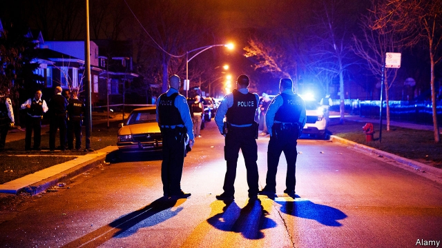

###### Monrovia on Lake Michigan

# Applying lessons from war-torn Africa to Chicago 

##### Concentrating on those most likely to kill or be killed may help to bring the murder rate down 

 

> May 4th 2019 

“I SEE A van, suspicious as hell. I keep walking. They just pull up, get to shooting. I was just trying to get to my man’s crib, four houses away. My mother say I died. I still got a bullet lodged in my liver right now. That shit was painful; worst feeling ever. I died and they brought me back.” 

Damien, a slender man in sports clothes and red running shoes, knows dangers lurk in some neighbourhoods. In the basement of a YMCA on Chicago’s South Side, he tells of being thrown out of home when he was 14. He has since been shot, pistol-whipped and imprisoned. Several friends have been killed, including two in a span of just eight days. “I know it’s time to do something different, I just want to see my daughter grow up”, he says. 

Another man, Devon, nods and agrees. He describes living amid, and participating in, frequent gun violence. “I been shaking. I’m shaking now,” he says, a few days after a friend was killed, in December. He also recalls being present when a stray round killed a young girl. Released from prison not long before, after serving a juvenile “life” term for murder, he sheds tears and talks of his anguish over whether to seek violent revenge. 

He also describes exhausting efforts to evade the rivals who hunt him. He rises at 3am, walks long and circuitous routes, avoids public transport (many targeted killings occur at bus stops), or remains locked indoors. Devon, a physically imposing man with close-cropped hair and a blue hoodie, says he is changing. “I came too far, I did too much. You want to wake up in peace, but you going to sleep with it [a gun] on you. What the fuck, two guns. You went to bed. Now you going to wake up.” 

Devon mentions behaviour today unthinkable for him a few years ago. He says he showed restraint shortly before another interview, in February, when unknown men robbed him as he cashed a cheque—“everything went too fast; there’s a gun over here, gun over here.” Rather than react violently, he says he use a method called “control, alt, delete” (CAD) to control his rage. “It saved my life. It probably saved theirs too.” He is proud of walking away. “I’m just saving lives”. 

Both men talk of growing into different people. Damien, having said, “It ain’t nothing to do it”, after describing his readiness to shoot people before, adds, “I’ve been controlling myself lately”. The two are among 700 participants in an 18-month, $25m experimental programme, called READI, which tries to change individuals’ behaviour in the most violent districts of Chicago. It is one response—funded by Heartland Alliance, a big non-profit group, and philanthropists—to a surge in violence in 2016, when Chicago saw 762 murders. Since big, hierarchical gangs fragmented into hundreds of tiny “cliques” of hot-headed and heavily armed youngsters, the city’s murder rate has been stubbornly high. The police force is unable to solve 80% of murders and 95% of all shootings. 

READI might make a difference. It mixes job training with months of intense efforts to teach habits of restraint. The men are supposed to become more employable and better able to control tempers. It is also led by a figure, Eddie Bocanegra, who has credibility among participants, having himself served 14 years in prison for a gang killing. 

Unusually, the scheme applies lessons from a study in Liberia, in west Africa, after years of civil war left young, homeless men involved in crime, especially in Monrovia, the capital. Researchers there recruited 999 “hard-core street youth”, picking individuals deeply involved in crime. Some got grants to start a business, others a few weeks of therapy to change impulsive behaviour and teach basic skills for legal ways to make a living. 

Those who got both grants and therapy turned out to be much less likely to be involved in crime a year later, says Chris Blattman, a researcher at the University of Chicago who worked in Liberia. He now helps to advise the READI programme, which began in 2017 and ends its first phase this year. As in Liberia, the programme targets the hardest cases. An algorithm developed by the city’s Crime Lab trawled police data for individuals’ arrest history, age, address, social networks, and for those who already know victims of violence—all indicators of who is likeliest to pull a trigger next. Mr Bocanegra says 91% of participants have been arrested before, on average 17 times each. The focus makes sense: one study found 70% of non-fatal shootings and 46% of fatal ones occur inside a network of just 6% of city residents. 

READI will be judged on whether it cuts, not ends, such violence. So far the anecdotes are encouraging, but at least five of its participants have been killed, including one man on April 28th. Mr Blattman says the first measure of success will be whether more participants survive than members who are monitored in a control group in the same neighbourhoods. He and Mr Bocanegra are cautious but hopeful. Devon is already convinced, because of the robbery that did not end in murder. “CAD worked. It worked. I was happy as hell.” 

-- 

 单词注释:

1.monrovia[mәn'rәuviә]:n. 蒙罗维亚（利比里亚首都） 

2.Michigan['miʃigәn]:n. 密歇根州 

3.Chicago[ʃi'kɑ:gәu]:n. 芝加哥 

4.crib[krib]:n. 婴儿小床, 食槽, 蓄栏 vi. 抄袭 vt. 拘禁, 关入栅栏 

5.shit[ʃit]:vi. 拉屎 vt. 欺骗, 在...拉屎 n. 粪, 屎 interj. 狗屁 

6.Damien[]:n. 达米安（“天魔”片中撒旦之子的名字） 

7.lurk[lә:k]:n. 潜伏, 潜行 vi. 暗藏, 潜伏, 埋伏 [计] 隐匿阅读 

8.ymca[]:abbr. 基督教青年会（Young Men's Christian Association） 

9.devon['devn]:n. 德文郡（等于Devon shire, 英国郡名）；德文岛（加拿大北部） 

10.amid[ә'mid]:prep. 在其间, 在其中 [经] 在...中 

11.stray[strei]:n. 走失的家畜, 浪子 a. 迷途的, 偶然的 vi. 迷路, 彷徨, 流浪 

12.juvenile['dʒu:vinail]:n. 少年, 少年读物 a. 少年的, 不成熟的, 适于少年的 

13.anguish['æŋgwiʃ]:n. 剧痛, 痛苦 vt. 使极痛苦 vi. 感到痛苦 

14.evade[i'veid]:v. (巧妙地)逃脱, 规避, 逃避 

15.circuitous[sә'kju:itәs]:a. 迂回的, 间接的, 绕行的 

16.killing['kiliŋ]:n. 谋杀, 杀戮 a. 杀害的, 疲惫的, 迷人的 

17.physically['fizikli]:adv. 按自然规律, 完全地, 实际上, 真正地, 身体上地 

18.hoodie['hjdi]:n. 有冠乌鸦 

19.fuck[fʌk]:vt. 与...性交, 欺骗, 诅咒 vi. 性交 n. 性交, 些微, 杂种 interj. 他妈的, 混帐 

20.unthinkable[.ʌn'θiŋkәbl]:a. 不能考虑的, 不能想像的, 想像不到的, 不合理的 

21.violently['vaiәlәntli]:adv. 猛烈地, 激烈地, 极端地 

22.alt[ælt]:n. 高音调 a. 高音调的 [计] 更换, 选择, 另外, 自动线路跟踪; 自由新闻组 

23.cad[kæd]:n. 卑鄙的男人, 下流人, 无赖, 计算机辅助设计 [计] 字符汇编/反汇编, 计算机辅助设计, 计算机辅助探测, 计算机辅助诊断 

24.readiness['redinis]:n. 预备, 准备, 敏捷 

25.participant[pɑ:'tisipәnt]:n. 参加者, 参与者 a. 有份的, 参加的, 参与的 

26.heartland['hɑ:tlænd]:n. 心脏地区, 中心地带 

27.alliance[ә'laiәns]:n. 联盟, 联合 [法] 同盟, 联盟, 联姻 

28.surge[sә:dʒ]:n. 巨涌, 汹涌, 澎湃 vi. 汹涌, 澎湃, 颠簸, 猛冲, 突然放松 vt. 使汹涌奔腾, 急放 [计] 电压尖峰 

29.hierarchical[,haiә'rɑ:kikәl]:[计] 分级的, 分层的, 层次的 

30.clique[kli:k]:n. 派系, 集团 vi. 结党 [计] 集团型 

31.stubbornly[]:adv. 倔强地；顽固地 

32.employable[im'plɒiәbl]:a. 适宜雇用的, 有资格任职的, 可利用的 

33.eddie['edi]:n. 埃迪（男子名） 

34.bocanegra[]:[网络] 博卡内格拉；号博卡内格拉；黑嘴 

35.credibility[.kredi'biliti]:n. 可信用, 确实性, 可靠 [法] 证据能力, 可信程度, 确实性 

36.Liberia[lai'biәriә]:n. 利比里亚 [经] 利比利亚 

37.homeless['hәumlis]:a. 无家的, 无养主的 

38.therapy['θerәpi]:n. 治疗 [医] 疗法, 治疗 

39.impulsive[im'pʌlsiv]:a. 冲动的, 受感情驱使的, 任性的 [医] 冲动的 

40.les[lei]:abbr. 发射脱离系统（Launch Escape System） 

41.chris[kris]:n. 克里斯（男子名）；克莉丝（女子名） 

42.algorithm['ælgәriðm]:n. 算法 [计] 算法 

43.trawl[trɒ:l]:n. 拖网 v. 用拖网捕鱼 

44.datum['deitәm]:n. 论据, 材料, 资料, 已知数 [医] 材料, 资料, 论据 

45.indicator['indikeitә]:n. 指示器, 指示剂, 指标 [计] 指示器 

46.trigger['trigә]:n. 触发器, 扳机 vt. 触发, 发射, 引起 vi. 松开扳柄 [计] 切换开关 

