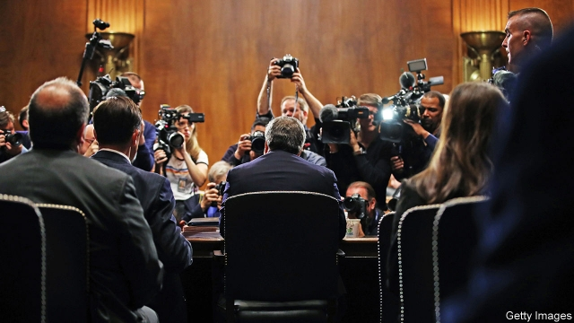

###### An oversight

# Donald Trump is not the first president to fight subpoenas 

##### Congress’s ability to scrutinise the executive branch rests on fragile norms 

 

> May 2nd 2019 

IN 1924 A Senate committee investigating the Teapot Dome bribery scandal issued a subpoena to Mal Daugherty, a bank president and brother of Harry Daugherty, who would soon resign as attorney-general. When Mal failed to appear the Senate dispatched its deputy sergeant-at-arms to Ohio to arrest him. Daugherty challenged his arrest, arguing that the Senate had exceeded its authority. The Supreme Court disagreed. Not only can Congress compel testimony essential to “a legislative function”; “it is to be presumed” that congressional investigations are intended “to aid [Congress] in legislating,” and “it is not a valid objection to such investigation that it might disclose wrongdoing or crime by a public officer.” 

President Donald Trump has sued two banks to stop them complying with House subpoenas (see article), and asked a federal court to block another to an accounting firm used by the Trump Organisation. He has vowed to fight one subpoena issued to Don McGahn, a former White House counsel, and has ordered an official who oversaw White House security clearances not to comply with another. More subpoenas may soon follow. The House Ways and Means Committee wants Mr Trump’s tax returns, which he has declined to turn over to them. The House Judiciary Committee may find William Barr, Mr Trump’s attorney-general, to be in contempt of Congress for ignoring a subpoena demanding the unredacted Mueller report. 

As that example suggests, congressional subpoenas are not all-powerful. Various presidents have fought them for different reasons. The usual levers brought to bear against private citizens who ignore subpoenas—fines and imprisonment—are harder to use against executive-branch officials. And congressional oversight, says Andrew Wright, an associate counsel to Barack Obama who is now a partner with K&L Gates, a law firm, “is a quasi-political, quasi-legal process” that usually resists quick resolution. This does not mean that Mr Trump—who has said that “we’re fighting all the subpoenas” because the House Democrats issuing them “aren’t, like, impartial people”—can simply ignore them, merely that this fight may have a political rather than a legal resolution. 

Congress can charge people who ignore subpoenas with contempt, which requires a majority vote in a single chamber. Enforcing that charge is trickier. The days of apprehension by the sergeant-at-arms followed by detention are over; that power has not been used since 1935, when a Hoover administration official was held at the Willard hotel. Contempt of Congress has been a federal crime since 1857, but Mr Barr is unlikely to approve prosecuting either his boss or anyone who was following his boss’s orders, including himself. 

That leaves civil contempt as a possible legal avenue. Congress can ask a federal court to compel obedience to a subpoena. This can take a while. In October 2011 Eric Holder, Barack Obama’s attorney-general, received a congressional subpoena. Mr Obama tried to block it by declaring executive privilege, in June 2012. A court rejected Mr Obama’s blanket claim of privilege, but not until January 2016. 

The current standoff may finish faster, for two reasons. First, many of the justiciability concerns that took courts time to work through during the Obama and Bush administrations have been resolved. And second, as Stephen Vladeck, a law professor at the University of Texas, explains, Mr Trump’s statement of blanket refusal “suggests that case-specific objections are post-hoc rationalisations”, which courts may be inclined to swiftly reject. 

But legal battles still take some time to adjudicate. That may annoy Democrats but suit Mr Trump perfectly. His supporters prize his pugnacity, and he prefers table-pounding defiance to the intricacies of legal compromise. Also, political salience fades over time. He may reckon that if he loses in court, the public will have moved on to the next outrage. And congressional subpoenas expire when the current Congress does, making a successful play for time a victory, of sorts. 

-- 

 单词注释:

1.oversight['әuvәsait]:n. 勘漏, 失察, 失败, 照料 [经] 监督权 

2.subpoena[sәb'pi:nә]:n. 传票 vt. 传审, 传唤 

3.scrutinise[]:vt.vi. 细看, 仔细检查, 审查, 细阅 [经] 详细检查, 细细地看 

4.norm[nɒ:m]:n. 基准, 模范, 标准, 准则, 平均数 [化] 定额 

5.dome[dәum]:n. 圆顶 vt. 加圆顶 vi. 成圆顶状 

6.bribery['braibәri]:n. 贿赂行为, 行贿, 受贿 [经] 行贿, 受贿 

7.mal[mɑ:l]:[医] [疾]病 

8.daugherty[]: [人名] [爱尔兰人、苏格兰人姓氏] 多尔蒂 Doherty的变体 

9.harry['hæri]:vt. 掠夺, 使苦恼, 强使前行, 折磨, 骚扰 

10.dispatch[dis'pætʃ]:vt. 派遣 n. 派遣, 急件 [计] 调度 

11.Ohio[әu'haiәu]:n. 俄亥俄 

12.testimony['testimәni]:n. 证言, 证据, 声明 [医] 证据 

13.legislative['ledʒislәtiv]:n. 立法机构 a. 立法的, 有立法权的 

14.presume[pri'zu:m]:vt. 假定, 推测, 擅自, 意味着 vi. 擅自行动, 相信 

15.congressional[kәn'greʃәnl]:a. 会议的, 议会的, 国会的 [法] 代表大会的, 大会的, 议会的 

16.legislate['ledʒisleit]:vi. 制定法律 vt. 用立法规定 

17.wrongdoing['rɒŋ'du:iŋ]:n. 干坏事, 坏事 

18.sue[su:]:vt. 控告, 起诉, 请求 vi. 提出诉讼, 提出请求 

19.comply[kәm'plai]:vi. 顺从, 依从 [法] 遵守, 承诺, 照做 

20.organisation[,ɔ: ^әnaizeiʃən; - ni'z-]:n. 组织, 团体, 体制, 编制 

21.vow[vau]:n. 誓约, 誓言, 许愿 vi. 起誓, 发誓, 郑重宣言 vt. 立誓, 起誓要, 郑重地宣布 

22.don[dɒn]:n. 西班牙贵族(或绅士), 先生, 阁下 vt. 穿上 

23.counsel['kaunsәl]:n. 商议, 忠告, 法律顾问 v. 商议, 劝告 

24.oversee[.әuvә'si:]:vt. 向下看, 了望, 监督, 偷看到 [法] 监察, 监督, 俯瞰 

25.clearance['kliәrәns]:n. 清除, 间隙 [化] 间隙; 空隙 

26.judiciary[dʒu:'diʃiәri]:a. 司法的, 法院的, 法官的 n. 司法部, 司法系统, 法官 

27.william['wiljәm]:n. 威廉（男子名）；[常作W-][美俚]钞票, 纸币 

28.barr[]:abbr. 翻转形态（Bump and Run Reversal） 

29.unredacted[]:[网络] 执意要求看到原始 

30.Mueller[]:米勒（人名） 

31.andrew['ændru:]:n. 安德鲁（男子名） 

32.wright[rait]:n. 制作者, 工人 

33.barack[bɑ:'ræk]:n. 巴拉克（男子名） 

34.obama[]:n. 奥巴马(姓) 

35.democrat['demәkræt]:n. 民主人士, 民主主义者, 民主党党员 [经] 民主党 

36.impartial[im'pɑ:ʃәl]:a. 公平的, 不偏不倚的 [法] 公正无私的, 不偏袒的, 公平的 

37.tricky['triki]:a. 狡猾的, 机敏的 

38.apprehension[.æpri'henʃәn]:n. 理解, 忧惧, 逮捕 [医] 领会 

39.detention[di'tenʃәn]:n. 阻止, 监禁, 拘留 [医] 隔离, 拘留, 滞留, 停滞 

40.hoover['hu:vә]:n. 胡佛电动吸尘器 vi. 用真空吸尘器打扫 

41.willard['wilɑ:d]:n. 威拉德（男子名） 

42.prosecute['prɒsikju:t]:vt. 告发, 起诉, 彻底进行, 执行, 从事 vi. 告发, 起诉, 作检察官 

43.obedience[ә'bi:djәns]:n. 服从, 顺从, 忠实 [法] 服从, 顺从, 遵从 

44.eric['erik]:abbr. 科教资源信息中心（Educational Resources Information Center）；电子遥控与独立控制（Electronic Remote and Independent Control） 

45.holder['hәuldә]:n. 持有人, 所有人, 支持物 [化] 夹持器; 夹具; 贮罐 

46.standoff['stændɒf]:a. 冷淡的, 有支架的 n. 冷淡, 平衡, 和局 

47.justiciability[,dʒʌ,stiʃiə'biləti]:n. 可诉性；可否审理；可审判性（justiciable的名词形式） 

48.stephen['sti:vn]:n. 斯蒂芬（男子名） 

49.Texas['teksәs]:n. 德克萨斯 

50.rationalisation[,ræʃәnәlai'zeiʃәn;-li'z-]:n. <主英>=rationalization 

51.swiftly['swiftli]:adv. 很快地, 即刻 

52.adjudicate[ә'dʒu:dikeit]:v. 判决, 宣告, 裁定 

53.supporter[sә'pɒ:tә]:n. 支持者, 后盾, 迫随者, 护身织物 [法] 支持者, 赡养者, 抚养者 

54.pugnacity[pʌg'næsiti]:n. 好斗 

55.defiance[di'faiәns]:n. 蔑视, 挑战 [法] 挑战, 藐视, 违抗 

56.intricacy['intrikәsi]:n. 纷乱, 复杂, 错综 

57.salience['seiliәns]:n. 显著, 卓越, 突出, 突起, 特征 

58.reckon['rekәn]:vt. 计算, 总计, 估计, 认为, 猜想 vi. 数, 计算, 估计, 依赖, 料想 

59.outrage['autreidʒ]:n. 暴行, 侮辱, 愤怒 vt. 凌辱, 虐待, 触犯 

60.expire[ik'spaiә]:vi. 期满, 呼气, 断气 vt. 呼出 

