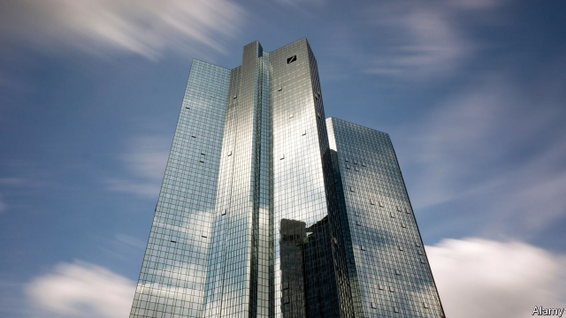

###### All the president’s banks

# Donald Trump sues Deutsche Bank and Capital One 

##### A once-chummy relationship turns sour 

 

> May 2nd 2019 

IN ONE RESPECT President Donald Trump, who at times likes to claim Swedish ancestry, is true to his German origins. Like most German family companies, his business has a Hausbank, a go-to bank with whom he has a long-standing relationship. But unlike those companies, he did not choose his Hausbank because of geographical proximity or family tradition. He did business with Deutsche Bank because no other big bank would lend him millions after several of his businesses went bankrupt in the 1990s. Germany’s biggest bank was so keen to be a prominent player in New York property that it ignored multiple red flags about the financial health of Mr Trump’s empire. It reportedly lent him $2bn over nearly two decades. 

The once-cordial relationship between Mr Trump and Deutsche has soured. When he became a serious contender for the presidency in 2016 Deutsche stopped lending him money (he still owes the bank tens of millions). Deutsche has started to hand over financial documents related to Mr Trump’s business dealings to Letitia James, New York’s attorney-general, who is investigating the president. Since January the bank’s lawyers have been co-operating with investigators from the Democratic-controlled House Intelligence and Financial Services committees, who are probing the president’s financial affairs. After the committees served a subpoena on April 15th, the bank signalled it would share decades of financial records with them by May 6th unless a court intervened. On April 29th Mr Trump sued Deutsche (and Capital One, an American bank) in a federal court in New York to stop the banks from complying with the subpoenas. 

The lawsuit asks the court to declare the committees’ subpoenas invalid. It claims they were issued to “harass” Mr Trump. “No grounds exist to establish any purpose other than a political one,” says the suit. Why is Mr Trump so keen to prevent records held by his primary lender from coming to light? Because Deutsche’s documents include internal company memos, estimates of the value of Mr Trump’s assets and parts of his personal and business-tax returns, which the Treasury Department (which oversees the IRS) has been reluctant to divulge. 

Deutsche Bank says the president’s lawsuit reflects a dispute between Mr Trump and congressional committees and that the bank is not accused of any wrongdoing. “We remain committed to providing appropriate information to all authorised investigations,” says the bank. Adam Schiff, chair of the House Intelligence Committee, praised Deutsche for its assiduous co-operation with congressional investigators. The ailing lender is trying to salvage its reputation. It hopes that, by providing more transparency, it will help to end unfounded speculation that it helped to channel Russian money to Mr Trump. Deutsche also vows to “abide by a court order” regarding the congressional investigation. 

The president’s suit seems unlikely to succeed. Courts tend to stay away from questioning lawmakers’ motives for investigations. And the executive-privilege defence that may fend off other subpoenas does not apply to things the president did in his private life before he was elected. This suggests that the two committees should get some fresh reading material before too long. 

-- 

 单词注释:

1.sue[su:]:vt. 控告, 起诉, 请求 vi. 提出诉讼, 提出请求 

2.deutsche[]:n. 德意志联邦共和国马克 

3.Swedish['swi:diʃ]:n. 瑞典人, 瑞典语 a. 瑞典的, 瑞典人的, 瑞典语的 

4.ancestry['ænsestri]:n. 祖先, 世系, 名门出身 

5.geographical[dʒiә'græfikl]:a. 地理学的, 地理的 

6.proximity[prɒk'simiti]:n. 接近, 亲近 

7.bankrupt['bæŋkrʌpt]:n. 破产者 a. 破产的 vt. 使破产 

8.york[jɔ:k]:n. 约克郡；约克王朝 

9.reportedly[ri'pɒ:tidli]:adv. 根据传说, 根据传闻, 据报道 

10.contender[kәn'tendә(r)]:n. 参赛者, 争论者, 斗争者, 竞争者 

11.presidency['prezidәnsi]:n. 总统职权, 总裁职位 

12.tens[]:十位 

13.dealing['di:liŋ]:n. 经营行为, 行为, 交易 [法] 待遇, 处置, 行为 

14.letitia[li'tiʃiə]:n. 利蒂希娅（女子名） 

15.jame[]: 灰岩井 

16.investigator[in'vestigeitә]:n. 调查者, 审查者 [法] 审查员, 侦查员, 调查员 

17.probe[prәub]:n. 探索, 调查, 探针, 探测器 v. 用探针探测, 调查, 探索 

18.subpoena[sәb'pi:nә]:n. 传票 vt. 传审, 传唤 

19.intervene[.intә'vi:n]:vi. 插入, 调停, 干涉 [经] 进场干预 

20.comply[kәm'plai]:vi. 顺从, 依从 [法] 遵守, 承诺, 照做 

21.lawsuit['lɒ:sju:t]:n. 诉讼 [法] 诉讼, 诉讼案件 

22.harass['hærәs]:vt. 使困扰, 使烦恼, 折磨 

23.lender['lendә]:n. 出借人, 贷方 [经] 出借者, 贷方, 贷款人 

24.memo['memәu]:n. 备忘录 [经] 备忘录 

25.asset['æset]:n. 资产, 有益的东西 

26.treasury['treʒәri]:n. 国库, 宝库, 财政部, 国库券 [经] 库存, 国库, 金库 

27.oversee[.әuvә'si:]:vt. 向下看, 了望, 监督, 偷看到 [法] 监察, 监督, 俯瞰 

28.IR[]:[化] 红外光谱法 [医] 铱(77号原素) 

29.divulge[di'vʌldʒ]:vt. 泄露, 透露 

30.congressional[kәn'greʃәnl]:a. 会议的, 议会的, 国会的 [法] 代表大会的, 大会的, 议会的 

31.wrongdoing['rɒŋ'du:iŋ]:n. 干坏事, 坏事 

32.authorise['ɔ:θәraiz]:vt. 授权；批准；允许；委任（等于authorize） 

33.Adam['ædәm]:n. 亚当 [计] 自动直接存取管理 

34.Schiff[]:n. 希夫（姓氏） 

35.assiduous[ә'sidjuәs]:a. 勤勉的, 刻苦的 

36.ailing['eiliŋ]:a. 生病的 [医] 患病的, 病痛的 

37.salvage['sælvidʒ]:n. 海上救助, 抢救, 打捞, 抢救出来的财物 vt. 海上救助, 抢救, 打捞, 营救 [计] 文件恢复程序 

38.transparency[træns'pærәnsi]:n. 透明, 透明度, 透过性, 透明物, 清晰 [计] 透明性; 透明 

39.unfounded['ʌn'faundid]:a. 没有事实根据的, 没有理由的, 虚幻的, 未建立的 [法] 无根据的, 无稽的, 没有理的 

40.speculation[.spekju'leiʃәn]:n. 沉思, 推测, 投机 [经] 投机交易, 买空卖空 

41.vow[vau]:n. 誓约, 誓言, 许愿 vi. 起誓, 发誓, 郑重宣言 vt. 立誓, 起誓要, 郑重地宣布 

42.abide[ә'baid]:vi. 停留, 遵守, 居留, 继续下去 vt. 忍受, 经受, 屈从于 

43.fend[fend]:vt. 击退, 保护, 供养 

