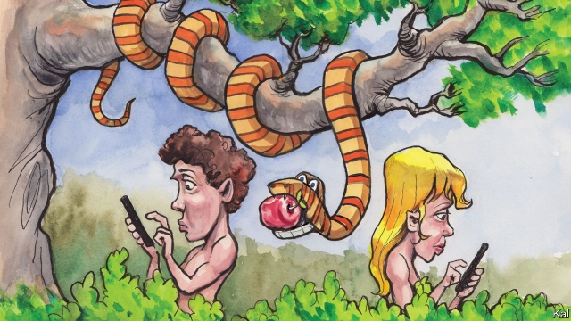

###### Lexington

# No sex please, we’re millennials 

##### A visitor from the 1990s marvels at the social conservatism on American campuses 

 

> May 4th 2019 

TO UNDERLINE HIS theory that sexuality is a construct of human discourse, the philosopher Michel Foucault noted that people talk about sex a lot. “We convince ourselves that we have never said enough on the subject,” he wrote in his (four-volume) “The History of Sexuality”. “It is possible that where sex is concerned, the most long-winded, the most impatient of societies is our own.” After a three-hour discussion of sex and dating with 30 students at Northwestern University, on the rainy shore of Lake Michigan, your columnist felt he knew why. Few fields of human behaviour—and none more important—are so hard to explain. 

Lexington’s visit was spurred by the latest evidence that young people in America—as in Japan and some other rich countries—are having much less sex. The portion of Americans aged 18 to 29 who claim to have had no sex for 12 months has more than doubled in a decade—to 23% last year. That is, counter-intuitively, despite the removal of many impediments to sex. Young Americans are less religious and more relaxed about sexual orientation than they have ever been. They are also readier to experiment, in part owing to the deluge of free porn they receive on smartphones. “You have access to the entire body of porn in your rucksacks!” marvelled Alexandra Solomon, a clinical psychologist who runs Northwestern’s renowned “Marriage 101” course, in a subsequent lecture. 

Her comment elicited hardly any amusement. Indeed, the most striking thing about the students to Lexington—in effect, a visitor from the 1990s—was how frank and unembarrassable they seemed. They were, despite their shared interest in studying sex at an elite university, a diverse crowd: straight and gay, black and white, outgoing and reserved. About half were from religious families; a couple from migrant ones. Yet all seemed willing to discuss their sexual likes, dislikes and anxieties, including use of porn, body shyness, and the possible role of both in fuelling a millennial obsession with pubic grooming. To the extent that they represented their generation, diffidence about sex is not the problem. 

The biggest reasons for the “sex recession” are probably straightforward. Married couples have more sex than singletons and Americans are marrying later. Economic duress is another dampener: it is no coincidence that the slowdown in young Americans’ sex lives began during the great recession. Partly as a result of it, many of them still live with their parents. And the low esteem that poor prospects engender, as the experience of many Japanese tragically attests, can also cause mass celibacy. 

The recent vigour of America’s economy might make this seem less relevant—especially among high-achievers like the Northwestern students. Yet it was striking how many mentioned the 2008 recession, including their memories of the distress it caused their parents, as a reason to prioritise their careers, even to the extent of forgoing romance entirely. “We’re not looking to get married any more, so what are we doing?” asked one woman. 

But that still does not seem to explain the persistence of America’s sex recession, or its most extreme feature: how concentrated it is among men. Since 2008 there has been almost a threefold rise in the share of men under the age of 30 who claim to be having no sex. At the same time, the portion of sexless women increased by only 8%. A range of possible explanations for the disparity has been suggested, and the students seemed to corroborate several of them. Many felt men’s social skills had been especially eroded by over-reliance on technology. Overindulgence in porn meanwhile offered them an escape route from reality. Yet the most compelling answer, because it contains elements of all that and more, may be signalled by young people’s increasing reluctance to date. 

This is often blamed on the “hook-up culture” of college campuses. Yet casual sex and dating coexisted in the 1990s. It is also easy to exaggerate—now as then—how many people are hooking up. Half the Northwestern students said they rarely or never did. Yet they also rattled off reasons not to date which, among the men, who would traditionally take the lead in such encounters, included uncertainty about how they were even managed. Many considered the prospect of chatting someone up in a bar not merely daunting but possibly offensive. “Revealing that your intention in talking to someone is sexual? That’s hairy,” shuddered one man. 

The problem seems to be a profound anxiety about what the other party to a potential coupling might want and expect. The heavy stress that all the students laid on the importance of mutually agreeing the basis of any relationship, at every stage of its development, is probably both a cause and effect of this. Dating apps, which around half the students had used, can mitigate it at best. It is likely a response to increased female empowerment, the major change in sexual politics, and therefore further exacerbated by men’s dread of a #MeToo-style harassment charge. In short, young American men with rather poor interpersonal skills currently face a historically confusing mating-game, even as they worry a lot about their careers. No wonder many are opting to stick to their video games. 

This is painful. But it does at least suggest that sexual relations are not so much hitting the skids in America as in flux. The forces that govern sexual behaviour are dynamic. Who could have predicted a little over a decade ago, when George W. Bush was  splurging on abstinence schemes, that America would soon see a spike in celibacy fuelled by economics, technology, female empowerment and perhaps even casual sex? And that cocktail of circumstances will not last. The economy is strong. The currents in popular culture will shift. And once young Americans become more used to their more equal gender relations, they might re-embrace the degree of ambiguity and risk that romance entails. That is the hope, at least. Meanwhile, they might try putting down their phones, talking face to face a bit more, and even flirting. 

-- 

 单词注释:

1.lexington['leksiŋtәn]:n. 列克星敦市（位于美国肯塔基州） 

2.millennials[mɪ'leniəl]:adj. 一千年的；一千年至福的 [网络] 千禧世代；千禧之子；千禧一代 

3.marvel['mɑ:vl]:n. 奇异事物, 罕见例子 vt. 惊异于 vi. 惊异 

4.conservatism[kәn'sә:vәtizәm]:n. 保守, 守旧性, 保守主义, [the]保守党的主张和政策, 保守党 [医] 保守性 

5.sexuality[.sekʃu'æliti]:n. 性征, 性行为, 性欲 [医] 性别, 性欲 

6.michel[]:n. 米歇尔（男子名） 

7.Foucault[fu:'kəu]:n. 傅科（人名） 

8.sexuality[.sekʃu'æliti]:n. 性征, 性行为, 性欲 [医] 性别, 性欲 

9.northwestern[.nɒ:θ'westәn]:a. 在西北部的, 西北方的, 来自西北的 

10.Michigan['miʃigәn]:n. 密歇根州 

11.columnist['kɒlәmist]:n. 专栏作家 

12.les[lei]:abbr. 发射脱离系统（Launch Escape System） 

13.impediment[im'pedimәnt]:n. 妨碍, 障碍, 阻止, 口吃 [经] 对履行义务的阻碍 

14.deluge['delju:dʒ]:n. 大洪水, 泛滥 vt. 使泛滥 

15.porn[pɔ:n]:n. 色情描写, 黄色书刊, 色情画, 色情照片, 色情文学 

16.smartphones[]: 智能手机（smartphone的复数） 

17.alexandra[,æli^'zɑ:ndrә]:n. 亚历山德拉（女子名, 义为男人的保护者） 

18.Solomon['sɒlәmәn]:n. 所罗门(古以色列国王), 聪明人, 贤人 [计] 所罗门阵列处理机 

19.clinical['klinikәl]:a. 临床的, 门诊部的 [医] 临床的, 临证的 

20.psychologist[sai'kɒlәdʒist]:n. 心理学家 [医] 心理学家 

21.renowned[ri'naund]:a. 有名的, 有声誉的 

22.elicit[i'lisit]:vt. 引出, 推导出, 引起 

23.unembarrassable[]:[网络] 不容忽视 

24.elite[ei'li:t]:n. 精华, 精锐, 中坚分子 

25.shyness['ʃainis]:n. 羞怯, 胆怯 

26.millennial[mi'leniәl]:a. 一千年的, 千福年的 

27.obsession[әb'seʃәn]:n. 困扰, 困扰人的情绪 [医] 强迫观念 

28.pubic['pju:bik]:a. 阴部的, 耻骨的 [医] 耻骨的 

29.groom[gru:m]:n. 马夫, 新郎, 男仆 vt. 喂马, 使...整洁, 推荐 vi. 打扮, 穿戴 

30.diffidence['difidәns]:n. 无自信, 畏缩, 羞怯 

31.recession[ri'seʃәn]:n. 后退, 凹处, 衰退, 归还 [医] 退缩 

32.singleton['siŋgltәn]:n. 一个, 独生子, 独身 

33.duress[djuә'reis]:n. 强迫, 监禁 [法] 强迫, 威胁, 监禁 

34.slowdown['slәudaun]:n. 降低速度, 减速 

35.esteem[i'sti:m]:n. 尊敬, 尊重 vt. 尊敬, 尊重, 认为 

36.engender[in'dʒendә]:vt. 产生, 引起 vi. 发生, 形成 

37.tragically['trædʒɪklɪ]:adv. 悲剧地, 悲惨地 

38.attest[ә'test]:vi. 证明, 表明, 作证 vt. 为...作证 

39.celibacy['selibәsi]:n. 独身 [法] 独身状态, 独身生活 

40.vigour['vigә]:n. 精力, 活力, 力量, 效力, 气势 

41.prioritise[praɪ'ɒrəˌtaɪz]:vt. 给予…优先权; 按优先顺序处理; 出轻重缓急 vi. 把事情按优先顺序排好（等于prioritize） 

42.forgo[fɒ:'gәu]:vt. 摒绝, 放弃 

43.persistence[pә'sistәns]:n. 固执, 坚持不懈, 持续(性), 存留(状态) [电] 持久 

44.threefold['θri:fәuld]:a. 三倍的, 三重的 adv. 三倍地, 三重地 

45.sexless['sekslis]:a. 无性的, 中性的, 无性别的, 缺乏性感的, 性欲冷淡的 

46.disparity[dis'pæriti]:n. 不一致 [医] 差异, 不等 

47.corroborate[kә'rɒbәreit]:vt. 巩固, 确证 [法] 确证, 确定, 证实 

48.erode[i'rәud]:vt. 腐蚀, 侵蚀 vi. 受腐蚀 

49.overindulgence[.әuvәrin'dʌldʒәns]:n. 放纵, 任性, 沉溺 

50.reluctance[ri'lʌktәns]:n. 不情愿, 勉强 [电] 磁阻 

51.coexist[.kәuig'zist]:vi. 共存 

52.rattle['rætl]:vt. 使嘎嘎响, 喋喋不休地说 vi. 格格响, 喋喋不休 n. 格格声, 拨浪鼓, 喋喋不休的话 

53.traditionally[]:adv. 传统上；传说上；习惯上 

54.uncertainty[.ʌn'sә:tnti]:n. 不确定, 不可靠, 不确定的事物 [化] 不确定度 

55.daunt[dɒ:nt]:vt. 威吓, 难倒, 使气馁 

56.offensive[ә'fensiv]:a. 令人不快的, 侮辱的, 攻击性的 [法] 攻击的, 进攻的, 冒犯的 

57.hairy['hєәri]:a. 多毛的, 毛状的, 长毛的 

58.profound[prә'faund]:a. 极深的, 深厚的, 深刻的, 渊博的 

59.coupling['kʌpliŋ]:n. 联结, 结合, 耦合 [计] 耦合 

60.mutually['mju:tʃuәli]:adv. 互相地, 互助 

61.APP[]:[计] 应用, 应用程序; 相联并行处理器 

62.mitigate['mitigeit]:vt. 温和, 缓和, 减轻 [医] 缓和, 减轻 

63.empowerment[ɪm'paʊəmənt]:n. 授权; 许可 

64.politic['pɒlitik]:a. 精明的, 明智的, 策略的 

65.exacerbate[ek'sæsәbeit]:vt. 使恶化, 使增剧, 激怒, 使加剧 

66.harassment['hærәsmәnt]:n. 困扰, 烦扰, 烦恼 [法] 折磨, 骚扰, 侵扰 

67.interpersonal[.intә'pә:sәnәl]:a. 人与人之间的, 人际(关系)的 [法] 人与人之间的, 需要与他人接触的 

68.currently['kʌrәntli]:adv. 现在, 当前, 一般, 普通 [计] 当前 

69.historically[his'tɔrikәli]:adv. 历史上地；从历史观点上说 

70.opt[ɒpt]:vi. 选择 

71.skid[skid]:vt. 刹住, 滚滑 vi. 打滑 n. 刹车, 滑动垫木 

72.flux[flʌks]:n. 流出, 涨潮, 变迁 vi. 熔化, 流出 vt. 使熔融 [计] 助焊剂 

73.george[dʒɔ:dʒ]:n. 乔治（男子名）；自动操纵装置；英国最高勋爵勋章上的圣乔治诛龙图 

74.W['dʌb(ә)lju:]:[计] 等待, 写, 字 [医] 钨(74号元素) 

75.splurge[splә:dʒ]:n. 炫耀, 夸示 vi. 炫耀, 卖弄, 挥霍 vt. 挥霍 

76.abstinence['æbstinәns]:n. 节制, 禁欲, 戒酒 [医] 节制, 禁戒(如禁酒,节欲) 

77.spike[spaik]:n. 长钉, 鞋钉, 钉状物, 尖峰状物, 穗 vt. 以大钉钉牢, 用尖物刺穿, 阻止, 弃置不用 [计] 尖峰信号 

78.cocktail['kɒkteil]:n. 鸡尾酒, 开味品 a. 鸡尾酒会的 

79.gender['dʒendә]:n. 性 vt. 产生 

80.romance[rәu'mæns]:n. 冒险故事, 浪漫史, 传奇文学 vi. 写传奇, 作空想, 虚构 

81.entail[in'teil]:vt. 使成为必需, 需要, 使承担, 遗传给 n. 限定继承 

82.flirt[flә:t]:n. 卖弄风骚的人, 急动, 急扔 vt. 忽然弹出, 轻快摆动, 挥动 vi. 调情, 玩弄, 摆动, 轻率地对待 

