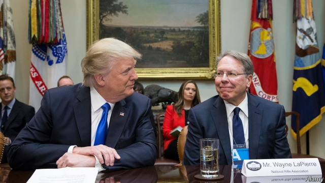

###### Wayne’s world

# What’s going on at the NRA? 

##### Political infighting is tearing America’s biggest gun lobby group apart 

 

> May 4th 2019 

HOW SERIOUS is the mess at the National Rifle Association? Wayne LaPierre, who has led the outfit since 1991, said earlier this year that it might be forced to shut “forever” because of gun-shy banks and business owners. That might sound hyperbolic. After all, NRA propagandists routinely claim some bogeyman—communists, zombies, “violent anti-second-amendment extremists” or New York’s governor—threaten NRA members and their constitutional rights. Scaremongering drums up the dues that pay its boss lavishly. 

Yet this time the lobby seems most intent on self-harm. A clash of personalities is partly to blame. Its ceremonial president Oliver North (of Iran-Contra fame), said last week that a “clear crisis” besets the group. He then bungled an effort to topple Mr LaPierre. As recently as last week the NRA had gushed over Mr North as “a rock-solid purveyor of truth and defender of justice, relentless in the face of wrongful criticism.” But that was before he reportedly told Mr LaPierre to quit or suffer a public letter about the organisation’s leaders and financial practices. Mr LaPierre says he stared down the lieutenant-colonel, who has now been replaced as president. 

That showdown took place in Indianapolis, where NRA members had flocked for their annual convention. Among the worried supporters was President Donald Trump, who tweeted that the lobby risks being destroyed if squabbling leaders fail to circle their wagons against a serious external threat. He meant a legal push by New York state (where the lobby has been registered since 1871), whose attorney-general, Letitia James, is dishing out subpoenas while asking if there was financial malpractice at the NRA. No friend of the lobby, she once called it a “terrorist” group. 

At stake is whether the legal case, if it goes against the NRA, eventually leads the gun group to lose its designation as a charity and thus its tax-free status. Without those advantages the NRA, which is secretive about its finances but seems to be in ever more serious debt, could go broke. No one is sure whether it really has the 5m members it claims. Survey data suggest that the share of Americans who own guns is declining, although people who do possess them own more than they used to. But one measure of the NRA’S straitened condition is that, in the mid-terms, gun-control groups outspent it in an election for the first time. That was quite a turnaround: the gun lobby dished up $30m to help get Mr Trump elected in 2016. 

The greatest problem for the lobby may thus prove to be financial. An investigation by the Trace, which studies the firearms industry, and the New Yorker recently provided evidence of questionable practices involving NRA bosses and Ackerman McQueen, an advertising agency in Oklahoma. The firm takes a hefty $40m a year from the NRA for marketing and more, and is behind some big and costly efforts to expand its media presence, for example with a TV channel. The NRA’s recent decision to sue its agency seems to have triggered Mr North’s putsch against Mr LaPierre. 

No wonder that opponents of the NRA sound gleeful over its mishaps. Andrew Cuomo, New York’s governor, crowed that “the gig is up for the NRA because people now know the truth.” As more members learn that the boss reportedly takes home $5m each year, their enthusiasm might wane. But don’t write him off yet. In the 1990s Mr LaPierre made an enemy of a sitting Republican president, George H.W. Bush, and the NRA was said to be insolvent. He and the gun lobby bounced back from that. They could do so again. 

-- 

 单词注释:

1.infighting['infaitiŋ]:n. 近战, 混战, 暗斗 

2.lobby['lɒbi]:n. 大厅, 休息室, 游说议员者 vi. 游说议员, 游说 vt. 游说 

3.wayne[wein]:n. 韦恩（男子名） 

4.lapierre[]:[网络] 拉皮埃尔；拉皮埃尔饭店；拉皮勒 

5.outfit['autfit]:n. 用具, 配备, 机构 vt. 配备, 供应 vi. 得到装备 

6.hyperbolic[,haipә:'bɔlik]:a. 双曲线的, 夸张法的 [计] 双曲线的 

7.NRA[]:abbr. 国家档案登记处（National Register of Archives） 

8.propagandist[.prɒpә'gændist]:n. 宣传者 a. 宣传的, 宣传者的 

9.routinely[]:adv. 日常, 乏味, 常规, 例行 

10.zomby[]:僵停 

11.extremist[iks'tri:mist]:[经] 偏激份子 

12.constitutional[.kɒnsti'tju:ʃәnl]:a. 宪法的, 立宪的, 体质的 [医] 全身的; 体质的 

13.scaremonger['skєәmʌŋgә]:n. 散布谣言的人, 危言耸听者 

14.lavishly['læviʃli]:adv. 浪费地, 丰富地 

15.intent[in'tent]:n. 意图, 含义, 故意 a. 专心的, 决心的, 热心的 

16.clash[klæʃ]:n. 冲突, 撞击声, 抵触 vi. 冲突, 抵触 vt. 使发出撞击声 [计] 对撞 

17.ceremonial[.seri'mәunjәl]:n. 仪式 a. 正式的 

18.oliver['ɒlivә]:n. 脚踏铁锤 

19.beset[bi'set]:vt. 围绕, 使苦恼, 镶嵌 

20.bungle['bʌŋgl]:v. 拙劣地工作, 粗制滥造, 把...搞糟 n. 粗劣, 失误, 笨拙 

21.topple['tɒpl]:vt. 推翻, 颠覆 vi. 倒塌, 摇摇欲坠 

22.gush[gʌʃ]:n. 涌出, 滔滔不绝地讲话 v. 涌出, 迸出, 滔滔不绝的讲话 

23.purveyor[pә'veiә]:n. 承办伙食者, 承办商人, 征发官员 

24.defender[di'fendә]:n. 防卫者, 防护者, 辩护者 [法] 辩护人, 保护人 

25.relentless[ri'lentlis]:a. 无情的, 冷酷的, 残酷的 

26.wrongful['rɒŋful]:a. 不正当的, 不法的, 不讲道理的 [法] 错误的, 不正当的, 伤害的 

27.reportedly[ri'pɒ:tidli]:adv. 根据传说, 根据传闻, 据报道 

28.showdown['ʃәudaun]:n. 摊牌, 暴露, 紧要关头 

29.indianapolis['indiә'næpәlis]:n. 印第安纳波利斯（美国印第安纳州首府） 

30.supporter[sә'pɒ:tә]:n. 支持者, 后盾, 迫随者, 护身织物 [法] 支持者, 赡养者, 抚养者 

31.tweet[twi:t]:vi. 啁啾 n. 小鸟叫声 

32.squabble['skwɒbl]:vi. 争吵, 口角 n. 争吵, 口角 

33.york[jɔ:k]:n. 约克郡；约克王朝 

34.letitia[li'tiʃiə]:n. 利蒂希娅（女子名） 

35.jame[]: 灰岩井 

36.subpoena[sәb'pi:nә]:n. 传票 vt. 传审, 传唤 

37.malpractice[mæl'præktis]:n. 不当治疗, 不端行为, 渎职 [医] 疗法失当, 医疗差错 

38.terrorist['terәrist]:n. 恐怖分子 [法] 恐怖份子, 恐怖主义 

39.designation[.dezig'neiʃәn]:n. 指示, 指定, 命名 [电] 指定 

40.statu[]:[网络] 状态查看；雕像；特级雪花白 

41.secretive[si'kri:tiv]:a. 秘密的, 偷偷摸摸的, 分泌的, 促进分泌的 

42.datum['deitәm]:n. 论据, 材料, 资料, 已知数 [医] 材料, 资料, 论据 

43.straiten['streitn]:vt. 使为难, 使穷困, 限制 

44.outspent[aut'spent]:outspend的过去式和过去分词 

45.firearm['faiә'ɑ:m]:n. 火器, 枪炮 

46.yorker['jɒ:kә]:n. 贴板球 

47.questionable['kwestʃәnәbl]:a. 可疑的 [法] 可疑的, 有问题的, 不可靠的 

48.Ackerman[]:n. (Ackerman)人名；(英、法、西、芬、捷、德、瑞典)阿克曼 

49.McQueen[]:n. 麦奎因（姓氏） 

50.advertising['ædvәtaiziŋ]:n. 广告业, 广告 a. 广告的 [计] 发广告 

51.Oklahoma[.әuklә'hәumә]:n. 俄克拉何马 

52.hefty['hefti]:a. 重的, 肌肉发达的 

53.marketing['mɑ:kitiŋ]:n. 行销, 买卖 [经] 推销, 在市场买卖, 销售 

54.sue[su:]:vt. 控告, 起诉, 请求 vi. 提出诉讼, 提出请求 

55.trigger['trigә]:n. 触发器, 扳机 vt. 触发, 发射, 引起 vi. 松开扳柄 [计] 切换开关 

56.putsch['putʃ]:n. （德）起义；暴动；叛乱 

57.gleeful['gli:ful]:a. 愉快的 

58.mishap['mishæp]:n. 不幸之事, 灾祸, 恶运 

59.andrew['ændru:]:n. 安德鲁（男子名） 

60.cuomo[]: [人名] 科莫 

61.gig[gig]:n. 旋转物, 轻便双轮马车, 赛艇, 鱼叉, 记过, 爵士乐演奏会 vi. 乘轻便双轮马车, 乘快艇, (用鱼叉)叉鱼 vt. (用鱼叉)叉, 刺激, 记过 

62.wane[wein]:n. 减少, 衰微, 败落, 亏缺, 月亏 vi. 变小, 亏缺, 衰落, 消逝, 退潮 

63.george[dʒɔ:dʒ]:n. 乔治（男子名）；自动操纵装置；英国最高勋爵勋章上的圣乔治诛龙图 

64.hw[]:abbr. 半波（Half Wave）；热水（hot water）；硬件（Hardware） 

65.insolvent[in'sɒlvәnt]:a. 无力偿还的, 破产的 n. 无力偿还者, 破产者 

