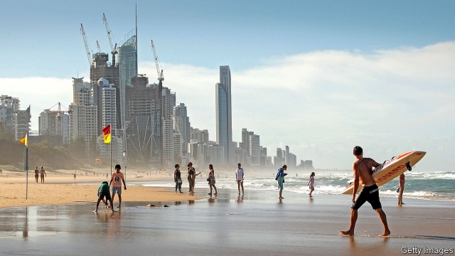
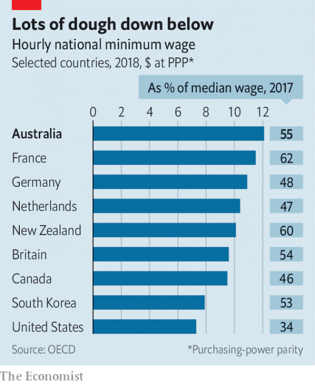

###### Sun, surf and bonzer pay

# Australia has the world’s highest minimum wage 

 

> print-edition iconPrint edition | Asia | Jul 20th 2019 

AUSTRALIA HAS long been at the leading edge of minimum wages. The state of Victoria was the second place in the world to introduce a wage floor in 1896, beaten only by New Zealand. A landmark legal case in 1907 took a more expansive view of a fair wage, ruling that it should be enough to maintain a family with three children in “frugal comfort”. Australia is still at it: it now has the world’s most generous minimum wage, reclaiming a distinction it last held more than a decade ago. 

The OECD, a club mainly of rich countries, compares minimum wages around the world by adjusting for inflation and the cost of living, and converting them into American dollars. On that basis Australian workers pulled in at least $12.14 an hour last year, up by nearly 4% from 2017. That puts them narrowly ahead of their peers in Luxembourg, ranked second, and a whopping two-thirds better off than federal minimum-wage earners in America (see chart). 

 

Australians may be incredulous to learn that they are doing relatively well. In recent years one of their big gripes has been sluggish wage growth. The norm in Australia used to be nominal annual wage increases of about 3% to 4%. Even after the global financial crisis of 2008, wage growth remained strong, thanks in part to the natural-resources boom. But over the past five years the resources sector has lost its fizz, and wage growth has ebbed to about 2% a year, lower than in America. 

That makes the high minimum wage all the more notable. The Fair Work Commission, an independent panel that sets the minimum wage after considering submissions from industry and the unions as well as academic research, raised it by 3% this year, after increases of 3.5% in 2018 and 3.3% in 2017. These rises have outpaced both inflation and broader wage growth, and have helped give low-end workers a somewhat bigger share of national income. 

It used to be an article of faith among economists that higher minimum wages would cause job losses, but data from Australia add to evidence that counters that assumption, at least as long as increases are gradual. A study by the Reserve Bank of Australia (RBA), the central bank, examined minimum-wage increases between 1998 and 2008, and found no discernible effect on employment. Similarly, over the past five years, Australia’s unemployment rate has fallen steadily. 

The value of the minimum wage is especially important in Australia since the pay of so many workers is linked to it. Under a national system of industry-wide salary awards, pay in many jobs, from cabin crew to funeral directors, is in effect indexed to the minimum wage. Every time the minimum wage goes up, so does the pay of nearly a quarter of Australians, making it a powerful lever to affect the economy as a whole. 

The RBA seems pleased with the boost to wages. It wants higher earnings to lift inflation, which is below its target of 2-3%. With the housing market in the doldrums, the economy is growing at the slowest pace since 2009, threatening Australia’s 28-year growth streak. But low pay rises, says Philip Lowe, the head of the RBA, harm the economy more than low house prices. ■ 
<<<<<<< HEAD

-- 

 单词注释:

1.surf[sә:f]:n. 海浪, 拍岸浪 vi. 作冲浪运动 

2.bonzer['bɒnzә]:a. 优秀的, 华丽的 

3.Jul[]:七月 

4.victoria[vik'tɔ:riә]:n. 维多利亚（女子名） 

5.zealand['zi:lәnd]:n. 西兰岛（丹麦最大的岛） 

6.landmark['lændmɑ:k]:n. 陆标, 划时代的事, 地界标 [医] 界标 

7.expansive[ik'spænsiv]:a. 扩张性的, 使扩大的, 广阔的 [化] 膨胀的; 可以膨胀的 

8.frugal['fru:gәl]:a. 节俭的, 朴素的 

9.reclaim[ri'kleim]:vt. 开垦, 改造, 感化, 纠正, 回收 vi. 喊叫, 抗议 

10.Oecd[]:[经] 已开发国家组织 

11.inflation[in'fleiʃәn]:n. 胀大, 夸张, 通货膨胀 [化] 充气吹胀; 膨胀 

12.narrowly['nærәuli]:adv. 狭窄地, 严密地, 仔细地, 几乎不, 勉强地, 仅仅 

13.peer[piә]:n. 同等的人, 匹敌, 贵族 vi. 凝视, 窥视, 费力地看, 隐现 vt. 与...同等, 封为贵族 

14.luxembourg['luksәm,bә:^]:n. 卢森堡公国；卢森堡（卢森堡公国首都） 

15.whop[hwɒp]:v. 打, 抽出, 打败, 征服 n. 重击, 打击声 

16.earner['ә:nә]:n. 赚钱的人 

17.incredulous[in'kredjulәs]:a. 怀疑的, 不轻信的 

18.gripe[graip]:n. 紧握, 柄, 把手, 控制 vt. 抓紧, 抱住, 使肠痛, 激怒 vi. 肠绞痛, 抱怨 

19.sluggish['slʌgiʃ]:a. 偷懒的, 懒惰的, 迟钝的 [经] 萧条的, 呆滞的 

20.norm[nɒ:m]:n. 基准, 模范, 标准, 准则, 平均数 [化] 定额 

21.nominal['nɒminl]:a. 名义上的, 名字的, 有名无实的, 稍许的 n. 名词性词 

22.sector['sektә]:n. 扇形, 部门, 部分, 函数尺, 象限仪, 段, 区段 vt. 把...分成扇形 [计] 扇面; 扇区; 段; 区段 

23.fizz[fiz]:vi. 嘶嘶响, 显示兴奋 n. 嘶嘶声, 兴奋, 活力 

24.ebb[eb]:n. 退潮, 衰退 vi. 潮退, 衰退 

25.notable['nәutәbl]:n. 著名人士, 值得注意之事物 a. 值得注意的, 显著的 

26.submission[sәb'miʃәn]:n. 屈服, 服从, 谦恭, 呈递, 提交, 意见 [经] 提交, 提出, 提交公断 

27.outpace[.aut'peis]:vt. 超过...速度, 赶过 

28.economist[i:'kɒnәmist]:n. 经济学者, 经济家 [经] 经济学家 

29.datum['deitәm]:n. 论据, 材料, 资料, 已知数 [医] 材料, 资料, 论据 

30.rba[]:abbr. relative batting average 平均的相对打击水平 

31.discernible[di's\\:nәbl,-'z\\:-]:a. 看得清的, 可看出的, 可辨别的, 辨别得出的 [计] 可识别的 

32.earning['ә:niŋ]:n. 收入（earn的现在分词） 

33.doldrum['dɒldrəm]: [医]赤道无风带 

34.streak[stri:k]:n. 条理, 斑纹, 倾向 vt. 加条纹 vi. 变成条纹, 飞跑 

35.philip['filip]:n. 菲利普（男子名） 

36.lowe[]:n. 劳氏（世界知名跨国公司）；灵狮（全球第4大广告代理机构） 
=======
>>>>>>> 50f1fbac684ef65c788c2c3b1cb359dd2a904378

