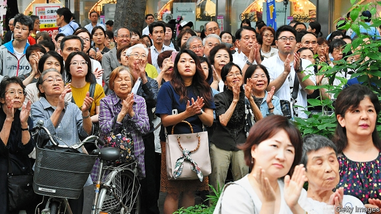

###### Yawning in the face of danger

# Japan’s dull election is a sign of ailing politics 

 

> print-edition iconPrint edition | Asia | Jul 20th 2019 

IT IS THE opposite of election fever. On July 21st Japan will go to the polls to vote for 124 of 245 seats in the upper house, where members sit for six years. Were it not for the posters, the odd noisy campaign van and occasional rallies outside train stations, few people would notice. The vote is not the main topic of conversation in the media nor in crowded cafés. Indeed, given the lack of interest, some analysts fret that turnout will dip below 50%. 

There is little upheaval in Japan’s politics, but that does not make them healthy. Turnout has long been falling for all age groups (see chart)—and the decline may accelerate if the young remain disengaged as they age. The lowering of the voting age in 2016 from 20 to 18 seems to have made little difference. Faith in the system is faltering, too. In 2018 only 40% of Japanese said they were happy with their democracy, down by ten percentage points from a year earlier, according to the Pew Research Centre, an American think-tank. 

 

The dearth of interest is not for lack of pressing issues. Three topics are dominating the election. The first is a planned hike in the consumption tax from 8% to 10%, which is intended to slow the growth of Japan’s monstrous public debt (currently around 250% of GDP), but which many economists fear could cause the long-faltering economy to stumble yet again. The second is pensions. The government has tried to disown, play down and deny the recent finding of the Financial Services Agency, a regulator, that the average elderly couple will need to top up their public pension by an eye-watering 20m yen ($185,000) to maintain a reasonable standard of living. The third is a proposed amendment to the pacifist clause of the constitution to make it clear that the Self-Defence Forces, Japan’s army in all but name, is legal (the government has abandoned the idea of scrapping the clause altogether). 

The amendment is the first item in the manifesto of the ruling Liberal Democratic Party (LDP), but polls suggest a majority of voters oppose it. Nonetheless, the LDP is likely to win handsomely. It has ruled for all but a handful of the past 65 years. At the moment, says Aurelia George Mulgan of the University of New South Wales, there is only “a weak desire to throw the bastards out”. “It is practically a one-party state,” says Hajime Yoshikawa of the Social Democratic Party. 

A few, like Mieko Nakabayashi, a former MP with the Democratic Party of Japan (DPJ), blame voters for not giving opposition parties a chance despite supporting many of their policies. The DPJ’s three-year stint in power from 2009 to 2012 was “not enough time to raise a baby”, she laments. The DPJ’s chaotic tenure made voters wary of turning to the opposition—a reluctance reinforced by nettlesome foreign-policy problems that seem to demand experienced hands, such as North Korea’s nuclear programme, China’s military build-up and American protectionism. 

The law that restricts most forms of campaigning to between 12 and 17 days, depending on the election, makes it difficult for new parties and candidates to catch voters’ attention and convey a coherent message. “Most simply repeat their names over and over again in front of train stations or on their campaign cars, because that’s all they have time to do,” says Kenneth Mori McElwain of the University of Tokyo. Even if the opposition were to get into power again, the bureaucracy, which has close ties to the LDP after all these years, would work against it, as it did to the DPJ. 

The LDP’s long dominance has also kept politics a pursuit for old men. This is the first parliamentary poll since the Diet approved a resolution urging all parties to try to field more female candidates: 28% of the 370 people contesting seats on July 21st are women, a record. But only 15% of the LDP’s candidates are female. Many LDP MPs, including Shinzo Abe, the prime minister, inherited their seats from their fathers. 

A recent poll of candidates revealed that the LDP’s have less socially liberal views than those of other parties. “It is to do with the gate-keepers, the party elite, who have very old ideas of what leadership looks like and entails,” says Linda Hasunuma of the University of Bridgeport in America. There are hardly any openly gay politicians, for instance. Mari Murakami, a 29-year-old lesbian, says she feels “marginalised” when she votes, because the leading parties are against same-sex marriage. 

The long tenure of Mr Abe has made things worse. He faces little opposition from within his own party because of his successive electoral victories and because of a weakening of the factions that once jostled for power within the LDP. He has concentrated authority in the Kantei, the prime minister’s office. A recent editorial in the Asahi Shimbun, a left-leaning newspaper, lamented that “the relationship between the administrative and legislative branches of the government has lost the healthy tension vital for a sound democracy… this has led to endemic arrogance and lax discipline within the administration.” 

Ministers drag their feet about providing information to the public and debating policy. The budget committees of both houses have not held a single meeting since the Diet passed the budget in April. The government refuses to provide clear and detailed explanations of scandals such as the one concerning Moritomo Gakuen, a private school that has ties to Mr Abe and was able to buy public land on the cheap. 

The Constitutional Democratic Party, the largest opposition grouping, is campaigning in part on reviving Japan’s democracy. Asahi reckons that the upper house elections “will be an opportunity for Japanese voters to make choices that help restore health to this nation’s democracy”. They seem unlikely to seize it. There is a chance that voters might deprive the ruling coalition of its current super-majority of seats, Ms Mulgan says, which would impede its plan to amend the constitution. But polls suggest even that may not happen, leaving the government strong and public enthusiasm for politics weak. ■ 

-- 

 单词注释:

1.ailing['eiliŋ]:a. 生病的 [医] 患病的, 病痛的 

2.politic['pɒlitik]:a. 精明的, 明智的, 策略的 

3.Jul[]:七月 

4.rally['ræli]:n. 重振旗鼓, 集合, 群众集会, 跌停回升 v. 重整旗鼓, 集合, 恢复精神, 团结, 挖苦, 嘲笑 

5.analyst['ænәlist]:n. 分析者, 精神分析学家 [化] 分析员; 化验员 

6.fret[fret]:n. 烦躁, 磨损, 焦急, 网状饰物 vi. 烦恼, 不满, 磨损 vt. 使烦恼, 腐蚀, 使磨损, 使起波纹 

7.turnout['tә:naut]:n. 聚集的人群, 出席者, 产量 [化] 输出; 产额 

8.upheaval[ʌp'hi:vl]:n. 举起, 隆起, 大变动, 剧变 

9.turnout['tә:naut]:n. 聚集的人群, 出席者, 产量 [化] 输出; 产额 

10.disengage[.disin'geidʒ]:vt. 使脱离, 使松开, 使摆脱约束(或义务等) vi. 脱离, 解脱 

11.falter['fɒ:ltә]:vt. 支吾地说 vi. 支吾, 蹒跚地走 n. 颤抖, 支吾, 踌躇 

12.pew[pju:]:n. 教堂长椅, 会众, 座位 vt. 为(教堂)安装座位, 把...围在一起 

13.dearth[dә:θ]:n. 缺乏, 粮食不足, 饥馑 

14.hike[haik]:n. 徒步旅行, 远足, 涨价, 提高 vi. 步行, 徒步旅行, 上升 vt. 使高涨, 拉起 

15.monstrous['mɒnstrәs]:a. 巨大的, 畸形的, 怪异的 [法] 巨大的, 异形的, 畸形的:荒诞的 

16.currently['kʌrәntli]:adv. 现在, 当前, 一般, 普通 [计] 当前 

17.economist[i:'kɒnәmist]:n. 经济学者, 经济家 [经] 经济学家 

18.disown[dis'әun]:vt. 否认 [计] 不认, 驱逐 

19.regulator['regjuleitә]:n. 调整者, 校准者, 校准器, 调整器, 标准钟 [化] 调节剂; 调节器 

20.yen[jen]:n. 日元(日本货币单位), 渴望, 嗜好 vi. 渴望 

21.amendment[ә'mendmәnt]:n. 修订, 改善, 改良, 改正 [化] 调理剂; 修正 

22.pacifist['pæsifist]:n. 和平主义者, 反战论者, 不抵抗主义者 

23.clause[klɒ:z]:n. 子句, 条款 [计] 子句 

24.scrap[skræp]:n. 碎片, 残余物, 些微, 片断, 铁屑, 吵架 vt. 扔弃, 敲碎, 拆毁 vi. 互相殴打 a. 零碎拼凑成的, 废弃的 

25.manifesto[.mæni'festәu]:n. 宣言, 声明 

26.LDP[]:abbr. 自由民主党（Liberal Democratic Party）；增加标签分发协议（Label Distribution Protocol） 

27.voter['vәutә]:n. 选民, 投票人 [法] 选民, 选举人, 投票人 

28.nonetheless[,nʌnðә'les]:conj. 然而, 尽管, 不过 adv. 不过, 仍然, 尽管如此, 然而 

29.handsomely['hænsәmli]:adv. 漂亮地, 整齐地, 当心地, 慢慢地, 优厚地, 慷慨地, 美观地 

30.aurelia[ɔ:'ri:liә]:n. 蛹,水母 

31.george[dʒɔ:dʒ]:n. 乔治（男子名）；自动操纵装置；英国最高勋爵勋章上的圣乔治诛龙图 

32.mulgan[]: [人名] [爱尔兰姓氏] 马尔根 Milligan的变体 

33.wale[weil]:n. 隆起的伤痕, 鞭痕, 凸条纹, 精华, 选择 vt. 在...上留下鞭痕, 织成棱纹, 挑选, 撑住 vi. 挑选 

34.bastard['bæstәd]:n. 私生子, 劣货 a. 私生的, 杂种的, 不合标准的 

35.hajime[]:[网络] 肇；一；兔耳族 

36.yoshikawa[]:吉川（地名） 

37.mieko[]:[网络] 美惠子；未映子；米蔻 

38.MP[]:国会议员, 下院议员 [计] 宏处理程序, 维护程序, 线性规划, 微程序, 多处理器 

39.dpj[]: [医][=dementia paralytica juvenilis]青少年麻痹性痴呆 

40.opposition[.ɒpә'ziʃәn]:n. 反对, 敌对, 相反, 在野党 [医] 对生, 对向, 反抗, 反对症 

41.stint[stint]:vt. 节省, 限制, 停止 vi. 节约 n. 吝惜, 节约, 限额 

42.lament[lә'ment]:n. 悲叹, 悔恨, 恸哭, 挽歌, 悼词 vt. 哀悼 vi. 悔恨, 悲叹 

43.chaotic[kei'ɒtik]:a. 混乱的, 无秩序的 [法] 混乱的, 混沌的 

44.tenure['tenjuә]:n. 享有, 保有期 [经] (财产,职位等的)占有, 占有权 

45.wary['wєәri]:a. 谨慎的, 小心的, 机警的, 周到的, 唯恐的 

46.reluctance[ri'lʌktәns]:n. 不情愿, 勉强 [电] 磁阻 

47.nettlesome['netlsәm]:a. 令人激恼的, 烦人的, 易怒的 

48.protectionism[prә'tekʃәnizm]:n. 贸易保护主义, 贸易保护制 [经] 保护(贸易)主义, 保护(贸易)制 

49.coherent[kәu'hiәrәnt]:a. 互相耦合的, 清晰的, 明了的，凝聚性的, 连贯的 

50.kenneth[]:n. 肯尼思（男子名）；[古]英俊的领导者 

51.MORI[]:abbr. 国际市场研究公司（Market &Opinion Research International） 

52.mcelwain[]: [人名] 麦克尔韦恩 

53.bureaucracy[bjuә'rɒkrәsi]:n. 官僚, 官吏 [法] 官僚主义, 官僚政治, 官僚机构 

54.dominance['dɔminәns]:n. 优势, 显性, 统治, 控制, 支配 [计] 控制, 扰势 

55.parliamentary[.pɑ:lә'mentәri]:a. 国会的, 议会的, 议会制度的 

56.MP[]:国会议员, 下院议员 [计] 宏处理程序, 维护程序, 线性规划, 微程序, 多处理器 

57.shinzo[]:[网络] 晋三；爆裂战士战蓝宝；神像 

58.abe[eib]:n. 亚伯（男子名, 等于Abraham） 

59.les[lei]:abbr. 发射脱离系统（Launch Escape System） 

60.socially['sәuʃәli]:adv. 在社会上, 在社交上, 以社会生活方式 

61.elite[ei'li:t]:n. 精华, 精锐, 中坚分子 

62.entail[in'teil]:vt. 使成为必需, 需要, 使承担, 遗传给 n. 限定继承 

63.linda[]:n. 琳达（女子名） 

64.Hasunuma[]:[地名] 莲沼 ( 日 ) 

65.bridgeport[]:n. 布里奇波特（地名） 

66.openly['әjpәnli]:adv. 公开地, 坦率地, 直率地, 公然地 

67.mari[maui]:n. 毛伊岛（位于夏威夷中部） 

68.murakami[]:n. (Murakami)人名；(英)穆拉卡米 

69.lesbian['lezbiәn]:a. 女同性恋的 n. 女同性恋者 

70.marginalise['mɑ:dʒɪnəlaɪz]:v. 使显得微不足道；使处于边缘；使无实权 

71.electoral[i'lektәrәl]:a. 选举人的, 选举的, (有关)选举的 [法] 选举的, 选举人的, 由选举人组成的 

72.faction['fækʃәn]:n. 小派系, 内讧 [法] 宗派, 派别, 小集团 

73.jostle['dʒɒsl]:n. 推挤, 冲撞 vi. 推挤, 冲撞 vt. 推, 挤, 煽动 

74.Kantei[]:[网络] 堪亭流 

75.Asahi[]:n. 朝日（公司及其品牌名称） 

76.shimbun[]: 新闻 

77.administrative[әd'ministrәtiv]:a. 管理的, 行政的 [法] 行政的, 管理的, 遗产管理的 

78.legislative['ledʒislәtiv]:n. 立法机构 a. 立法的, 有立法权的 

79.endemic[en'demik]:n. 地方病 a. 某地(或某些人中)流行的, 地方的 

80.arrogance['ærәgәns]:n. 傲慢态度, 自大 

81.lax[læks]:a. 松的, 不严格的, 腹泻的, 松弛的 n. 腹泻, 松元音 

82.constitutional[.kɒnsti'tju:ʃәnl]:a. 宪法的, 立宪的, 体质的 [医] 全身的; 体质的 

83.grouping['gru:piŋ]:n. 分组 [计] 组 

84.revive[ri'vaiv]:vt. 使苏醒, 使复兴, 使振奋, 回想起, 重播 vi. 苏醒, 复活, 复兴, 恢复精神 

85.reckon['rekәn]:vt. 计算, 总计, 估计, 认为, 猜想 vi. 数, 计算, 估计, 依赖, 料想 

86.deprive[di'praiv]:vt. 剥夺, 使丧失 [法] 剥夺, 剥夺, 夺去 

87.coalition[.kәuә'liʃәn]:n. 结合体, 结合, 联合 [经] 联合, 联盟 

88.impede[im'pi:d]:vt. 妨碍, 阻碍, 阻止 

89.amend[ә'mend]:vt. 修改, 改善, 改良 vi. 改过自新 

