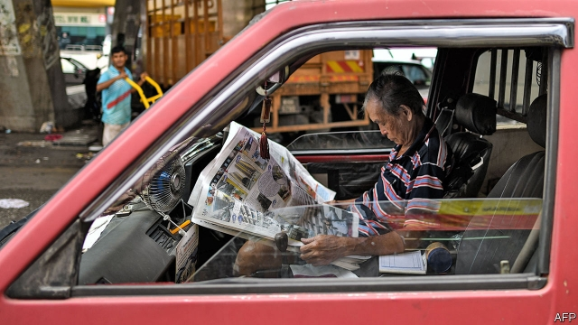

###### Spare change

# Malaysia’s callow government has not kept its vows on civil liberties 

 

> print-edition iconPrint edition | Asia | Jul 20th 2019 

POTS OF BRUSHES litter the desk of Zulkiflee Anwar Haque, a Malaysian political cartoonist better known as Zunar. Drawings of which he is especially proud decorate the blue walls of his studio in Kuala Lumpur. Several satirise Malaysia’s disgraced former prime minister, Najib Razak, who was booted from office more than a year ago, along with his big-haired wife, Rosmah Mansor. Such cartoons drew the ire of Mr Najib’s government. Zunar was charged with multiple offences under illiberal laws on publishing and sedition. The surprise victory in last year’s elections of a reformist coalition, Pakatan Harapan (PH), brought his legal troubles to an end. But although PH has stopped persecuting journalists, it has not, as it promised, done away with the instruments of repression. “All the laws that the government used against me before still exist,” he grumbles. 

Dismantling the oppressive systems put in place by the United Malays National Organisation (UMNO), the party that ruled Malaysia for more than six decades, was never going to be quick or easy. Under Mr Najib and, to a lesser extent, his predecessors, the press was cowed, the electoral system was rigged, the judiciary and bureaucracy were pliant and critics, whether within or outside the government, were harassed or imprisoned, often on trumped-up charges. Officials who complained about corruption at 1MDB, a state investment vehicle from which $4.5bn disappeared on Mr Najib’s watch, lost their jobs. Those charged with investigating the affair say they feared for their lives. 

PH, many of whose members were victims of such abuses, promised to change all this. Its manifesto was a liberal wish-list of 464 initiatives, including repealing the Sedition Act, allowing the press greater freedom, reducing the powers of the prime minister and erecting stronger barriers between the executive and the judiciary.  

PH has taken some steps in the right direction, most notably by appointing respected figures to pivotal posts such as that of attorney-general, speaker of parliament and chief justice. A former campaigner for fair elections now sits on the Election Commission. The new head of the Malaysian Anti-Corruption Commission, Latheefa Koya, is considered independent. And in recent days the lower house of parliament passed an amendment to lower the voting age from 21 to 18. The shift could enfranchise almost 8m young voters in time for the next general election, which is expected in 2023. 

But in other respects, the government’s record is chequered. An effort to repeal a law on “fake news”, which allows the government to criminalise unfriendly reporting, was stymied in the upper house last year by the opposition. There has been no effort at all to repeal or amend a law that allows for detention without trial for 28 days, which was used to arrest the leader of demonstrations against corruption when Mr Najib was prime minister. And revisions to other laws, such as the Peaceful Assembly Act of 2012, which in practice curtails protests, are seen as inadequate. For example, the government plans to amend the law to require protesters to give the authorities seven days’ notice of a rally or march, rather than the previous ten. That is still far more, however, than the 48 hours that Human Rights Watch, an international NGO, considers reasonable. 

Meanwhile, Malaysians continue to be targeted under the Sedition Act. An outcry followed the High Court’s decision this month to reject the appeal of an Islamic preacher and political activist sentenced to nine months in prison for insulting the Sultan of Selangor, one of the nine monarchs who take turns as Malaysia’s head of state. Instead the activist’s sentence was increased to a year. The government points out that he was originally charged and sentenced, and his appeal lodged, while UMNO was still in power. But democracy advocates do not understand how a government supposedly determined to repeal the Sedition Act can sit by while such abuses continue. Mahathir Mohamad, the current prime minister, insists that change is at hand. “We are in the midst of structuring the new law and it will be concluded as soon as possible,” he declared on July 11th. 

But Dr Mahathir may be part of the problem. He is a former UMNO leader who unashamedly used many of the repressive laws that PH is supposed to be repealing during a previous stint as prime minister. More generally, the government is an awkward mix of long-time opposition activists and defectors from UMNO, such as Dr Mahathir, who were put off more by Mr Najib’s alleged corruption than by his authoritarian ways. 

Then there are Malaysia’s racial politics. The government was forced to abandon plans to ratify the International Convention on the Elimination of All Forms of Racial Discrimination, a UN-sponsored treaty, after objections from Malays, the country’s biggest ethnic group, who feared this might threaten the many affirmative-action schemes that favour them and discriminate against other groups. The opposition has painted many of the government’s reforms as harmful to Malays or contrary to Islam (the religion of most Malays)—charges fledgling ministers, many of whom are neither Malay nor Muslim, lack the confidence to rebut forcefully. 

Perhaps the biggest problem is that voters, and thus the government, are more interested in other subjects, most notably the economy. Repealing a hated goods-and-services tax was among PH’s first moves upon taking power. “I don’t think human rights is a real top priority,” admits one activist working with the government. 

As voters tire of the government, however, reforms will become harder to enact. “If you don’t do it off the bat when you come into power I’m not sure it will ever get done,” says Ambiga Sreenevasan, a prominent lawyer investigated for sedition by Mr Najib’s government. Malaysians voted for a coalition that loudly and explicitly espoused liberal values—but that may not have been why they voted for it. In the meantime, the state retains the power to repress their views. One of Zunar’s drawings captures the situation well. In it the stripes of Malaysia’s flag become bars behind which its people are imprisoned. ■ 
<<<<<<< HEAD

-- 

 单词注释:

1.callow['kælәu]:a. 年轻而无经验的, (鸟)羽毛未丰的 [机] 无羽毛的 

2.vow[vau]:n. 誓约, 誓言, 许愿 vi. 起誓, 发誓, 郑重宣言 vt. 立誓, 起誓要, 郑重地宣布 

3.Jul[]:七月 

4.Anwar[]:n. 安瓦尔；艾乃哇尔（一部影片） 

5.haque[]:[网络] 哈克 

6.Malaysian[mә'leiziәn]:a. 马来西亚的 n. 马来西亚人 

7.cartoonist[kɑ:'tu:nist]:n. 漫画家 

8.Zunar[]:[网络] 漫画家祖纳；漫画家是以祖纳；漫画家朱纳 

9.kuala[]:n. 河口 

10.lumpur[]:n. 吉隆坡 

11.satirise['sætәraiz]:vt. 讽刺, 讥刺, 用讽刺文抨击, 讽刺地描绘 vi. 写讽刺文, 讲讽刺话 

12.disgrace[dis'greis]:n. 耻辱, 不名誉 vt. 使受耻辱, 使失体面 

13.najib[]:n. 纳吉彼; 纳吉布; 纳吉（人名） 

14.razak[]:[网络] 拉扎克；拉萨家族；总理拉紮克 

15.ire[aiә]:n. 忿怒 [电] 美国无线电工程师学会 

16.illiberal[i'libәrәl]:a. 狭隘的, 无教养的, 吝啬的 

17.sedition[si'diʃәn]:n. 煽动骚乱, 暴动, 妨害治安, 骚动 [法] 煽动, 煽动叛逆罪, 暴动 

18.reformist[ri'fɒ:mist]:n. 改良主义者, 改革者 

19.coalition[.kәuә'liʃәn]:n. 结合体, 结合, 联合 [经] 联合, 联盟 

20.Pakatan[]:[网络] 蔡锐铭 

21.pH[pi:eitʃ]:氢离子指数 [医] 药典; 苯基 

22.persecute['pә:sikju:t]:vt. 迫害, 虐待, 困扰, 同...捣乱 [法] 迫害, 虐待, 烦扰 

23.repression[ri'preʃәn]:n. 抑制, 压抑, 制止 [医] 压抑, 抑制 

24.grumble['grʌmbl]:n. 怨言, 满腹牢骚 vi. 抱怨, 发牢骚, 发隆隆声 vt. 抱怨 

25.dismantle[dis'mæntl]:vt. 拆除...的设备, 分解, 去除覆盖物 

26.oppressive[ә'presiv]:a. 压制性的, 压迫的, 沉重的 

27.Malay[mә'lei]:n. 马来 a. 马来人的, 马来语的 

28.organisation[,ɔ: ^әnaizeiʃən; - ni'z-]:n. 组织, 团体, 体制, 编制 

29.umno[]: United Malays National Organization 马来民族统一机构 

30.Malaysia[mә'leiziә]:n. 马来西亚 [经] 马来西亚 

31.lesser['lesә]:a. 较少的, 较小的, 次要的 

32.predecessor[.predi'sesә]:n. 前任, 先辈, 前身 [医] 初牙, 前辈, 祖先 

33.electoral[i'lektәrәl]:a. 选举人的, 选举的, (有关)选举的 [法] 选举的, 选举人的, 由选举人组成的 

34.rig[rig]:n. 装备, 帆装 vt. 装配, 装扮, 给船装帆, 垄断, 操纵 

35.judiciary[dʒu:'diʃiәri]:a. 司法的, 法院的, 法官的 n. 司法部, 司法系统, 法官 

36.bureaucracy[bjuә'rɒkrәsi]:n. 官僚, 官吏 [法] 官僚主义, 官僚政治, 官僚机构 

37.pliant['plaiәnt]:a. 易弯的, 柔韧的, 柔顺的 

38.harass['hærәs]:vt. 使困扰, 使烦恼, 折磨 

39.corruption[kә'rʌpʃәn]:n. 腐败, 堕落, 贪污 [计] 论误 

40.manifesto[.mæni'festәu]:n. 宣言, 声明 

41.repeal[ri'pi:l]:n. 废止, 撤消 vt. 废止, 撤消, 放弃 

42.sedition[si'diʃәn]:n. 煽动骚乱, 暴动, 妨害治安, 骚动 [法] 煽动, 煽动叛逆罪, 暴动 

43.notably['nәjtbәli]:adv. 显著地, 著名地, 尤其, 特别 

44.pivotal['pivәtәl]:a. 枢轴的, 关键的, 起中心作用的 

45.campaigner[kæm'peinә]:n. 从军者, 老兵, 竞选者 

46.koya[]: [地名] [尼日利亚] 科亚 

47.amendment[ә'mendmәnt]:n. 修订, 改善, 改良, 改正 [化] 调理剂; 修正 

48.enfranchise[in'fræntʃaiz]:vt. 给予自治权, 给予选举权, 解放 [法] 给与公民权, 给予自由土地保有权, 释放 

49.voter['vәutә]:n. 选民, 投票人 [法] 选民, 选举人, 投票人 

50.chequer['tʃekә]:n. (一粒)棋子, 西洋跳棋, 方格图案, 格子花, 花楸果, 排列成方格式的石头 vt. 把...画/制成方格图案形, 交替变换 

51.fake[feik]:n. 假货, 欺骗, 诡计 a. 假的 vt. 假造, 仿造 vi. 伪装 

52.criminalise['krimənəlaiz]:vt. [主英国英语] =criminalize 

53.unfriendly[.ʌn'frendli]:adv. 不友善地 

54.stymy[]:n. (喻)困难的境地 vt. 使(球)处于困难的位置, 使为难, 使处困境, 妨碍, 阻挠, 阻碍 

55.opposition[.ɒpә'ziʃәn]:n. 反对, 敌对, 相反, 在野党 [医] 对生, 对向, 反抗, 反对症 

56.amend[ә'mend]:vt. 修改, 改善, 改良 vi. 改过自新 

57.detention[di'tenʃәn]:n. 阻止, 监禁, 拘留 [医] 隔离, 拘留, 滞留, 停滞 

58.demonstration[.demәn'streiʃәn]:n. 示范, 实证 [医] 示教, 实物教授 

59.curtail[kә:'teil]:vt. 缩减, 剥夺, 简略 [法] 剥夺特权 

60.inadequate[in'ædikwәt]:a. 不充分的, 不适当的 [法] 不充分的, 不适当的 

61.protester[]:n. 抗议者, 持异议者, 拒付者 [经] 反对者 

62.rally['ræli]:n. 重振旗鼓, 集合, 群众集会, 跌停回升 v. 重整旗鼓, 集合, 恢复精神, 团结, 挖苦, 嘲笑 

63.ngo[]:abbr. 民间组织；非政府组织（Non-Governmental Organization） 

64.Malaysian[mә'leiziәn]:a. 马来西亚的 n. 马来西亚人 

65.outcry['autkrai]:n. 尖叫, 倒彩, 强烈抗议, 喊价 vi. 喊叫 vt. 叫得比...响 

66.Islamic[iz'læmik]:a. 伊斯兰教的, 穆斯林的 

67.preacher['pri:tʃә]:n. 传道士, 讲道者, 牧师 

68.activist['æktivist]:n. 激进主义分子 

69.sultan['sʌltn]:n. 苏丹(某些伊斯兰国家统治者的称号) 

70.Selangor[sә'læŋә(r)]:雪兰莪州[马来西亚马来亚地区州名] 

71.monarch['mɒnәk]:n. 帝王, 统治者, 元首 [医] 单原型(植) 

72.originally[ә'ridʒәnli]:adv. 本来, 原来, 最初, 就起源而论, 独创地 

73.supposedly[sә'pәuzidli]:adv. 想象上, 看上去像, 被认为是, 恐怕, 按照推测 

74.Mahathir[]:n. (Mahathir)人名；(马来)马哈蒂尔 

75.Mohamad[]:n. (Mohamad)人名；(阿拉伯、印尼)穆罕默德 

76.unashamedly[ˌʌnə'ʃeɪmɪdlɪ]:adv. 厚颜无耻 

77.repressive[ri'presiv]:a. 压抑的, 抑制的, 镇压的 

78.stint[stint]:vt. 节省, 限制, 停止 vi. 节约 n. 吝惜, 节约, 限额 

79.defector[di'fektә]:n. 背叛者, 叛离者 [法] 变节分子, 背叛者, 开小差者 

80.allege[ә'ledʒ]:vt. 宣称, 主张, 提出, 断言 [法] 断言, 指称, 指证 

81.authoritarian[ɒ:.θɒri'tєәriәn]:a. 独裁的, 独裁主义的 

82.politic['pɒlitik]:a. 精明的, 明智的, 策略的 

83.ratify['rætifai]:vt. 批准, 认可 [经] 证实, 肯定, 确认 

84.ethnic['eθnik]:a. 人种的, 种族的 [医] 人种的 

85.discriminate[dis'krimineit]:v. 区别, 差别待遇 

86.Islam['izlɑ:m]:n. 伊斯兰教 

87.fledgling['fledʒliŋ]:n. 羽毛初长的雏鸟, 刚会飞的幼鸟, 无经验的人 

88.Malay[mә'lei]:n. 马来 a. 马来人的, 马来语的 

89.Muslim['mjzlim; (?@) 'mʌzlem]:n. 伊斯兰教, 伊斯兰教教徒 

90.rebut[ri'bʌt]:vi. 反驳 vt. 辩驳, 反驳, 揭露 

91.forcefully[]:adv. 激烈地；强有力地；有说服力地 

92.enact[i'nækt]:vt. 制定法律, 扮演, 颁布 [法] 法令, 法规, 条例 

93.Ambiga[]:[网络] 主席安美嘉；律师公会主席安碧嘉；联合主席安美嘉 

94.explicitly[]:adv. 明确地；明白地 

95.espouse[i'spauz]:vt. 支持, 赞成, 嫁, 娶 [法] 娶, 出嫁, 信奉 

96.repress[ri'pres]:vt. 镇压, 抑制, 压制 vi. 压制 
=======
>>>>>>> 50f1fbac684ef65c788c2c3b1cb359dd2a904378

