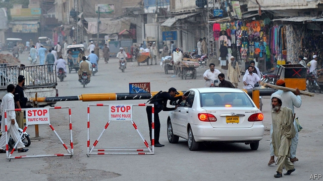
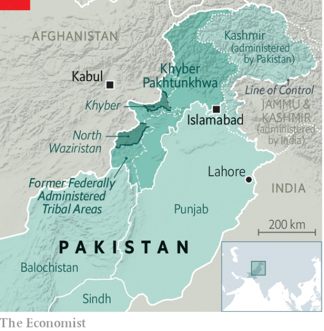

###### Political camouflage

# Pakistan’s borderlands at last win a say in their own administration 

 

> print-edition iconPrint edition | Asia | Jul 20th 2019 

NAHEED AFRIDI is something of a spectacle. She is canvassing for votes in Khyber district ahead of elections later this month. In a region where women are largely confined to their homes, her progress through villages near the Afghan border attracts curiosity and admiration, but also criticism. “I know I have challenged the ego of so-called strong men, and that’s why they tell me it’s against our religion and culture,” she says. 

The poll on July 20th, in which candidates will vie for one of 16 slots in the provincial assembly, is a milestone for Pakistan’s neglected tribal borderlands: it is the first time they have been allowed to vote for local administrators. Since colonial times, the area has been run directly by the central government. But last year a constitutional amendment brought the Federally Administered Tribal Areas (FATA), as the frontier zone used to be known, into the political and legal mainstream by merging it into the neighbouring province of Khyber Pakhtunkhwa. In theory, that gives the region’s 5m inhabitants the same rights as other Pakistanis. But the ballot follows a military crackdown against the very movement for civil liberties which has recently been invigorating local politics. 

FATA has been starved of development and repressed for decades—in part, presumably, because its people had little say in how it was run. The Frontier Crimes Regulations—passed more than a century ago—awarded a colonial official nearly absolute power. The set-up stayed in place after the British left because it suited the Pakistani authorities too. 

 

Life for residents worsened when FATA became a battleground after 9/11. Used for years as a base for Islamist insurgents who served as Pakistani proxies in Afghanistan, and then colonised by Afghan militants, it became a haven for jihadists. Residents, mainly from the Pushtun ethnic minority, found themselves caught between the militants and the army’s repeated offensives. The most recent, in a part of FATA called Waziristan in 2014, finally pushed the militants out and ended a bloody domestic terrorist campaign by the Pakistani Taliban. 

The army now claims that peace has been restored in the tribal borderlands and that rebuilding is under way. Opposition parties say that its tough tactics undermine promises of reform and show it has little intention of allowing civilian governance to bloom. The disagreement is at the core of the forthcoming election. Although security in the country has improved, military campaigns have displaced hundreds of thousands of people and soldiers stand accused of human-rights abuses. 

A popular protest movement called the PTM arose in the area in 2018. Its activists complain of oppressive curfews and checkpoints, and also decry extra-judicial killings and disappearances. Supporters thronged to its rallies. Unaccustomed to such dissent, the army at first tried to appease the PTM. Then its intolerance returned. In April infuriated generals publicly warned that the PTM’s time was up. The following month troops at a checkpoint in Waziristan fired into a crowd of its supporters and killed 13. The army claimed the soldiers were fired on first; the PTM says the crowd was unarmed. Two MPs who support the PTM and were at the scene, Mohsin Dawar and Ali Wazir, are being held under anti-terrorism laws. The army accuses the PTM of anti-state activities, backed by India and Afghanistan. Journalists have been ordered not to cover the group. 

The crackdown shows that power still lies with the army, despite the democratic promise of the approaching elections. In Waziristan a ban on rallies and political meetings was in place until two weeks before the contest. Opposition politicians say the reason given—to ensure security—is a pretext to constrain them and so help the Pakistan Tehreek-e-Insaf (PTI) party, which is in government at both the provincial and national level. 

Whoever wins the privilege of representing the region will have their work cut out. Large investments are needed in schools, hospitals, roads and water supplies to bring services in the area to a level similar to the rest of Pakistan. But promised money has yet to arrive. Adopting a proper judicial system is another headache. The borderlands have no courts and tribal police flail in the face of paperwork and investigations. Lawyers in interim courts say cases suffer when caught between the old and new systems. 

Despite growing disaffection with the slow pace of reforms and the pain of austerity measures imposed by the national government, the PTI is expected to do well at the polls. Ameer Muhammad Khan, a candidate for the party, says he meets scores of enthusiastic party workers at his campaign office each day. The vote will prove “historic in the life of every tribal person”, he says. It will also test the limits of the army’s forbearance. ■ 
<<<<<<< HEAD

-- 

 单词注释:

1.camouflage['kæmuflɑ:ʒ]:vt. 伪装, 掩饰 n. 伪装, 伪装物, 幌子 

2.borderland['bɒ:dәlænd]:n. 边界地方, 边陲, 两可间的状态 

3.Jul[]:七月 

4.afridi[]:n. 阿夫里迪蜡防花布 阿弗里迪 

5.Khyber[]:n. (Khyber)人名；(阿富)希贝尔 

6.Afghan['æfgæn]:a. 阿富汗的, 阿富汗人的 n. 阿富汗人, 阿富汗语, 阿富汗毛毯 

7.admiration[.ædmә'reiʃәn]:n. 赞赏, 钦佩, 引人赞赏的对象 

8.ego['egәu. 'i:gәu]:n. 自我 [医] 自我 

9.vie[vai]:vi. 争, 竞争, 争胜 vt. 提出...来竞争, 以...作较量 

10.slot[slɒt]:n. 水沟, 细长孔, 硬币投币口, 缝, 狭槽, 狭通道, 位置, 一档(广播节目等) vt. 开槽于, 把...纳入机构 [计] 槽; 存储槽 

11.provincial[prә'vinʃәl]:n. 外地人, 粗野的人 a. 省的, 外地的, 偏狭的 

12.milestone['mailstәun]:n. 里程碑, 里程石, 里程标 

13.tribal[traibl]:a. 部落的, 宗族的 

14.administrator[әd'ministreitә]:n. 管理人, 行政官 [经] 遗产管理人员 

15.colonial[kә'lәunjәl]:a. 殖民的, 殖民地的 [法] 殖民地居民 

16.constitutional[.kɒnsti'tju:ʃәnl]:a. 宪法的, 立宪的, 体质的 [医] 全身的; 体质的 

17.amendment[ә'mendmәnt]:n. 修订, 改善, 改良, 改正 [化] 调理剂; 修正 

18.federally['fedәrәli]:adv. 同盟地, 联邦地, 联邦政府地 

19.administer[әd'ministә]:vt. 管理, 料理, 执行 vi. 执行遗产管理人的职责, 给予帮助 

20.tribal[traibl]:a. 部落的, 宗族的 

21.fata[]:abbr. fatigue test(ing) article 疲劳测试条款 

22.mainstream['meinstri:m]:n. 主流 

23.merge[mә:dʒ]:vt. 使合并, 使消失, 吞没 vi. 合并, 渐渐消失 [计] 合并 

24.Pakhtunkhwa[]:[网络] 伯尔省帕科屯瓦；普赫图赫瓦 

25.Pakistani[.pɑ:ki'stɑ:ni]:a. 巴基斯坦的 n. 巴基斯坦人 

26.ballot['bælәt]:n. 投票, 投票用纸, 抽签 vi. 投票, 抽签 vt. 投票选出, 拉选票 

27.crackdown['krækdaun]:n. 制裁, 镇压, 痛击 

28.invigorate[in'vigәreit]:vt. 使精力充沛, 鼓舞, 搞活, 使健壮 

29.politic['pɒlitik]:a. 精明的, 明智的, 策略的 

30.repress[ri'pres]:vt. 镇压, 抑制, 压制 vi. 压制 

31.Pakistani[.pɑ:ki'stɑ:ni]:a. 巴基斯坦的 n. 巴基斯坦人 

32.worsen['wә:sn]:vt. 使更坏, 使恶化 vi. 变得更坏, 恶化 

33.Islamist[iz'lɑ:mist]:n. 伊斯兰教主义者；回教教徒 

34.insurgent[in'sә:dʒәnt]:a. 谋叛的, 起义的, 澎湃的 n. 起义者, 叛乱者 

35.proxy['prɒksi]:n. 代理, 代理人, 委托书 [经] 代理人, 代表权, 授权书 

36.Afghanistan[æf'gænistæn]:n. 阿富汗 

37.colonise['kɔlәnaiz]:vi. 开拓殖民地；移民于殖民地 

38.militant['militәnt]:a. 好战的 

39.haven['heivn]:n. 港, 避难所, 安息所 vt. 安置...于港中, 庇护, 入港 

40.jihadist[]:n. 伊斯兰圣战士 

41.Pushtun[]:[网络] 普什图人；普什图部落 

42.ethnic['eθnik]:a. 人种的, 种族的 [医] 人种的 

43.offensive[ә'fensiv]:a. 令人不快的, 侮辱的, 攻击性的 [法] 攻击的, 进攻的, 冒犯的 

44.Waziristan[wә,ziәri'stɑ:n,wɑ:-]:瓦齐里斯坦[巴基斯坦西部一地区] 

45.bloody['blʌdi]:a. 血腥的, 嗜杀的, 有血的 

46.terrorist['terәrist]:n. 恐怖分子 [法] 恐怖份子, 恐怖主义 

47.Taliban[]:塔利班 

48.opposition[.ɒpә'ziʃәn]:n. 反对, 敌对, 相反, 在野党 [医] 对生, 对向, 反抗, 反对症 

49.tactic['tæktik]:n. 一项战术, 一条策略 a. 战术的, 顺序的, 排列的 

50.undermine[.ʌndә'main]:vt. 在...下面挖, 渐渐破坏, 暗地里破坏 [法] 暗中破坏, 以阴谋中伤伤害 

51.governance['gʌvәnәns]:n. 统治, 统辖, 管理 [法] 统治, 管理, 支配 

52.forthcoming['fɒ:θ'kʌmɑŋ]:a. 即将来临的 n. 来临 

53.displace[dis'pleis]:vt. 移置, 替换, 转移 

54.ptm[]:n. pulse-time modulation的简写 

55.activist['æktivist]:n. 激进主义分子 

56.oppressive[ә'presiv]:a. 压制性的, 压迫的, 沉重的 

57.curfew['kә:fju:]:n. 晚钟, 打晚钟时刻, 宵禁 [法] 宵禁, 宵禁令 

58.checkpoint['tʃekpɒint]:n. 检查站 [计] 检查点 

59.decry[di'krai]:vt. 反对, 责难, 诽谤, 诋毁 

60.killing['kiliŋ]:n. 谋杀, 杀戮 a. 杀害的, 疲惫的, 迷人的 

61.disappearance[.disә'piәrәns]:n. 看不见, 失踪, 消失 

62.supporter[sә'pɒ:tә]:n. 支持者, 后盾, 迫随者, 护身织物 [法] 支持者, 赡养者, 抚养者 

63.rally['ræli]:n. 重振旗鼓, 集合, 群众集会, 跌停回升 v. 重整旗鼓, 集合, 恢复精神, 团结, 挖苦, 嘲笑 

64.unaccustomed[.ʌnә'kʌstәmd]:a. 不习惯的, 不惯的, 异乎惯例的, 不寻常的 

65.dissent[di'sent]:n. 异议 vi. 持异议, 不同意 

66.appease[ә'pi:z]:vt. 抚慰, 缓解, 平息, 姑息 [法] 使和缓, 使满足, 姑息 

67.intolerance[in'tɒlәrәns]:n. 不宽容, 偏狭, 不容许相反的言论 [医] 不耐[性] 

68.infuriate[in'fjuәrieit]:a. 狂怒的 vt. 激怒 

69.unarm[.ʌn'ɑ:m]:vt. 缴械 vi. 放下武器 

70.MP[]:国会议员, 下院议员 [计] 宏处理程序, 维护程序, 线性规划, 微程序, 多处理器 

71.mohsin[]:[网络] 穆赫辛；莫辛；穆森 

72.ALI[]:[计] 异步线路接口 

73.wazir[wɑ:'ziә(r)]:n. (伊斯兰教国家元老, 高官)维齐尔 

74.pretext['pri:tekst]:n. 借口, 托词 v. 以...为借口 

75.constrain[kәn'strein]:vt. 强迫, 限制, 关押 

76.Pakistan[.pɑ:ki'stɑ:n]:n. 巴基斯坦 

77.pti[]:abbr. 精密加工工艺公司；Precision Technology, Inc.；体育训练教练员；Physical Training Instructor 

78.judicial[dʒu:'diʃәl]:a. 法庭的, 公正的, 审判上的, 司法的 [法] 司法的, 审判上的, 法官的 

79.flail[fleil]:n. 连枷 v. 用连枷打, 打 

80.interim['intәrim]:a. 暂时的, 临时的, 间歇的 n. 过渡时期 

81.disaffection[.disә'fekʃәn]:n. 不满, 不平, 背叛 [法] 挑唆背判, 离判, 不满 

82.austerity[ɒ'sterәti]:n. 朴素, 苦行, 严格, 严峻 

83.ameer[ә'miә]:n. 埃米尔(穆斯林国家酋长,王公,统帅的称号) 

84.muhammad[]:n. 穆罕默德 

85.khan[kɑ:n]:n. 可汗, 商队宿店 

86.historic[hi'stɒrik]:a. 历史上著名的, 有历史性的 

87.forbearance[fɒ:'bєәrәns]:n. 节制, 自制, 忍耐 [法] 债务偿还期的延展, 忍耐, 宽容 
=======
>>>>>>> 50f1fbac684ef65c788c2c3b1cb359dd2a904378

