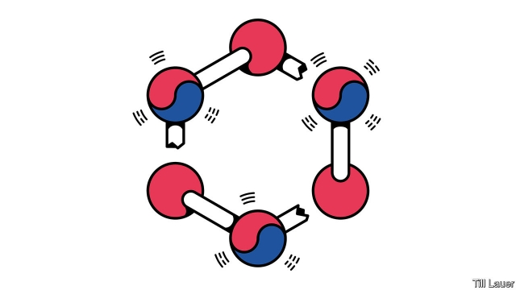

###### Banyan

# Relations between Japan and South Korea are fraying alarmingly 

 

> print-edition iconPrint edition | Asia | Jul 20th 2019 

THEY ARE two full-blown democracies, a rarity in their part of the world. In terms of history and culture, they have dollops in common. Above all, in a fraught region, they are crucial allies of the United States. Yet Japan and South Korea have been acting more like foes than friends. 

This month Japan slapped export controls on chemicals critical to South Korea’s semiconductor and smartphone industries—a big escalation in the two sides’ mutual antagonisms. Although South Korea only imports a relatively paltry $400m or so of these chemicals each year, alternative supplies are scarce, so the impact on global supply chains could be huge. 

South Koreans have reacted with rancour. Celebrities show off cancelled plane tickets to Japan on their Instagram accounts. Japanese-made cars have been deliberately scratched. Shopowners have launched a boycott of Japanese goods. Politicians say Japanese brands should be labelled “made by war criminals”. 

At issue, as ever, are painful, messy questions of history. In first half of the 20th century Japan was Korea’s colonial overlord. Imperial Japan brought not only economic modernisation, but also brutal dominion, especially during the years of total war in the Pacific between 1937 and 1945. South Korea’s left-leaning president, Moon Jae-in, has sought to define his presidency in part by how he views the past. He has removed statues of Koreans deemed collaborators during Japanese rule and renamed streets dedicated to them. Last year he in effect repudiated an agreement between his conservative predecessor, Park Geun-hye, and Japan’s prime minister, Shinzo Abe, that aimed to resolve once and for all the matter of wartime “comfort women”: tens of thousands of Koreans, a handful still alive today, who were forced to have sex in Japanese army brothels. Under the deal Japan offered an apology and ¥1bn ($9.3m) to the victims, South Korea agreed to cease using the issue as a diplomatic wedge and to remove the statue of a comfort woman outside the Japanese embassy. 

The statue remains. But the cause of greatest annoyance to Japan are rulings last autumn by South Korea’s Supreme Court against two Japanese industrial giants that conscripted Koreans during the war. The court ordered the companies to pay compensation to surviving victims. Japan insists that the 1965 friendship treaty establishing relations between the two countries settled forced-labour claims (though not those of comfort women). It shrugs at those who point out that South Korea was a dictatorship at the time, and that the victims whose claims were supposedly settled were neither consulted about the settlement nor given any of the money Japan paid in compensation. 

The court has since seized assets belonging to Mitsubishi Heavy Industries and may sell them. To Japanese officials, this is an act of economic war. South Korean counterparts claim the same for the export controls on hydrogen fluoride and two other chemicals on which South Korean electronics giants rely. Following a disastrous meeting between lower-level officials late last week, Mr Moon suggested that South Korea would have to learn not only to get along without Japanese supplies of the chemicals, but even without Japan. 

In Tokyo this week officials are at pains to stress that Japan’s move is not an export ban, rather the reimposition of controls on sensitive materials that had grown lax. Follow the procedures, they say, and the worst South Korean firms will experience is a bigger lag between requesting chemicals and receiving them. They clearly want to defend Mr Abe’s reputation as a global champion of open markets, but admit that claims that the controls have nothing to do with the court case are unconvincing. 

The crisis plays right into the hands of China and North Korea. Japanese officials insist that when it comes to defence, security and intelligence-sharing, relations with South Korea remain cordial and effective. But it is hard to believe that there is no impact. America might be able to knock heads and get the two sides to back down, but has so far avoided getting involved. 

Mr Moon has been weakened at home, not least because he has little to show for his attempts at détente with North Korea. The row has made him more popular. And with upper-house elections due this month, Mr Abe must not look weak. Both leaders face citizenries whose misgivings about the other country are hardening. There is no easy route to a climbdown. 

-- 

 单词注释:

1.banyan['bænjәn]:n. 印度榕树 [医] 榕树, 孟加拉榕 

2.Korea[kә'riә]:n. 朝鲜, 韩国 

3.fray[frei]:n. 磨损, 打架, 争论 vt. 使磨损 vi. 被磨损 

4.alarmingly[ ə'lɑːmɪŋli]:adv. 让人担忧地 

5.Jul[]:七月 

6.rarity['rєәrәti]:n. 稀罕, 罕有, 珍奇, 稀薄 

7.dollop['dɒlәp]:n. 块, 团 

8.fraught[frɒ:t]:a. 含有...的, 伴着...的, 充满...的 

9.ally['ælai. ә'lai]:n. 同盟者, 同盟国, 助手 vt. 使联盟, 使联合, 使有关系 vi. 结盟 

10.foe[fou]:n. 仇敌, 反对者, 敌人, 对手 

11.slap[slæp]:n. 掴, 掌击, 侮辱, 拍击声 v. 拍击, 惩罚 adv. 正面地, 直接地, 突然地 

12.smartphone[]:n. 智能手机 

13.escalation[.eskә'leiʃәn]:n. 扩大, 增加 [经] 调查, 价格调整 

14.antagonism[æn'tægәnizm]:n. 对立, 敌对, 敌意 [化] 拮抗作用; 消效作用 

15.paltry['pɒ:ltri]:a. 不足取的, 琐碎的, 可鄙的 

16.Korean[kә'riәn]:n. 朝鲜人, 朝鲜语 a. 朝鲜人的, 朝鲜语的 

17.rancour['ræŋkә]:n. 敌意, 深仇 

18.celebrity[si'lebrti]:n. 名声, 名人 

19.Instagram[]:一款图片分享应用 

20.shopowner[ʃə'pəʊnər]: 财东 

21.colonial[kә'lәunjәl]:a. 殖民的, 殖民地的 [法] 殖民地居民 

22.overlord['әuvәlɒ:d]:n. 大君主, 最高君主, 霸主 [法] 霸权, 霸主地位, 封建君主 

23.imperial[im'piәriәl]:a. 帝王的, 宗主国的, 至尊的, 壮丽的 n. 特等品 

24.modernisation[,mɔdәnai'zeiʃәn;-ni'z-]:n. <主英>=modernization 

25.brutal['bru:tәl]:a. 残忍的, 野蛮的, 不讲理的 

26.dominion[dә'minjәn]:n. 领土, 主权, 统治 [法] 统治权, 主权, 统治 

27.presidency['prezidәnsi]:n. 总统职权, 总裁职位 

28.deem[di:m]:v. 认为, 相信 

29.collaborator[kә'læbәreitә]:n. 合干者, 合作者, 通敌者 [法] 合作者, 协助者, 勾结者 

30.rename[.ri:'neim]:vt. 重新命名, 再命名, 给...改名 [计] 重命名; DOS内部命令:更改文件名 

31.dedicate['dedikeit]:vt. 献出, 贡献 

32.repudiate[ri'pju:dieit]:vt. 声明离婚, 拒绝, 拒付, 拒绝履行 [经] 拒付(公债,国债等) 

33.predecessor[.predi'sesә]:n. 前任, 先辈, 前身 [医] 初牙, 前辈, 祖先 

34.shinzo[]:[网络] 晋三；爆裂战士战蓝宝；神像 

35.abe[eib]:n. 亚伯（男子名, 等于Abraham） 

36.wartime['wɒ:taim]:n. 战时 

37.tens[]:十位 

38.brothel['brɒθәl]:n. 妓院 [法] 妓院 

39.diplomatic[.diplә'mætik]:a. 外交的, 老练的 [法] 外交的, 外交上的, 文献上的 

40.wedge[wedʒ]:n. 楔子, 楔形物, 起因, 导致分裂的东西 vt. 楔住, 挤进, 楔入 vi. 楔入, 挤进 

41.annoyance[ә'nɒiәns]:n. 烦恼, 打扰, 可厌之事 [法] 使人烦恼的事物, 麻烦事, 讨厌物 

42.ruling['ru:liŋ]:n. 判决, 裁定, 统治 a. 统治的, 支配的, 普遍的 

43.conscript['kɒnskript]:a. 被征入伍的, 被征召的 n. 征兵 vt. 征召 

44.compensation[.kɒmpen'seiʃәn]:n. 补偿, 赔偿金, 工资 [医] 代偿(机能), 补偿 

45.dictatorship[dik'teitәʃip]:n. 独裁者之职位, 独裁, 独裁政权 [法] 专攻, 独裁权 

46.supposedly[sә'pәuzidli]:adv. 想象上, 看上去像, 被认为是, 恐怕, 按照推测 

47.asset['æset]:n. 资产, 有益的东西 

48.Mitsubishi[mi'tsubiʃi]:[经] 三菱 

49.Korean[kә'riәn]:n. 朝鲜人, 朝鲜语 a. 朝鲜人的, 朝鲜语的 

50.counterpart['kauntәpɑ:t]:n. 副本, 复本, 配对物, 相应物 [经] 副本, 正副二份中之一 

51.fluoride['flu(:)әraid]:n. 氟化物 [化] 氟化物 

52.disastrous[di'zɑ:strәs]:a. 损失惨重的, 悲伤的 

53.reimposition[ri:ɪmpə'zɪʃn]:n. 重新征收 

54.lax[læks]:a. 松的, 不严格的, 腹泻的, 松弛的 n. 腹泻, 松元音 

55.unconvincing[ʌnkәn'vinsiŋ]:a. 不足以令人相信的 

56.citizenry['sitizәnri]:n. 市民 [法] 市民 

57.misgiving[mis'^iviŋ]:n. 疑虑, 不安, 害怕, 担扰, 疑惧 

58.climbdown[]:n. 爬下, 退让, 屈服 

